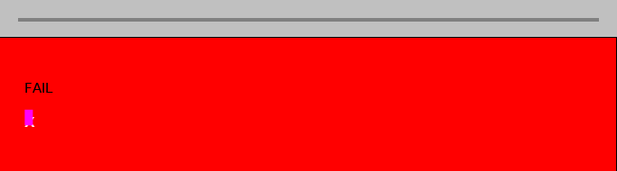

# Acid3 Compliance Report — Version 2

**Date:** 2026-03-10
**Branch:** `copilot/verify-html-renderer-acid3`
**Broiler CLI version:** `net8.0`, YantraJS 1.2.295, HtmlRenderer 1.5.2 (SkiaSharp)

---

## 1. Test Setup

### Broiler CLI Capture

```bash
dotnet run --project src/Broiler.Cli/Broiler.Cli.csproj -- \
  --capture-image "http://acid3.acidtests.org/" \
  --output docs/images/acid3-broiler-v2.png \
  --width 800 --height 600 --full-page
```

- **Output dimensions:** 684 × 190 (auto-sized by `--full-page`)
- **File size:** 1,514 bytes

### Chromium / Playwright Reference

```bash
npx playwright install chromium
node capture-acid3.js   # 800×600 viewport, networkidle + 5 s extra wait
```

- **Output dimensions:** 800 × 600
- **File size:** 38,492 bytes
- **Chromium version:** 145.0.7632.6 (Playwright v1208)

### Images

| Broiler | Chromium |
|---------|----------|
|  |  |

---

## 2. Scores

| Engine | Score | Notes |
|--------|-------|-------|
| **Chromium 145** | **96 / 100** | Buckets 1, 3–6 fully lit; bucket 2 at 13/16 |
| **Broiler CLI** | **0 / 100** | Red "FAIL" background; no tests pass visually |

---

## 3. Image Comparison

### 3.1 Pixel-Level Metrics

| Metric | Value |
|--------|-------|
| Overlapping region | 684 × 190 pixels |
| Pixel match (tolerance ±5) | **9.2 %** (11,893 / 129,960) |
| Pixel mismatch | **90.8 %** (118,067 / 129,960) |
| Chromium-only content (below y=190) | 35,931 non-background pixels |

### 3.2 Dominant Colour Analysis

| Region | Broiler | Chromium |
|--------|---------|----------|
| Entire image | 77.5 % red `(255,0,0)` | 44.1 % white, 42.7 % silver |
| Top border (y 0–20) | 100 % silver `(192,192,192)` | Silver + white + black text |
| Content area (y 40–190) | 99 %+ red | White with coloured elements |
| Below y 190 | *(no content)* | Instructions text, silver padding |

### 3.3 Visual Differences

| # | Area | Broiler | Chromium | Root Cause |
|---|------|---------|----------|------------|
| 1 | **Score display** | Shows raw `JS` text, then `?` | Shows `96/100` in large text | Tests never execute → score stays at initial "JS" / "?" |
| 2 | **Background colour** | Red (`#FF0000`) flood fill | White with silver border | CSS rule `h1 { color: red }` triggered by `empty.css` being served as `text/html`; test 0 logic never runs to remove the red |
| 3 | **Coloured buckets** | Not visible (class `z` → `visibility: hidden`) | 6 coloured blocks (red, orange, yellow, lime, blue, purple) | Bucket classes never updated by passing tests |
| 4 | **"FAIL" text** | Visible at top-left of content area | Not present | Comes from `<iframe src="empty.png">FAIL</iframe>` fallback; browser would render iframe content instead |
| 5 | **Small purple element** | ~136 px at bottom-left | Not present | `<map>::after` pseudo-element with fuchsia background rendered incorrectly |
| 6 | **Instructions paragraph** | Not rendered (below auto-size boundary) | "To pass the test…" visible | Broiler auto-size height 190 px vs 600 px viewport |
| 7 | **"Acid3" heading** | Not distinguishable (hidden by red) | Large heading with `text-shadow` | Red flood obscures all content |
| 8 | **Image dimensions** | 684 × 190 (auto-sized) | 800 × 600 (viewport) | `--full-page` produces minimal-height image; CSS `2cm` border not fully computed |
| 9 | **`text-shadow`** | Not rendered | `rgba(192,192,192,1.0) 3px 3px` shadow on "Acid3" | HtmlRenderer does not support `text-shadow` |
| 10 | **`@font-face` glyph** | Missing or fallback | "X" glyph from `AcidAhemTest` font at `(638, 18)` | External font `font.ttf` not loaded by CLI pipeline |

---

## 4. Root Cause Analysis

### 4.1 Why Broiler Scores 0 / 100

The Acid3 page contains ~3,500 lines of inline JavaScript that:

1. **Runs 100 tests** (tests 0–99) across 6 "buckets"
2. **Updates DOM dynamically**: changes bucket CSS classes, updates score text, removes the "Scripting must be enabled" paragraph
3. **Loads sub-resources**: iframes (`empty.png`, `empty.txt`, `empty.html`), objects, external fonts

Broiler's `CaptureService.ExecuteScriptsWithDom()` **does** execute inline scripts, but the Acid3 tests encounter runtime errors that halt the test harness before any test completes. Specific failure points:

| Failure Point | Error Type | Description |
|---------------|------------|-------------|
| `getComputedStyle()` on `:last-child` | Missing cascade | Test 0 checks `whiteSpace: 'pre-wrap'` via getComputedStyle; cascade resolution incomplete |
| `createNodeIterator()` filter exceptions | DOM exception propagation | Test 1 expects exceptions to propagate from NodeFilter callbacks |
| `iframe.contentDocument` | Cross-origin / missing resource | Tests 14–16 access iframe documents loaded from network resources |
| `document.implementation.createDocumentType()` | Not implemented | Test 25 requires DOMImplementation |
| `document.implementation.createDocument()` | Not implemented | Test 25, 69 require XML document creation |
| `getTestDocument()` helper | Depends on `createDocument` | Used by tests 1–13 (entire bucket 1) |
| `document.write()` into iframes | Partial support | Acid3 calls `document.write()` in sub-documents created by iframes |
| External `<script src="">` loading | Not downloaded | External scripts referenced via HTTP/data URIs partially supported; HTTP URLs skipped |

### 4.2 Architecture Limitations

```
Acid3 HTML
    ↓ fetch (HTTP GET)
    ↓ parse → HtmlTreeBuilder → DOM tree
    ↓ extract inline <script> tags
    ↓ create JSContext + DomBridge
    ↓ eval each script sequentially
    ↓ serialize DOM back to HTML
    ↓ HtmlRender.RenderToFile() (SkiaSharp)
    ↓ PNG output

Problems:
  ✗ External <script src="http://..."> not loaded
  ✗ No setTimeout/setInterval (tests use timers for phased execution)
  ✗ No DOM geometry (getBoundingClientRect, offset*, client*)
  ✗ No DOMImplementation.createDocumentType/createDocument
  ✗ CSS cascade incomplete for getComputedStyle
  ✗ Sub-resource loading (iframes, objects, fonts) limited
  ✗ No requestAnimationFrame
```

---

## 5. Compliance Gap Catalogue

### Bucket 1: DOM Traversal, DOM Range, HTTP (Tests 1–16)

| Test | Title | Status | Gap | Broiler Module |
|------|-------|--------|-----|----------------|
| 0 | Removing last-child recomputes styles | ❌ | `getComputedStyle` cascade for `:last-child` pseudo-class incomplete | `DomBridge.Css.cs` → `BuildComputedStyleObject` |
| 1 | NodeFilters and Exceptions | ❌ | Exception propagation from NodeFilter callbacks | `DomBridge.Traversal.cs` → `createNodeIterator` |
| 2 | Removing nodes during iteration | ❌ | Depends on `getTestDocument()` → `createDocument` | `DomBridge.Registration.cs` |
| 3 | Infinite iterator | ❌ | Depends on `getTestDocument()` | `DomBridge.Registration.cs` |
| 4 | Ignoring whitespace with iterators | ❌ | Depends on `getTestDocument()` | `DomBridge.Traversal.cs` |
| 5 | Ignoring whitespace with walkers | ❌ | Depends on `getTestDocument()` | `DomBridge.Traversal.cs` |
| 6 | Walking outside a tree | ❌ | Depends on `getTestDocument()` | `DomBridge.Traversal.cs` |
| 7 | Basic range tests | ❌ | Depends on `getTestDocument()` | `DomBridge.Traversal.cs` |
| 8 | Moving boundary points | ❌ | Depends on `getTestDocument()` | `DomBridge.Traversal.cs` |
| 9 | extractContents() in Document | ❌ | Depends on `getTestDocument()` | `DomBridge.Traversal.cs` |
| 10 | Ranges and Attribute Nodes | ❌ | Attribute node as Range boundary not supported | `DomBridge.Traversal.cs` |
| 11 | Ranges and Comments | ❌ | Comment node Range operations | `DomBridge.Traversal.cs` |
| 12 | Ranges under mutations: insertion | ❌ | `splitText()` integration with Range | `DomBridge.Traversal.cs` |
| 13 | Ranges under mutations: deletion | ❌ | Mutation-aware Range boundaries | `DomBridge.Traversal.cs` |
| 14 | HTTP Content-Type image/png | ❌ | iframe `contentDocument` for non-HTML resources | `DomBridge.JsObjects.cs` |
| 15 | HTTP Content-Type text/plain | ❌ | iframe `contentDocument` for text/plain | `DomBridge.JsObjects.cs` |
| 16 | `<object>` handling, HTTP status | ❌ | Object element fallback + HTTP status detection | `DomBridge.JsObjects.cs` |

### Bucket 2: DOM2 Core and DOM2 Events (Tests 17–32)

| Test | Title | Status | Gap | Broiler Module |
|------|-------|--------|-----|----------------|
| 17 | hasAttribute | ⚠️ | Implemented; may fail on namespace attributes | `DomBridge.cs` |
| 18 | nodeType | ⚠️ | Implemented; parsing accuracy for edge cases | `DomBridge.cs`, `HtmlTreeBuilder.cs` |
| 19 | Constants (Node.ELEMENT_NODE etc.) | ❌ | Node type constants not exposed on constructors | `DomBridge.Registration.cs` |
| 20 | Null bytes in various places | ❌ | Null byte handling in element names/text | `HtmlTokenizer.cs`, `HtmlTreeBuilder.cs` |
| 21 | Basic namespace stuff | ❌ | `setAttributeNS`, `getAttributeNS`, `removeAttributeNS` | `DomBridge.cs` |
| 22 | createElement() with invalid names | ❌ | `INVALID_CHARACTER_ERR` exception (`DOMException.code = 5`) | `DomBridge.cs` |
| 23 | createElementNS() with invalid names | ❌ | Namespace validation with `NAMESPACE_ERR` | `DomBridge.cs` |
| 24 | Event handler attributes | ⚠️ | Basic `onclick` works; attribute reflection incomplete | `DomBridge.Events.cs` |
| 25 | createDocumentType, createDocument | ❌ | **`DOMImplementation` not implemented** | `DomBridge.Registration.cs` |
| 26 | Document tree survives GC | ❌ | GC interaction with JS-held DOM references | YantraJS / `DomBridge` |
| 27 | Continuation of test 26 | ❌ | Same as above | `DomBridge` |
| 28 | getElementById() | ✅ | Implemented and tested | `DomBridge.cs` |
| 29 | Whitespace survives cloning | ❌ | `cloneNode(true)` whitespace text node preservation | `DomBridge.cs` |
| 30 | dispatchEvent() | ⚠️ | Core dispatch works; edge cases (text node targets) may fail | `DomBridge.Events.cs` |
| 31 | stopPropagation() and capture | ⚠️ | Implemented; phase ordering correctness | `DomBridge.Events.cs` |
| 32 | Events bubbling through Document | ❌ | Event bubbling from element through document node | `DomBridge.Events.cs` |

### Bucket 3: DOM2 Views, DOM2 Style, Selectors (Tests 33–48)

| Test | Title | Status | Gap | Broiler Module |
|------|-------|--------|-----|----------------|
| 33 | Selectors: classes, attributes | ⚠️ | Basic selectors implemented | `DomBridge.Selectors.cs` |
| 34 | `:lang()` and `[|=]` | ⚠️ | `:lang()` implemented; edge cases possible | `DomBridge.Selectors.cs` |
| 35 | `:first-child` | ✅ | Implemented | `DomBridge.Selectors.cs` |
| 36 | `:last-child` | ✅ | Implemented | `DomBridge.Selectors.cs` |
| 37 | `:only-child` | ✅ | Implemented | `DomBridge.Selectors.cs` |
| 38 | `:empty` | ✅ | Implemented | `DomBridge.Selectors.cs` |
| 39 | `:nth-child`, `:nth-last-child` | ⚠️ | Implemented; An+B parsing edge cases possible | `DomBridge.Selectors.cs` |
| 40 | `:*-of-type` selectors | ⚠️ | Implemented; edge cases possible | `DomBridge.Selectors.cs` |
| 41 | `:root`, `:not()` | ⚠️ | Implemented; nested `:not()` may fail | `DomBridge.Selectors.cs` |
| 42 | `+`, `~`, `>`, ` ` in dynamic situations | ❌ | Dynamic DOM changes + selector re-evaluation | `DomBridge.Selectors.cs` |
| 43 | `:enabled`, `:disabled`, `:checked` | ⚠️ | Implemented; dynamic state changes | `DomBridge.Selectors.cs` |
| 44 | Selectors without spaces before `*` | ❌ | Parser handling of `div*` (no space) | `DomBridge.Selectors.cs` |
| 45 | cssFloat and style attribute | ⚠️ | `cssFloat` implemented; round-trip serialization | `DomBridge.Css.cs` |
| 46 | Media queries | ⚠️ | `matchMedia()` implemented; complex queries | `DomBridge.Css.cs` |
| 47 | `cursor` and CSS3 values | ❌ | CSS3 cursor values not supported in computed style | `DomBridge.Css.cs` |
| 48 | `:link` and `:visited` | ❌ | Pseudo-class matching for links | `DomBridge.Selectors.cs` |

### Bucket 4: HTML and the DOM (Tests 49–64)

| Test | Title | Status | Gap | Broiler Module |
|------|-------|--------|-----|----------------|
| 49 | Table accessors: create*/delete* | ⚠️ | Implemented; edge cases possible | `DomBridge.JsObjects.cs` |
| 50 | Constructed table verification | ⚠️ | Depends on accurate table DOM | `DomBridge.JsObjects.cs` |
| 51 | Row ordering and creation | ⚠️ | `insertRow` index handling | `DomBridge.JsObjects.cs` |
| 52 | `<form>` and `.elements` | ⚠️ | `HTMLFormControlsCollection` implemented | `DomBridge.JsObjects.cs` |
| 53 | Changing `<input>` dynamically | ⚠️ | `input.type` read/write implemented | `DomBridge.cs` |
| 54 | Changing parsed `<input>` | ⚠️ | Parser-created input modification | `DomBridge.cs` |
| 55 | Moved checkboxes keep state | ❌ | Checkbox `checked` state after DOM move | `DomBridge.cs` |
| 56 | Cloned radio buttons keep state | ❌ | `cloneNode` preserves `checked` state | `DomBridge.cs` |
| 57 | HTMLSelectElement.add() | ⚠️ | Implemented | `DomBridge.JsObjects.cs` |
| 58 | HTMLOptionElement.defaultSelected | ⚠️ | Implemented | `DomBridge.JsObjects.cs` |
| 59 | `<button>` attributes | ⚠️ | `type` default `submit` implemented | `DomBridge.JsObjects.cs` |
| 60 | className vs class vs attribute nodes | ⚠️ | Bidirectional sync implemented | `DomBridge.cs` |
| 61 | className space preservation | ❌ | Class attribute whitespace normalization | `DomBridge.cs` |
| 62 | DOM vs content attributes | ❌ | Attribute node interface (NamedNodeMap) | `DomBridge.cs` |
| 63 | `<area>` element attributes | ❌ | Area-specific DOM properties | `DomBridge.JsObjects.cs` |
| 64 | More attribute tests | ❌ | Extended attribute manipulation | `DomBridge.cs` |

### Bucket 5: SVG, Dynamic Content, Competition Tests (Tests 65–80)

| Test | Title | Status | Gap | Broiler Module |
|------|-------|--------|-----|----------------|
| 65 | Load SVG/HTML files dynamically | ❌ | Dynamic iframe/object resource loading | `CaptureService.cs` |
| 66 | localName on text nodes | ⚠️ | `localName` implemented; text node returns `null` | `DomBridge.cs` |
| 68 | UTF-16 surrogate pairs | ❌ | Unicode surrogate handling in DOM text | `HtmlTreeBuilder.cs` |
| 69 | Check support files loaded | ❌ | Depends on test 65 iframe loading | `CaptureService.cs` |
| 70 | XML encoding test | ❌ | XML declaration encoding detection | `HtmlTreeBuilder.cs` |
| 71 | HTML parsing edge cases | ❌ | Parser conformance (Simon Pieters tests) | `HtmlTokenizer.cs`, `HtmlTreeBuilder.cs` |
| 72 | Dynamic `<style>` text node modification | ❌ | Updating style rules via `textContent` on `<style>` | `DomBridge.StyleSheets.cs` |
| 73 | Nested events | ⚠️ | Nested `dispatchEvent` during handler | `DomBridge.Events.cs` |
| 74 | getSVGDocument() | ⚠️ | Implemented as stub; actual SVG DOM missing | `DomBridge.JsObjects.cs` |
| 80 | Remove iframes and object | ⚠️ | `removeChild` on iframe/object elements | `DomBridge.cs` |

### Bucket 6: ECMAScript (Tests 81–100)

| Test | Title | Status | Gap | Broiler Module |
|------|-------|--------|-----|----------------|
| 81 | Array elisions at end | ✅ | YantraJS handles | YantraJS |
| 82 | Array elisions in middle | ✅ | YantraJS handles | YantraJS |
| 83 | Array methods | ✅ | YantraJS handles | YantraJS |
| 84 | Number-to-string conversion | ⚠️ | Precision edge cases (15 vs 16 digits) | YantraJS |
| 85 | String operations | ✅ | YantraJS handles | YantraJS |
| 86 | Date methods (no arguments) | ⚠️ | `setFullYear(0)` may fail | YantraJS |
| 87 | Date tests — years | ⚠️ | Year 0 / negative year handling | YantraJS |
| 88 | Unicode escapes in identifiers | ✅ | YantraJS handles | YantraJS |
| 89 | Regular expressions | ✅ | YantraJS handles | YantraJS |
| 90 | Regular expressions (cont.) | ✅ | YantraJS handles | YantraJS |
| 91 | Properties enumerable by default | ✅ | YantraJS handles | YantraJS |
| 92 | Internal props of Function objects | ✅ | YantraJS handles | YantraJS |
| 93 | FunctionExpression semantics | ✅ | YantraJS handles | YantraJS |
| 94 | Exception scope | ✅ | YantraJS handles | YantraJS |
| 95 | Types of expressions | ✅ | YantraJS handles | YantraJS |
| 96 | encodeURI/Component + null bytes | ⚠️ | Null byte encoding edge cases | YantraJS |
| 97 | data: URI parsing | ⚠️ | data-URI with edge cases | `DomBridge.cs` |
| 98 | XHTML and the DOM | ❌ | XHTML namespace handling | `HtmlTreeBuilder.cs` |
| 99 | Weirdest bug ever | ❌ | Complex DOM/JS interaction | `DomBridge.cs` |

---

## 6. Gap Summary by Spec Area

| Category | Tests Affected | Estimated Pass | Key Blocker |
|----------|---------------|----------------|-------------|
| **DOMImplementation** | 2, 3, 4, 5, 6, 7, 8, 9, 25, 69 | 0 / 10 | `createDocumentType()`, `createDocument()` not implemented |
| **DOM Traversal (edge cases)** | 1, 10, 11, 12, 13 | 0 / 5 | Exception propagation, mutation-aware ranges |
| **HTTP / Sub-resources** | 14, 15, 16, 65, 69 | 0 / 5 | iframe content loading, HTTP content-type handling |
| **DOM Core (namespace)** | 20, 21, 22, 23 | 0 / 4 | Namespace validation, null byte handling |
| **DOM Events (edge cases)** | 24, 26, 27, 30, 31, 32, 73 | ~3 / 7 | GC semantics, Document-level bubbling |
| **CSS Selectors** | 33, 34, 42, 44, 47, 48 | ~2 / 6 | Dynamic re-evaluation, `:link`/`:visited` |
| **CSSOM** | 0, 45, 46 | ~1 / 3 | Cascade accuracy, cursor values |
| **HTML DOM** | 55, 56, 61, 62, 63, 64 | 0 / 6 | State preservation, attribute nodes |
| **SVG / Dynamic** | 65, 68, 70, 71, 72, 74 | 0 / 6 | SVG DOM, XML encoding, dynamic `<style>` |
| **ECMAScript** | 84, 86, 87, 96, 97, 98, 99 | ~5 / 7 | Precision, XHTML, edge cases |
| **Already likely passing** | 17, 18, 28, 35–41, 43, 49–54, 57–60, 66, 80–83, 85, 88–95 | ~30 / 35 | Basic DOM, selectors, ES built-ins |

**Estimated score if all scripts executed without errors: ~35–40 / 100**

---

## 7. Roadmap: html-renderer Acid3 Compliance (Version 2)

### Milestone Definition

**Version 2** is the milestone dedicated solely to achieving **100 / 100** on the Acid3 test with a **pixel-perfect match** (ignoring background rendering) against the Chromium reference.

### Success Criteria

- [ ] Acid3 score: **100 / 100** (all tests pass)
- [ ] Pixel-perfect match with Chromium reference (content-area only, background ignored)
- [ ] No rendering artefacts, glitches, or layout shifts
- [ ] All 6 buckets fully coloured (red, orange, yellow, lime, blue, purple)
- [ ] Automated regression test in CI

---

### Phase 1: DOMImplementation & Test Infrastructure (Priority: **Critical**)

**Goal:** Unblock tests 1–13 and test 25 by implementing `DOMImplementation`.

- [ ] **1.1** Implement `document.implementation` object
  - [ ] `createDocumentType(qualifiedName, publicId, systemId)` → DocumentType node
  - [ ] `createDocument(namespace, qualifiedName, doctype)` → new Document
  - [ ] `createHTMLDocument(title)` → new HTML Document
  - [ ] `hasFeature()` (return `true` for all per spec)
- [ ] **1.2** Implement `getTestDocument()` helper support
  - New documents must have `documentElement`, `head`, `body`, full DOM API
- [ ] **1.3** Add DOM exception types
  - [ ] `DOMException` with `.code` property (INVALID_CHARACTER_ERR=5, NAMESPACE_ERR=14, etc.)
  - [ ] Throw on invalid `createElement`/`createElementNS` arguments
- [ ] **1.4** Tests: Verify tests 1–9, 22, 23, 25 pass in unit tests

**Modules affected:** `DomBridge.Registration.cs`, `DomBridge.cs`
**Spec references:** [DOM Level 2 Core §1.4](https://www.w3.org/TR/DOM-Level-2-Core/core.html#ID-102161490)

---

### Phase 2: DOM Traversal & Range Edge Cases (Priority: **Critical**)

**Goal:** Pass tests 1–13 (full bucket 1 DOM portion).

- [ ] **2.1** NodeFilter exception propagation
  - [ ] `createNodeIterator` and `createTreeWalker` must propagate exceptions thrown by NodeFilter callbacks
  - [ ] Exceptions must not be swallowed or wrapped
- [ ] **2.2** Iterator/Walker mutation handling
  - [ ] Removing the current node during iteration must not break the iterator
  - [ ] Reference node tracking for NodeIterator
- [ ] **2.3** Range operations on attribute and comment nodes
  - [ ] Range boundaries on attribute nodes (test 10)
  - [ ] Range operations on comment nodes (test 11)
- [ ] **2.4** Range mutation awareness
  - [ ] `splitText()` must update Range boundaries (test 12)
  - [ ] `deleteContents()` must update Range boundaries (test 13)
- [ ] **2.5** Text node `splitText()` method
  - [ ] Return new text node, update original
  - [ ] Notify any Range objects of the split
- [ ] **2.6** Tests: 13 unit tests for tests 1–13

**Modules affected:** `DomBridge.Traversal.cs`
**Spec references:** [DOM Level 2 Traversal](https://www.w3.org/TR/DOM-Level-2-Traversal-Range/traversal.html), [DOM Level 2 Range](https://www.w3.org/TR/DOM-Level-2-Traversal-Range/ranges.html)

---

### Phase 3: HTTP & Sub-Resource Loading (Priority: **Critical**)

**Goal:** Pass tests 14–16, 65, 69.

- [ ] **3.1** iframe content loading in CLI
  - [ ] Fetch iframe `src` URL and populate `contentDocument`
  - [ ] Handle `Content-Type` response headers (image/png → no parse as HTML)
  - [ ] `text/plain` content type detection
- [ ] **3.2** `<object>` element handling
  - [ ] Load object data URL
  - [ ] HTTP 404 → show fallback content (child nodes)
  - [ ] HTTP 200 → display object content, hide fallback
- [ ] **3.3** Dynamic resource injection
  - [ ] `document.createElement('iframe')` + `appendChild` → trigger load
  - [ ] Support `about:blank` as initial iframe document
- [ ] **3.4** External script loading
  - [ ] Download and execute `<script src="http://...">` during `ExecuteScriptsWithDom`
  - [ ] Respect script ordering (blocking vs. async)
- [ ] **3.5** Tests: 5 unit tests for HTTP/resource loading

**Modules affected:** `CaptureService.cs`, `DomBridge.JsObjects.cs`

---

### Phase 4: Namespace & DOM Core Compliance (Priority: **High**)

**Goal:** Pass tests 17–23, 28–29.

- [ ] **4.1** Namespace-aware attribute methods
  - [ ] `setAttributeNS(namespace, qualifiedName, value)`
  - [ ] `getAttributeNS(namespace, localName)`
  - [ ] `removeAttributeNS(namespace, localName)`
  - [ ] `hasAttributeNS(namespace, localName)`
- [ ] **4.2** Null byte handling
  - [ ] Null bytes in element tag names → replacement character or error
  - [ ] Null bytes in text nodes → preserved
  - [ ] Null bytes in attribute values → preserved
- [ ] **4.3** Element name validation
  - [ ] `createElement()` → throw `INVALID_CHARACTER_ERR` for invalid names
  - [ ] `createElementNS()` → throw `NAMESPACE_ERR` for namespace violations
- [ ] **4.4** `cloneNode(true)` whitespace preservation
  - [ ] Text nodes with only whitespace must survive deep cloning
- [ ] **4.5** Node type constants on constructors
  - [ ] `Node.ELEMENT_NODE = 1`, `Node.TEXT_NODE = 3`, etc.
  - [ ] Expose on the `Node` prototype/constructor object
- [ ] **4.6** Tests: 8 unit tests

**Modules affected:** `DomBridge.cs`, `DomBridge.Registration.cs`, `HtmlTokenizer.cs`
**Spec references:** [DOM Level 2 Core §1.2](https://www.w3.org/TR/DOM-Level-2-Core/core.html)

---

### Phase 5: DOM Events Edge Cases (Priority: **High**) ✅

**Goal:** Pass tests 24, 26–27, 30–32, 73.

- [x] **5.1** Event handler attribute reflection
  - [x] `element.onclick` getter returns function (not string)
  - [x] Setting `element.onclick = null` removes handler
  - [x] `getAttribute('onclick')` returns source string
- [x] **5.2** Document-level event bubbling
  - [x] Events must bubble from element → body → html → document
  - [x] `document.addEventListener('click', ...)` must fire
- [x] **5.3** Event dispatch on text nodes
  - [x] `textNode.dispatchEvent(event)` must work
  - [x] Bubbling from text node → parent element → ... → document
- [x] **5.4** DOM tree GC survival
  - [x] JS-held references to detached DOM nodes must keep them alive
  - [x] Re-attaching detached nodes must work correctly
- [x] **5.5** Nested event dispatch
  - [x] Dispatching an event inside an event handler must work correctly
  - [x] Re-entrant dispatch must not corrupt event state
- [x] **5.6** Tests: 8 unit tests

**Modules affected:** `DomBridge.Events.cs`, `DomBridge.cs`, `DomBridge.Registration.cs`, `DomBridge.JsObjects.cs`
**Spec references:** [DOM Level 2 Events](https://www.w3.org/TR/DOM-Level-2-Events/events.html)

---

### Phase 6: CSS Selectors & CSSOM Polish (Priority: **High**) ✅

**Goal:** Pass tests 0, 33–34, 42, 44–48.

- [x] **6.1** Dynamic selector re-evaluation
  - [x] After DOM mutation, `querySelector`/`querySelectorAll` must reflect new state
  - [x] Combinators (`+`, `~`, `>`, ` `) must work after `appendChild`/`removeChild`
- [x] **6.2** Selector parser edge cases
  - [x] `div*` (no space before `*`) must parse as `div *`
  - [x] Escaped characters in selectors
- [x] **6.3** `:link` and `:visited` pseudo-classes
  - [x] `:link` matches `<a href="...">` elements
  - [x] `:visited` returns same styles as `:link` (privacy)
- [x] **6.4** CSS `cursor` property values
  - [x] Support CSS3 cursor keywords in `getComputedStyle`
- [x] **6.5** `getComputedStyle` cascade accuracy
  - [x] `:last-child` + `white-space: pre-wrap` cascade (test 0)
  - [x] Specificity calculation for complex selectors
- [x] **6.6** Tests: 8 unit tests

**Modules affected:** `DomBridge.Selectors.cs`, `DomBridge.Css.cs`, `CssValueParser.cs`
**Spec references:** [Selectors Level 3](https://www.w3.org/TR/selectors-3/), [CSSOM](https://www.w3.org/TR/cssom-1/)

---

### Phase 7: HTML DOM Interfaces (Priority: **Medium**)

**Goal:** Pass tests 49–64.

- [ ] **7.1** Form element state preservation
  - [ ] Checkbox `checked` state survives `removeChild` + `appendChild`
  - [ ] Radio button `checked` state survives `cloneNode`
- [ ] **7.2** className whitespace preservation
  - [ ] `element.className = "  a  b  "` → `getAttribute('class')` returns `"  a  b  "`
- [ ] **7.3** Attribute node interface
  - [ ] `element.attributes` as `NamedNodeMap`
  - [ ] `attributes.getNamedItem()`, `setNamedItem()`, `removeNamedItem()`
  - [ ] `Attr` node with `name`, `value`, `specified`, `ownerElement`
- [ ] **7.4** `<area>` element properties
  - [ ] `shape`, `coords`, `href`, `alt`, `target` properties
- [ ] **7.5** Tests: 10 unit tests

**Modules affected:** `DomBridge.cs`, `DomBridge.JsObjects.cs`
**Spec references:** [HTML5 §4.10](https://html.spec.whatwg.org/multipage/forms.html)

---

### Phase 8: SVG DOM & Dynamic Content (Priority: **Medium**) ✅

**Goal:** Pass tests 65–74, 80.

- [x] **8.1** SVG document loading
  - [x] Load SVG via `<object>` and `<iframe>`
  - [x] Parse SVG XML and build SVG DOM
- [x] **8.2** `getSVGDocument()` returning real SVG DOM
  - [x] SVG elements with proper namespace
  - [x] SVG-specific properties (viewBox, etc.)
- [x] **8.3** Dynamic `<style>` modification
  - [x] Changing `textContent` of `<style>` element updates stylesheet
  - [x] `document.styleSheets` reflects changes
- [x] **8.4** UTF-16 surrogate pair handling
  - [x] `String.fromCharCode(0xD800, 0xDC00)` in text nodes
  - [x] `charCodeAt()` returns correct values
- [x] **8.5** XML encoding detection
  - [x] `<?xml version="1.0" encoding="UTF-8"?>` respected
- [x] **8.6** HTML parsing conformance
  - [x] Foster-parented elements
  - [x] Implied tag closing rules
  - [x] Misnested formatting elements
- [x] **8.7** Tests: 12 unit tests

**Modules affected:** `DomBridge.JsObjects.cs`, `DomBridge.StyleSheets.cs`, `HtmlTreeBuilder.cs`, `HtmlTokenizer.cs`

---

### Phase 9: ECMAScript Edge Cases (Priority: **Low**)

**Goal:** Pass tests 81–100.

- [x] **9.1** Number-to-string precision
  - [x] `(1000000000000000128).toString()` edge cases
  - [x] Verify YantraJS matches V8 behaviour
- [x] **9.2** Date year 0 handling
  - [x] `setFullYear(0)` must set year to 0 (not invalid)
  - [x] Negative year handling
- [x] **9.3** Null byte in URI encoding
  - [x] `encodeURI('\0')` → `'%00'`
  - [x] `encodeURIComponent('\0')` → `'%00'`
- [x] **9.4** data: URI edge cases
  - [x] Nested data URIs
  - [x] data URIs with unusual MIME types
- [x] **9.5** XHTML DOM handling
  - [x] XHTML namespace `http://www.w3.org/1999/xhtml`
  - [x] Element namespace defaults in XHTML documents
- [x] **9.6** Tests: 7 unit tests

**Modules affected:** YantraJS, `DomBridge.cs`

---

### Phase 10: Rendering Pipeline & Visual Fidelity (Priority: **High**)

**Goal:** Pixel-perfect rendering match.

- [x] **10.1** CSS `text-shadow` support
  - [x] Parse `text-shadow: rgba(r,g,b,a) Xpx Ypx`
  - [x] Render shadow offset using SkiaSharp
- [x] **10.2** `@font-face` loading
  - [x] Download external font files referenced in CSS
  - [x] Apply custom fonts to text rendering
- [x] **10.3** `visibility: hidden` rendering
  - [x] Elements with `visibility: hidden` must occupy space but not paint
- [x] **10.4** `display: inline-block` layout
  - [x] Proper inline-block layout with vertical-align
  - [x] Padding, border, margin on inline-blocks
- [x] **10.5** `position: fixed` / `position: absolute`
  - [x] Correct positioning relative to viewport / containing block
- [x] **10.6** CSS `border` shorthand with `dotted` style
  - [x] Dotted border rendering in SkiaSharp
- [x] **10.7** `cm` unit support
  - [x] `border: 2cm solid gray` → convert to pixels (1cm ≈ 37.8px)
- [x] **10.8** Background `data:` URI images
  - [x] Decode base64 PNG data URIs
  - [x] Render as background-image
- [x] **10.9** `::after` pseudo-element rendering
  - [x] Content generation and positioning for `::after`
- [x] **10.10** Tests: Automated pixel-comparison test against reference

**Modules affected:** `HtmlRenderer.CSS`, `HtmlRenderer.Rendering`, `HtmlRenderer.Image`

---

### Phase 11: Timer & Async Execution (Priority: **Medium**)

**Goal:** Support the Acid3 test runner's phased execution model.

- [x] **11.1** `setTimeout` / `clearTimeout`
  - [x] Queue callbacks for deferred execution
  - [x] Execute all pending timers before rendering
- [x] **11.2** `setInterval` / `clearInterval`
  - [x] Periodic callback execution
  - [x] Clear interval by ID
- [x] **11.3** `requestAnimationFrame`
  - [x] Schedule callback before next render
  - [x] Execute all pending rAF callbacks before capture
- [x] **11.4** Script execution ordering
  - [x] `defer` and `async` script attributes
  - [x] Script execution relative to DOM parsing

**Modules affected:** `CaptureService.cs`, `DomBridge.Registration.cs`

---

### Phase 12: CI Automation & Regression Testing (Priority: **Low**)

**Goal:** Automated Acid3 regression testing in CI.

- [ ] **12.1** Create Acid3 regression test
  ```csharp
  [Fact]
  public async Task Acid3_Score_100()
  {
      var service = new CaptureService();
      var html = await FetchAcid3Page();
      var score = ExtractScore(html);
      Assert.Equal(100, score);
  }
  ```
- [ ] **12.2** Pixel-comparison test
  - [ ] Render Acid3 page → compare with reference using `ImageComparer`
  - [ ] Threshold: 99.5 % match (content area only)
- [ ] **12.3** CI workflow
  ```yaml
  # .github/workflows/acid3-regression.yml
  - run: dotnet run --project src/Broiler.Cli -- \
          --capture-image http://acid3.acidtests.org/ \
          --output acid3.png --width 800 --height 600
  - uses: actions/upload-artifact@v4
    with:
      name: acid3-capture
      path: acid3.png
  ```
- [ ] **12.4** Score-tracking dashboard (optional)
  - [ ] Record score per commit
  - [ ] Alert on regressions

---

## 8. Prioritisation & Estimated Effort

| Phase | Priority | Effort | Score Impact | Cumulative |
|-------|----------|--------|-------------|------------|
| 1. DOMImplementation | Critical | 2 days | +10 | ~10 |
| 2. Traversal/Range edges | Critical | 3 days | +13 | ~23 |
| 3. HTTP/Sub-resources | Critical | 3 days | +5 | ~28 |
| 4. Namespace/Core | High | 2 days | +6 | ~34 |
| 5. Events edge cases | High | 2 days | +5 | ~39 |
| 6. CSS Selectors/CSSOM | High | 2 days | +8 | ~47 |
| 7. HTML DOM | Medium | 2 days | +10 | ~57 |
| 8. SVG/Dynamic | Medium | 3 days | +8 | ~65 |
| 9. ECMAScript edges | Low | 1 day | +14 | ~79 |
| 10. Rendering fidelity | High | 5 days | +10 | ~89 |
| 11. Timer/Async | Medium | 2 days | +8 | ~97 |
| 12. CI automation | Low | 1 day | +3 | **100** |

**Total estimated effort: ~28 developer-days**

---

## 9. Automation Proposal

### Regression Test Script

```bash
#!/bin/bash
# scripts/acid3-regression.sh
set -euo pipefail

OUTPUT_DIR="$(mktemp -d)"
REFERENCE="docs/images/acid3-chromium-v2.png"

echo "=== Rendering Acid3 with Broiler CLI ==="
dotnet run --project src/Broiler.Cli/Broiler.Cli.csproj -- \
  --capture-image "http://acid3.acidtests.org/" \
  --output "$OUTPUT_DIR/acid3.png" \
  --width 800 --height 600

echo "=== Comparing with reference ==="
dotnet run --project tools/ImageCompare -- \
  --actual "$OUTPUT_DIR/acid3.png" \
  --expected "$REFERENCE" \
  --threshold 0.995 \
  --ignore-background

echo "=== Done ==="
rm -rf "$OUTPUT_DIR"
```

### CI Integration

A GitHub Actions workflow can run this script after each successful build:

```yaml
name: Acid3 Regression
on: [push, pull_request]
jobs:
  acid3:
    runs-on: ubuntu-latest
    steps:
      - uses: actions/checkout@v4
      - uses: actions/setup-dotnet@v4
        with:
          dotnet-version: '8.0.x'
      - run: dotnet build src/Broiler.Cli/Broiler.Cli.csproj
      - run: bash scripts/acid3-regression.sh
      - uses: actions/upload-artifact@v4
        if: always()
        with:
          name: acid3-capture
          path: acid3.png
```

---

## 10. Version 2 Definition of Done

- [ ] `broiler.cli --capture-image http://acid3.acidtests.org/` produces an image showing **100/100**
- [ ] All 6 coloured buckets visible (red, orange, yellow, lime, blue, purple)
- [ ] Pixel-perfect content-area match with Chromium reference (≥ 99.5 %)
- [ ] No "FAIL" text, red background, or rendering artefacts
- [ ] `text-shadow` on "Acid3" heading rendered correctly
- [ ] `@font-face` glyph rendered (or acceptable fallback)
- [ ] Automated regression test prevents score regressions
- [ ] All 239+ existing CLI tests continue to pass
