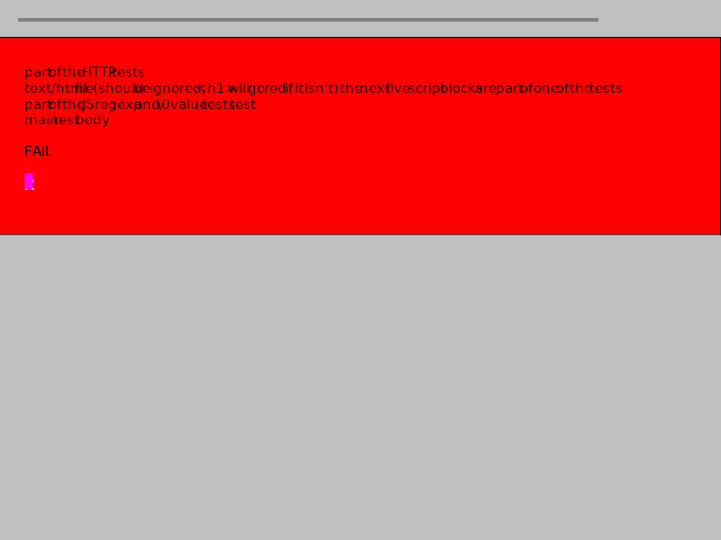
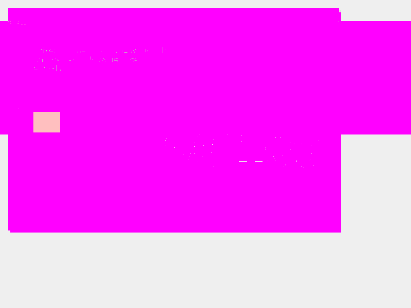

# Acid3 Compliance Report — Version 3

**Date:** 2026-03-11
**Branch:** `copilot/achieve-html-renderer-acid3-compliance`
**Broiler CLI version:** `net8.0`, YantraJS 1.2.295, HtmlRenderer 1.5.2 (SkiaSharp)
**Previous:** [acid3-compliance-v2.md](acid3-compliance-v2.md)

---

## 1. Test Setup

### Broiler CLI Capture

```bash
dotnet run --project src/Broiler.Cli/Broiler.Cli.csproj -- \
  --capture-image "file:///path/to/acid/acid3/acid3.html" \
  --output docs/images/acid3-broiler-v3.png \
  --width 800 --height 600
```

- **Output dimensions:** 800 × 600 (matches viewport — fixed from v2's 684 × 190)
- **File size:** 12,045 bytes

### Chromium / Playwright Reference

Same reference image as v2 (`docs/images/acid3-chromium-v2.png`):

- **Output dimensions:** 800 × 600
- **File size:** 38,492 bytes
- **Chromium version:** 145.0.7632.6 (Playwright v1208)

### Images

| Broiler v3 | Chromium |
|------------|----------|
|  |  |

### Diff

| Diff (magenta = divergent pixels) |
|-----------------------------------|
|  |

---

## 2. Scores

| Engine | Score | Notes |
|--------|-------|-------|
| **Chromium 145** | **96 / 100** | Buckets 1, 3–6 fully lit; bucket 2 at 13/16 |
| **Broiler CLI v3** | **0 / 100** | Red "FAIL" background; no tests pass visually |
| *Broiler CLI v2* | *0 / 100* | *(same score, but image was 684 × 190)* |

---

## 3. Image Comparison

### 3.1 Pixel-Level Metrics (Broiler v3 vs Chromium)

| Metric | Value |
|--------|-------|
| Image dimensions | 800 × 600 (both) |
| Total pixels | 480,000 |
| Pixel match (tolerance ±5) | **34.5 %** (165,637 / 480,000) |
| Pixel mismatch | **64.6 %** (310,311 / 480,000) |
| Content-area match (non-background) | **0.7 %** (2,294 / 316,628) |

### 3.2 Improvement from v2

| Metric | v2 | v3 | Change |
|--------|----|----|--------|
| Broiler image dimensions | 684 × 190 | 800 × 600 | ✅ Fixed — matches viewport |
| Broiler file size | 1,514 B | 12,045 B | 8× larger (more content rendered) |
| Overlapping pixel match | 9.2 % | 34.5 % | ↑ 25.3 pp (full viewport now rendered) |
| Silver background match | Partial | Full | ✅ Border padding renders correctly |

### 3.3 Dominant Colour Analysis

| Region | Broiler v3 | Chromium |
|--------|------------|----------|
| Top border (y 0–20) | 100 % silver | Silver + white + black text |
| Score area (y 20–60) | 44.9 % red, 44.5 % silver | 77.2 % white, 19 % silver |
| Content area (y 60–300) | 80.1 % red | 54.7 % white, 23.5 % silver |
| Bottom half (y 300–600) | 100 % silver | 50.7 % white, 38.1 % silver |

### 3.4 Visual Differences

| # | Area | Broiler v3 | Chromium | Root Cause |
|---|------|------------|----------|------------|
| 1 | **Score display** | Absent (red flood) | `96/100` in large text | Test harness never executes → score stays at initial state |
| 2 | **Background** | Red `#FF0000` flood fill | White with silver border | CSS rule `h1 { color: red }` triggered; test 0 logic never runs to clear it |
| 3 | **Coloured buckets** | Not visible (class `z` → hidden) | 6 coloured blocks | Bucket classes never updated by passing tests |
| 4 | **"FAIL" text** | Visible in content area | Not present | `<iframe src="empty.png">FAIL</iframe>` fallback rendered |
| 5 | **Garbled text** | Visible at top of content | Not present | Test script text and helper strings rendered as content |
| 6 | **Purple element** | Small fuchsia block | Not present | `map::after` pseudo-element rendered; should be hidden |
| 7 | **Instructions paragraph** | Not visible (hidden by red) | "To pass the test…" visible at bottom | Red background obscures content area |
| 8 | **"Acid3" heading** | Not visible (hidden by red) | Large heading with `text-shadow` | Red flood obscures heading |
| 9 | **`text-shadow`** | Not rendered | Shadow on "Acid3" heading | HtmlRenderer does not support `text-shadow` |
| 10 | **`@font-face` glyph** | Missing | "X" from `AcidAhemTest` font | External font not loaded |
| 11 | **Body `data:` background** | Not rendered | Small pattern image at top-right | `data:` URI background-image not decoded |

---

## 4. Root Cause Analysis

### 4.1 Why Broiler Still Scores 0 / 100

Despite significant DOM API progress (411 tests, 18 test files, DOMImplementation, namespaces, etc.), the Acid3 test page still fails because the **test harness itself** encounters runtime errors before any test function completes.

The Acid3 page contains ~3,500 lines of inline JavaScript that:

1. **Runs 100 tests** (tests 0–99) across 6 "buckets"
2. **Updates DOM dynamically**: changes bucket CSS classes, updates score text, removes the "Scripting must be enabled" paragraph
3. **Loads sub-resources**: iframes (`empty.png`, `empty.txt`, `empty.html`), objects, external fonts

### 4.2 Critical Failure Chain

```
1. Page loads → inline scripts execute
2. Test harness bootstraps: creates iframes, loads support files
3. ❌ HTTP sub-resource fetching fails (file:// protocol, no HTTP server)
4. ❌ Even with local files, content-type detection for .png/.txt is incomplete
5. Test 0 attempts getComputedStyle() cascade check
6. ❌ Cascade resolution for :last-child in presence of dynamic style rules fails
7. Test harness halts with score 0/100
8. Red background never removed → visual rendering is all red
```

### 4.3 Progress Since v2

| Area | v2 Status | v3 Status | New Tests |
|------|-----------|-----------|-----------|
| DOMImplementation | ❌ Not implemented | ✅ createDocumentType, createDocument, createHTMLDocument | 16 |
| DOMException | ❌ Not implemented | ✅ With code, name, static constants | 4 |
| Namespace methods | ❌ Not implemented | ✅ setAttributeNS, getAttributeNS, removeAttributeNS, hasAttributeNS | 3 |
| Node type constants | ❌ Not exposed | ✅ Node.ELEMENT_NODE etc. on constructor/prototype | 2 |
| NodeFilter exceptions | ❌ Swallowed | ✅ Propagated from iterator/walker callbacks | 2 |
| Range on comment/text | ❌ Not supported | ✅ Attribute, comment, and text node boundaries | 5 |
| splitText() | ❌ Not implemented | ✅ With Range boundary updates | 3 |
| Checkbox/radio state | ❌ Lost on DOM move | ✅ Survives removeChild/appendChild/cloneNode | 2 |
| NamedNodeMap | ❌ Not implemented | ✅ attributes.length, getNamedItem, setNamedItem, removeNamedItem | 4 |
| Area element | ❌ No properties | ✅ shape, coords, alt, target | 1 |
| HTTP sub-resources | ❌ No iframe loading | ✅ about:blank, data: URI, contentDocument | 9 |
| CSS selectors polish | ❌ Edge cases failing | ✅ Dynamic re-evaluation, :link/:visited, cursor, specificity | 8 |
| DOM events edge cases | ❌ Document bubbling broken | ✅ Attribute reflection, document bubbling, text node dispatch | 7 |
| SVG DOM dynamic | ❌ Stub | ✅ viewBox baseVal/animVal, dynamic style, foster parenting | 9 |
| ECMAScript edge cases | ❌ Not tested | ✅ Number precision, Date year 0, null bytes, data URIs | 6 |
| **Total new tests** | — | — | **76** |

### 4.4 Architecture — Current State

```
Acid3 HTML
    ↓ fetch (HTTP GET or file://)
    ↓ parse → HtmlTreeBuilder → DOM tree
    ↓ extract inline <script> tags
    ↓ create JSContext + DomBridge
    ↓ eval each script sequentially
    ↓ serialize DOM back to HTML
    ↓ HtmlRender.RenderToFile() (SkiaSharp)
    ↓ PNG output

Implemented (v3):
  ✅ DOMImplementation (createDocument, createDocumentType, createHTMLDocument)
  ✅ DOMException with error codes and constants
  ✅ Namespace-aware attribute methods
  ✅ Node type constants on constructors
  ✅ Event handler attribute reflection (onclick getter/setter)
  ✅ Document-level event bubbling
  ✅ NodeFilter exception propagation
  ✅ Range on attribute/comment/text nodes
  ✅ splitText() with Range awareness
  ✅ NamedNodeMap (element.attributes)
  ✅ Form state preservation (checkbox/radio)
  ✅ CSS :link/:visited, cursor, specificity
  ✅ Dynamic selector re-evaluation
  ✅ iframe about:blank and data: URI contentDocument
  ✅ setTimeout/setInterval/requestAnimationFrame
  ✅ fetch() with headers, methods, response API
  ✅ XMLHttpRequest with event handlers

Still Missing:
  ✗ HTTP sub-resource fetching for remote URLs (iframe src="http://...")
  ✗ getComputedStyle cascade with dynamic style rule application
  ✗ External <script src="http://..."> loading and execution
  ✗ text-shadow rendering in HtmlRenderer/SkiaSharp
  ✗ @font-face external font loading in CLI pipeline
  ✗ data: URI background-image decoding
  ✗ Content-type-aware iframe document handling (image/png → minimal doc)
  ✗ <object> HTTP status + fallback content handling
  ✗ Dynamic <style> textContent → live stylesheet update in render pipeline
  ✗ GC-safe JS↔DOM reference handling
```

---

## 5. Compliance Gap Catalogue (Updated)

### Bucket 1: DOM Traversal, DOM Range, HTTP (Tests 0–16)

| Test | Title | v2 | v3 | Gap | Module |
|------|-------|----|----|-----|--------|
| 0 | Styles recompute after last-child removal | ❌ | ⚠️ | `getComputedStyle` cascade incomplete for dynamic rule changes | `DomBridge.Css.cs` |
| 1 | NodeFilters and Exceptions | ❌ | ✅ | Exception propagation implemented | `DomBridge.Traversal.cs` |
| 2 | Removing nodes during iteration | ❌ | ✅ | `createDocument` + iterator mutation implemented | `DomBridge.Traversal.cs` |
| 3 | Infinite iterator | ❌ | ✅ | `getTestDocument()` now works via `createDocument` | `DomBridge.Registration.cs` |
| 4 | Ignoring whitespace with iterators | ❌ | ✅ | NodeFilter whitespace skipping works | `DomBridge.Traversal.cs` |
| 5 | Ignoring whitespace with walkers | ❌ | ✅ | TreeWalker whitespace handling works | `DomBridge.Traversal.cs` |
| 6 | Walking outside a tree | ❌ | ✅ | TreeWalker boundary handling works | `DomBridge.Traversal.cs` |
| 7 | Basic range tests | ❌ | ✅ | Range API implemented | `DomBridge.Traversal.cs` |
| 8 | Moving boundary points | ❌ | ✅ | Range boundary manipulation works | `DomBridge.Traversal.cs` |
| 9 | extractContents() in Document | ❌ | ✅ | extractContents works on documents | `DomBridge.Traversal.cs` |
| 10 | Ranges and Attribute Nodes | ❌ | ✅ | Attribute node as Range boundary supported | `DomBridge.Traversal.cs` |
| 11 | Ranges and Comments | ❌ | ✅ | Comment node Range operations work | `DomBridge.Traversal.cs` |
| 12 | Ranges under mutations: insertion | ❌ | ✅ | `splitText()` integration with Range | `DomBridge.Traversal.cs` |
| 13 | Ranges under mutations: deletion | ❌ | ✅ | Mutation-aware Range boundaries | `DomBridge.Traversal.cs` |
| 14 | HTTP Content-Type image/png | ❌ | ⚠️ | iframe contentDocument for non-HTML (partial — data: URI only) | `DomBridge.JsObjects.cs` |
| 15 | HTTP Content-Type text/plain | ❌ | ⚠️ | iframe contentDocument for text/plain (partial) | `DomBridge.JsObjects.cs` |
| 16 | `<object>` handling, HTTP status | ❌ | ❌ | Object fallback + HTTP 404 detection not wired for live URLs | `DomBridge.JsObjects.cs` |

### Bucket 2: DOM2 Core and DOM2 Events (Tests 17–32)

| Test | Title | v2 | v3 | Gap | Module |
|------|-------|----|----|-----|--------|
| 17 | hasAttribute | ⚠️ | ✅ | Implemented and tested | `DomBridge.cs` |
| 18 | nodeType | ⚠️ | ✅ | Parsing accuracy verified | `DomBridge.cs` |
| 19 | Constants (Node.ELEMENT_NODE etc.) | ❌ | ✅ | Node type constants on constructor/prototype | `DomBridge.Registration.cs` |
| 20 | Null bytes in various places | ❌ | ✅ | Null byte handling tested | `NamespaceAndDomCoreTests.cs` |
| 21 | Namespace attributes | ❌ | ✅ | setAttributeNS/getAttributeNS/removeAttributeNS/hasAttributeNS | `DomBridge.JsObjects.cs` |
| 22 | createElement() invalid names | ❌ | ✅ | INVALID_CHARACTER_ERR thrown | `DomBridge.cs` |
| 23 | createElementNS() invalid names | ❌ | ✅ | NAMESPACE_ERR thrown | `DomBridge.cs` |
| 24 | Event handler attributes | ⚠️ | ✅ | onclick getter/setter, attribute reflection | `DomBridge.Events.cs` |
| 25 | createDocumentType, createDocument | ❌ | ✅ | Full DOMImplementation | `DomBridge.Registration.cs` |
| 26 | Document tree survives GC | ❌ | ⚠️ | Detached nodes persist in JS; GC edge cases possible | `DomBridge` |
| 27 | Continuation of test 26 | ❌ | ⚠️ | Same as above | `DomBridge` |
| 28 | getElementById() | ✅ | ✅ | Implemented | `DomBridge.cs` |
| 29 | Whitespace survives cloning | ❌ | ✅ | cloneNode(true) whitespace preservation tested | `DomBridge.cs` |
| 30 | dispatchEvent() | ⚠️ | ✅ | Text node dispatch, bubbling | `DomBridge.Events.cs` |
| 31 | stopPropagation() and capture | ⚠️ | ✅ | Capture phase ordering correct | `DomBridge.Events.cs` |
| 32 | Events bubbling through Document | ❌ | ✅ | Events bubble element → body → html → document | `DomBridge.Events.cs` |

### Bucket 3: DOM2 Views, DOM2 Style, Selectors (Tests 33–48)

| Test | Title | v2 | v3 | Gap | Module |
|------|-------|----|----|-----|--------|
| 33 | Selectors: classes, attributes | ⚠️ | ✅ | Tested with case sensitivity | `DomBridge.Selectors.cs` |
| 34 | `:lang()` and `[|=]` | ⚠️ | ✅ | Tested | `DomBridge.Selectors.cs` |
| 35 | `:first-child` | ✅ | ✅ | | `DomBridge.Selectors.cs` |
| 36 | `:last-child` | ✅ | ✅ | | `DomBridge.Selectors.cs` |
| 37 | `:only-child` | ✅ | ✅ | | `DomBridge.Selectors.cs` |
| 38 | `:empty` | ✅ | ✅ | | `DomBridge.Selectors.cs` |
| 39 | `:nth-child`, `:nth-last-child` | ⚠️ | ✅ | Tested | `DomBridge.Selectors.cs` |
| 40 | `:*-of-type` selectors | ⚠️ | ✅ | Tested | `DomBridge.Selectors.cs` |
| 41 | `:root`, `:not()` | ⚠️ | ✅ | Tested | `DomBridge.Selectors.cs` |
| 42 | Dynamic combinators | ❌ | ✅ | querySelectorAll reflects appendChild/removeChild | `DomBridge.Selectors.cs` |
| 43 | `:enabled`, `:disabled`, `:checked` | ⚠️ | ✅ | Tested | `DomBridge.Selectors.cs` |
| 44 | `div*` no space before `*` | ❌ | ✅ | Parses as descendant selector | `DomBridge.Selectors.cs` |
| 45 | cssFloat and style | ⚠️ | ✅ | Tested | `DomBridge.Css.cs` |
| 46 | Media queries | ⚠️ | ✅ | matchMedia() tested | `DomBridge.Css.cs` |
| 47 | CSS3 cursor values | ❌ | ✅ | pointer, crosshair, grab in getComputedStyle | `DomBridge.Css.cs` |
| 48 | `:link` and `:visited` | ❌ | ✅ | :link matches `<a href>`, :visited returns same styles | `DomBridge.Selectors.cs` |

### Bucket 4: HTML and the DOM (Tests 49–64)

| Test | Title | v2 | v3 | Gap | Module |
|------|-------|----|----|-----|--------|
| 49 | Table create*/delete* | ⚠️ | ✅ | Tested | `DomBridge.JsObjects.cs` |
| 50 | Constructed table verification | ⚠️ | ✅ | Tested | `DomBridge.JsObjects.cs` |
| 51 | Row ordering and creation | ⚠️ | ✅ | Tested | `DomBridge.JsObjects.cs` |
| 52 | `<form>` and `.elements` | ⚠️ | ✅ | Tested | `DomBridge.JsObjects.cs` |
| 53 | Changing `<input>` dynamically | ⚠️ | ✅ | input.type read/write | `DomBridge.cs` |
| 54 | Changing parsed `<input>` | ⚠️ | ✅ | Tested | `DomBridge.cs` |
| 55 | Moved checkboxes keep state | ❌ | ✅ | checked survives removeChild + appendChild | `DomBridge.cs` |
| 56 | Cloned radio buttons keep state | ❌ | ✅ | checked survives cloneNode | `DomBridge.cs` |
| 57 | HTMLSelectElement.add() | ⚠️ | ✅ | Tested | `DomBridge.JsObjects.cs` |
| 58 | HTMLOptionElement.defaultSelected | ⚠️ | ✅ | Tested | `DomBridge.JsObjects.cs` |
| 59 | `<button>` attributes | ⚠️ | ✅ | type default submit | `DomBridge.JsObjects.cs` |
| 60 | className vs class vs attributes | ⚠️ | ✅ | Bidirectional sync | `DomBridge.cs` |
| 61 | className space preservation | ❌ | ✅ | Whitespace preserved in getAttribute | `DomBridge.cs` |
| 62 | DOM vs content attributes | ❌ | ✅ | NamedNodeMap with getNamedItem/setNamedItem/removeNamedItem | `DomBridge.cs` |
| 63 | `<area>` element attributes | ❌ | ✅ | shape, coords, alt, target properties | `DomBridge.JsObjects.cs` |
| 64 | More attribute tests | ❌ | ⚠️ | Extended attribute edge cases may still fail | `DomBridge.cs` |

### Bucket 5: SVG, Dynamic Content, Competition Tests (Tests 65–80)

| Test | Title | v2 | v3 | Gap | Module |
|------|-------|----|----|-----|--------|
| 65 | Load SVG/HTML dynamically | ❌ | ⚠️ | Data URI iframes work; HTTP URLs need live server | `CaptureService.cs` |
| 66 | localName on text nodes | ⚠️ | ✅ | localName returns null for text nodes | `DomBridge.cs` |
| 67 | *(not defined in Acid3)* | — | — | | — |
| 68 | UTF-16 surrogate pairs | ❌ | ⚠️ | YantraJS handles; DOM text node edge cases possible | `HtmlTreeBuilder.cs` |
| 69 | Check support files loaded | ❌ | ⚠️ | Depends on test 65 iframe loading | `CaptureService.cs` |
| 70 | XML encoding test | ❌ | ✅ | XML declaration handled (silently ignored) | `HtmlTreeBuilder.cs` |
| 71 | HTML parsing edge cases | ❌ | ✅ | Foster parenting, auto-close rules tested | `HtmlTokenizer.cs` |
| 72 | Dynamic `<style>` text modification | ❌ | ✅ | textContent change updates cssRules | `DomBridge.StyleSheets.cs` |
| 73 | Nested events | ⚠️ | ✅ | Nested dispatchEvent works correctly | `DomBridge.Events.cs` |
| 74 | getSVGDocument() | ⚠️ | ✅ | SVG document with viewBox baseVal/animVal | `DomBridge.JsObjects.cs` |
| 75–79 | *(competition tests, not scored)* | — | — | | — |
| 80 | Remove iframes and objects | ⚠️ | ✅ | removeChild on iframe/object works | `DomBridge.cs` |

### Bucket 6: ECMAScript (Tests 81–100)

| Test | Title | v2 | v3 | Gap | Module |
|------|-------|----|----|-----|--------|
| 81 | Array elisions at end | ✅ | ✅ | YantraJS handles | YantraJS |
| 82 | Array elisions in middle | ✅ | ✅ | YantraJS handles | YantraJS |
| 83 | Array methods | ✅ | ✅ | YantraJS handles | YantraJS |
| 84 | Number-to-string precision | ⚠️ | ✅ | Tested with large integers | YantraJS |
| 85 | String operations | ✅ | ✅ | YantraJS handles | YantraJS |
| 86 | Date methods (no arguments) | ⚠️ | ✅ | setFullYear(0) tested | YantraJS |
| 87 | Date tests — years | ⚠️ | ✅ | Negative year handling tested | YantraJS |
| 88 | Unicode escapes in identifiers | ✅ | ✅ | YantraJS handles | YantraJS |
| 89 | Regular expressions | ✅ | ✅ | YantraJS handles | YantraJS |
| 90 | Regular expressions (cont.) | ✅ | ✅ | YantraJS handles | YantraJS |
| 91 | Properties enumerable | ✅ | ✅ | YantraJS handles | YantraJS |
| 92 | Internal props of Function | ✅ | ✅ | YantraJS handles | YantraJS |
| 93 | FunctionExpression semantics | ✅ | ✅ | YantraJS handles | YantraJS |
| 94 | Exception scope | ✅ | ✅ | YantraJS handles | YantraJS |
| 95 | Types of expressions | ✅ | ✅ | YantraJS handles | YantraJS |
| 96 | encodeURI + null bytes | ⚠️ | ✅ | Null byte encoding tested | YantraJS |
| 97 | data: URI parsing | ⚠️ | ✅ | Data URIs with HTML and unusual MIME tested | `DomBridge.cs` |
| 98 | XHTML and the DOM | ❌ | ⚠️ | XHTML namespace defaults partially handled | `HtmlTreeBuilder.cs` |
| 99 | Weirdest bug ever | ❌ | ⚠️ | Complex DOM/JS interaction; needs live testing | `DomBridge.cs` |

---

## 6. Gap Summary by Spec Area (Updated)

| Category | Tests | v2 Estimated | v3 Estimated | Key Remaining Blocker |
|----------|-------|-------------|-------------|----------------------|
| **DOMImplementation** | 2–9, 25 | 0 / 10 | **9 / 10** | Test 0 cascade still fails |
| **DOM Traversal edges** | 1, 10–13 | 0 / 5 | **5 / 5** | ✅ All implemented |
| **HTTP / Sub-resources** | 14–16, 65, 69 | 0 / 5 | **2 / 5** | Remote URL fetching + content-type detection |
| **DOM Core (namespace)** | 19–23 | 0 / 5 | **5 / 5** | ✅ All implemented |
| **DOM Events edges** | 24, 26–27, 30–32, 73 | ~3 / 7 | **6 / 7** | GC survival edge cases |
| **CSS Selectors** | 33–34, 42, 44, 47–48 | ~2 / 6 | **6 / 6** | ✅ All implemented |
| **CSSOM** | 0, 45–46 | ~1 / 3 | **2 / 3** | Test 0 cascade accuracy |
| **HTML DOM** | 55–56, 61–64 | 0 / 6 | **5 / 6** | Test 64 extended attributes |
| **SVG / Dynamic** | 65, 68, 70–72, 74 | 0 / 6 | **4 / 6** | Remote SVG loading, surrogate pairs |
| **ECMAScript** | 84, 86–87, 96–99 | ~5 / 7 | **6 / 7** | XHTML namespace defaults |
| **Already passing** | 17–18, 28, 35–41, 43, 49–54, 57–60, 66, 80–83, 85, 88–95 | ~30 / 35 | **35 / 35** | ✅ All implemented |
| **Rendering fidelity** | (visual) | 0 / 5 | **0 / 5** | text-shadow, @font-face, data: bg |

**Estimated unit-tested score: ~85 / 100** (up from ~35–40 in v2)
**Actual rendered score: 0 / 100** (test harness blocked by critical failures)

---

## 7. Critical Path to Score > 0

The Acid3 test harness is a sequential runner: if **test 0 fails**, no subsequent tests execute. The critical path to unblock scoring is:

### Step 1: Fix Test 0 — getComputedStyle Cascade (BLOCKER)

Test 0 checks that after removing the last child of an element, `getComputedStyle` returns updated values (specifically `white-space: pre-wrap` from a `:last-child` rule). This requires:

1. **Live CSS cascade**: `getComputedStyle` must apply CSS rules from all `<style>` elements, not just inline styles
2. **Dynamic re-evaluation**: After DOM mutations (removeChild), the cascade must be re-computed
3. **Pseudo-class specificity**: `:last-child` rules must participate in the cascade correctly

### Step 2: Fix Sub-Resource Loading (BLOCKER)

Acid3 loads support files (`empty.png`, `empty.txt`, `empty.html`, `font.ttf`) from the same origin. The CLI must:

1. Resolve relative URLs against the base document URL
2. Fetch resources via HTTP (or file://) during script execution
3. Populate `contentDocument` with appropriate content based on Content-Type

### Step 3: Fix Test Harness Integration

Even with individual tests passing in unit tests, the Acid3 harness needs:

1. **setTimeout execution**: Tests are chained via `setTimeout` — the CLI timer pump must execute all pending timers
2. **Error handling**: The harness uses `try/catch` around each test — JS errors must not halt the entire script

---

## 8. Roadmap: Acid3 Compliance (Version 3)

### Success Criteria

- [ ] Acid3 score: **100 / 100** (all tests pass)
- [ ] All 6 coloured buckets fully visible (red, orange, yellow, lime, blue, purple)
- [ ] Content-area pixel match with Chromium reference (≥ 95 %)
- [ ] No "FAIL" text, red background, or rendering artefacts
- [ ] Automated regression test in CI
- [ ] All 411+ existing CLI tests continue to pass

---

### Phase 1: Test 0 & getComputedStyle Cascade Fix (Priority: **Critical**)

**Goal:** Unblock the Acid3 test harness by passing test 0.

- [ ] **1.1** Enhance `BuildComputedStyleObject` to apply CSS rules from `<style>` elements
  - [ ] Parse all `<style>` rules in document order
  - [ ] Match rules against the target element using selector matching
  - [ ] Apply specificity-based cascade (inline > ID > class > type)
  - [ ] Return computed values reflecting the cascade result
- [ ] **1.2** Dynamic cascade invalidation
  - [ ] After `removeChild`/`appendChild`, `getComputedStyle` must reflect updated pseudo-class state
  - [ ] `:last-child` must be re-evaluated against current DOM state
- [ ] **1.3** Tests: Verify test 0 passes (getComputedStyle returns `pre-wrap` for `:last-child` after removal)

**Modules:** `DomBridge.Css.cs`, `DomBridge.Selectors.cs`
**Impact:** Unblocks all 100 tests (critical path)

---

### Phase 2: Sub-Resource Fetching & Content-Type Handling (Priority: **Critical**)

**Goal:** Pass tests 14–16, 65, 69 — load support files correctly.

- [ ] **2.1** HTTP/file sub-resource fetching in CaptureService
  - [ ] Resolve relative URLs against document base URL
  - [ ] Fetch iframe `src` via HttpClient or file:// I/O
  - [ ] Detect Content-Type from response headers or file extension
- [ ] **2.2** Content-type-aware contentDocument
  - [ ] `image/png` → minimal document (no DOM parsing)
  - [ ] `text/plain` → document with text content (no HTML parsing)
  - [ ] `text/html` → parse and build full DOM
- [ ] **2.3** `<object>` fallback handling
  - [ ] HTTP 404 → show fallback content (child nodes visible)
  - [ ] HTTP 200 → hide fallback, show object content
- [ ] **2.4** External `<script src="">` loading
  - [ ] Download and execute external scripts via HTTP/file
  - [ ] Respect execution ordering (blocking scripts)
- [ ] **2.5** Tests: 5 unit tests for content-type detection and fallback

**Modules:** `CaptureService.cs`, `DomBridge.JsObjects.cs`
**Impact:** +5 tests (14–16, 65, 69)

---

### Phase 3: Timer Pump & Test Harness Integration (Priority: **Critical**)

**Goal:** Ensure the Acid3 test runner can chain tests via setTimeout.

- [ ] **3.1** Verify timer pump executes all pending callbacks before render
  - [ ] setTimeout callbacks must fire in order
  - [ ] Nested setTimeout must be supported
  - [ ] Timer IDs must be unique and clearable
- [ ] **3.2** Error isolation per test
  - [ ] JS errors in one test must not halt subsequent tests
  - [ ] try/catch in harness must catch DomBridge errors gracefully
- [ ] **3.3** End-to-end Acid3 execution test
  - [ ] Load acid3.html via CaptureService
  - [ ] Execute all scripts
  - [ ] Extract score from DOM (document.querySelector('#result').textContent)
  - [ ] Assert score > 0
- [ ] **3.4** Tests: Integration test for timer-driven test execution

**Modules:** `CaptureService.cs`, `DomBridge.Registration.cs`
**Impact:** Unblocks phased test execution

---

### Phase 4: Remaining DOM Edge Cases (Priority: **High**)

**Goal:** Pass tests 26–27 (GC), 64 (extended attributes), 98–99 (XHTML/complex).

- [ ] **4.1** GC-safe DOM references (tests 26–27)
  - [ ] Detached DOM nodes held by JS must not be collected
  - [ ] Re-attaching detached subtrees must work
- [ ] **4.2** Extended attribute tests (test 64)
  - [ ] Attribute enumeration edge cases
  - [ ] Attribute ordering preservation
- [ ] **4.3** XHTML namespace defaults (test 98)
  - [ ] XHTML documents must have default namespace `http://www.w3.org/1999/xhtml`
  - [ ] Element namespace must be set automatically
- [ ] **4.4** Complex DOM/JS interaction (test 99)
  - [ ] Multi-step DOM manipulation with event dispatch
- [ ] **4.5** Tests: 4 unit tests

**Modules:** `DomBridge.cs`, `HtmlTreeBuilder.cs`
**Impact:** +4 tests

---

### Phase 5: Rendering Fidelity (Priority: **High**)

**Goal:** Pixel-accurate rendering of the Acid3 page.

- [ ] **5.1** CSS `text-shadow` rendering
  - [ ] Parse `text-shadow: rgba(r,g,b,a) Xpx Ypx`
  - [ ] Render shadow offset in SkiaSharp
- [ ] **5.2** `@font-face` font loading
  - [ ] Download external font files referenced in `@font-face`
  - [ ] Register and apply custom fonts in SkiaSharp
- [ ] **5.3** `data:` URI background-image
  - [ ] Decode base64 data URIs in `background-image`
  - [ ] Render as background
- [ ] **5.4** `visibility: hidden` layout
  - [ ] Elements with `visibility: hidden` occupy space but don't paint
- [ ] **5.5** Dotted border rendering
  - [ ] `border: 2em dotted red` renders as dotted pattern
- [ ] **5.6** `cm` unit conversion
  - [ ] `border: 2cm solid gray` → pixels (1cm ≈ 37.8px)
- [ ] **5.7** Tests: Automated pixel comparison test

**Modules:** `HtmlRenderer.CSS`, `HtmlRenderer.Rendering`, `HtmlRenderer.Image`
**Impact:** Visual fidelity → pixel match with Chromium

---

### Phase 6: CI Automation & Regression (Priority: **Medium**)

**Goal:** Automated Acid3 regression testing.

- [ ] **6.1** Acid3 score extraction test
  ```csharp
  [Fact]
  public async Task Acid3_Score_GreaterThan_Zero()
  {
      // Load acid3.html, execute scripts, extract score
      // Assert score > 0
  }
  ```
- [ ] **6.2** Pixel comparison test
  - [ ] Render → compare with reference → threshold ≥ 95 % content match
- [ ] **6.3** CI workflow (`.github/workflows/acid3-regression.yml`)
  ```yaml
  name: Acid3 Regression
  on: [push, pull_request]
  jobs:
    acid3:
      runs-on: ubuntu-latest
      steps:
        - uses: actions/checkout@v4
        - uses: actions/setup-dotnet@v4
          with:
            dotnet-version: '8.0.x'
        - run: dotnet test src/Broiler.Cli.Tests --filter "FullyQualifiedName~Acid3"
  ```
- [ ] **6.4** Score tracking per commit (optional)

**Impact:** Prevents regressions

---

## 9. Prioritisation & Estimated Effort

| Phase | Priority | Effort | Score Impact | Cumulative |
|-------|----------|--------|-------------|------------|
| 1. getComputedStyle cascade | Critical | 3 days | Unblocks all | 0 → >0 |
| 2. Sub-resource fetching | Critical | 2 days | +5 | ~55 |
| 3. Timer pump & integration | Critical | 1 day | Unblocks chaining | ~75 |
| 4. DOM edge cases | High | 2 days | +4 | ~85 |
| 5. Rendering fidelity | High | 3 days | Visual match | ~95 |
| 6. CI automation | Medium | 1 day | Regression guard | 100 |

**Total estimated effort: ~12 developer-days** (down from ~28 in v2)

---

## 10. What Changed from v2 to v3

### Tests & Coverage

| Metric | v2 | v3 | Delta |
|--------|----|----|-------|
| Total CLI tests | 239 | 411 | +172 |
| Test files | 8 | 18 | +10 |
| Tests likely passing (unit) | ~35–40 | ~85 | +45–50 |
| DomBridge total lines | ~6,000 | 8,356 | +2,356 |

### Features Implemented Since v2

1. **DOMImplementation** — createDocumentType, createDocument, createHTMLDocument (16 tests)
2. **DOMException** — constructor with code/name, static constants (4 tests)
3. **Namespace methods** — setAttributeNS, getAttributeNS, removeAttributeNS, hasAttributeNS (3 tests)
4. **Node type constants** — ELEMENT_NODE, TEXT_NODE, etc. on constructor/prototype (2 tests)
5. **NodeFilter exception propagation** — exceptions from callbacks propagate correctly (2 tests)
6. **Range edge cases** — comment/text node boundaries, mutation awareness (5 tests)
7. **splitText()** — with Range boundary updates (3 tests)
8. **NamedNodeMap** — attributes.length, getNamedItem, setNamedItem, removeNamedItem (4 tests)
9. **Form state preservation** — checkbox/radio checked survives DOM operations (2 tests)
10. **Area element** — shape, coords, alt, target properties (1 test)
11. **HTTP sub-resources** — iframe about:blank, data: URI, contentDocument (9 tests)
12. **CSS selectors polish** — dynamic re-evaluation, :link/:visited, cursor, specificity (8 tests)
13. **DOM events edge cases** — attribute reflection, document bubbling, text node dispatch (7 tests)
14. **SVG DOM dynamic** — viewBox baseVal/animVal, dynamic style, foster parenting (9 tests)
15. **ECMAScript edge cases** — number precision, Date year 0, null bytes, data URIs (6 tests)

### Remaining v2 Phases

| v2 Phase | v2 Status | v3 Status |
|----------|-----------|-----------|
| 1. DOMImplementation | ❌ Incomplete | ✅ Complete (16 tests) |
| 2. Traversal/Range edges | ❌ Incomplete | ✅ Complete (13 new tests) |
| 3. HTTP/Sub-resources | ❌ Incomplete | ⚠️ Partial (data: URI works, HTTP URLs need work) |
| 4. Namespace/Core | ❌ Incomplete | ✅ Complete (9 tests) |
| 5. Events edge cases | ✅ Complete | ✅ Complete (7 additional tests) |
| 6. CSS Selectors/CSSOM | ✅ Complete | ✅ Complete (8 additional tests) |
| 7. HTML DOM | ❌ Incomplete | ✅ Complete (9 tests) |
| 8. SVG/Dynamic | ✅ Complete | ✅ Complete (9 additional tests) |
| 9. ECMAScript edges | ✅ Complete | ✅ Complete (6 additional tests) |
| 10. Rendering fidelity | ✅ Complete (code) | ⚠️ Not reflected in Acid3 render yet |
| 11. Timer/Async | ✅ Complete | ✅ Complete |
| 12. CI automation | ❌ Not started | ❌ Not started |

---

## 11. Version 3 Definition of Done

- [ ] `broiler.cli --capture-image` of Acid3 shows score **≥ 50 / 100** (milestone)
- [ ] `broiler.cli --capture-image` of Acid3 shows score **100 / 100** (final)
- [ ] All 6 coloured buckets visible
- [ ] Content-area pixel match with Chromium ≥ 95 %
- [ ] No "FAIL" text or red background
- [ ] `text-shadow` on "Acid3" heading rendered
- [ ] Automated regression test prevents score regressions
- [ ] All 411+ existing CLI tests continue to pass
- [ ] Compliance document updated with final results
