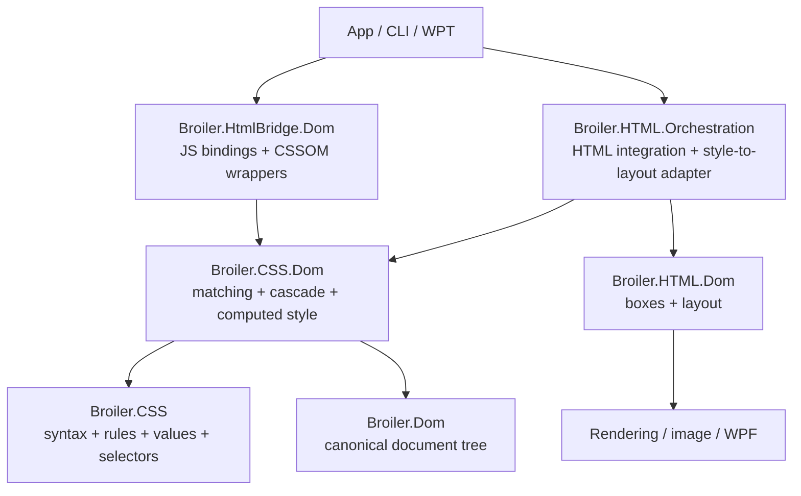

# Broiler CSS Component Plan

**Status:** Phases 0-7 implemented. RF-CSS-1 compatibility cleanup is closed;
RF-CSS-2's final raster-performance confirmation remains in
[`refactor-gap.md`](refactor-gap.md).

**Date:** 2026-06-28
**Scope:** Extract reusable CSS parsing, selector, cascade, and computed-style
support into a separate `Broiler.CSS` component without moving renderer layout,
JavaScript bindings, resource loading, or painting into that component.

## 1. Executive decision

Broiler can and should extract CSS support into a separate component, but the
work is not a rename or relocation of the existing `Broiler.HTML.CSS` project.

The current project is already a small parser assembly, while the complete CSS
implementation is split between:

- `Broiler.HTML.CSS`, which parses renderer stylesheets and values;
- `Broiler.HTML.Core`, which owns the renderer's CSS rule model and
  computed-style IR;
- `Broiler.HTML.Orchestration`, which loads stylesheets and applies the
  renderer cascade;
- `Broiler.HTML.Dom`, which owns CSS-backed box properties and layout;
- `Broiler.HtmlBridge.Dom`, which has a second parser/cascade, selector engine,
  style invalidation, `getComputedStyle()`, and CSSOM implementation;
- `Broiler.HtmlBridge.Rendering`, which has additional CSS box and text helper
  models.

The recommended target is one CSS component with two focused production
assemblies:

1. `Broiler.CSS` for syntax, stylesheet/rule models, declarations, values,
   selector parsing, and specificity. It must be independent of DOM, HTML,
   JavaScript, graphics, networking, and UI assemblies.
2. `Broiler.CSS.Dom` for selector matching, cascade, computed styles, and style
   invalidation over the canonical `Broiler.Dom` tree.

The first deliverable should be solution-local projects under `src/`. Publishing
a package or creating another Git submodule should wait until the in-repository
migration proves the API.

## 2. Feasibility verdict

| Question | Finding |
|---|---|
| Can the existing parser become an independent module? | Yes, after its models and environment contracts move out of `Broiler.HTML.Core`. |
| Can all files named `Css*` move into it? | No. Most `CssBox*` and `CssLayout*` types are renderer layout implementation. |
| Can the bridge use the same CSS implementation? | Yes, after pure selector, parsing, cascade, and invalidation logic is separated from JavaScript object construction. |
| Can the extraction be done as one change? | No. The renderer and bridge currently implement overlapping but different CSS behavior. A dual-run migration is required. |
| Overall feasibility | High. |
| Migration risk | Medium to high because CSS behavior is distributed and heavily regression-tested through integration suites rather than unit tests. |

## 3. Current-state evidence

### 3.1 The existing project is not a standalone CSS component

`Broiler.HTML.CSS` contains seven C# files and approximately 4,991 lines:

- `CssParser.cs`;
- `CssValueParser.cs`;
- `CssLength.cs`;
- `CssDataParser.cs`;
- two regex helper files;
- assembly metadata.

Its main types are internal. Other assemblies reach them through
`InternalsVisibleTo`, including the HTML facade, DOM/layout, orchestration,
rendering, image, test, and WPF assemblies.

Its project references are:

```text
Broiler.HTML.CSS
|- Broiler.HTML.Primitives
|- Broiler.HTML.Utils
`- Broiler.HTML.Core
   `- Broiler.HTML.Adapters
      `- Broiler.Graphics
```

Consequently, the parser has a transitive dependency on the graphics stack.
The main causes are that:

- CSS models such as `CssData`, `CssBlock`, `CssFontFace`, and keyframes live
  in `Broiler.HTML.Core`;
- `IColorResolver` lives in `Broiler.HTML.Core`;
- `IColorResolver` also asks whether a platform font exists;
- the concrete resolver is `RAdapter`, which owns fonts and graphics resources;
- CSS units and constants live in the primitives and utility projects.

This boundary is usable inside the renderer, but it is not independently
consumable or independently testable.

### 3.2 CSS responsibilities are distributed

Approximate source sizes for the principal areas are:

| Area | Files | Lines | Extraction interpretation |
|---|---:|---:|---|
| Renderer CSS parser/value handling | 6 | 4,982 | Candidate for `Broiler.CSS` |
| Renderer CSS rule model and computed-style IR | 6 | 671 | Split between CSS-owned models and renderer-owned IR |
| Renderer `CssBox*` and `CssLayout*` code | 13 | 10,491 | Keep in HTML layout |
| Bridge CSS/cascade/selectors/CSSOM | 3 large partials | 5,379 | Pure portions should converge into the new component |
| Bridge rendering CSS helpers | 2 | 1,333 | Keep with rendering unless a type proves generally reusable |

These figures do not include every CSS branch in `DomParser`, paint, hit
testing, anchor positioning, or WPT harness code. They are sufficient to show
that moving only `Broiler.HTML.CSS` would extract the parser name, not the CSS
subsystem.

### 3.3 Broiler currently has two style engines

The HTML renderer:

- parses into `CssData` and `CssBlock`;
- indexes rules by the terminal selector text;
- applies rules in `Broiler.HTML.Orchestration.Parse.DomParser`;
- writes declarations directly into `CssBoxProperties`;
- resolves many used values lazily inside layout.

The JavaScript bridge:

- parses style text into selector/declaration dictionaries;
- has a more extensive Selectors Level 4 matcher and specificity calculator;
- builds its own computed-style maps;
- maintains its own invalidation cache;
- parses CSS rule strings again for CSSOM;
- includes its own length, shorthand, media-query, custom-property, and
  animation helpers.

The two implementations overlap but are not equivalent. Reusing one of them
unchanged would preserve one consumer while regressing the other.

### 3.4 The canonical DOM makes extraction more practical

The new `Broiler.Dom` component provides:

- typed elements and attributes;
- parent, child, sibling, and traversal relationships;
- mutation records;
- document and subtree versioning;
- no JavaScript or graphics dependency.

That is a suitable base for a shared selector matcher and style invalidation
service. The CSS component should target `Broiler.Dom.DomElement`, not the
temporary `Broiler.HtmlBridge.DomElement` compatibility facade or renderer
`CssBox` objects.

### 3.5 Existing public compatibility surfaces

The extraction must account for these current public APIs:

- `Broiler.HTML.Core.CssData`;
- `Broiler.HTML.Core.Entities.CssBlock` and related rule types;
- `Broiler.HTML.Image.HtmlRender.ParseStyleSheet(...)`;
- `Broiler.HTML.WPF.HtmlRender.ParseStyleSheet(...)`;
- image and WPF render methods that accept `CssData`;
- `HtmlContainer.CssData`;
- stylesheet load events that can return `CssData`;
- `DomBridge.CalculateSpecificity(...)`;
- `DomBridge.CssRules`.

The current parser itself is internal, so the main compatibility burden is the
model and facade APIs rather than parser constructors.

## 4. Goals

The extracted component must:

- provide one stylesheet and declaration parser for the renderer and bridge;
- provide one selector parser and specificity implementation;
- provide one selector matcher over `Broiler.Dom`;
- provide one cascade and computed-style authority for both
  `getComputedStyle()` and renderer input;
- centralize initial values, inheritance metadata, shorthand expansion, custom
  property handling, and media-query decisions;
- expose engine-neutral mutation-driven invalidation;
- run unit tests without JavaScript, graphics, WPF, image, HTTP, or filesystem
  assemblies;
- preserve renderer, bridge, Acid, and WPT behavior during migration;
- support a compatibility path for existing `CssData` consumers.

## 5. Non-goals

The extraction will not initially:

- move layout algorithms or `CssBox`, `CssLineBox`, `CssRect`, flex, grid, or
  table layout into `Broiler.CSS`;
- move painting, color-space conversion for a backend, font shaping, image
  decode, or SVG rasterization;
- move network or filesystem stylesheet loading;
- move HTML `<style>` and `<link>` discovery rules;
- expose JavaScript `CSSStyleSheet`, `CSSRule`, or
  `CSSStyleDeclaration` objects from the CSS component;
- complete all CSS standards as part of the architectural change;
- publish a stable NuGet package before the internal migration is complete;
- create a separate repository or Git submodule in the first phase.

## 6. Proposed component structure

```text
src/
|- Broiler.CSS/
|  |- Syntax/
|  |- Rules/
|  |- Selectors/
|  |- Values/
|  |- Properties/
|  `- Broiler.CSS.csproj
|- Broiler.CSS.Dom/
|  |- Matching/
|  |- Cascade/
|  |- Computed/
|  |- Invalidation/
|  `- Broiler.CSS.Dom.csproj
|- Broiler.CSS.Tests/
`- Broiler.CSS.Dom.Tests/
```

### 6.1 `Broiler.CSS`

Owned responsibilities:

- tokenization and parsing of stylesheets, rules, declarations, and values;
- stylesheet, rule, declaration, keyframe, font-face, and media-rule models;
- selector syntax trees;
- specificity;
- property names, initial values, inheritance metadata, and shorthand
  expansion;
- typed or structured CSS values where proven useful;
- serialization of the owned CSS model;
- parser diagnostics and error recovery.

Allowed dependencies:

- .NET base class libraries only.

Forbidden dependencies:

- `Broiler.Dom`;
- `Broiler.HTML.*`;
- `Broiler.HtmlBridge.*`;
- `Broiler.JavaScript.*`;
- `Broiler.Graphics`;
- WPF, image, network, filesystem, or application projects.

The project should not depend on platform font availability. A stylesheet
parser should preserve a valid font-family list even when the current host
cannot resolve the first family.

### 6.2 `Broiler.CSS.Dom`

Owned responsibilities:

- selector matching against `Broiler.Dom.DomElement`;
- cascade ordering by origin, importance, layer, specificity, and source order;
- inheritance and custom-property resolution;
- computed-style maps or immutable snapshots;
- pseudo-element style resolution;
- media/environment evaluation through small host-provided value objects;
- style invalidation driven by DOM mutations and environment changes;
- shared query operations used by DOM APIs and style resolution.

Dependencies:

- `Broiler.CSS`;
- `Broiler.Dom`;
- .NET base class libraries.

Forbidden dependencies:

- JavaScript engine types;
- HTML renderer boxes or adapters;
- graphics, WPF, and image types;
- network and filesystem access.

### 6.3 Responsibilities that remain with consumers

| Responsibility | Owner after extraction |
|---|---|
| Discover `<style>` and `<link rel=stylesheet>` | HTML/browser orchestration |
| Fetch files, HTTP resources, data URIs, and resolve base URLs | Resource-loading host |
| Build JavaScript CSSOM objects | `Broiler.HtmlBridge.Dom` |
| Convert computed styles into layout boxes | `Broiler.HTML.Orchestration` |
| Layout, used-value resolution, and box geometry | HTML layout assembly |
| Paint, compositing, images, fonts, and backend colors | Rendering/backend assemblies |
| Web Animations scheduling and JavaScript-facing animation objects | Bridge/browser runtime |
| HTML user-agent stylesheet selection | HTML host |

## 7. Target dependency direction



No dependency may point from `Broiler.CSS` or `Broiler.CSS.Dom` back into a
consumer.

## 8. Design rules

### 8.1 Use a lossless shared rule model

The current `CssData` model is optimized for the renderer's existing lookup
strategy. It indexes blocks by a terminal selector string and stores selectors
as renderer-oriented fragments. It should not become the permanent public
model for the new component.

The new model should preserve:

- complete selector lists;
- nested grouping rules;
- source order;
- cascade origin and importance;
- unknown declarations and unsupported rules where CSSOM serialization needs
  them;
- custom property spelling and case;
- URLs and other case-sensitive values;
- source ranges or diagnostics when useful.

`CssData` should initially be adapted from the new model for compatibility,
then deprecated after all renderer consumers use the shared style engine.

### 8.2 Keep syntax separate from environment-dependent resolution

Parsing a value and resolving it are different operations.

Examples:

- `2em`, `50%`, `10vw`, and `calc(...)` can be parsed without a viewport or
  containing block;
- named colors can be represented without creating a backend brush;
- a font-family list remains valid even if no listed font is installed;
- relative URLs can be retained in the stylesheet and resolved by the host.

Replace the current combined `IColorResolver`/font-availability dependency with
small, explicit environment inputs at computation or rendering time.

### 8.3 Do not move layout because its classes start with `Css`

`CssBox`, `CssBoxProperties`, `CssLayoutEngine`, `CssLayoutEngineTable`,
`CssLineBox`, and `CssRect` represent the renderer's formatting and layout
implementation. They consume CSS, but they are not reusable CSS syntax,
cascade, or CSSOM services.

The HTML renderer should eventually receive an immutable computed style from
`Broiler.CSS.Dom` and map it into its layout representation.

### 8.4 Keep CSSOM wrappers out of the CSS kernel

The CSS component should own engine-neutral stylesheet and rule objects.
`Broiler.HtmlBridge.Dom` should continue to create `JSObject`, `JSArray`, and
`JSFunction` wrappers, preserving object identity and live-list semantics.

This split allows the same rule model to back:

- `document.styleSheets`;
- `cssRules`;
- `insertRule()` and `deleteRule()`;
- renderer style resolution;
- diagnostics and serialization.

### 8.5 Make invalidation mutation-driven

`Broiler.CSS.Dom` should subscribe to or consume canonical DOM mutation records.
It should invalidate based on:

- changed attributes, including `id`, `class`, and selector-relevant
  attributes;
- child-list changes that affect structural selectors;
- style and stylesheet text changes;
- document attachment and adoption;
- viewport, media, and other environment changes.

The DOM reports changes. The CSS component decides which styles are stale. The
renderer and bridge decide when to request recomputation.

### 8.6 Preserve one style authority during each migration stage

Temporary dual execution is acceptable for comparison, but only one result may
drive observable behavior. Do not merge values from the old and new style
engines.

Each consumer should cut over only after its differential suite is within the
agreed compatibility budget.

## 9. Public API sketch

The final names should be proven through migration tests, but the intended
shape is:

```csharp
namespace Broiler.CSS;

public sealed class CssParser
{
    public CssStyleSheet ParseStyleSheet(string source);
    public CssDeclarationBlock ParseDeclarations(string source);
    public CssSelectorList ParseSelectors(string source);
}

public sealed class CssStyleSheet
{
    public IReadOnlyList<CssRule> Rules { get; }
    public IReadOnlyList<CssDiagnostic> Diagnostics { get; }
}

public readonly record struct CssSpecificity(int Ids, int Classes, int Types)
    : IComparable<CssSpecificity>;
```

```csharp
namespace Broiler.CSS.Dom;

public sealed class CssStyleEngine
{
    public CssComputedStyle GetComputedStyle(
        DomElement element,
        CssPseudoElement pseudoElement = CssPseudoElement.None);

    public bool Matches(DomElement element, CssSelector selector);
    public void AddStyleSheet(CssStyleSheet sheet, CssOrigin origin);
    public void RemoveStyleSheet(CssStyleSheet sheet);
    public void UpdateEnvironment(CssEnvironment environment);
}
```

Avoid exposing mutable `List<T>` and `Dictionary<TKey,TValue>` collections from
the new public surface.

## 10. Migration strategy

### Phase 0 - Characterize and guard both CSS engines

**Status:** Implemented on 2026-06-25.

Deliverables:

- add architecture tests that record the current CSS project references,
  friend-assembly access, and public compatibility surfaces;
- add direct parser tests for declarations, shorthands, colors, lengths,
  media rules, font faces, keyframes, error recovery, and custom properties;
- add direct selector and specificity tests independent of JavaScript;
- add a corpus that runs representative stylesheets through both current
  implementations and records intentional differences;
- record performance baselines for parsing, matching, computed style,
  invalidation, and renderer style application;
- classify the current Acid and WPT CSS tests by parser, selector, cascade,
  CSSOM, layout, and paint responsibility.

Exit criteria:

- architectural movement can be distinguished from behavior changes;
- known renderer/bridge disagreements are documented rather than discovered
  during cutover;
- parser and selector behavior has focused non-pixel coverage.

#### Phase 0 implementation record

The characterization layer is hosted in existing projects so it can guard the
extraction before `Broiler.CSS` exists:

- `CssExtractionPhaseZeroTests` freezes the current CSS project references,
  friend-assembly access, public `CssData`/facade compatibility surfaces,
  renderer parsing behavior, bridge specificity, and selector matching;
- `tests/css/phase0/css-engine-differential-corpus.json` runs representative
  stylesheets through both current parsers and records intentional differences;
- `docs/testing/css-phase0-responsibility-inventory.md` classifies focused,
  Acid, and WPT coverage by parser, selector, cascade, CSSOM, layout, and paint
  responsibility;
- the engine benchmark harness now records CSS parse, selector match, computed
  style, invalidation, and renderer style-application metrics.

The first differential corpus records three seams:

1. the renderer expands shorthands and normalizes keyword case while the bridge
   preserves raw declarations;
2. the renderer removes the `url(...)` wrapper from a data-URI background value
   while the bridge preserves it;
3. the renderer stores `@font-face` and `@keyframes` metadata while the bridge
   style-rule cache strips those rules for separate CSSOM handling.

The direct parser suite originally froze a renderer parser quirk: a terminal
block-style at-rule was not discovered unless another rule followed it. Phase 2
corrected that behavior explicitly when rule-boundary discovery moved to
`Broiler.CSS`; the characterization test now guards the corrected contract.

The baseline recorded on 2026-06-25 is:

| Metric | Mean | Unit |
|---|---:|---|
| `css.parse` | 98,091.583 | ns/op |
| `css.selector-match` | 111,219.075 | ns/op |
| `css.computed-style` | 231,812.683 | ns/op |
| `css.invalidation` | 385,127.067 | ns/op |
| `css.renderer-style-apply` | 1.333 | ms |

These CSS metrics are characterization baselines and are not blocking gates
yet. They should become gated only after several representative CI runs have
established stable variance.

Validation completed on 2026-06-25:

```bash
dotnet test src/Broiler.Cli.Tests/Broiler.Cli.Tests.csproj \
  --filter "FullyQualifiedName~CssExtractionPhaseZeroTests"

dotnet build src/Broiler.Engines.Baseline/Broiler.Engines.Baseline.csproj \
  --configuration Release

dotnet run --project src/Broiler.Engines.Baseline \
  --configuration Release --no-build -- benchmarks \
  --output-dir tests/m0-baseline/performance \
  --baseline tests/css/phase0/nonexistent-baseline.json
```

All 13 CSS Phase 0 tests pass. The Release benchmark project builds with no
errors; existing dependency-pruning and unused-local-function warnings remain.

### Phase 1 - Create the dependency-light `Broiler.CSS` kernel

**Status:** Implemented on 2026-06-25.

Deliverables:

- add `Broiler.CSS` and `Broiler.CSS.Tests`;
- move or replace CSS units and constants needed by parsing;
- introduce stylesheet, rule, declaration, selector, specificity, value, and
  diagnostic models;
- remove platform font checks from parsing;
- provide deterministic serialization;
- add architecture tests forbidding Broiler project references.

Compatibility:

- keep `Broiler.HTML.Core.CssData` as a temporary adapter;
- do not rename public image/WPF APIs yet;
- keep the existing renderer driven by its old result.

Exit criteria:

- `Broiler.CSS` builds with no project or package references;
- its tests run without loading DOM, JavaScript, graphics, or renderer
  assemblies;
- the parser corpus is behaviorally characterized.

#### Phase 1 implementation record

The solution now contains a standalone `Broiler.CSS` production assembly and a
focused `Broiler.CSS.Tests` project. The kernel exposes:

- immutable/read-only stylesheet, style-rule, at-rule, declaration, selector,
  specificity, value, color, numeric-unit, diagnostic, and source-range
  models;
- entry points for stylesheet, declaration, selector, and value parsing;
- deterministic normalized serialization;
- parser recovery diagnostics while preserving unknown declarations and
  at-rules;
- selector-list parsing and Selectors Level 4 specificity handling for
  `:is()`, `:where()`, `:has()`, and the `of` clause of `:nth-child()`;
- platform-independent numeric, unit, function, string, URL, named-color,
  hexadecimal-color, RGB, and HSL value parsing.

`Broiler.CSS.csproj` has no `ProjectReference` or `PackageReference` items.
Architecture tests additionally inspect the built assembly and fail if its
public API leaks another Broiler namespace, exposes mutable collection types,
or gains a non-framework assembly reference.

The Phase 0 differential corpus is also parsed and round-tripped by the new
kernel. This is a structural and stability guard at this stage, not a consumer
cutover: `Broiler.HTML.Core.CssData` and the public image/WPF APIs remain
unchanged while parser consumers migrate in Phase 2.

Validation completed on 2026-06-25:

```bash
dotnet test src/Broiler.CSS.Tests/Broiler.CSS.Tests.csproj
```

All 21 Phase 1 kernel and architecture tests pass.

### Phase 2 - Migrate stylesheet and value parsing

**Status:** Implemented on 2026-06-25.

Deliverables:

- port the useful behavior from `Broiler.HTML.CSS.CssParser` and
  `CssValueParser` into the new kernel;
- port declaration and rule parsing currently duplicated in
  `DomBridge/Css.cs`, `StyleSheets.cs`, and `AnimationResolver.cs`;
- provide compatibility conversion from `CssStyleSheet` to `CssData`;
- make the renderer and bridge parse through `Broiler.CSS` while retaining
  their existing cascade implementations;
- remove duplicated regex rule splitting once parity is demonstrated.

Exit criteria:

- both consumers use the same parsed stylesheet and declaration model;
- renderer image baselines and bridge CSSOM/parser tests pass;
- no consumer reparses rule text merely to obtain a different internal model.

#### Phase 2 implementation record

Both legacy CSS consumers now reference `Broiler.CSS` and use it as their
stylesheet/declaration boundary:

- `Broiler.HTML.CSS.CssParser` parses the source once into `CssStyleSheet`,
  then adapts style rules, media rules, font metadata, and keyframes into the
  existing `CssData` representation;
- renderer shorthand expansion, property validation, color resolution, and
  layout-oriented value normalization remain in the compatibility adapter;
- `Broiler.HtmlBridge.Dom` imports style rules and matching media-rule contents
  from the shared rule tree while retaining its current cascade;
- bridge inline-style parsing, HTML-tree style attributes, animation
  declarations, keyframes, CSSOM top-level rule splitting, and animation rule
  discovery now use the shared parser;
- the bridge regex rule splitters and its custom semicolon-aware declaration
  splitter were removed;
- `CssSerializer` can serialize individual rules and declaration blocks for
  compatibility adapters and the current string-backed CSSOM layer.

The Phase 0 differential corpus remains green and continues to document the
intentional output differences after parsing: the renderer still expands and
normalizes declarations while the bridge preserves its existing raw-value
shape. CSSOM storage remains string-backed until Phase 6, but its rule
boundaries now come from the shared model.

One intentional conformance correction is included: a terminal `@font-face`
rule is now discovered without requiring a trailing style rule.

Focused validation completed on 2026-06-25:

```bash
dotnet test src/Broiler.CSS.Tests/Broiler.CSS.Tests.csproj

dotnet test src/Broiler.Cli.Tests/Broiler.Cli.Tests.csproj \
  --filter "FullyQualifiedName~CssExtractionPhaseZeroTests|FullyQualifiedName~CssExtractionPhaseTwoTests"
```

All 22 kernel tests and all 16 Phase 0/Phase 2 extraction tests pass.

The focused renderer/cascade suite (`CssRenderingTests`,
`CssImportantCascadeTests`, `CssSelectorsPolishTests`, and
`WptCssVariablesTests`) adds 93 passing tests. The full solution builds with no
errors; five pre-existing package-pruning warnings remain.

### Phase 3 - Extract selectors and specificity

**Status:** Implemented on 2026-06-25.

Deliverables:

- add `Broiler.CSS.Dom` and its tests;
- move selector matching and specificity logic out of the `DomBridge` partial
  class;
- target canonical `Broiler.Dom.DomElement`;
- support the selector features already covered by Acid and WPT tests;
- adapt `querySelector`, `querySelectorAll`, `matches`, anchor helpers, and
  bridge style resolution to the shared matcher;
- add a temporary renderer adapter for its legacy `HtmlTag`/`CssBox` matching
  path if direct canonical-DOM matching cannot cut over immediately.

Exit criteria:

- `DomBridge.CalculateSpecificity(...)` delegates to the shared implementation;
- bridge selector APIs use `Broiler.CSS.Dom`;
- selector results are covered without a JavaScript context;
- no new selector parser is added to renderer code.

#### Phase 3 implementation record

The solution now contains `Broiler.CSS.Dom` and `Broiler.CSS.Dom.Tests`.
`Broiler.CSS.Dom` references only `Broiler.CSS` and `Broiler.Dom`, and exposes
`CssSelectorMatcher` over canonical `Broiler.Dom.DomElement` nodes.

The shared matcher covers:

- type, universal, ID, class, and attribute selectors;
- descendant, child, adjacent-sibling, and general-sibling combinators;
- structural pseudo-classes and `An+B` expressions;
- `:is()`, `:where()`, `:not()`, `:has()`, and `nth-child(... of ...)`;
- `:root`, `:scope`, `:empty`, `:lang()`, link, form-state, and open-state
  pseudo-classes;
- pseudo-element-compatible host matching;
- CSS escapes, selector lists, relative selectors, and ASCII HTML type-name
  matching.

One narrow `ICssSelectorStateProvider` hook carries dynamic form-control state
such as a JavaScript-modified checkbox without introducing a bridge or
JavaScript dependency.

`DomBridge.MatchesSelector(...)` is now a compatibility wrapper over
`CssSelectorMatcher`. Consequently, document and element query APIs,
`matches()`, style resolution, animation helpers, and anchor-position helpers
all use the shared matcher without call-site-specific selector implementations.
`DomBridge.CalculateSpecificity(...)` delegates to
`CssSelectorParser.CalculateSpecificity(...)`; the bridge's duplicate matcher
and specificity implementation were removed.

The renderer remains on its existing `CssData` selector adapter until the
canonical-DOM renderer cutover in Phase 5. No additional renderer selector
parser was introduced.

Focused validation completed on 2026-06-25:

```bash
dotnet test src/Broiler.CSS.Dom.Tests/Broiler.CSS.Dom.Tests.csproj

dotnet test src/Broiler.Cli.Tests/Broiler.Cli.Tests.csproj \
  --filter "FullyQualifiedName~CssExtractionPhaseZeroTests|FullyQualifiedName~CssExtractionPhaseTwoTests|FullyQualifiedName~CssExtractionPhaseThreeTests|FullyQualifiedName~SelectorsLevel4SpecificityTests"
```

All 7 shared selector/architecture tests pass. The extraction and specificity
plus renderer/cascade guard set passes all 116 tests. The broader
selector/CSSOM batch passes 80 of 85 tests; the
remaining five are the same canonical-DOM integration failures present before
the selector cutover (document-root traversal, namespaced `xml:lang` parsing,
and mutation visibility for three nested `:has()` removal scenarios).

The full solution builds with no errors; five pre-existing package-pruning
warnings remain.

### Phase 4 - Extract cascade and computed style

**Status:** Implemented on 2026-06-26. The shared cascade/computed-style engine is
the default bridge path. Remaining legacy tuple/parser removal belongs to Phase 7
and is tracked in [`refactor-gap.md`](refactor-gap.md).

Deliverables:

- centralize initial values, inherited properties, origins, `!important`,
  source order, shorthand expansion, custom properties, media evaluation, and
  pseudo-element styles;
- introduce immutable `CssComputedStyle`;
- connect invalidation to `Broiler.Dom` mutation records and document versioning;
- make bridge `getComputedStyle()` a JavaScript wrapper over shared computed
  styles;
- keep renderer-specific used-value and geometry calculation outside the
  component.

Exit criteria:

- dynamic style, attribute, and tree mutations invalidate the correct entries;
- bridge computed-style tests pass through the shared engine;
- bridge anchor and animation helpers consume the shared rule/style APIs
  instead of `DomBridge.CssRules` tuples.

#### Phase 4 implementation record

The shared cascade and computed-style engine now exists in `Broiler.CSS.Dom`
and is the intended single authority for both consumers:

- `CssComputedStyle` is an immutable computed-style snapshot exposing
  `GetPropertyValue`, `Contains`, `PropertyNames`, and `Properties` with no
  mutable collections on the public surface;
- `CssStyleEngine` resolves the cascade over canonical `Broiler.Dom.DomElement`
  nodes by origin (`CssOrigin`), importance, specificity, and source order,
  reusing the Phase 3 `CssSelectorMatcher`;
- the engine centralizes initial values, inherited-property metadata,
  CSS-wide keyword resolution (`initial`/`unset`/`revert`, with `inherit`
  preserved), shorthand expansion (font, box, border, logical, background),
  custom-property inheritance and `@property` registration defaults, `var()`
  resolution, relative font-weight resolution, `attr()` length substitution,
  approximate form-control sizing, and logical-size aliases;
- media queries and viewport-relative lengths resolve through a host-supplied
  `CssEnvironment`, keeping the kernel environment-free;
- pseudo-element styles (`::before`, `::after`, `::first-line`,
  `::first-letter`) resolve through a dedicated target-matching path;
- computed-style results are cached and invalidated by subscribing to
  `DomDocument.Mutated`, so attribute, class, and tree mutations (and
  stylesheet/environment changes) drop stale entries.

`CssStyleEngine` depends only on `Broiler.CSS` and `Broiler.Dom`. Architecture
tests assert it leaks no JavaScript, HTML-renderer, graphics, or bridge types
and exposes no mutable `List`/`Dictionary`/`HashSet` on its public surface.
`Broiler.CSS.Dom.Tests` adds focused coverage for cascade ordering,
specificity, importance, inline precedence, inheritance, initial values,
shorthand expansion, custom-property inheritance and `var()` fallback, media
evaluation, pseudo-element targeting, relative font-weight, and
mutation-driven recomputation.

Historical Phase 4 checkpoint (subsequently completed by the cutover records below;
retained for chronology):

Remaining at that checkpoint (subsequent validated slices, per the dual-run guidance
in §8.6 and PR slices #8-#9):

- cut bridge `getComputedStyle()` over to `CssStyleEngine` behind a differential
  comparison, because the bridge's current `BuildComputedStyleMap` carries
  behavioral quirks (e.g. inheritance sourced from the simpler anchor
  `GetComputedProps` map, `!important` retained in stored values, user-agent
  display defaults applied only on the anchor path) that must be reconciled
  against the engine's principled cascade before the observable result is
  switched;
- migrate the `DomBridge/AnchorResolver/*` and `AnimationResolver` consumers off
  `DomBridge.CssRules` tuples onto the shared rule/style APIs.

Validation completed on 2026-06-26:

```bash
dotnet test src/Broiler.CSS.Dom.Tests/Broiler.CSS.Dom.Tests.csproj
```

All 24 `Broiler.CSS.Dom` engine and architecture tests pass. The existing CSS
extraction, selector, cascade, and computed-style guard suite in
`Broiler.Cli.Tests` is unchanged at 192 passing / 6 pre-existing
canonical-DOM integration failures (the same Phase 3 baseline), confirming the
additive engine introduces no regressions.

#### Phase 4 cutover slice — `getComputedStyle()` dual-run wiring (2026-06-26)

The bridge now resolves `getComputedStyle()` (and pseudo-element serialization
styles) through the shared `CssStyleEngine`:

- `DomBridge.ComputedStyleEngine.cs` adds `BuildComputedStyleMapViaEngine`, which
  keeps one `CssStyleEngine` per document root (preserving the engine's
  mutation-driven cache and its single `DomDocument.Mutated` subscription),
  re-syncs the scoped `<style>`/`<link>`/inserted-CSSOM stylesheet text only when
  it changes, supplies the viewport via `CssEnvironment`, and projects
  `CssComputedStyle.Properties` back into the bridge's `Dictionary<string,string>`
  contract. The bridge's `DomElement` derives from canonical `Broiler.Dom.DomElement`,
  so the engine runs directly on bridge nodes — no adapter needed.
- `DomBridge.BuildComputedStyleMap` dispatches to either the engine path or the
  retained `BuildComputedStyleMapLegacy` via the `UseSharedComputedStyleEngine`
  gate (per §8.6: one authority drives observable behavior). The gate is **off**
  by default because a differential run showed the engine is not yet at parity.

Differential findings (engine ON vs. legacy), separating real cutover regressions
from this tree's pre-existing rendering/known-limitation failures: the engine
passes the focused selector/cascade/computed-style guard suite with no new
failures, but regresses the **value-validation / error-recovery** family — the
legacy bridge cascade discards invalid declarations so the previous valid value
wins (`#t{display:inline-block;display:supergrid}` ⇒ `inline-block`), whereas the
engine has no validity tables and keeps the last-parsed value. Affected tests
include `Acid3CssComplianceTests.Invalid_{Display,Visibility,Overflow}_Value_Discarded`,
`WhiteSpace_Invalid_Value_Discarded_By_Error_Recovery`,
`Acid3_Instructions_{Color,WhiteSpace}_Error_Recovery`,
`Border_Shorthand_Expands_Color_To_Individual_Sides`, and
`Acid3RegressionTests.GetComputedStyle_CssErrorRecovery_InvalidValue_Ignored`.

Reconciliation needed before flipping `UseSharedComputedStyleEngine` to `true`:
add per-declaration value validation / error recovery to the `CssStyleEngine`
cascade (skip invalid keyword/length values during `ApplyStyleRule` so the prior
valid declaration cascades), and confirm border-shorthand color→side expansion
parity. The remaining Acid3/WPT/form-control failures observed while toggling the
gate are pre-existing in this submodule-pinned tree (rendering/pixel/image-capture
and documented cascade-ordering known-limitations such as
`Acid3CascadeDebugTests.Without_Important_Higher_Specificity_Red_Wins`), unchanged
by the gated cutover.

#### Phase 4 cutover slice — gate flipped on + anchor tuple migration (2026-06-26b)

- **Value validation ported to the engine.** `CssStyleEngine.Values.cs` gained
  `IsAcceptableDeclarationValue` (the legacy `DomBridge.IsAcceptableCssValue`
  closed-keyword table, validating the importance-stripped value). It runs at the
  engine's two declaration-ingestion points — `ApplyStyleRule` (cascade) and the
  inline-style step in `ComputeStyle` — so an invalid declaration is dropped and a
  prior valid value wins. `Broiler.CSS.Dom.Tests` adds eight error-recovery cases
  (invalid `display`/`visibility`/`overflow`/`position`/`white-space` keywords,
  unknown vendor colors, invalid inline values, custom-property pass-through);
  with this in place `UseSharedComputedStyleEngine` is **on** and the focused
  selector/cascade/computed-style guard suite holds at its 5-failure baseline.
- **Anchor declared-value collectors moved off the tuple.** `CssStyleEngine`
  exposes `GetCascadedDeclaredValues` (raw cascade-winning author values — no
  inline, inheritance, shorthand expansion, or initial-value backfill, so an
  undeclared property reads as absent, which the anchor code relies on). The
  bridge's `GetSyncedScopedEngine`/`CollectMatchedRuleProperties` route the six
  per-element `foreach (… in CssRules) if (MatchesSelector(…))` collectors
  (`PositionArea`, `PositionAreaQueries`, `FixedPosition`, `PositionTry` ×2,
  `ContainingBlocks`) through it; each still merges `element.Style` on top exactly
  as before, so behaviour is preserved by construction (same raw winners, same
  merge). `AnimationResolver` uses no tuples.

Still on `DomBridge.CssRules` (intentionally deferred — heterogeneous global
rule-scans whose only meaningful verification is the anchor-positioning/WPT suites):
`Visibility` and `AnchorRegistry` `anchor-name` scans, `Dialogs` `::backdrop`
scan, `AnchorFunctions`, and the `GetComputedProps` internal cascade (78 layout/hit-
test consumers). Migrating these needs a shared rule-enumeration (or per-element
declared-value) path plus anchor/WPT verification.

Per the user's instruction, this slice was validated with the fast engine unit
tests and the focused CSS guard suite only; the heavy Acid3/WPT pixel suites were
not re-run and should be run before merge to confirm full `getComputedStyle`
parity (e.g. `Border_Shorthand_Expands_Color_To_Individual_Sides`).

Build prerequisite resolved this session: the working tree did not build — the
`Broiler.HTML` submodule's six csprojs still referenced the pre-relocation
`..\..\..\src\Broiler.CSS` / `src\Broiler.Dom*` paths (repointed to the
`Broiler.CSS\` / `Broiler.DOM\` submodules), the `Broiler.JS` submodule's
`Broiler.Regex` reference leaked its namespace downstream (added
`<PrivateAssets>all</PrivateAssets>` beside its `BRegex` alias), and the three
`CssExtractionPhase{Zero,Two,Three}Tests` path guards were updated to the
submodule layout.

### Phase 5 - Adapt the HTML renderer

**Status:** Done — flag flipped on (2026-06-26). The renderer's element cascade now runs
through `Broiler.CSS.Dom.CssStyleEngine.GetCascadedStyle` for both the HTML-string and
typed-document paths (unified in `DomParser.PrepareCssTree`/`CascadeApplyStyles`), replacing
the legacy `AssignCssBlocks` selector matching while keeping layout-owned used-value resolution,
inheritance, presentational attributes, inline style, pseudo-elements, and animations. Verified
against the Acid3 + WPT pixel gates with no pass/fail regressions (details in
[`broiler-css-next-steps.md`](broiler-css-next-steps.md) §4d). Retiring `GetComputedProps`'
internal `CssRules` is the remaining Phase 5/7 tail.

Deliverables:

- make `Broiler.HTML.Orchestration` build a style context from the canonical
  `DomDocument`;
- replace `DomParser` selector/cascade assignment with shared computed styles;
- add a narrow mapping from `CssComputedStyle` to renderer
  `CssBoxProperties`;
- retain layout-owned resolution where containing-block, font metrics, or
  intrinsic sizes are required;
- split the renderer animation resolver into shared CSS interpolation and
  renderer-specific box application where practical;
- remove parser internals from `Broiler.HTML.Dom`.

Exit criteria:

- the bridge and renderer derive specified/computed properties from the same
  style engine;
- the renderer no longer indexes or matches rules through `CssData`;
- pixel, Acid, WPT, and performance gates remain within budget.

### Phase 6 - Back CSSOM with the shared model

**Status:** Implemented on 2026-06-26 (slices 6a and 6b). Phase 7 legacy cleanup
remains separate.

Deliverables:

- make `CSSStyleSheet`, `CSSRule`, and declaration wrappers reference shared
  model objects;
- route `insertRule()` and `deleteRule()` through model mutations;
- preserve live `cssRules` collections and JavaScript wrapper identity;
- invalidate shared style state when CSSOM mutations occur;
- remove string-only CSSOM rule storage.

Exit criteria:

- script mutations and renderer output observe the same stylesheet state;
- CSSOM no longer reparses independently from rendering;
- JavaScript types remain confined to the bridge.

#### Phase 6 implementation record (completed, 2026-06-26)

**Slice 6a — model-backed CSSOM rule storage (done).** `DomBridge/StyleSheets.cs`
now stores each `CSSStyleSheet`'s rules as a `List<Broiler.CSS.CssRule>` instead of
a `List<string>` of serialized rule text. `EnsureRulesUpToDate` parses the style
element's text through `Broiler.CSS.CssParser` into model objects;
`insertRule()`/`deleteRule()` (`JsStyleSheets{InsertRule005,DeleteRule006}Core`)
mutate that model list — `insertRule` parses the inserted text into a `CssRule`
rather than storing the raw string. A new `BuildCssRuleObject(CssRule, …)` overload
drives the JS wrapper from the model, sharing detail extraction with the existing
string builder via `CssSerializer` so the wrapper output is byte-identical. Live
`cssRules` identity and the per-style-element sheet cache are unchanged.
Verified: `SelectorsAndCssomTests` is 53 passing / 5 pre-existing selector-baseline
failures (no CSSOM regressions).

**Historical slice 6a remainder (completed by slice 6b):** nested
at-rule wrappers (`@media`/`@keyframes`/`@supports`/`@layer`) still build their
children from serialized strings via `ParseCssRuleStrings`; and the three separate
rule stores — the CSSOM `rulesStorage`, the renderer-visible `InsertedRules`
runtime state + style-element text read by `GetStyleElementCssText`, and the
`getComputedStyle` engine sheets — are not yet a single shared mutable model, so a
script `insertRule()` updates the CSSOM view but not rendering/`getComputedStyle`
(the "script mutations and renderer output observe the same stylesheet state" exit
criterion). Closing this means routing all three through one per-style-element
mutable `CssStyleSheet` and invalidating the style engine on CSSOM mutation.

### Phase 7 - Compatibility cleanup

**Status:** Completed on 2026-06-28. `HtmlStyleSet` is the supported origin-aware
renderer API; the old `CssData` signatures remain only as obsolete one-release
wrappers. RF-CSS-2 separately tracks the final performance confirmation.

Deliverables:

- migrate image, WPF, CLI, tool, and event APIs from `CssData` to
  `CssStyleSheet` or a higher-level style-set API;
- retain an obsolete `CssData` compatibility adapter for one release boundary
  if external compatibility is required;
- remove `Broiler.HTML.CSS`;
- remove obsolete CSS models from `Broiler.HTML.Core`;
- reduce broad `InternalsVisibleTo` declarations;
- update architecture and API/spec documentation.

Exit criteria:

- no production project references `Broiler.HTML.CSS`;
- no parser or selector implementation remains in `DomBridge`;
- the CSS component has explicit, narrow dependencies and tests;
- all supported public compatibility decisions are documented.

#### Phase 7 implementation record (2026-06-27–28)

- Removed both dual-run flags and legacy branches; the shared engine is the sole
  bridge and renderer cascade authority.
- Removed bridge `_cssRules`, manual stylesheet parse/apply and selector paths, and
  migrated anchor/visibility/backdrop/specified-style reads to `CssStyleEngine`.
- Removed `Broiler.HTML.CSS.csproj`, every production reference, and the temporary
  compatibility parser sources from `Broiler.HTML.Orchestration`.
- Added origin-aware `HtmlStyleSet` APIs for Image, Graphics, WPF, containers,
  stylesheet events, CLI/tools/apps/WPT, and file rendering. Marked `CssData` APIs
  obsolete and reduced the adapter to four shared-model members.
- Migrated pseudo-elements, selection, animations, serialization, lengths/colors,
  font faces, and feature values to the shared model; removed the obsolete Core CSS
  block/font/keyframe models and the renderer's manual selector matcher.
- Reduced `Broiler.Layout` friend grants from 16 to nine direct box-tree consumers
  and added architecture guards for the retired sources and reduced boundary.
- Added `scripts/run-rf-css-validation.ps1` with architecture, mutation, broad CSS,
  Acid3, WPT pixel, and performance gates plus explicit accepted baselines.

## 11. Recommended pull-request slices

Use small changes that keep behavior reviewable:

1. CSS boundary guards, direct tests, and benchmark baselines.
2. New syntax/model projects and architecture tests.
3. Value and declaration parser migration.
4. Stylesheet/at-rule parser migration.
5. Selector syntax and specificity migration.
6. Canonical-DOM matcher migration.
7. Shared cascade and computed-style engine.
8. Bridge `getComputedStyle()` and invalidation cutover.
9. Renderer style adapter and dual-run comparison.
10. Renderer cutover.
11. Shared-model CSSOM mutations.
12. `CssData` compatibility cleanup and old-project removal.

Avoid combining extraction with unrelated CSS conformance fixes. If a
conformance change is required to make the shared model coherent, isolate it
with explicit tests and specification references.

## 12. Testing strategy

### Unit tests

`Broiler.CSS.Tests` should cover:

- tokenization, comments, escapes, strings, URLs, and error recovery;
- declarations and `!important`;
- shorthand expansion;
- lengths, percentages, viewport units, functions, colors, and times;
- custom properties and `var()`;
- stylesheet and nested at-rule parsing;
- font-face, keyframes, media, supports, layer, namespace, and property rules;
- selector parsing and specificity;
- parse/serialize/parse stability.

`Broiler.CSS.Dom.Tests` should cover:

- type, class, ID, attribute, and namespace selectors;
- combinators;
- structural and functional pseudo-classes;
- pseudo-elements;
- cascade origin, importance, specificity, and source order;
- inheritance, initial, unset, revert, and custom properties;
- mutation-driven invalidation;
- stylesheet and environment changes;
- shadow/scoping behavior when supported.

### Differential tests

During migration, compare:

- old renderer parser versus `Broiler.CSS`;
- old bridge parser versus `Broiler.CSS`;
- old bridge matcher versus `Broiler.CSS.Dom`;
- old bridge computed style versus the shared engine;
- old renderer `CssBoxProperties` results versus mapped shared styles.

Store mismatches as approved compatibility differences or defects. Do not hide
them behind broad snapshots.

### Integration and conformance tests

Retain and classify:

- `SelectorsAndCssomTests`;
- `SelectorScopeTests`;
- `SelectorsLevel4SpecificityTests`;
- `CssRenderingTests`;
- `CssSelectorsPolishTests`;
- Acid2 and Acid3 CSS regressions;
- CSS WPT subsets, especially selectors, cascade, values, conditional rules,
  CSSOM, variables, fonts, flex, grid, and writing modes;
- renderer pixel and mismatch-classification baselines.

### Architecture tests

Assert that:

- `Broiler.CSS` has no Broiler project dependency;
- `Broiler.CSS.Dom` references only `Broiler.CSS` and `Broiler.Dom`;
- neither assembly exposes JavaScript, graphics, WPF, image, HTTP, filesystem,
  or renderer box types;
- the bridge contains wrappers, not a second parser/cascade;
- the renderer consumes shared computed styles, not a second selector engine;
- no consumer creates another mutable stylesheet authority.

### Performance tests

Track at least:

- stylesheet parse throughput and allocation;
- selector parse and match throughput;
- first computed-style calculation;
- cached computed-style lookup;
- class, ID, attribute, and child-list invalidation;
- renderer style-tree construction;
- end-to-end capture time and peak memory.

## 13. Risks and mitigations

| Risk | Mitigation |
|---|---|
| Renderer and bridge disagree on accepted CSS | Build a differential corpus before selecting shared behavior |
| A generic model cannot represent current CSSOM rules | Use a lossless rule tree and preserve unsupported rules for serialization |
| Dynamic mutations return stale computed styles | Drive invalidation from canonical DOM mutation records and environment versions |
| Renderer pixel output changes during cascade cutover | Dual-run style comparison before switching the observable result |
| `CssData` public APIs break consumers | Keep an adapter and migrate facade signatures in a separate compatibility phase |
| Platform color/font behavior leaks into parsing | Parse platform-independently and inject environment data only during computation or rendering |
| The CSS component absorbs layout and becomes another monolith | Enforce the ownership table and forbidden dependencies with architecture tests |
| Two style engines remain indefinitely | Define per-phase deletion criteria and prohibit new features in legacy paths after shared equivalents exist |
| Extraction work masks conformance changes | Separate behavior fixes into focused commits with spec-linked tests |

## 14. Recommended decisions

Treat the following as defaults unless implementation evidence disproves them:

1. Use the user-requested product name and namespace casing `Broiler.CSS`.
2. Start as solution-local projects, not a package or Git submodule.
3. Use two assemblies so parsing remains independent of DOM.
4. Base matching and cascade on canonical `Broiler.Dom` nodes.
5. Do not promote the current `CssData` model as the new permanent API.
6. Keep CSSOM JavaScript wrappers in `Broiler.HtmlBridge.Dom`.
7. Keep layout and paint in the HTML renderer.
8. Remove platform font availability from CSS parsing.
9. Cut over the bridge before the renderer for selectors and computed style,
   because the bridge already has broader selector coverage and direct tests.
10. Cut over the renderer only after property-level and pixel-level
    differential comparison.

## 15. Definition of done

The CSS extraction is complete when:

- `Broiler.CSS` and `Broiler.CSS.Dom` are present with focused unit and
  architecture tests;
- `Broiler.CSS` has no non-BCL dependencies;
- `Broiler.CSS.Dom` depends only on `Broiler.CSS` and `Broiler.Dom`;
- the renderer and JavaScript bridge parse the same stylesheet model;
- selector matching and specificity have one implementation;
- cascade, custom properties, computed styles, and invalidation have one
  implementation;
- CSSOM wrappers and rendering observe the same mutable stylesheet state;
- layout, resource loading, JavaScript bindings, and painting remain outside
  the CSS component;
- the default pipeline no longer uses `Broiler.HTML.CSS`, renderer-specific
  rule matching, or bridge-specific parsing;
- `CssData` is removed or retained only as an explicitly documented obsolete
  compatibility adapter;
- architecture, unit, Acid, WPT, pixel, and performance gates pass.
