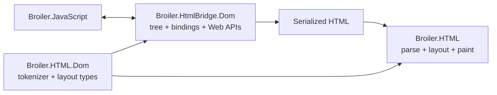
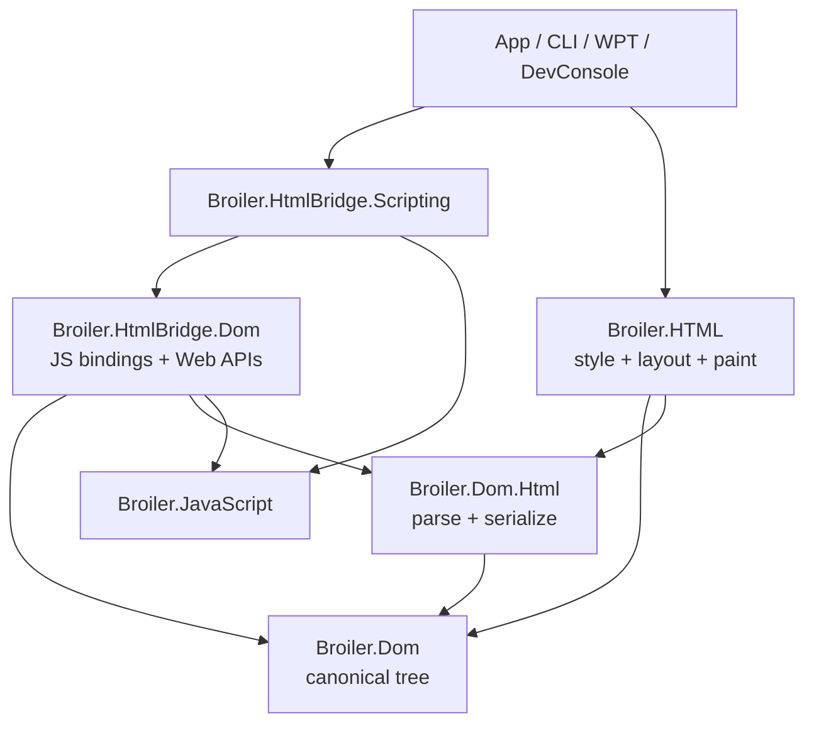

# Broiler DOM Component Plan

**Status:** Core Phases 0-6 implemented; roadmap closeout incomplete. Compatibility
surface retirement and deferred validation are tracked in
[`refactor-gap.md`](refactor-gap.md), RF-DOM-1 and RF-DOM-2.

**Date:** 2026-06-24
**Scope:** Extract a canonical, engine-neutral DOM component from the current
HTML renderer and JavaScript bridge without changing observable browser
behavior during the extraction.

## 1. Executive decision

Broiler should introduce a separate `Broiler.Dom` component that owns the
document tree and standards-shaped DOM algorithms. It must not depend on the
JavaScript engine, the HTML/CSS renderer, graphics, WPF, networking, or the
browser application.

The component should be introduced incrementally:

1. Create `Broiler.Dom` as the canonical node model and mutation authority.
2. Add `Broiler.Dom.Html` for HTML tree construction and serialization.
3. Adapt `Broiler.HtmlBridge.Dom` to bind JavaScript objects to the canonical
   DOM instead of owning the tree.
4. Adapt the HTML renderer to consume the same tree through a typed interface.
5. Retire the duplicate bridge-owned `DomElement` representation and the
   serialize-then-reparse renderer hand-off.

The existing `Broiler.HtmlBridge.Dom` project should not be renamed to
`Broiler.Dom`. Despite its name, it is currently a JavaScript/Web API binding
and browser-runtime integration layer, not an independent DOM implementation.

## 2. Why a separate component is needed

Broiler currently has two projects whose names imply DOM ownership, but neither
is a suitable canonical DOM component:

| Current area | Current responsibility | Why it is not the canonical DOM |
|---|---|---|
| `Broiler.HTML.Dom` | HTML tokenization plus CSS box, line, layout, and selection structures | Most types describe renderer layout rather than DOM nodes |
| `Broiler.HtmlBridge.Dom` | JavaScript object registration, DOM APIs, events, timers, Fetch/XHR, messaging, CSSOM, geometry, subdocuments, and serialization | It directly depends on Broiler.JavaScript, rendering code, and the HTML renderer |
| `Broiler.HtmlBridge.Core/Dom/DomElement.cs` | Lightweight mutable tree used by the bridge | At planning time it stored `JSValue` listeners and untyped runtime state, so the model was not engine-neutral |

At the time of this plan:

- `Broiler.HtmlBridge.Dom` contains about 28,500 lines across 66 C# files.
- 40 files in that project directly import `Broiler.JavaScript` namespaces.
- `IDomBridgeRuntime` accepts a concrete `JSContext`.
- `DomElement` stores JavaScript callbacks, parsed style data, reflected
  attributes, IDL properties, and tree state in one object.
- Script execution returns serialized HTML, which the renderer parses again.

The result is a blurred boundary:



This makes DOM correctness, renderer invalidation, JavaScript binding, and HTML
parsing difficult to evolve independently.

## 3. Goals

The extracted component must:

- provide one canonical document tree for scripting, developer tools, and
  rendering;
- model documents, elements, text, comments, document fragments, and document
  types as distinct node kinds;
- centralize parent/child mutation rules and document ownership;
- keep attributes as the single source of truth for `id`, `class`, namespace,
  and other reflected content attributes;
- expose mutation notifications without knowing how JavaScript microtasks or
  renderer invalidation are implemented;
- support HTML parsing and serialization through a companion assembly;
- permit DOM unit tests without loading the JavaScript engine or graphics
  stack;
- preserve the frozen `htmlbridge-public-surface/v1` compatibility surface
  during migration;
- enable a typed DOM-to-renderer hand-off.

## 4. Non-goals

The extraction will not initially:

- implement the complete WHATWG DOM and HTML standards;
- replace the JavaScript engine;
- rewrite the layout or paint engine;
- move `window`, timers, Fetch, XHR, CSP, messaging, or networking into
  `Broiler.Dom`;
- publish a stable external NuGet package;
- rename `Broiler.HTML.Dom` before its layout ownership is clarified;
- change Acid, WPT, or application-visible behavior merely to simplify the
  extraction.

## 5. Proposed component structure

Treat the DOM as one solution component with two focused production assemblies:

```text
src/
├── Broiler.Dom/
│   ├── Nodes/
│   ├── Attributes/
│   ├── Mutation/
│   ├── Events/
│   ├── Traversal/
│   └── Broiler.Dom.csproj
├── Broiler.Dom.Html/
│   ├── Parsing/
│   ├── Serialization/
│   └── Broiler.Dom.Html.csproj
├── Broiler.Dom.Tests/
└── Broiler.Dom.Html.Tests/
```

### 5.1 `Broiler.Dom`

`Broiler.Dom` is the dependency-light kernel.

Owned responsibilities:

- `DomNode`, `DomDocument`, `DomElement`, `DomText`, `DomComment`,
  `DomDocumentFragment`, and `DomDocumentType`;
- node identity, ownership, parent/child relationships, and tree order;
- attribute and namespace storage;
- core mutation algorithms such as append, insert, replace, remove, adopt,
  import, clone, normalize, and text replacement;
- document indexes for ID and other frequently queried attributes;
- traversal primitives and ranges once they can be moved without JS coupling;
- engine-neutral event and mutation records;
- hooks for style/layout invalidation and mutation scheduling.

Allowed dependencies:

- .NET base class libraries only.

Forbidden dependencies:

- `Broiler.JavaScript.*`;
- `Broiler.HtmlBridge.*`;
- `Broiler.HTML.*`;
- `Broiler.Graphics`;
- WPF, image, network, or application projects.

### 5.2 `Broiler.Dom.Html`

`Broiler.Dom.Html` owns HTML-specific construction and text conversion.

Owned responsibilities:

- WHATWG-oriented HTML tokenization;
- tree building into `DomDocument`;
- fragment parsing for `innerHTML`, `outerHTML`, `insertAdjacentHTML`, and
  `document.write`;
- HTML serialization;
- void-element and raw-text handling;
- document metadata extraction that belongs to parsing rather than rendering.

Dependencies:

- `Broiler.Dom`;
- .NET base class libraries.

The current `HtmlTokenizer`, bridge `HtmlTreeBuilder`, and shared serialization
helpers should converge here. This prevents both the bridge and renderer from
maintaining their own tree-construction path.

### 5.3 Existing projects after extraction

| Project | Responsibility after extraction |
|---|---|
| `Broiler.HtmlBridge.Dom` | JavaScript bindings and browser-facing DOM/Web API adapters |
| `Broiler.HtmlBridge.Scripting` | Script lifecycle, execution ordering, and microtask integration |
| `Broiler.HtmlBridge.Rendering` | Rendering adapters and compatibility helpers, not DOM ownership |
| `Broiler.HTML.Orchestration` | Build style/layout/paint state from a `DomDocument` |
| `Broiler.HTML.Dom` | Legacy layout/box structures until a later layout-focused rename or split |

The target dependency direction is:



No dependency may point from `Broiler.Dom` back toward a consumer.

## 6. Model design rules

### 6.1 One source of truth

The canonical tree must not duplicate state that can drift:

- `id` and `className` are reflected views over attributes;
- `innerHTML` is parsed/serialized content, not an independently stored string;
- text nodes store text; elements do not emulate text nodes through flags;
- comments and document fragments are separate node kinds;
- parent and child links are updated only by central mutation algorithms;
- document-wide element indexes are updated as part of the same mutation.

### 6.2 Consumer state stays outside nodes

The following current `DomElement` state must move to consumer-owned stores:

| Current state | Future owner |
|---|---|
| `JSValue` event listeners and inline handlers | `Broiler.HtmlBridge.Dom` binding state keyed by node identity |
| JS object proxy cache | `Broiler.HtmlBridge.Dom` |
| unreflected JavaScript IDL values | Typed binding state or feature-specific stores |
| parsed/computed CSS and JS-set style bookkeeping | CSSOM/style system |
| layout boxes, geometry, scroll metrics, and hit-test data | HTML rendering/layout adapter |
| network and subdocument loading state | Browser/Web API integration layer |
| timers, animation frames, and microtask callbacks | Scripting/browser runtime |

`DomNode` must not contain a general `Dictionary<string, object?>` escape hatch.
Such a property bag would recreate the current coupling invisibly.

### 6.3 Mutation notifications

The DOM should publish engine-neutral change information, for example:

- child-list mutation;
- attribute mutation with old and new values;
- character-data mutation;
- node adoption or document attachment;
- subtree version changes.

Consumers subscribe through interfaces or events:

- the bridge translates changes into `MutationObserver` records and schedules
  the correct JavaScript microtask;
- the style system invalidates selector matching and computed styles;
- layout invalidates affected boxes;
- developer tools refresh tree views.

The DOM reports facts; consumers decide when and how to process them.

### 6.4 Public surface sketch

The exact API should be proven by tests before it is frozen, but the intended
shape is:

```csharp
namespace Broiler.Dom;

public abstract class DomNode
{
    public DomNodeType NodeType { get; }
    public DomDocument OwnerDocument { get; }
    public DomNode? ParentNode { get; }
    public IReadOnlyList<DomNode> ChildNodes { get; }

    public DomNode AppendChild(DomNode node);
    public DomNode InsertBefore(DomNode node, DomNode? reference);
    public DomNode ReplaceChild(DomNode node, DomNode child);
    public DomNode RemoveChild(DomNode child);
    public DomNode CloneNode(bool deep);
}

public sealed class DomDocument : DomNode
{
    public DomElement? DocumentElement { get; }
    public DomElement? Head { get; }
    public DomElement? Body { get; }

    public DomElement CreateElement(string localName);
    public DomElement CreateElementNS(string? namespaceUri, string qualifiedName);
    public DomText CreateTextNode(string data);
    public DomComment CreateComment(string data);
    public DomDocumentFragment CreateDocumentFragment();
}
```

The API should prefer read-only collections and mutation methods over publicly
mutable `List<T>` and `Dictionary<TKey,TValue>` instances.

## 7. Migration strategy

A big-bang replacement is too risky because current bridge behavior spans
roughly 28,500 lines and many WPT/Acid regressions depend on subtle ordering.
Use a staged strangler migration with one canonical tree at every runtime
stage.

### Phase 0 — Characterize and guard the boundary

**Status:** Implemented on 2026-06-24.

Deliverables:

- add architecture tests that record current assembly references and public
  type ownership;
- add focused tests for tree mutation, adoption, fragment parsing,
  serialization, event ordering, and style invalidation;
- record benchmark baselines for parse, bridge mutation, serialization, and
  render hand-off;
- inventory direct mutation of `DomElement.Parent`, `Children`, `Attributes`,
  `Style`, and `DomProperties`;
- document the compatibility members that must remain available during the
  transition.

Exit criteria:

- representative DOM behavior is covered independently of pixel tests;
- CI fails if the new DOM component gains a forbidden dependency.

#### Phase 0 implementation record

The characterization layer is intentionally hosted in existing projects so it
can guard the extraction before `Broiler.Dom` exists:

- `HtmlBridgeBoundaryGuardTests` freezes the current public bridge leak surface,
  records `DomElement` ownership, and freezes the two JavaScript assemblies
  referenced by `Broiler.HtmlBridge.Core`;
- `DomExtractionPhaseZeroTests` freezes the legacy mutable node surface,
  implicit document structure, parent/child consistency, stable serialization,
  and agreement between the tree and flat element views after mutation;
- the engine benchmark harness now records `bridge.serialize` and
  `bridge.render-handoff` in addition to the existing `html.parse`,
  `bridge.dom-call`, and `bridge.mutation` metrics.

The baseline of record is published in
[`tests/m0-baseline/performance/engine-benchmark-baseline.md`](../../tests/m0-baseline/performance/engine-benchmark-baseline.md).
The first recorded means for the new seams are:

| Metric | Mean | Unit |
|---|---:|---|
| `bridge.serialize` | 2.902 | ms |
| `bridge.render-handoff` | 121.904 | ms |

The initial direct-mutation inventory was generated over
`Broiler.HtmlBridge.Dom`, `Broiler.HtmlBridge.Rendering`,
`Broiler.HtmlBridge.Scripting`, `Broiler.Cli`, and `Broiler.Wpt`:

| Mutable legacy surface | Direct occurrences | Files |
|---|---:|---:|
| `Parent` assignment | 145 | 18 |
| `Children` mutation | 152 | 17 |
| `Attributes` mutation | 56 | 9 |
| `Style` mutation | 122 | 20 |
| `DomProperties` mutation | 70 | 11 |

These counts are migration indicators, not permanent budgets. Each later phase
should reduce the relevant count while moving writes behind canonical mutation
or typed consumer-state APIs.

The compatibility surface retained for the migration is:

- `DomBridge.Attach(JSContext, string)` and its URL overload;
- `DomBridge.RegisterNamedElementGlobals(JSContext)`;
- `DomBridge.DocumentElement`;
- `DomBridge.Elements`;
- the `Broiler.HtmlBridge` facade and its existing type forwards.

Phase 0 does not gate the new serialization and render-handoff metrics yet.
They become performance gates only after representative CI baselines have
stabilized across several runs.

Validation completed on 2026-06-24:

```bash
dotnet test src/Broiler.Cli.Tests/Broiler.Cli.Tests.csproj \
  --filter "FullyQualifiedName~HtmlBridgeBoundaryGuardTests|FullyQualifiedName~DomExtractionPhaseZeroTests"

dotnet build src/Broiler.Engines.Baseline/Broiler.Engines.Baseline.csproj \
  --configuration Release
```

The focused guard suite passed all 10 tests. The Release benchmark project
build completed with no errors; existing dependency/compiler warnings remain.

### Phase 1 — Create the DOM kernel

**Status:** Implemented on 2026-06-24.

Deliverables:

- add `Broiler.Dom` and `Broiler.Dom.Tests`;
- introduce the node hierarchy, attributes, namespaces, ownership, and central
  mutation algorithms;
- implement document indexes and deterministic tree traversal;
- add mutation notifications and versioning;
- keep the project internal to the solution while the API is changing.

Exit criteria:

- the project builds with no Broiler project references;
- core tree and mutation tests run without JavaScript or graphics assemblies;
- reflection-based boundary tests prove no forbidden public types leak.

#### Phase 1 implementation record

Phase 1 added the following solution projects:

- `src/Broiler.Dom/Broiler.Dom.csproj`;
- `src/Broiler.Dom.Tests/Broiler.Dom.Tests.csproj`.

The kernel now provides:

- distinct `DomDocument`, `DomElement`, `DomText`, `DomComment`,
  `DomDocumentFragment`, and `DomDocumentType` node types;
- read-only public child and attribute collections;
- centralized append, insert, replace, remove, fragment unpacking, adoption,
  import, clone, and normalize operations;
- hierarchy validation for document roots, document types, text nodes, cycles,
  and cross-document insertion;
- reflected `id` and `class` attributes plus namespace-aware attribute APIs;
- connected-element ID indexing and deterministic preorder traversal;
- document and subtree version counters;
- engine-neutral child-list, attribute, character-data, and adoption mutation
  records.

The Phase 1 architecture tests assert:

- the production assembly has no non-framework assembly dependency;
- its public API exposes no type from another `Broiler.*` namespace;
- public DOM collections do not expose mutable `List<T>`, `Dictionary<TKey,
  TValue>`, or `HashSet<T>` implementations;
- the project file has no `ProjectReference` or `PackageReference`.

Validation completed on 2026-06-24:

```bash
dotnet test src/Broiler.Dom.Tests/Broiler.Dom.Tests.csproj
dotnet build src/Broiler.Dom/Broiler.Dom.csproj --configuration Release
dotnet test src/Broiler.Cli.Tests/Broiler.Cli.Tests.csproj \
  --filter "FullyQualifiedName~HtmlBridgeBoundaryGuardTests|FullyQualifiedName~DomExtractionPhaseZeroTests"
dotnet build Broiler.slnx --configuration Debug --no-restore
```

All 15 kernel/architecture tests and all 10 Phase 0 compatibility tests pass.
The Release kernel build completes with zero warnings and zero errors. The
whole solution also builds successfully; its five pre-existing NuGet pruning
warnings remain.

The new tree is deliberately not connected to `DomBridge` or the HTML renderer
yet. Phase 2 first removes JavaScript-owned state from the legacy node model;
Phase 3 then makes the bridge adopt the canonical tree without maintaining two
mutable document representations.

### Phase 2 — Decouple JavaScript state from the tree

**Status:** Implemented on 2026-06-24.

Deliverables:

- introduce bridge-owned binding state keyed by canonical nodes;
- move `EventListenerRegistration` instances containing `JSValue` out of the
  node model;
- move inline event handlers, JS object caches, and JS-only IDL state out of
  nodes;
- replace broad `DomProperties` keys with typed feature-specific state;
- adapt mutation observers to consume engine-neutral mutation records.

Exit criteria:

- `Broiler.Dom` has no reference to a JavaScript type;
- listener, property, and wrapper identity behavior remains covered by bridge
  tests;
- no parallel mutable tree is introduced.

#### Phase 2 implementation record

JavaScript and browser-runtime state no longer lives on the legacy
`Broiler.HtmlBridge.DomElement` model:

- `EventListeners` and `InlineEventHandlers` moved into bridge-owned runtime
  state;
- `EventListenerRegistration` and `MutationObserverOptions` moved out of
  `Broiler.HtmlBridge.Core` and are now internal bridge implementation types;
- `DomProperties` was removed from the node model;
- JS object wrapper identity remains owned by the bridge's `_jsObjectCache`;
- the bridge state table uses `ConditionalWeakTable<DomElement, ...>`, so state
  lifetime follows node lifetime without modifying node identity or ownership.

The former property-bag keys are backed by typed feature groups:

| Runtime state group | State moved |
|---|---|
| Form controls | IDL value, checked state, default selection, selected index, dialog return value |
| Scrolling | horizontal and vertical scroll offsets |
| Layout | resolved position-area rectangle |
| Dialog/top layer | modal state and insertion order |
| Shadow DOM | host, root, and mode |
| Stylesheets | fetched CSS and inserted rule state |
| Document | viewport availability |
| Animation | current time override |
| Document type | name, public ID, system ID, and internal subset |

All bridge call sites now access the named runtime groups directly. The
temporary finite-key migration adapter was removed, so there is no string-key
property-bag path; adding browser-runtime state requires an explicit typed
slot and an owning feature group.

`Broiler.HtmlBridge.Core` also dropped its
`Broiler.JavaScript.Runtime` project reference. Its only remaining JavaScript
dependency is `Broiler.JavaScript.Engine`, required by the still-frozen
`IDomBridgeRuntime.Attach(JSContext, ...)` compatibility seam.

Validation completed on 2026-06-24:

```bash
dotnet build Broiler.slnx --no-restore
dotnet test src/Broiler.Cli.Tests/Broiler.Cli.Tests.csproj --no-build \
  --filter "FullyQualifiedName~DomEvents|FullyQualifiedName~MutationObserver|FullyQualifiedName~HtmlDomInterfacesTests|FullyQualifiedName~SvgDomAndCrossDocTests"
dotnet test src/Broiler.Cli.Tests/Broiler.Cli.Tests.csproj --no-build \
  --filter "FullyQualifiedName~HtmlBridgeBoundaryGuardTests|FullyQualifiedName~DomExtractionPhaseZeroTests"
dotnet test src/Broiler.Dom.Tests/Broiler.Dom.Tests.csproj --no-restore
```

The behavior-heavy bridge slice passes all 190 tests, the compatibility guard
slice passes all 11 tests, and the standalone DOM kernel passes all 15 tests.
Phase 2 does not connect the canonical `Broiler.Dom` tree to the bridge; that
single-tree cutover begins in Phase 3.

### Phase 3 — Make the bridge use the canonical tree

**Status:** Implemented on 2026-06-24.

Deliverables:

- make `DomBridge` own a `DomDocument` rather than `_documentNode` plus a flat
  mutable `_elements` list;
- bind JavaScript wrappers to `DomNode` instances;
- derive script discovery and document collections from the document/indexes;
- migrate selectors, traversal, ranges, Shadow DOM, and subdocument ownership
  one behavior group at a time;
- retain compatibility adapters for `DocumentElement` and `Elements` while
  in-repo callers migrate.

Exit criteria:

- all script-visible DOM mutations operate on `DomDocument`;
- wrapper identity remains stable for a node;
- `ScriptEngine` no longer requires a concrete mutable element list to locate
  scripts;
- Acid3 and focused DOM/Web API tests remain at or above baseline.

#### Phase 3 implementation record

`DomBridge` now owns a `Broiler.Dom.DomDocument`. The existing public
`Broiler.HtmlBridge.DomElement` is retained as a compatibility facade, but it
derives from `Broiler.Dom.DomElement`; its parent/child and attribute APIs
delegate to canonical tree and attribute mutations.

The old flat mutable `_elements` list was removed. `DomBridge.Elements`,
selectors, document collections, named-element registration, animation scans,
and anchor/layout scans now derive their live view from canonical tree order.
A reference-identity `HashSet` remains only as a compatibility registry for
detached nodes and wrapper lifetime; it is not a document collection.

HTML tree construction can target an existing `DomDocument`, so initial parse
nodes and script-created nodes use canonical ownership. The JavaScript wrapper
cache remains keyed by node identity, preserving stable wrappers across moves
and cross-document adoption. `ScriptEngine` discovers script positions through
the tree-derived `Elements` compatibility view rather than a mutable list.

Architecture guards enforce that:

- `DomBridge.Document` is a canonical `DomDocument`;
- the compatibility `DomElement` is a canonical `DomNode`;
- `DomBridge` has no `List<DomElement>` field;
- runtime state remains typed and outside the node model.

Validation after the cutover:

- solution and focused project builds succeed;
- the behavior-heavy bridge slice passes all 190 tests;
- the extraction/boundary slice passes all 14 tests;
- the standalone DOM kernel passes all 15 tests.

### Phase 4 — Consolidate HTML parsing and serialization

Deliverables:

- add `Broiler.Dom.Html` and its tests;
- move or reimplement the shared tokenizer behind a stable token contract;
- replace `HtmlTreeBuilder` output with `DomDocument`;
- move fragment parsing and serialization into the companion assembly;
- make `innerHTML`, `outerHTML`, `document.write`, and subdocument parsing use
  the same parser and mutation algorithms;
- preserve source locations or parse diagnostics if current tooling needs them.

Exit criteria:

- the bridge and renderer do not maintain separate HTML tree builders;
- serialization round-trips are deterministic for the supported HTML subset;
- tokenizer/tree-builder WPT coverage does not regress.

#### Phase 4 implementation record

`Broiler.Dom.Html` now owns the stable HTML token contract, tokenizer,
canonical document and context-sensitive fragment parser, parse diagnostics,
and adapter-based serializer. It depends only on `Broiler.Dom`.

The bridge `HtmlTreeBuilder` is now a compatibility materializer over
`HtmlDocumentParser`; `innerHTML`, `document.write`, iframe/subdocument parsing,
and bridge serialization use the shared document/fragment and serializer
contracts. The renderer parser also consumes the canonical shared tree instead
of maintaining a second token-stack tree builder.

Architecture guards freeze tokenizer, parser, and serializer ownership in
`Broiler.Dom.Html`, ensure the old renderer assembly no longer defines its own
tokenizer, and permit no Broiler dependency beyond `Broiler.Dom`.

Focused tests cover raw-text tokenization, implicit document/table structure,
context-sensitive fragments, and deterministic parse/serialize/parse output.

### Phase 5 — Add the typed renderer hand-off

**Status:** Implemented on 2026-06-24.

Deliverables:

- add a renderer entry point that accepts `DomDocument`;
- build CSS boxes from canonical DOM nodes or stable node handles;
- route DOM mutation notifications into style and layout invalidation;
- keep the serialized-HTML path behind a temporary compatibility switch;
- run both paths in comparison tests before cutover.

Exit criteria:

- the default script-to-render path no longer serializes and reparses HTML;
- scripted state and rendered state refer to the same node identities;
- visual baselines, WPT screenshots, and Acid captures do not regress;
- end-to-end capture is not slower than the agreed benchmark budget.

#### Phase 5 implementation record

The renderer now exposes `SetDocument(DomDocument, ...)` on its image,
graphics, WPF, and internal container surfaces. Both string and typed inputs
share the same canonical DOM-to-`CssBox` builder and the same cascade/layout
pipeline; the typed route skips HTML serialization and reparsing.

Typed containers retain the bound canonical document and compare
`DomDocument.Version` before layout or queries. Child-list, attribute, and
character-data mutations therefore invalidate the CSS-box snapshot and rebuild
it lazily without synchronizing a second mutable DOM tree.

`ITypedScriptEngine.ExecuteToDocument` and
`IDomBridgeRuntime.GetRenderDocument` provide the script-to-render hand-off.
Bridge-owned style and form-control state is reflected into canonical
attributes at the boundary. Interactive WPF rendering now calls
`HtmlPanel.SetDocument` for initial and timer-stepped script states, while the
existing serialized `IScriptEngine.Execute` and `HtmlContainer.SetHtml`
surfaces remain available.

`RenderingPipeline.HandoffMode` defaults to `TypedDocument` and retains
`SerializedHtml` as the explicit compatibility mode. Dual-path tests compare
deterministic fragment trees, verify lazy invalidation after canonical
mutation, and exercise script mutation through direct rendering. The benchmark
harness now records `bridge.typed-render-handoff` beside the serialized
`bridge.render-handoff` metric.

Validation completed on 2026-06-24:

- typed hand-off, dual-path equivalence, live invalidation, and architecture
  guards: 20/20 passed;
- standalone DOM kernel: 15/15 passed;
- shared HTML parser/serializer: 4/4 passed;
- WPF application, graphics renderer, benchmark harness, and full solution
  builds succeed.

### Phase 6 — Extract standards algorithms and clean up

**Status:** Implemented incrementally on 2026-06-24.

Deliverables:

- move engine-neutral selector traversal, Range, TreeWalker, NodeIterator,
  event dispatch, and Shadow DOM algorithms into `Broiler.Dom` where practical;
- leave JavaScript object construction and callback invocation in the bridge;
- remove the legacy bridge-owned `DomElement`;
- remove compatibility adapters and obsolete type forwards after consumers
  migrate;
- rename `Broiler.HtmlBridge.Dom` to a clearer binding-oriented name only as a
  separately reviewed compatibility change;
- evaluate renaming `Broiler.HTML.Dom` to `Broiler.HTML.Layout` once its parser
  responsibilities have moved.

Exit criteria:

- exactly one production DOM tree model remains;
- the DOM assembly is independently testable and dependency-light;
- project and namespace names accurately describe ownership.

#### Phase 6 implementation record

`Broiler.Dom` now owns dependency-free traversal and range primitives:

- `DomTreeWalker` implements root-bounded parent, child, sibling, forward, and
  backward traversal with `whatToShow` and filter semantics;
- `DomNodeIterator` owns reference/pointer state, subscribes to canonical
  mutation records, and adjusts after subtree removal;
- `DomRange` owns boundary validation, ordering, collapse/select operations,
  common-ancestor resolution, and removal adjustment;
- `DomNode` exposes engine-neutral ancestor/descendant relations used by these
  algorithms.

The bridge's TreeWalker and NodeIterator JavaScript objects now wrap the
canonical implementations. JavaScript filter invocation and object conversion
remain in the bridge, while traversal state and mutation handling live in the
DOM kernel. Range geometry, content extraction, JavaScript events, and
bridge-specific Shadow DOM distribution remain bridge-owned until their
renderer/runtime dependencies can be separated without weakening behavior.

The legacy `Broiler.HtmlBridge.DomElement` remains as the frozen public
compatibility facade, but it is not a second tree model: it derives from the
canonical node and delegates tree/attribute mutation to `Broiler.Dom`.
Project renaming remains a separately reviewed compatibility change.

Validation completed on 2026-06-24:

- standalone DOM kernel, including TreeWalker, NodeIterator, and Range
  mutation behavior: 18/18 passed;
- bridge architecture and ownership guards: 12/12 passed;
- migrated TreeWalker and NodeIterator JavaScript integration tests: 11/11
  passed;
- full solution build succeeds with no errors.

The broader `DomTraversalAndRangeTests` class still contains a slow,
bridge-owned range-geometry failure:
`Range_GetBoundingClientRect_Includes_DisplayContents_Descendants` completes
after roughly 105 seconds but does not produce the expected
`expected=60|actual=60|clientRects=2` marker. That path does not instantiate
the canonical `DomRange`; range geometry remains explicitly deferred above.

## 8. Suggested pull-request sequence

Keep each pull request buildable and behavior-preserving:

1. **DOM boundary guards and baseline tests**
2. **`Broiler.Dom` project plus node/mutation kernel**
3. **Bridge binding-state extraction from `DomElement`**
4. **Canonical document adoption in `DomBridge`**
5. **`Broiler.Dom.Html` parser and serializer**
6. **Typed renderer entry point with dual-path comparison**
7. **Default typed hand-off and serialized-path retirement**
8. **Traversal/events/Shadow DOM algorithm extraction**
9. **Compatibility cleanup and naming follow-up**

Avoid combining project extraction, public renaming, and behavior fixes in one
pull request. Compliance fixes discovered during migration should be isolated
unless they are required to preserve existing behavior.

## 9. Compatibility policy

The existing `Broiler.HtmlBridge` facade and
`htmlbridge-public-surface/v1` remain the compatibility boundary during the
transition.

- Preserve public namespaces initially where type forwarding is viable.
- Mark compatibility members obsolete only after all in-repo consumers move.
- Do not expose the new node model through the frozen bridge surface until its
  ownership and lifecycle contracts are stable.
- Replace `Elements` with script/document snapshots before removing it.
- Replace concrete `JSContext` attachment with a binding/runtime abstraction in
  a later bridge boundary version.
- Record any breaking public change in
  `docs/architecture/htmlbridge-engine-boundaries.md`.

## 10. Testing strategy

### Unit tests

`Broiler.Dom.Tests` should cover:

- parent/child invariants;
- insert, replace, remove, clone, adopt, import, and normalize;
- document ownership and cross-document operations;
- attribute reflection and namespace behavior;
- text and comment handling;
- document indexes;
- mutation record contents and ordering;
- traversal and range edge cases as those algorithms move.

`Broiler.Dom.Html.Tests` should cover:

- tokenizer states used by Broiler;
- implicit `html`, `head`, `body`, and table elements;
- foster parenting and formatting-element behavior;
- fragment parsing context;
- raw-text and escapable-raw-text elements;
- comments, doctypes, namespaces, and serialization;
- parse/serialize/parse equivalence for the supported subset.

### Integration tests

Retain and classify existing bridge, CLI, WPT, and Acid coverage:

- JavaScript wrapper identity and DOM mutation;
- event propagation and mutation observers;
- selectors, traversal, ranges, and Shadow DOM;
- script ordering, `document.write`, timers, and microtasks;
- computed style and renderer invalidation;
- subdocuments and same-origin access;
- serialized compatibility output during migration.

### Architecture tests

Add tests that assert:

- `Broiler.Dom` references no other Broiler assembly;
- its public API contains no `Broiler.JavaScript`, renderer, graphics, WPF, or
  network types;
- no consumer defines a second mutable document tree;
- JavaScript callbacks are stored by the bridge, not by DOM nodes;
- the renderer's typed entry point accepts the canonical document contract.

### Performance tests

Track at least:

- HTML parse and tree-build time;
- append/insert/remove throughput;
- attribute mutation throughput;
- selector query cost;
- mutation observer overhead;
- serialization cost;
- typed DOM-to-render hand-off;
- end-to-end capture time and peak memory.

Use the existing `bridge.mutation`, `html.parse`, `html.layout`, and
`html.raster` baselines as initial comparison points.

## 11. Risks and mitigations

| Risk | Mitigation |
|---|---|
| Two live trees drift during migration | Never synchronize two mutable trees; use adapters over one canonical document |
| Public `DomElement` consumers break | Keep a temporary compatibility facade and migrate in-repo callers first |
| Event or mutation ordering changes | Add focused ordering tests before moving state |
| Renderer performance regresses | Compare typed and serialized paths under benchmark and pixel gates |
| Node wrappers leak memory | Use explicit document-scoped caches and clear them when documents are disposed |
| Style data loses JS precedence | Move `JsSetStyleProps` behavior into a typed CSS declaration/invalidation store before removing it |
| HTML parser behavior diverges | Move tokenizer and tree builder behind tests before deduplicating callers |
| The new component becomes another dumping ground | Enforce the dependency and ownership rules with architecture tests |
| Renaming creates noise during extraction | Defer project/namespace renames until behavior and ownership are stable |

## 12. Recommended decisions

The following choices should be treated as defaults unless implementation
evidence disproves them:

1. Use `.NET` project and namespace casing `Broiler.Dom`, not `Broiler.DOM`.
2. Model distinct node types rather than retaining `IsTextNode` on an element
   class.
3. Keep `Broiler.Dom` free of all Broiler project references.
4. Put HTML parsing and serialization in `Broiler.Dom.Html`.
5. Keep CSSOM, computed style, geometry, networking, and JavaScript callbacks
   outside the DOM kernel.
6. Use one canonical mutable tree throughout migration.
7. Introduce the typed renderer path in parallel and cut over only after
   behavior and performance comparison.
8. Delay public API freezing and package publication until the in-repo
   migration is complete.

## 13. Definition of done

The separate DOM component is complete when:

- `Broiler.Dom` and `Broiler.Dom.Html` are present in the solution with focused
  tests;
- `Broiler.Dom` has no non-BCL project dependency;
- JavaScript and renderer state are stored outside DOM nodes;
- scripts and rendering operate on the same `DomDocument`;
- the default pipeline does not serialize and reparse between script execution
  and layout;
- the legacy bridge-owned tree has been removed;
- architecture, unit, bridge, WPT, Acid, pixel, and performance gates pass;
- the boundary and roadmap documentation reflects the final ownership model.
