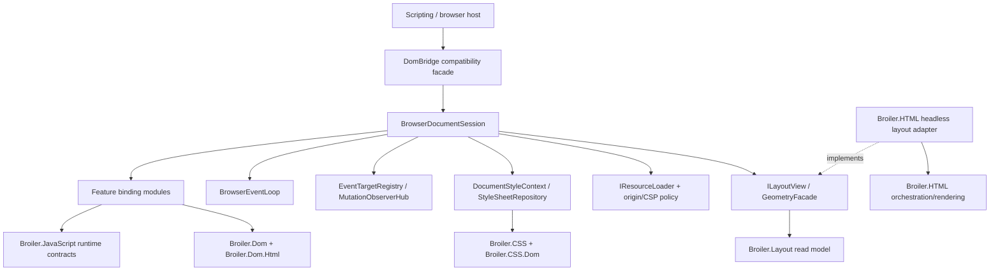

# HtmlBridge complexity-reduction roadmap

Status: proposed

Baseline date: 2026-07-13

Scope: Broiler.HtmlBridge.Core, Broiler.HtmlBridge.Dom,
Broiler.HtmlBridge.Rendering, Broiler.HtmlBridge.Scripting, and the canonical
components that should absorb engine-neutral behavior.

Companion inventory:
[HtmlBridge current component inventory](../architecture/htmlbridge-current-component-inventory.md).

## Executive decision

Do not solve the remaining complexity by moving the whole bridge into
Broiler.Dom, Broiler.CSS, or Broiler.HTML.

The previous promotion work has already established a canonical DOM and a shared
CSS engine. The next constraint is the shape of the browser adapter itself:
Broiler.HtmlBridge.Dom is a 27,436-line partial god object which combines JavaScript
binding, browser-runtime state, host resource loading, CSSOM, event-loop behavior,
layout queries, rendering workarounds, and test compatibility. Most of those
responsibilities really are bridge responsibilities, but they should not be one
class.

The recommended end state is:

1. Keep a small, source-compatible DomBridge facade.
2. Split browser behavior into document-scoped services and feature binding
   modules inside the bridge before considering more assemblies.
3. Promote only engine-neutral algorithms and data models to Broiler.Dom,
   Broiler.Dom.Html, Broiler.CSS, Broiler.CSS.Dom, Broiler.Layout, Broiler.HTML,
   Broiler.JavaScript, or Broiler.Graphics.
4. Replace the three unrelated responsibilities in
   Broiler.HtmlBridge.Rendering, then remove that project.
5. Make resource loading, time, and layout explicit injected host services.

This sequence reduces coupling without turning the canonical DOM/CSS libraries
into a browser host or creating dozens of tiny assemblies.

## Baseline and why this work is now necessary

The measurements below describe the current working tree, excluding bin and obj.
Method counts are approximate declaration counts, so they are useful for sizing
and trend checks rather than public-API accounting.

| Project | Source files | Physical lines | Non-blank lines | Approx. methods |
|---|---:|---:|---:|---:|
| Broiler.HtmlBridge.Core | 9 | 1,175 | 987 | 50 |
| Broiler.HtmlBridge.Dom | 65 | 27,436 | 23,641 | 1,104 |
| Broiler.HtmlBridge.Rendering | 3 | 1,003 | 908 | 35 |
| Broiler.HtmlBridge.Scripting | 5 | 682 | 594 | 22 |
| **Total** | **82** | **30,296** | **26,130** | **about 1,211** |

The dominant class is DomBridge:

- It is reopened by 63 partial declarations.
- Fourteen callback files contain 409 distinct numbered Js...Core callbacks.
- Forty-one of the 65 Dom source files directly know about the JavaScript
  engine; 25 know about CSS/computed style; 11 know about resources or network
  loading; 12 parse or serialize HTML; and 8 calculate layout geometry.
- InlineStyle is touched from 24 files, GetElementRuntimeState from 25,
  GetComputedProps from 16, ToJSObject from 16, and CreateBridgeElement from 13.
  These are hidden shared-state APIs, not feature-local dependencies.

Largest individual files:

| File | Lines | Main reason for size |
|---|---:|---|
| DomBridge/LayoutMetrics.cs | 2,269 | CSSOM View, layout approximation, scrolling, rectangles, zoom |
| JsFunctionCallbacks/JsObjects.cs | 1,634 | numbered callbacks for several unrelated interfaces |
| JsFunctionCallbacks/Registration.cs | 1,516 | callback plumbing and generic dispatch |
| DomBridge/SubDocuments.cs | 1,390 | frames, documents, parsing, origin, lifecycle and resource loading |
| DomBridge/Utilities.cs | 1,373 | unrelated DOM, URL, MIME, storage, form, canvas and SVG helpers |
| DomBridge/DomBridge.cs | 1,001 | construction, attach, lifecycle, timers and global orchestration |
| DomBridge.Serialization.cs | 947 | serialization plus render-oriented transforms |
| DomBridge/StyleSheets.cs | 918 | CSSOM identity, mutation, parsing and resource loading |

The current project graph also makes a low-level binding project pull the full
image rendering stack:

    Scripting -> Dom -> Rendering -> HTML.Image
                                      -> HTML.Orchestration
                                      -> HTML.Core -> Layout

Dom currently needs Rendering primarily for geometry and compatibility helpers.
That dependency direction should be replaced by a small layout/read-model
contract.

## Complexity model

The plan treats four kinds of complexity separately. Moving a file only helps
the first kind; it does not automatically help the other three.

| Kind | Current symptom | Correct response |
|---|---|---|
| Ownership | Neutral algorithms live in a browser adapter | Promote the algorithm and its neutral tests |
| Cohesion | One partial class owns unrelated browser APIs | Extract document services and feature modules |
| Dependency | Dom reaches through Rendering to HTML.Image | Invert through narrow layout and host contracts |
| State | Canonical DOM state is shadowed by bridge dictionaries | Establish one authority and one invalidation stream |

## Target architecture

Dependency rules:

- Broiler.Dom and Broiler.CSS must never reference HtmlBridge, a JavaScript
  engine, networking, or renderer policy.
- The bridge may depend on canonical DOM/CSS and public Layout contracts.
- The bridge must not depend on Broiler.HTML.Image.
- Broiler.HTML may implement a bridge-consumed layout interface, but the
  interface and DTOs must live below the HTML renderer.
- A browser host composes implementations. A feature callback must not construct
  HttpClient, parse a file path, or create a renderer directly.

## Ownership comparison and proposed destinations

### Canonical components

| Destination | Move here | Keep out |
|---|---|---|
| Broiler.Dom | Tree-neutral range operations, traversal, mutation records and option matching, node equality/normalization, neutral shadow-tree algorithms | JS wrappers, event-loop scheduling, URL/origin policy, computed style, geometry |
| Broiler.Dom.Html | HTML document/fragment parsing, deterministic serialization, canonical doctype/parser metadata, script-element discovery as metadata | Fetching scripts, CSP decisions, execution order, render compatibility rewrites |
| Broiler.CSS | CSS syntax and typed value models: anchor grammar, position-area/position-try values, keyframes/timing functions, CSS time and length expressions | Live CSSOM object identity, stylesheet fetching, DOM cascade, used layout values |
| Broiler.CSS.Dom | Selector matching, cascade, computed style, style scopes, tree-aware invalidation | JavaScript CSSOM wrappers, network loading, used geometry |
| Broiler.Layout | Anchor placement, position-try selection, sticky/fixed containing blocks, overflow/scroll geometry, zoomed used values, hit testing, animation sampling/application | JS conversion, document loading, renderer-specific compatibility transforms |
| Broiler.HTML | DOM-to-box projection and headless layout-session implementation; HTML rendering orchestration | Canonical DOM APIs, JS bindings, CSP and fetch policy |
| Broiler.JavaScript | ECMAScript WeakRef and FinalizationRegistry support and reusable engine-level primitives | Browser APIs such as Window, fetch, DOM events, queueMicrotask host integration |
| Broiler.Graphics | Immutable canvas display-list primitives only if commands are actually replayed | JS Canvas bindings and an unused mutable command recorder |

### Bridge and host components

| Destination | Move or keep here | Reason |
|---|---|---|
| HtmlBridge facade | Existing public construction/attach/flush/serialize entry points | Source compatibility and a single composition root |
| HtmlBridge feature bindings | JS registration, conversion, callback dispatch, CSSOM/DOM object identity | These translate browser IDL behavior into this JS engine |
| HtmlBridge document services | listeners, timers, observers, browsing contexts, top layer, JS identity, style session | Browser-runtime behavior is legitimate bridge ownership |
| Host/security layer | immutable CSP policy, URL/origin decisions, injected resource loader | Host policy should not contaminate DOM or CSS |
| WPT/CLI test support | check-layout assertions, Acid-specific transforms, path mapping and test-only shims | Test policy must not run on arbitrary production pages |

## Proposed bridge decomposition

Start inside Broiler.HtmlBridge.Dom. Assembly boundaries should follow stable
dependency boundaries later; they should not be used as the first refactoring
tool.

### Document-scoped services

| Service | Mission | Replaces or contains |
|---|---|---|
| BrowserDocumentSession | Own document, URL/origin, viewport, lifecycle and disposal | DomBridge's mutable document-wide fields |
| JsObjectRegistry | Preserve one JS wrapper identity per canonical node/object | scattered ToJSObject/CreateBridgeElement caches |
| DocumentBindingFactory | Build bindings and their narrow dependencies | generic callback registration in the facade |
| BrowserEventLoop | Own tasks, timers, intervals, RAF, microtask checkpoints and thread affinity | timer lists and drain loops in DomBridge/ScriptEngine |
| EventTargetRegistry | One listener store and dispatch path for node/window/generic targets | the current three listener stores |
| MutationObserverHub | Subscribe once to DomDocument.Mutated, filter records, queue delivery | manual notifications and registration-specific state |
| DocumentStyleContext | Own style scopes, engines, caches and invalidation | global computed-property and scope helpers |
| StyleSheetRepository | Own sheet text/rules/import state; use an injected loader | mixed CSSOM identity, parsing and fetch code |
| BrowsingContextManager | Own parent/child windows, frames, origins, ports and lifecycle | SubDocuments, SubDocumentObjects and Messaging overlap |
| GeometryFacade | Translate Layout read-model values to CSSOM View values | LayoutMetrics and SharedLayoutGeometry glue |
| ScrollController | Own scroll offsets and scrolling API behavior | ScrollRuntimeState plus geometry approximations |
| TopLayerManager | Own dialog/popover order and modal/top-layer state | dialog flags spread across anchor/runtime files |
| RenderDocumentProjector | Produce a non-destructive renderer input snapshot | live-DOM mutations in serialization/render preparation |

Every service is instance-scoped to BrowserDocumentSession. No runtime state may
remain in a process-global static ConditionalWeakTable.

### Feature binding modules

Registration and callbacks for one web-platform feature must be co-located:

- Window and lifecycle
- Document
- Node and attributes
- Element and geometry
- Traversal and Range
- Events and MutationObserver
- CSSOM and computed style
- SVG
- Forms and tables
- Dialog and popover
- Frames and browsing contexts
- Fetch and XMLHttpRequest
- Messaging
- Canvas

Each module exposes one Install(JsRealmContext) entry point and receives only the
services it uses. Replace numbered names such as JsElement123Core with semantic
names while moving them. A temporary compatibility registration table may map
old callback names to new handlers.

## Detailed delivery roadmap

### Phase 0 - stabilize the boundary and freeze a baseline

Goal: begin from a buildable public surface and prevent refactoring from being
confused with an API break.

Work:

1. Finish or revert the in-progress namespace move in the current working tree.
   At this baseline, Broiler.HtmlBridge.Scripting builds, but
   Broiler.Wpt.Tests has three CS0118 failures because
   Broiler.HtmlBridge.DomBridge is now interpreted as a namespace where callers
   expect the public DomBridge type.
2. Preserve the public full name Broiler.HtmlBridge.DomBridge as the v2
   compatibility facade. Use an internal namespace such as
   Broiler.HtmlBridge.WebApi or Broiler.HtmlBridge.Dom.Runtime; do not use
   Broiler.HtmlBridge.DomBridge as a namespace. Type forwarding cannot preserve
   a namespace rename when the full type name itself changes.
3. Capture the public API surface for Core, Dom, Rendering and Scripting.
4. Record deterministic WPT/Acid/pixel baselines and the bridge.mutation
   benchmark.
5. Add architecture tests for the dependency rules in this document.

Exit criteria:

- Broiler.slnx builds with zero errors.
- Existing v2 public names compile from a small consumer fixture.
- No canonical project references a bridge or JavaScript assembly.
- Baseline test and benchmark artifacts are committed or linked.

Suggested PRs:

- P0.1 namespace/public-surface repair.
- P0.2 API snapshot and architecture guards.
- P0.3 reproducible behavioral/performance baseline.

The recorded Phase 0 baseline (committed/linked artifacts, reproducible commands and
observed status) lives in [Phase 0 baseline](htmlbridge-phase0-baseline.md).

### Phase 1 - repair the project graph

Status: **completed** 2026-07-13 (branch `htmlbridge-phase1-project-graph`). All five
work items landed: (1) dropped the dead Rendering→Core reference; (2) inverted
Dom→HTML.Image behind a new `Broiler.Layout.ILayoutView`, with the renderer-backed
implementation relocated to the new `Broiler.HTML.Headless` submodule project and injected
into `DomBridge` via a `[ModuleInitializer]`-registered factory; (3) made the layout view
disposable, document-scoped and `(document,version,viewport,baseUrl)`-keyed; (4) collapsed
the duplicate `Broiler.Dom`/`Broiler.Graphics` nodes via overridable `$(BroilerDomPath)`/
`$(BroilerGraphicsPath)` MSBuild props plus a `scripts/check-submodule-sha-drift.sh` CI
guard; (5) narrowed the bridge Dom/Scripting projects off `Broiler.JavaScript.All`. All four
exit criteria are locked by guard tests in `HtmlBridgeArchitectureGuardTests`. The static
`DomBridge.LayoutViewFactory` seam is an intentional temporary compromise that Phase 2's
`BrowserDocumentSession` replaces with constructor injection.

Goal: make later extraction possible without dragging duplicate or high-level
projects through every test.

Work:

1. Remove the unused Rendering-to-Core reference if the API audit still shows no
   call.
2. Replace the Dom-to-HTML.Image geometry dependency with a small ILayoutView
   contract and immutable geometry DTOs. Put the contract with Broiler.Layout or
   in a dependency-neutral bridge abstraction; put the current implementation in
   Broiler.HTML.Orchestration or a small Broiler.HTML.Headless project.
3. Make SharedLayoutGeometryProvider disposable, document-scoped and
   version-aware. Its cache key must include document version, viewport and base
   URL. Do not swallow all renderer exceptions.
4. Unify duplicate root and nested Broiler.Dom/Broiler.Graphics project paths.
   Add overridable MSBuild paths for submodule-local builds, top-level overrides
   for the main solution, and a CI guard which fails if duplicate submodule SHAs
   drift.
5. Replace broad Broiler.JavaScript.All references with the smallest stable
   engine/runtime projects possible.

Exit criteria:

- Broiler.HtmlBridge.Dom no longer references Broiler.HTML.Image.
- One Broiler.Dom assembly project node and one Graphics implementation are
  present in a solution build.
- Geometry tests pass through ILayoutView.
- Dependency tests lock the new graph.

### Phase 2 - establish document services and a single state authority

Status: **P2.1 completed** 2026-07-13 (branch `htmlbridge-phase2-p2-1-lifetime-disposal`).
`DomBridge` is now `IDisposable` with a deterministic, idempotent `Dispose()` that releases
every per-session resource (layout view, timer/animation queues, listener stores, mutation
observers, ranges/iterators, message ports, JS wrapper caches; it drops — never disposes — the
borrowed `JSContext`). A shared `ClearRuntimeSessionState()` reset is called by both `Dispose()`
and `ParseHtml`, so **re-attaching now leaves no timers/listeners/observers from the prior
document** (previously they leaked — nothing cleared those maps on re-parse). The post-dispose
document/timer entry points fail fast with `ObjectDisposedException`. A minimal
`DomBridgeDisposalRegistry` (namespace `Broiler.HtmlBridge.Dom.Runtime`) is the single
lifetime/composition seam that P2.2+ grows into `BrowserDocumentSession`. Characterization +
disposal + guard tests live in `Broiler.Cli.Tests/DomBridgeSessionLifetimeTests.cs`; the public-API
snapshot baseline was regenerated (only the `Broiler.HtmlBridge.Dom` DomBridge type line changed —
Core is untouched, so `IDomBridgeRuntime` stays source-compatible and is **not** `IDisposable`).

**P2.2 completed** 2026-07-13 (same branch). JS wrapper identity now has a single authority:
`JsObjectRegistry` (namespace `Broiler.HtmlBridge.Dom.Runtime`) owns the per-node wrapper map and
the sub-document-root document-wrapper map (both reference-keyed) behind a narrow surface
(`TryGet`/`Set`/`Remove`/`Entries`/`TryGetNode`/`SetDocument`/`TryGetDocument`/`Clear`), replacing
the scattered `_jsObjectCache` and `_docRootToDocJSObject` fields at ~20 sites across
`JsObjects`/`JsFunctionCallbacks`/`Registration`/`SubDocuments*`/`ShadowDom`/`Utilities`. Behavior
is preserved; re-parse now also releases stale sub-document wrappers via one `Clear()` (observably
equivalent — the dropped keys are detached roots no lookup can reach again). No public-API change
(the registry is internal). Tests: `Broiler.Cli.Tests/JsObjectRegistryTests.cs` (registry unit
tests + wrapper-identity characterization through the bridge). The wrapper *construction* in
`ToJSObject` stays in the bridge (it needs `this` for hundreds of callbacks); only the identity
store moved. The per-document JS singletons (`_documentJSObject`/`_windowJSObject`/
`_visualViewportJSObject`) are intentionally left as fields — they are single globals, not node
identity — for a later pass.

**P2.3 completed** 2026-07-13 (same branch). Computed-style machinery now has a single authority:
`DocumentStyleContext` (namespace `Broiler.HtmlBridge.Dom.Runtime`) owns the per-document-root
`CssStyleEngine` scopes (and the `ComputedStyleEngineScope` type), the `GetComputedProps` memo (cache
+ re-entrancy in-progress map), and the style-invalidation batch state — replacing the five scattered
bridge fields (`_computedStyleEngines`, `_computedPropsCache`, `_computedPropsInProgress`,
`_styleInvalidationBatchDepth`, `_pendingStyleInvalidationRoots`). There is now one invalidation
route, `DocumentStyleContext.InvalidateComputedStyle()`, which clears the memo *and* the engines'
cascade/computed caches together (they must invalidate as one because `GetComputedProps` reads inline
style from the live ElementRuntimeState map, invisible to the engine's own DOM-mutation subscription).
The bridge keeps the algorithms that need the DOM/loading (engine construction via
`GetSyncedScopedEngine`, `<style>`/`<link>` collection, the recursive scope walk) and calls into the
context for storage; no back-reference. Behavior-preserving; no public-API change (internal). Tests:
`Broiler.Cli.Tests/DocumentStyleContextTests.cs` (memo/engine-scope/batch unit tests + a
class-change → `getComputedStyle` invalidation characterization through the bridge). Net −53 lines in
the bridge partials.

**P2.4 completed** 2026-07-13 (same branch). The document's task queues now have a single owner:
`BrowserEventLoop` (namespace `Broiler.HtmlBridge.Dom.Runtime`) owns the `setTimeout`/`setInterval`
callback maps, the `requestAnimationFrame` map, the internal frame-action queue, their id counters
and the cleared-timer set — plus the drain itself (`DrainStep`/`DrainAll`). It replaces the eight
scattered bridge fields and the ~90-line `FlushTimerStep` body. Registration
(`setTimeout`/`clearTimeout`/`setInterval`/`clearInterval`/`requestAnimationFrame`/
`cancelAnimationFrame`) and `QueueFrameAction` delegate to it; `DomBridge.FlushTimers`/
`FlushTimerStep`/`HasPendingTimers` are now thin wrappers (still guarded by `ThrowIfDisposed`, and the
per-task `TaskCheckpointCallback` is passed into the drain). The incidental reuse of the frame-action
counter to mint smooth-scroll tokens is gone — smooth-scroll tokens get their own bridge-local
counter (observably equivalent: the two were independent namespaces). Behavior-preserving; no
public-API change (the loop is internal, and the public timer methods keep their signatures). Tests:
`Broiler.Cli.Tests/BrowserEventLoopTests.cs` (registration/cancellation/drain/checkpoint/error-isolation
unit tests + a timer-flush characterization through the bridge; existing
`ScriptEngineExecuteTests.DomBridge_FlushTimerStep_*` still pass). Net −147 lines in the bridge
partials. The loop is also the seam for the still-pending single-owner thread-affinity model (Phase 2
item 5); today it preserves the existing defensive concurrent collections.

**P2.5 completed** 2026-07-13 (same branch). Listeners and observers now have single owners, both in
namespace `Broiler.HtmlBridge.Dom.Runtime`:

- `EventTargetRegistry` owns the per-node `addEventListener` listeners, the window listeners, the
  generic JS-target (message-port / sub-window) listeners, the target→owner-window map, and the
  visual-viewport `scroll` listeners — replacing four scattered bridge fields plus the node-listener
  store that used to live on the process-global `ElementRuntimeState`. Node listeners now use an
  **instance-scoped `ConditionalWeakTable`**, keeping the same weak GC semantics while removing them
  from the static table (partial progress on Phase-2 item 4). `ElementRuntimeState.EventListeners` is
  deleted; only inline `on*` handlers remain node-runtime state there. The dispatch algorithms stay in
  the bridge (`FireListeners` became an instance method) and read/write listeners through the registry.
- `MutationObserverHub` owns the registered observer list — `Register` (with `observe()` replace
  semantics), `Unregister` (`disconnect`), `Count`, `Snapshot`, `Clear`. Registration
  (`Common.cs`), the three delivery loops (`Traversal.cs`) and teardown route through it; the bridge
  still builds and delivers the JS mutation records.

Behavior-preserving; no public-API change (both are internal; only private helpers changed static→
instance). Tests: `Broiler.Cli.Tests/EventTargetRegistryTests.cs` +
`Broiler.Cli.Tests/MutationObserverHubTests.cs` (unit tests + element/window listener characterization;
the existing `DomEventsEdgeCaseTests`, messaging and MutationObserver suites still pass). Full-suite
regression check vs the P2.4 baseline: zero regressions.

**P2.6 completed** 2026-07-13 (same branch) — **Phase 2 complete.** Two owners, both in
`Broiler.HtmlBridge.Dom.Runtime`:

- `MessagePortRegistry` owns the `MessageChannel`/`MessagePort` state — entangled peers, closed and
  started marks, and the per-port queue of pending messages — replacing the four scattered port maps.
  The messaging callbacks still build/dispatch the JS `MessageEvent`s; they read/mutate port state
  through it (`Link`/`TryGetPeer`/`HasPeer`/`IsClosed`/`Close`/`IsStarted`/`Start`/`Enqueue`/
  `TakeQueued`/`Clear`).
- `ResourceLoader` owns the host resource I/O — a process-shared `HttpClient` (kept static inside the
  loader so many documents don't each open a socket pool) and the optional local base path — replacing
  the static `SharedHttpClient` that feature callbacks reached into directly. This is the "no feature
  callback constructs an `HttpClient`" seam Phase 7 builds on (CSP, unified fetch/XHR/frame routing,
  cancellation are still to come). `FetchExternalStylesheet` went static→instance.

Behavior-preserving; no public-API change (both internal). Tests:
`Broiler.Cli.Tests/MessagePortRegistryTests.cs` + `Broiler.Cli.Tests/ResourceLoaderTests.cs` (unit
tests + existing messaging/network suites pass). Full-suite regression check vs the P2.5 baseline:
every candidate fails identically in isolation on both sides → zero regressions.

**Deferred within "browsing-context state" (a follow-up, not blocking Phase 3):** the sub-window and
sub-document content caches in `SubDocuments.cs` (`_subWindowCache`/`_subWindowContainers`,
`_subDocumentCache`, `_subDocumentLocationCache`, `_subDocumentBaseUrlCache`, `_objectLoadFailures`,
`_onloadFired`) and `_currentWindowOverride` are not yet consolidated into a `BrowsingContextManager`
— they are largely internal to `SubDocuments.cs` and intertwined with sub-document resolution. P2.6
took the cross-file cohesive slice (ports) and the resource-loader seam.

## Phase 2 outcome

All six sub-PRs landed on branch `htmlbridge-phase2-p2-1-lifetime-disposal`: P2.1 disposal/lifetime,
P2.2 `JsObjectRegistry`, P2.3 `DocumentStyleContext`, P2.4 `BrowserEventLoop`, P2.5
`EventTargetRegistry`+`MutationObserverHub`, P2.6 `MessagePortRegistry`+`ResourceLoader`. Hidden
bridge state now has explicit single owners (all internal, in `Broiler.HtmlBridge.Dom.Runtime`); node
event listeners were de-globalized off the process-static `ElementRuntimeState` onto an instance
`ConditionalWeakTable`. Not fully met and carried forward: two simultaneous sessions are still not
isolated (blocked at the Broiler.JS engine's shared globals — a JS-engine concern, not the bridge),
and the remaining process-static `ElementRuntimeState`/`PositionAreaResolutions` tables plus the
sub-document caches above are still to be de-globalized/consolidated.

Two findings recorded for later phases:

- **The "two *simultaneous* sessions are isolated" exit criterion is blocked below the bridge.**
  Two live `JSContext` instances currently share global state at the Broiler.JS engine layer (the
  last-created context's globals win), so simultaneous-session isolation cannot be delivered by a
  bridge-only change. The supported model today is one active session per thread; the bridge
  guarantees *sequential* re-attach isolation. Full simultaneous isolation needs JS-engine work
  (out of this roadmap's scope).
- **De-globalizing the process-static per-element runtime tables** (`ElementRuntimeStates`,
  `PositionAreaResolutions`) is deferred: it is a 155-call-site / 24-file cascade through the
  project's ~284 static helpers, and the tables are weak + node-keyed (they GC with the session's
  nodes, so they do not leak or cross sessions today). Its own later PR under item 4.

Goal: make hidden state dependencies explicit while preserving behavior.

Work:

1. Introduce BrowserDocumentSession and move construction/disposal into it.
2. Extract JsObjectRegistry, DocumentStyleContext, BrowserEventLoop,
   EventTargetRegistry, MutationObserverHub and an injected IResourceLoader.
3. Split ElementRuntimeState by concern:
   listener, form control, scroll, dialog/top layer, shadow root, stylesheet,
   document, animation and doctype state.
4. Remove process-global runtime state. Attach/reparse/dispose must release every
   timer, listener, observer, browsing context, layout snapshot and JS wrapper.
5. Define a single-owner event-loop/threading model. Concurrent collections are
   not a substitute for document thread affinity.
6. Route all computed-style cache clears through DocumentStyleContext and all
   mutations through DomDocument.Mutated.

Exit criteria:

- Two simultaneous sessions cannot see each other's nodes, listeners, timers,
  styles or storage.
- Re-attaching a DomBridge leaves no state from the prior document.
- There is one mutation stream, one event dispatcher, one style invalidation
  route and one resource loader.
- DomBridge's fields are primarily facade/session references, not feature state.

Suggested PR order:

- P2.1 session lifetime and disposal characterization. **(done — see Status above)**
- P2.2 JS identity registry. **(done — see Status above)**
- P2.3 style context and invalidation. **(done — see Status above)**
- P2.4 event loop. **(done — see Status above)**
- P2.5 listeners/observers. **(done — see Status above)**
- P2.6 resource loader and browsing-context state. **(done — see Status above; Phase 2 complete)**

### Phase 3 - replace the partial god object with feature modules

Status: **P3.1 completed** 2026-07-13 (branch `htmlbridge-phase3-traversal-module`). The DOM
traversal / Range vertical slice is the first co-located feature binding module:
`TraversalBinding` (namespace `Broiler.HtmlBridge.Dom.Features`) now owns `TreeWalker`,
`NodeIterator`, `Range`, the `NodeFilter` machinery and `document.createComment` — its registration
(`RegisterDocumentApis`), every handler (renamed from the numbered `JsTraversal…020…039Core` to
semantic `Range*`/`Create*` names) and the traversal-scoped state (the weak active-range and
active-node-iterator registries) live together in one file. The module depends only on the narrow
`ITraversalHost` contract (JS-wrapper identity, node lookup, boundary/geometry helpers still in the
bridge pending Phase 5, and the range-scoped node-construction seams) which `DomBridge` implements
via **explicit interface members** in `DomBridge.TraversalHost.cs` — so no handler reaches an
arbitrary bridge private field and the public surface is unchanged. `DomBridge`'s traversal
partials are now thin: the old `JsFunctionCallbacks/Traversal.cs` is deleted; `Traversal.cs` keeps
only the mutation-observer notification machinery and range client-rect geometry plus three
one-line `Build*` delegators; `Registration/Traversal.cs` is a single delegating call; the
`_activeRanges`/`_activeNodeIterators` fields moved off the bridge. Neutral static DOM-tree helpers
the module shares (`IsText`/`IsComment`/`ParentEl`/`ChildAt`/`ChildIndexOf`/`ChildElements`/
`GetNodeType`/`GetDocumentOrderNodes`/`CollectTextContent`/`IsDescendant`/`FindCommonAncestor`/
`GetNodesInRange`/`ThrowDOMException`) were widened `private static`→`internal static` in place
(no behaviour/API change; Phase 4 promotes them to Broiler.Dom). Behaviour-preserving; no
public-API change (both the module and the contract are internal). Tests:
`Broiler.Cli.Tests/TraversalBindingModuleTests.cs` (co-location/host-contract/state-moved guards +
Range/TreeWalker/createComment characterizations). Regression check vs the P2.6 baseline: the
existing traversal, mutation-observer, events and messaging suites pass unchanged; the pre-existing
environmental/known failures (`Range_GetBoundingClientRect_Includes_DisplayContents_Descendants`
headless-geometry, the six Acid3 pixel/cascade/border/NodeIterator-pre-removal tests, and the two
`:root`/`:lang` selector tests) fail identically on both sides → zero regressions.

Status: **P3.2 completed** 2026-07-13 (same branch). The **MutationObserver** feature (the
Events-and-MutationObserver pair's observer half) is the second co-located module:
`MutationObserverBinding` (namespace `Broiler.HtmlBridge.Dom.Features`) now **owns** the P2.5
`MutationObserverHub` state authority and co-locates the whole feature — the JS `MutationObserver`
polyfill + its `__broilerRegister/UnregisterMutationObserver` host functions, the
`observe()`/`disconnect()` callbacks (was `JsRegistrationBroiler…034/035Core`), the option parsing
(`CreateMutationObserverOptions`/`GetMutationObserverOption`, moved out of `Common.cs`), and the
childList/attribute/characterData record delivery (`Deliver…`, moved out of `Traversal.cs`). It
depends only on the narrow `IMutationObserverHost` contract (`ToJSObject` + `FindDomNodeByJSObject`),
which `DomBridge` implements via explicit interface members in `DomBridge.MutationObserverHost.cs`.
The bridge keeps three same-name `Notify…MutationObservers` delegators so the ~7 mutation-path call
sites in `Traversal.cs`/`Attributes.cs`/`JsObjects.cs` are untouched; `RegisterDocumentEventsAnd
MutationObservers` now registers only the typed `Event` constructors and delegates the observer
install; lifetime reset calls `_mutations.Clear()`. This also finished the P3.1 `Traversal.cs`
cleanup (the mutation-observer machinery it had temporarily retained is gone). Behaviour-preserving;
no public-API change (module + contract internal). Tests:
`Broiler.Cli.Tests/MutationObserverBindingModuleTests.cs` (co-location/host-contract/hub-ownership
guards + childList/attribute-oldValue/disconnect characterizations). Regression check: the
MutationObserver, DomEvents, Attributes, Traversal, Messaging and architecture-guard suites pass
unchanged; same pre-existing/known failures as above → zero regressions.

Status: **P3.3 completed** 2026-07-13 (same branch). The **event dispatch engine** — the highest-
coupling core of the Events feature — is the third co-located module: `EventDispatchBinding`
(namespace `Broiler.HtmlBridge.Dom.Features`) owns the capture → target → bubble propagation
algorithm (`DispatchEventOnElement`), the per-element listener firing (`FireListeners`, which had no
external callers), the event object's propagation-control methods (`stopPropagation`/
`stopImmediatePropagation`/`preventDefault`/`cancelBubble`/`returnValue`, renamed from the numbered
`JsEvents…001…007Core`) and `composedPath()`. It reads what it dispatches through the narrow
`IEventDispatchHost` contract (`ToJSObject`, `DocumentNode`, `DocumentJSObject`, `WindowJSObject`,
`GetEventListeners`, `GetInlineEventHandlers`), implemented by explicit interface members in
`DomBridge.EventDispatchHost.cs`. **Deliberately kept in the bridge** (different concerns, not
dispatch): the `addEventListener`/`removeEventListener` *registration* helpers
(`CreateEventListenerRegistration`/`GetCaptureForRemoval`/`HasMatchingEventListener`) that the four
registration sites use, inline-handler *compilation* (`CompileInlineEventAttribute(s)`), form
validity checks, and the shared `InvokeEventListener` (widened to `internal static` — also used by
the window/submit/messaging firing paths, which the module calls as `DomBridge.InvokeEventListener`).
The bridge keeps a same-name `DispatchEventOnElement` delegator so the ~five caller files
(`JsObjects`/`Registration`/`LayoutMetrics`/`SubDocuments`/`DomBridge.cs`) are untouched; the emptied
`JsFunctionCallbacks/Events.cs` was deleted. Behaviour-preserving; no public-API change (module +
contract internal). Tests: `Broiler.Cli.Tests/EventDispatchBindingModuleTests.cs` (co-location/
host-contract guards + capture/target/bubble ordering, stopPropagation and preventDefault
characterizations). Regression check: DomEvents (81), DomEventsEdgeCase (33), Acid3RegressionTests
(26), Attributes, MutationObserver, Messaging and architecture-guard suites pass unchanged → zero
regressions.

Status: **P3.4 completed** 2026-07-13 (same branch) — the Events feature's listener half, completing
Events alongside P3.3's dispatch half. The `addEventListener`/`removeEventListener` *registration
semantics* (option parsing for capture/once/passive, the DOM duplicate-registration check, and
match-by-listener-and-capture removal) are now one co-located helper, `EventListenerBinding`
(namespace `Broiler.HtmlBridge.Dom.Features`), exposing two storage-agnostic operations —
`AddListener(list, listener, options)` and `RemoveListener(list?, listener, options)` — plus the four
former bridge helpers (`CreateEventListenerRegistration`/`GetCaptureForRemoval`/
`HasMatchingEventListener`/`GetBooleanOption`) now internal to it. It is stateless with **no host
contract**: each of the four target callbacks (element in `JsObjects`, document + window in
`Registration`, message-port in `Messaging`) resolves its own listener list from the P2.5
`EventTargetRegistry` and calls the shared operations, replacing the identical ~15-line add/remove
block that had been copied across those four feature files. Behaviour-preserving; no public-API
change (the helper is internal). Tests: `Broiler.Cli.Tests/EventListenerBindingModuleTests.cs`
(co-location guard + dedup / capture-scoped-removal / once characterizations). Regression check:
DomEvents (81), DomEventsEdgeCase (33), Messaging (15), Attributes and the event/architecture-guard
suites pass unchanged → zero regressions.

Status: **P3.5 completed** 2026-07-13 (same branch). The **HTML table DOM interfaces** are the fifth
co-located module: `TableBinding` (namespace `Broiler.HtmlBridge.Dom.Features`) owns the whole
`HTMLTableElement` interface (`caption`/`tHead`/`tFoot`/`tBodies`/`rows` plus `createCaption`/
`createTHead`/`createTFoot`/`deleteCaption`/`deleteTHead`/`deleteTFoot`/`insertRow`/`deleteRow`),
`HTMLTableSectionElement` (`rows`/`insertRow`) and `HTMLTableRowElement` (`rowIndex`/
`sectionRowIndex`/`cells`/`insertCell`/`deleteCell`) — ~20 callbacks (renamed from the numbered
`JsElementInterfaces…001…023Core`) plus `BuildTableRows` and the `insertRow` placement algorithm,
moved out of `JsFunctionCallbacks/ElementInterfaces.cs` and `Utilities.cs`. The table registration in
`AddElementSpecificMembers` collapsed to a single `_tables.Install(obj, element, tag)` call. Table
DOM is pure canonical-tree manipulation, so the `ITableHost` contract is just two seams (`ToJSObject`
+ `CreateElement`, the construction funnel), implemented via explicit interface members in
`DomBridge.TableHost.cs`; everything structural uses the neutral static `DomBridge` tree helpers
(`SetParent`/`InsertChildAt`/`RemoveChildFrom`/`IsTableCellElement`/`UndefinedFunction` widened
`private`→`internal static`). `CollectTableRows` stayed a bridge `internal static` helper because hit
testing also uses it. Behaviour-preserving; no public-API change (module + contract internal).
Tests: `Broiler.Cli.Tests/TableBindingModuleTests.cs` (co-location/host-contract guards + insertRow/
insertCell/rows-spec-order/createTHead-idempotence/deleteRow characterizations). Regression check:
HtmlDomInterface (49), FormControlRender, Acid3RegressionTests (26) and the architecture-guard suites
pass unchanged; the one pre-existing environmental failure
(`FormControlRenderTests.SelectListBox_SizingAndScrolling_Follow_WritingMode`, a `<select>` layout
test) fails identically on both sides → zero regressions.

Status: **P3.6 completed** 2026-07-13 (same branch). The **`Element.classList` / `DOMTokenList`**
API is the sixth co-located module: `ClassListBinding` (namespace `Broiler.HtmlBridge.Dom.Features`)
owns `Build(element, onClassChanged)` plus the `contains`/`add`/`remove`/`toggle`/`replace`
operations (renamed from the bridge's `BuildClassListObject` + the scattered `JsUtilities…025…Core`
callbacks). It is the cleanest slice so far — pure logic over the canonical `Broiler.Dom.DomTokenList`
with an injected `Action<DomElement>` style-invalidation callback, so it is an **internal static
class with no host contract at all**. The registration site (`JsObjects.cs`) calls
`ClassListBinding.Build(element, bridge.InvalidateStyleScope)`. Behaviour-preserving; no public-API
change. Tests: `Broiler.Cli.Tests/ClassListBindingModuleTests.cs` (co-location guard +
add/remove/contains, toggle-with/without-force, replace characterizations). Regression check:
SelectorsAndCssom (only the two known-baseline `:root`/`:lang` fails, unchanged) and the
architecture-guard suites pass → zero regressions.

Status: **P3.7 completed** 2026-07-13 (same branch) — the first *runtime-state-coupled* feature
extracted, establishing the narrow-named-accessor pattern for the entangled remainder. The **dialog
/ popover / details JS API** is the seventh co-located module: `DialogBinding` (namespace
`Broiler.HtmlBridge.Dom.Features`) owns `HTMLDialogElement` (`showModal`/`show`/`close`/`open`/
`returnValue`), the popover API (`showPopover`/`hidePopover` on any element with the global
`popover` attribute) and `HTMLDetailsElement.open` — 8 callbacks (renamed from the numbered
`JsElementInterfaces…029…036Core`; the identical details/dialog `open` setters deduplicated) plus
the three registration blocks in `AddElementSpecificMembers`, now one
`_dialogs.Install(obj, element, tag, hasPopover)` call. Its runtime state
(`ElementRuntimeState.Dialog.{Modal,PopoverOpen,TopLayerOrder}`, `FormControl.ReturnValue`, the
top-layer counter) is reached through the narrow `IDialogHost` contract as **named primitives**
(`SetOpenAttribute`/`HasOpenAttribute`/`InvalidateStyleScope`/`AssignNextTopLayerOrder`/
`SetDialogModal`/`SetPopoverOpen`/`Get`/`SetReturnValue`/`PopoverKeepsOverlayOnHide`), implemented
via explicit interface members in `DomBridge.DialogHost.cs` — the module never touches the
runtime-state object, and these accessors are the single seam a future `TopLayerManager` re-homes.
The backdrop/top-layer **rendering** stays in the bridge's anchor resolver. Behaviour-preserving; no
public-API change (module + contract internal). Tests:
`Broiler.Cli.Tests/DialogBindingModuleTests.cs` (co-location/host-contract guards +
showModal/close/returnValue, dialog.open-setter, details.open characterizations). Regression check:
Dialog, Popover, Overlay, Backdrop, HtmlDomInterface (49), Acid3RegressionTests (26) and the
architecture-guard suites pass unchanged → zero regressions (the renderer reads the same runtime
state the module now writes).

Status: **P3.8 completed** 2026-07-13 (same branch) — the second runtime-state-coupled feature, via
the P3.7 named-accessor pattern. The **HTMLSelectElement / HTMLOptionElement** interface is the
eighth co-located module: `SelectBinding` (namespace `Broiler.HtmlBridge.Dom.Features`) owns
`select.add`/`options`/`selectedIndex`/`size` plus the option-collection, selected-index and value
algorithms (`CollectSelectOptions`/`GetSelectedIndex`/`SetSelectedIndex`/`GetValue`/`SetValue`,
**relocated out of `LayoutMetrics.cs`** where they lived but were never used by layout) and
`option.defaultSelected` — 6 callbacks (renamed from the numbered `JsElementInterfaces…037…045Core`).
The select + option registration blocks in `AddElementSpecificMembers` collapsed to one
`_select.Install(obj, element, tag)` call; the shared `value` form-control handler in `JsObjects.cs`
keeps its input/textarea branches and delegates only its select branch to `_select.GetValue`/
`SetValue`. The per-element form-control state (the select's dirty selected index, an option's IDL
value and default-selected flag on `ElementRuntimeState.FormControl`) is reached through the narrow
`ISelectHost` contract as named primitives (`TryGetSelectedIndex`/`SetSelectedIndex`/
`TryGetOptionValue`/`Get`/`SetOptionDefaultSelected`) plus `ToJSObject`/`FindDomElementByJSObject`,
implemented via explicit interface members in `DomBridge.SelectHost.cs`; the module never touches the
runtime-state object. Neutral attribute helpers `HasAttr`/`TryGetAttribute`/`SetAttr`/`RemoveAttr`/
`GetElementTextContent` were widened `private`→`internal static`. Behaviour-preserving; no public-API
change (module + contract internal). Tests: `Broiler.Cli.Tests/SelectBindingModuleTests.cs`
(co-location/host-contract guards + options/default-selected-index, selectedIndex-setter,
value-setter, add/size characterizations). Regression check: HtmlDomInterface (49), FormControlRender
and the architecture-guard suites pass unchanged; the one pre-existing environmental failure
(`FormControlRenderTests.SelectListBox_SizingAndScrolling_Follow_WritingMode`, a `<select>` layout
test) fails identically on both sides → zero regressions.

Status: **P3.9 completed** 2026-07-13 (same branch). The **HTMLFormElement** interface is the ninth
co-located module: `FormBinding` (namespace `Broiler.HtmlBridge.Dom.Features`) owns `form.elements`
(an `HTMLFormControlsCollection` with numeric **and named** access), `form.length`, `form.action`,
and the constraint-validation checks (`checkValidity`/`reportValidity`, whose logic moved out of
`Events.cs` — completing that file's de-form-ing). The bridge's `FormElementsCollection` (a JSObject
subclass with a named-lookup override) moved into the module as a nested type; its sole bridge
coupling — the `DomBridge` back-reference it carried only to wrap a control as a JS object — is
replaced by the narrow `IFormHost` contract (`ToJSObject`), implemented via one explicit interface
member in `DomBridge.FormHost.cs`. Everything else (control collection, validity) is pure
tree/attribute work over the already-`internal static` `DomBridge.CollectFormControls`/`HasAttr`/
`TryGetAttribute`/`ChildElements`/`IsText`, so no new widening was needed. The form registration block
in `AddElementSpecificMembers` collapsed to one `_forms.Install(obj, element, tag)` call; the
`checkValidity`/`reportValidity` registration on form-associated elements in `JsObjects.cs` now calls
`_forms.IsElementValid(element)`. Behaviour-preserving; no public-API change (module + contract
internal). Tests: `Broiler.Cli.Tests/FormBindingModuleTests.cs` (co-location/host-contract guards +
elements indexed/named/length, action get/set, checkValidity characterizations). Regression check:
HtmlDomInterface (49), FormControlRender and the architecture-guard suites pass unchanged; the one
pre-existing environmental `<select>` layout failure reproduces identically → zero regressions.

Still to come — each entangled with layout, network, or rendering; the P3.7–P3.9 named-accessor
pattern is the template for any residual runtime-state coupling: CSSOM/computed style,
Element/geometry, Window/Document, SVG, Frames/Network, Messaging, Canvas, and the DomBridge
500-800-line facade target.

Goal: make each browser API understandable and testable without loading the
entire DomBridge implementation.

Work:

1. Pick one vertical slice with moderate coupling, such as Traversal/Range.
2. Move registration and callbacks together into its feature module.
3. Give the module explicit dependencies and semantic callback names.
4. Repeat for Events, CSSOM, Element, Window/Document, Forms, Frames/Network,
   Messaging and Canvas.
5. Break Utilities.cs apart only when a consumer module is extracted; every
   helper gets a clear owner or is deleted.
6. Externalize embedded polyfill JavaScript as versioned assets after module
   ownership is stable.
7. Add a guard forbidding new DomBridge partial declarations.

Exit criteria:

- A feature's registration, handlers and tests are discoverable together.
- No callback accesses arbitrary DomBridge private fields.
- DomBridge is a composition/compatibility facade, targeted at 500-800 lines and
  one primary class file.
- No production source file exceeds 750 lines without a documented exemption.

### Phase 4 - eliminate parallel DOM state

Goal: make Broiler.Dom and Broiler.Dom.Html the only authorities for document
tree/content state.

Work:

1. Replace sentinel elements named #document, #document-fragment, #doctype and
   #subdoc-root with DomDocument, DomDocumentFragment, DomDocumentType and
   explicit browsing-context roots. Remove tag-name special cases.
2. Make the canonical style attribute or a canonical declaration object the one
   inline-style authority. A JS style mutation and getAttribute must observe the
   same state and trigger the same invalidation.
3. Remove the parallel InnerHtml string. innerHTML becomes parse/replace of
   canonical children; serialization always reads canonical nodes.
4. Promote neutral mutation-option matching and Range content algorithms to
   Broiler.Dom where they are still duplicated.
5. Reuse canonical Normalize, equality, clone, tree-order and traversal
   operations; delete bridge copies.
6. Remove tree-derived lists such as _knownNodes if they have no independent
   lifecycle role.

Exit criteria:

- One tree, one attribute/declaration value, one innerHTML representation and
  one mutation source exist.
- No #document-family fake tag checks remain.
- DOM conformance, Range, Selection, serialization and shadow-tree tests pass.

### Phase 5 - move used-value behavior into Layout

Goal: turn LayoutMetrics and AnchorResolver into a thin API adapter over a
single layout snapshot.

Broiler.Layout needs a richer public read model:

- border/content/padding geometry and client rectangles;
- fragmented rectangles and display: contents descendants;
- scroll overflow, scroll bounds and scroll offsets;
- offset parent and containing blocks;
- hit-test/topmost order;
- viewport, zoom and used-value metadata;
- anchor/position-try resolution;
- animation sample time and applied used values.

Work:

1. Define LayoutSnapshot/ILayoutView with document-version and viewport identity.
2. Implement all geometry APIs against one snapshot per document version.
3. Move anchor placement, position-area, position-try, sticky/fixed containing
   blocks, overflow simulation and hit testing to Layout.
4. Move neutral anchor/keyframe/timing syntax models to Broiler.CSS first; Layout
   consumes those models and applies them to boxes.
5. Keep only CSSOM View unit conversion, Web IDL defaults and JS object
   construction in the bridge.
6. Delete fallback geometry approximations after parity is proven.

Exit criteria:

- No per-element renderer/layout construction.
- One layout pass services all geometry queries until document/viewport
  invalidation.
- LayoutMetrics is a small binding/facade, not a layout engine.
- Anchor, sticky/fixed, scrolling, hit-testing and animation tests exercise
  Layout directly plus thin bridge contract tests.

### Phase 6 - remove Broiler.HtmlBridge.Rendering

Goal: dissolve a project which currently groups three unrelated concepts.

Disposition:

| Current type | Interim action | End state |
|---|---|---|
| SharedLayoutGeometryProvider | Put behind ILayoutView and make lifetime/cache correct | implementation in HTML.Orchestration/HTML.Headless |
| HtmlPostProcessor | Convert to ordered, non-destructive render-preparation passes | native HTML/Layout behavior; remaining Acid/WPT shims in test support |
| CanvasRenderingContext2D / CanvasDrawCommand | Internalize in Canvas binding and cap/remove unused command storage | real immutable Broiler.Graphics display list if a renderer consumes it |

HtmlPostProcessor must not be moved wholesale into Broiler.Dom.Html: it strips or
replaces valid content and contains renderer/test policy. The migration is to
replace each workaround with native HTML/Layout behavior, not to rename it.

Exit criteria:

- Rendering project has no consumers and is deleted.
- Render preparation never mutates the live script-visible DOM.
- Production browsing does not apply Acid/WPT-specific transforms.
- Canvas commands are either rendered and bounded or are not recorded.

### Phase 7 - isolate loading, security and browsing-context policy

Goal: separate deterministic document algorithms from host I/O and policy.

Work:

1. Split ContentSecurityPolicy into immutable directive parsing/evaluation,
   document meta discovery, and URL/origin context.
2. Replace regex HTML discovery in CSP and ScriptExtractionService with
   Broiler.Dom.Html parser output.
3. Make script extraction return metadata-rich descriptors: source kind, URL,
   nonce, async/defer/module flags and document order.
4. Route scripts, stylesheets, fetch, XHR and frames through one injected
   ResourceLoader with explicit file/data/http policy and cancellation.
5. Keep CSP checks in the host/browser layer; DOM and CSS receive already
   authorized content.
6. Move module-script support and script ordering into the browser event loop;
   do not silently skip a recognized module.

Exit criteria:

- No direct HttpClient/file/data-URI switch remains in feature callbacks.
- Unit tests use a deterministic in-memory loader.
- One URL resolution/origin implementation is shared by script, CSS, fetch, XHR
  and frames.
- CSP tests distinguish parse, discovery, policy and load/execution decisions.

### Phase 8 - simplify Core and Scripting, then reconsider assemblies

Goal: leave small contracts whose names match their responsibility.

Work:

1. Split IScriptEngine execution, interactive-session, profiling and
   microtask/event-loop capabilities. Preserve the old interface as an adapter
   until a deliberate public-surface v3.
2. Give every InteractiveSession a private event-loop/context lifetime. Ensure
   failed construction disposes it.
3. Make async-drain-limit exhaustion an explicit diagnostic/result, not a silent
   stop.
4. Apply profiling consistently or move it to host diagnostics if there are no
   real consumers.
5. Rename IScriptExtractor.cs to match ScriptExtractionResult, or restore a
   meaningful interface.
6. Decide final assemblies from dependency and deployment needs:
   likely Core, WebApi bindings and Scripting/Host. Avoid assembly-per-feature.

Exit criteria:

- Core contains contracts/value objects, not regex parsers, networking and
  mutable global logging together.
- ScriptEngine has one execution pipeline shared by normal, detailed, typed and
  interactive entry points.
- A public v3 is proposed only for changes which cannot be adapted behind v2.

## Priority and sequencing

The critical path is:

    Phase 0 -> Phase 1 -> Phase 2 -> Phase 3 -> Phase 4 -> Phase 5 -> Phase 6
                                           \-> Phase 7 -> Phase 8

Phase 7 can start after the ResourceLoader seam in Phase 2. CSS typed-value and
Layout read-model work can run in parallel with feature-module extraction after
Phase 1. Removing Rendering waits for both geometry inversion and replacement of
its compatibility passes.

Recommended first six implementation PRs:

1. Repair the namespace/public facade and restore Broiler.slnx.
2. Add dependency guards and deduplicate project paths.
3. Introduce ILayoutView; remove the Dom-to-HTML.Image path.
4. Introduce BrowserDocumentSession plus deterministic disposal tests.
5. Extract DocumentStyleContext and JsObjectRegistry.
6. Convert Traversal/Range into the first co-located feature binding module.

These establish the pattern without beginning with the riskiest areas
(LayoutMetrics, frames, events or network).

## Validation matrix

Every phase must choose the smallest relevant rows; milestone releases run all
rows.

| Boundary | Required validation |
|---|---|
| Public surface | API snapshot, compatibility consumer, no unplanned v2 changes |
| Core/Scripting | execution, deferred/async/interactive, microtask/timer, CSP and profiling tests |
| DOM | DOM/Range/Selection/traversal/mutation/shadow/serialization tests |
| CSS | parser, selector, cascade, computed-style, CSSOM live-mutation tests |
| Layout | geometry, scroll, fixed/sticky, hit-test, anchor, animation and zoom tests |
| Renderer | Acid, pixel/reference and headless-layout parity |
| Browser behavior | WPT subsets for the touched feature, then full committed-baseline comparison |
| Performance | bridge.mutation no worse than baseline +2%; layout snapshot built at most once per document version/viewport |
| Lifetime | repeat attach/dispose and parallel-session leak/isolation tests |
| Architecture | no canonical-to-bridge references, no HTML.Image dependency, no direct callback networking, no new partial files |

## Quantitative completion criteria

The program is complete when all of the following are true:

- Broiler.HtmlBridge.Dom is below 18,000 non-generated lines as a guardrail,
  with complexity moved to correct reusable engines or deleted rather than merely
  hidden.
- The public DomBridge facade is at most 800 lines and has no feature-private
  state.
- No new DomBridge partial files exist; no feature source file exceeds 750 lines
  without a reviewed exception.
- Broiler.HtmlBridge.Rendering is deleted.
- Broiler.HtmlBridge.Dom has no reference to Broiler.HTML.Image.
- The solution builds one canonical Dom and one canonical Graphics project path.
- There is one authority each for DOM content, inline style, events, mutations,
  resources, computed-style invalidation and layout snapshots.
- Fake #document-family elements and process-global session runtime state are
  gone.
- DOM equality/normalization, CSS parsing/timing, anchor placement and geometry
  each have one implementation in their canonical owner.
- Public v2 compatibility remains intact unless a separately approved v3
  boundary explicitly changes it.

## Risks and controls

| Risk | Control |
|---|---|
| A move changes behavior while appearing mechanical | Characterization test before each extraction; one concern per PR |
| Canonical projects absorb browser-specific policy | Dependency guards plus the ownership table above |
| New services merely recreate the god object | Narrow constructor dependencies; no service locator or DomBridge back-reference |
| Layout extraction causes repeated rendering | Versioned snapshot contract and benchmark assertion |
| State split creates two authorities | State-authority checklist and temporary write-through adapter with a deletion issue |
| Public namespace churn breaks consumers | Preserve Broiler.HtmlBridge.DomBridge facade through v2 |
| WPT-only hacks leak into production | Explicit RenderPreparationPass classification and production/test pipelines |
| More projects increase build complexity | Extract classes first; create assemblies only at stable dependency seams |

## Decisions that should be made explicitly

These are architecture decisions, not blockers to starting Phases 0-2:

1. Whether the layout contract lives in Broiler.Layout or a tiny
   dependency-neutral Broiler.HTML.Headless.Abstractions assembly. Prefer
   Broiler.Layout if the DTOs contain only used-value/read-model concepts.
2. Whether host/security remains under HtmlBridge or becomes Broiler.Web.Security.
   Create a new project only if there is a second non-bridge consumer.
3. Whether Canvas is intended to render. If not, remove command recording; if
   yes, define the Graphics display-list consumer before promoting its model.
4. Whether public-surface v3 is desired. None of the internal decomposition
   requires it.

## Relationship to existing roadmaps

This roadmap follows, rather than replaces, the completed neutral DOM/CSS
promotion work:

- [Phase 0 baseline record](htmlbridge-phase0-baseline.md)
- [DOM/CSS promotion roadmap](htmlbridge-dom-css-promotion-roadmap.md)
- [Remaining work roadmap](htmlbridge-remaining-work-roadmap.md)
- [Promotion backlog](htmlbridge-promotion-backlog-roadmap.md)
- [Out-of-scope routing](htmlbridge-out-of-scope-routing-roadmap.md)
- [Engine boundary](../architecture/htmlbridge-engine-boundaries.md)

Those documents answer which standards algorithms could leave the bridge. This
document answers how to reduce the complexity of the bridge responsibilities
which correctly remain.
