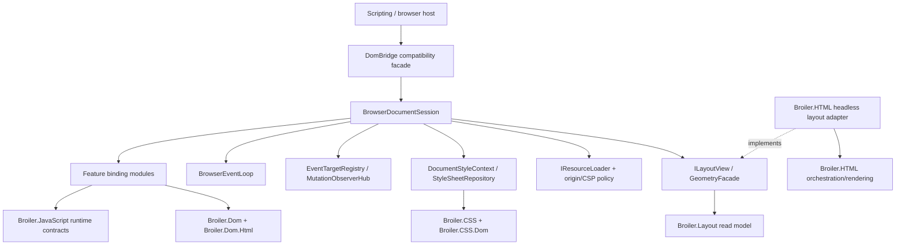

# HtmlBridge complexity-reduction roadmap

Status: proposed

Baseline date: 2026-07-13

Scope: Broiler.HtmlBridge.Core, Broiler.HtmlBridge.Dom,
Broiler.HtmlBridge.Rendering, Broiler.HtmlBridge.Scripting, and the canonical
components that should absorb engine-neutral behavior.

Companion inventory:
[HtmlBridge current component inventory](../architecture/htmlbridge-current-component-inventory.md).

## Executive decision

Do not solve the remaining complexity by moving the whole bridge into
Broiler.Dom, Broiler.CSS, or Broiler.HTML.

The previous promotion work has already established a canonical DOM and a shared
CSS engine. The next constraint is the shape of the browser adapter itself:
Broiler.HtmlBridge.Dom is a 27,436-line partial god object which combines JavaScript
binding, browser-runtime state, host resource loading, CSSOM, event-loop behavior,
layout queries, rendering workarounds, and test compatibility. Most of those
responsibilities really are bridge responsibilities, but they should not be one
class.

The recommended end state is:

1. Keep a small, source-compatible DomBridge facade.
2. Split browser behavior into document-scoped services and feature binding
   modules inside the bridge before considering more assemblies.
3. Promote only engine-neutral algorithms and data models to Broiler.Dom,
   Broiler.Dom.Html, Broiler.CSS, Broiler.CSS.Dom, Broiler.Layout, Broiler.HTML,
   Broiler.JavaScript, or Broiler.Graphics.
4. Replace the three unrelated responsibilities in
   Broiler.HtmlBridge.Rendering, then remove that project.
5. Make resource loading, time, and layout explicit injected host services.

This sequence reduces coupling without turning the canonical DOM/CSS libraries
into a browser host or creating dozens of tiny assemblies.

## Baseline and why this work is now necessary

The measurements below describe the current working tree, excluding bin and obj.
Method counts are approximate declaration counts, so they are useful for sizing
and trend checks rather than public-API accounting.

| Project | Source files | Physical lines | Non-blank lines | Approx. methods |
|---|---:|---:|---:|---:|
| Broiler.HtmlBridge.Core | 9 | 1,175 | 987 | 50 |
| Broiler.HtmlBridge.Dom | 65 | 27,436 | 23,641 | 1,104 |
| Broiler.HtmlBridge.Rendering | 3 | 1,003 | 908 | 35 |
| Broiler.HtmlBridge.Scripting | 5 | 682 | 594 | 22 |
| **Total** | **82** | **30,296** | **26,130** | **about 1,211** |

The dominant class is DomBridge:

- It is reopened by 63 partial declarations.
- Fourteen callback files contain 409 distinct numbered Js...Core callbacks.
- Forty-one of the 65 Dom source files directly know about the JavaScript
  engine; 25 know about CSS/computed style; 11 know about resources or network
  loading; 12 parse or serialize HTML; and 8 calculate layout geometry.
- InlineStyle is touched from 24 files, GetElementRuntimeState from 25,
  GetComputedProps from 16, ToJSObject from 16, and CreateBridgeElement from 13.
  These are hidden shared-state APIs, not feature-local dependencies.

Largest individual files:

| File | Lines | Main reason for size |
|---|---:|---|
| DomBridge/LayoutMetrics.cs | 2,269 | CSSOM View, layout approximation, scrolling, rectangles, zoom |
| JsFunctionCallbacks/JsObjects.cs | 1,634 | numbered callbacks for several unrelated interfaces |
| JsFunctionCallbacks/Registration.cs | 1,516 | callback plumbing and generic dispatch |
| DomBridge/SubDocuments.cs | 1,390 | frames, documents, parsing, origin, lifecycle and resource loading |
| DomBridge/Utilities.cs | 1,373 | unrelated DOM, URL, MIME, storage, form, canvas and SVG helpers |
| DomBridge/DomBridge.cs | 1,001 | construction, attach, lifecycle, timers and global orchestration |
| DomBridge.Serialization.cs | 947 | serialization plus render-oriented transforms |
| DomBridge/StyleSheets.cs | 918 | CSSOM identity, mutation, parsing and resource loading |

The current project graph also makes a low-level binding project pull the full
image rendering stack:

    Scripting -> Dom -> Rendering -> HTML.Image
                                      -> HTML.Orchestration
                                      -> HTML.Core -> Layout

Dom currently needs Rendering primarily for geometry and compatibility helpers.
That dependency direction should be replaced by a small layout/read-model
contract.

## Complexity model

The plan treats four kinds of complexity separately. Moving a file only helps
the first kind; it does not automatically help the other three.

| Kind | Current symptom | Correct response |
|---|---|---|
| Ownership | Neutral algorithms live in a browser adapter | Promote the algorithm and its neutral tests |
| Cohesion | One partial class owns unrelated browser APIs | Extract document services and feature modules |
| Dependency | Dom reaches through Rendering to HTML.Image | Invert through narrow layout and host contracts |
| State | Canonical DOM state is shadowed by bridge dictionaries | Establish one authority and one invalidation stream |

## Target architecture

Dependency rules:

- Broiler.Dom and Broiler.CSS must never reference HtmlBridge, a JavaScript
  engine, networking, or renderer policy.
- The bridge may depend on canonical DOM/CSS and public Layout contracts.
- The bridge must not depend on Broiler.HTML.Image.
- Broiler.HTML may implement a bridge-consumed layout interface, but the
  interface and DTOs must live below the HTML renderer.
- A browser host composes implementations. A feature callback must not construct
  HttpClient, parse a file path, or create a renderer directly.

## Ownership comparison and proposed destinations

### Canonical components

| Destination | Move here | Keep out |
|---|---|---|
| Broiler.Dom | Tree-neutral range operations, traversal, mutation records and option matching, node equality/normalization, neutral shadow-tree algorithms | JS wrappers, event-loop scheduling, URL/origin policy, computed style, geometry |
| Broiler.Dom.Html | HTML document/fragment parsing, deterministic serialization, canonical doctype/parser metadata, script-element discovery as metadata | Fetching scripts, CSP decisions, execution order, render compatibility rewrites |
| Broiler.CSS | CSS syntax and typed value models: anchor grammar, position-area/position-try values, keyframes/timing functions, CSS time and length expressions | Live CSSOM object identity, stylesheet fetching, DOM cascade, used layout values |
| Broiler.CSS.Dom | Selector matching, cascade, computed style, style scopes, tree-aware invalidation | JavaScript CSSOM wrappers, network loading, used geometry |
| Broiler.Layout | Anchor placement, position-try selection, sticky/fixed containing blocks, overflow/scroll geometry, zoomed used values, hit testing, animation sampling/application | JS conversion, document loading, renderer-specific compatibility transforms |
| Broiler.HTML | DOM-to-box projection and headless layout-session implementation; HTML rendering orchestration | Canonical DOM APIs, JS bindings, CSP and fetch policy |
| Broiler.JavaScript | ECMAScript WeakRef and FinalizationRegistry support and reusable engine-level primitives | Browser APIs such as Window, fetch, DOM events, queueMicrotask host integration |
| Broiler.Graphics | Immutable canvas display-list primitives only if commands are actually replayed | JS Canvas bindings and an unused mutable command recorder |

### Bridge and host components

| Destination | Move or keep here | Reason |
|---|---|---|
| HtmlBridge facade | Existing public construction/attach/flush/serialize entry points | Source compatibility and a single composition root |
| HtmlBridge feature bindings | JS registration, conversion, callback dispatch, CSSOM/DOM object identity | These translate browser IDL behavior into this JS engine |
| HtmlBridge document services | listeners, timers, observers, browsing contexts, top layer, JS identity, style session | Browser-runtime behavior is legitimate bridge ownership |
| Host/security layer | immutable CSP policy, URL/origin decisions, injected resource loader | Host policy should not contaminate DOM or CSS |
| WPT/CLI test support | check-layout assertions, Acid-specific transforms, path mapping and test-only shims | Test policy must not run on arbitrary production pages |

## Proposed bridge decomposition

Start inside Broiler.HtmlBridge.Dom. Assembly boundaries should follow stable
dependency boundaries later; they should not be used as the first refactoring
tool.

### Document-scoped services

| Service | Mission | Replaces or contains |
|---|---|---|
| BrowserDocumentSession | Own document, URL/origin, viewport, lifecycle and disposal | DomBridge's mutable document-wide fields |
| JsObjectRegistry | Preserve one JS wrapper identity per canonical node/object | scattered ToJSObject/CreateBridgeElement caches |
| DocumentBindingFactory | Build bindings and their narrow dependencies | generic callback registration in the facade |
| BrowserEventLoop | Own tasks, timers, intervals, RAF, microtask checkpoints and thread affinity | timer lists and drain loops in DomBridge/ScriptEngine |
| EventTargetRegistry | One listener store and dispatch path for node/window/generic targets | the current three listener stores |
| MutationObserverHub | Subscribe once to DomDocument.Mutated, filter records, queue delivery | manual notifications and registration-specific state |
| DocumentStyleContext | Own style scopes, engines, caches and invalidation | global computed-property and scope helpers |
| StyleSheetRepository | Own sheet text/rules/import state; use an injected loader | mixed CSSOM identity, parsing and fetch code |
| BrowsingContextManager | Own parent/child windows, frames, origins, ports and lifecycle | SubDocuments, SubDocumentObjects and Messaging overlap |
| GeometryFacade | Translate Layout read-model values to CSSOM View values | LayoutMetrics and SharedLayoutGeometry glue |
| ScrollController | Own scroll offsets and scrolling API behavior | ScrollRuntimeState plus geometry approximations |
| TopLayerManager | Own dialog/popover order and modal/top-layer state | dialog flags spread across anchor/runtime files |
| RenderDocumentProjector | Produce a non-destructive renderer input snapshot | live-DOM mutations in serialization/render preparation |

Every service is instance-scoped to BrowserDocumentSession. No runtime state may
remain in a process-global static ConditionalWeakTable.

### Feature binding modules

Registration and callbacks for one web-platform feature must be co-located:

- Window and lifecycle
- Document
- Node and attributes
- Element and geometry
- Traversal and Range
- Events and MutationObserver
- CSSOM and computed style
- SVG
- Forms and tables
- Dialog and popover
- Frames and browsing contexts
- Fetch and XMLHttpRequest
- Messaging
- Canvas

Each module exposes one Install(JsRealmContext) entry point and receives only the
services it uses. Replace numbered names such as JsElement123Core with semantic
names while moving them. A temporary compatibility registration table may map
old callback names to new handlers.

## Detailed delivery roadmap

### Phase 0 - stabilize the boundary and freeze a baseline

Goal: begin from a buildable public surface and prevent refactoring from being
confused with an API break.

Work:

1. Finish or revert the in-progress namespace move in the current working tree.
   At this baseline, Broiler.HtmlBridge.Scripting builds, but
   Broiler.Wpt.Tests has three CS0118 failures because
   Broiler.HtmlBridge.DomBridge is now interpreted as a namespace where callers
   expect the public DomBridge type.
2. Preserve the public full name Broiler.HtmlBridge.DomBridge as the v2
   compatibility facade. Use an internal namespace such as
   Broiler.HtmlBridge.WebApi or Broiler.HtmlBridge.Dom.Runtime; do not use
   Broiler.HtmlBridge.DomBridge as a namespace. Type forwarding cannot preserve
   a namespace rename when the full type name itself changes.
3. Capture the public API surface for Core, Dom, Rendering and Scripting.
4. Record deterministic WPT/Acid/pixel baselines and the bridge.mutation
   benchmark.
5. Add architecture tests for the dependency rules in this document.

Exit criteria:

- Broiler.slnx builds with zero errors.
- Existing v2 public names compile from a small consumer fixture.
- No canonical project references a bridge or JavaScript assembly.
- Baseline test and benchmark artifacts are committed or linked.

Suggested PRs:

- P0.1 namespace/public-surface repair.
- P0.2 API snapshot and architecture guards.
- P0.3 reproducible behavioral/performance baseline.

The recorded Phase 0 baseline (committed/linked artifacts, reproducible commands and
observed status) lives in [Phase 0 baseline](htmlbridge-phase0-baseline.md).

### Phase 1 - repair the project graph

Status: **completed** 2026-07-13 (branch `htmlbridge-phase1-project-graph`). All five
work items landed: (1) dropped the dead Rendering→Core reference; (2) inverted
Dom→HTML.Image behind a new `Broiler.Layout.ILayoutView`, with the renderer-backed
implementation relocated to the new `Broiler.HTML.Headless` submodule project and injected
into `DomBridge` via a `[ModuleInitializer]`-registered factory; (3) made the layout view
disposable, document-scoped and `(document,version,viewport,baseUrl)`-keyed; (4) collapsed
the duplicate `Broiler.Dom`/`Broiler.Graphics` nodes via overridable `$(BroilerDomPath)`/
`$(BroilerGraphicsPath)` MSBuild props plus a `scripts/check-submodule-sha-drift.sh` CI
guard; (5) narrowed the bridge Dom/Scripting projects off `Broiler.JavaScript.All`. All four
exit criteria are locked by guard tests in `HtmlBridgeArchitectureGuardTests`. The static
`DomBridge.LayoutViewFactory` seam is an intentional temporary compromise that Phase 2's
`BrowserDocumentSession` replaces with constructor injection.

Goal: make later extraction possible without dragging duplicate or high-level
projects through every test.

Work:

1. Remove the unused Rendering-to-Core reference if the API audit still shows no
   call.
2. Replace the Dom-to-HTML.Image geometry dependency with a small ILayoutView
   contract and immutable geometry DTOs. Put the contract with Broiler.Layout or
   in a dependency-neutral bridge abstraction; put the current implementation in
   Broiler.HTML.Orchestration or a small Broiler.HTML.Headless project.
3. Make SharedLayoutGeometryProvider disposable, document-scoped and
   version-aware. Its cache key must include document version, viewport and base
   URL. Do not swallow all renderer exceptions.
4. Unify duplicate root and nested Broiler.Dom/Broiler.Graphics project paths.
   Add overridable MSBuild paths for submodule-local builds, top-level overrides
   for the main solution, and a CI guard which fails if duplicate submodule SHAs
   drift.
5. Replace broad Broiler.JavaScript.All references with the smallest stable
   engine/runtime projects possible.

Exit criteria:

- Broiler.HtmlBridge.Dom no longer references Broiler.HTML.Image.
- One Broiler.Dom assembly project node and one Graphics implementation are
  present in a solution build.
- Geometry tests pass through ILayoutView.
- Dependency tests lock the new graph.

### Phase 2 - establish document services and a single state authority

Status: **P2.1 completed** 2026-07-13 (branch `htmlbridge-phase2-p2-1-lifetime-disposal`).
`DomBridge` is now `IDisposable` with a deterministic, idempotent `Dispose()` that releases
every per-session resource (layout view, timer/animation queues, listener stores, mutation
observers, ranges/iterators, message ports, JS wrapper caches; it drops — never disposes — the
borrowed `JSContext`). A shared `ClearRuntimeSessionState()` reset is called by both `Dispose()`
and `ParseHtml`, so **re-attaching now leaves no timers/listeners/observers from the prior
document** (previously they leaked — nothing cleared those maps on re-parse). The post-dispose
document/timer entry points fail fast with `ObjectDisposedException`. A minimal
`DomBridgeDisposalRegistry` (namespace `Broiler.HtmlBridge.Dom.Runtime`) is the single
lifetime/composition seam that P2.2+ grows into `BrowserDocumentSession`. Characterization +
disposal + guard tests live in `Broiler.Cli.Tests/DomBridgeSessionLifetimeTests.cs`; the public-API
snapshot baseline was regenerated (only the `Broiler.HtmlBridge.Dom` DomBridge type line changed —
Core is untouched, so `IDomBridgeRuntime` stays source-compatible and is **not** `IDisposable`).

**P2.2 completed** 2026-07-13 (same branch). JS wrapper identity now has a single authority:
`JsObjectRegistry` (namespace `Broiler.HtmlBridge.Dom.Runtime`) owns the per-node wrapper map and
the sub-document-root document-wrapper map (both reference-keyed) behind a narrow surface
(`TryGet`/`Set`/`Remove`/`Entries`/`TryGetNode`/`SetDocument`/`TryGetDocument`/`Clear`), replacing
the scattered `_jsObjectCache` and `_docRootToDocJSObject` fields at ~20 sites across
`JsObjects`/`JsFunctionCallbacks`/`Registration`/`SubDocuments*`/`ShadowDom`/`Utilities`. Behavior
is preserved; re-parse now also releases stale sub-document wrappers via one `Clear()` (observably
equivalent — the dropped keys are detached roots no lookup can reach again). No public-API change
(the registry is internal). Tests: `Broiler.Cli.Tests/JsObjectRegistryTests.cs` (registry unit
tests + wrapper-identity characterization through the bridge). The wrapper *construction* in
`ToJSObject` stays in the bridge (it needs `this` for hundreds of callbacks); only the identity
store moved. The per-document JS singletons (`_documentJSObject`/`_windowJSObject`/
`_visualViewportJSObject`) are intentionally left as fields — they are single globals, not node
identity — for a later pass.

**P2.3 completed** 2026-07-13 (same branch). Computed-style machinery now has a single authority:
`DocumentStyleContext` (namespace `Broiler.HtmlBridge.Dom.Runtime`) owns the per-document-root
`CssStyleEngine` scopes (and the `ComputedStyleEngineScope` type), the `GetComputedProps` memo (cache
+ re-entrancy in-progress map), and the style-invalidation batch state — replacing the five scattered
bridge fields (`_computedStyleEngines`, `_computedPropsCache`, `_computedPropsInProgress`,
`_styleInvalidationBatchDepth`, `_pendingStyleInvalidationRoots`). There is now one invalidation
route, `DocumentStyleContext.InvalidateComputedStyle()`, which clears the memo *and* the engines'
cascade/computed caches together (they must invalidate as one because `GetComputedProps` reads inline
style from the live ElementRuntimeState map, invisible to the engine's own DOM-mutation subscription).
The bridge keeps the algorithms that need the DOM/loading (engine construction via
`GetSyncedScopedEngine`, `<style>`/`<link>` collection, the recursive scope walk) and calls into the
context for storage; no back-reference. Behavior-preserving; no public-API change (internal). Tests:
`Broiler.Cli.Tests/DocumentStyleContextTests.cs` (memo/engine-scope/batch unit tests + a
class-change → `getComputedStyle` invalidation characterization through the bridge). Net −53 lines in
the bridge partials.

**P2.4 completed** 2026-07-13 (same branch). The document's task queues now have a single owner:
`BrowserEventLoop` (namespace `Broiler.HtmlBridge.Dom.Runtime`) owns the `setTimeout`/`setInterval`
callback maps, the `requestAnimationFrame` map, the internal frame-action queue, their id counters
and the cleared-timer set — plus the drain itself (`DrainStep`/`DrainAll`). It replaces the eight
scattered bridge fields and the ~90-line `FlushTimerStep` body. Registration
(`setTimeout`/`clearTimeout`/`setInterval`/`clearInterval`/`requestAnimationFrame`/
`cancelAnimationFrame`) and `QueueFrameAction` delegate to it; `DomBridge.FlushTimers`/
`FlushTimerStep`/`HasPendingTimers` are now thin wrappers (still guarded by `ThrowIfDisposed`, and the
per-task `TaskCheckpointCallback` is passed into the drain). The incidental reuse of the frame-action
counter to mint smooth-scroll tokens is gone — smooth-scroll tokens get their own bridge-local
counter (observably equivalent: the two were independent namespaces). Behavior-preserving; no
public-API change (the loop is internal, and the public timer methods keep their signatures). Tests:
`Broiler.Cli.Tests/BrowserEventLoopTests.cs` (registration/cancellation/drain/checkpoint/error-isolation
unit tests + a timer-flush characterization through the bridge; existing
`ScriptEngineExecuteTests.DomBridge_FlushTimerStep_*` still pass). Net −147 lines in the bridge
partials. The loop is also the seam for the still-pending single-owner thread-affinity model (Phase 2
item 5); today it preserves the existing defensive concurrent collections.

**P2.5 completed** 2026-07-13 (same branch). Listeners and observers now have single owners, both in
namespace `Broiler.HtmlBridge.Dom.Runtime`:

- `EventTargetRegistry` owns the per-node `addEventListener` listeners, the window listeners, the
  generic JS-target (message-port / sub-window) listeners, the target→owner-window map, and the
  visual-viewport `scroll` listeners — replacing four scattered bridge fields plus the node-listener
  store that used to live on the process-global `ElementRuntimeState`. Node listeners now use an
  **instance-scoped `ConditionalWeakTable`**, keeping the same weak GC semantics while removing them
  from the static table (partial progress on Phase-2 item 4). `ElementRuntimeState.EventListeners` is
  deleted; only inline `on*` handlers remain node-runtime state there. The dispatch algorithms stay in
  the bridge (`FireListeners` became an instance method) and read/write listeners through the registry.
- `MutationObserverHub` owns the registered observer list — `Register` (with `observe()` replace
  semantics), `Unregister` (`disconnect`), `Count`, `Snapshot`, `Clear`. Registration
  (`Common.cs`), the three delivery loops (`Traversal.cs`) and teardown route through it; the bridge
  still builds and delivers the JS mutation records.

Behavior-preserving; no public-API change (both are internal; only private helpers changed static→
instance). Tests: `Broiler.Cli.Tests/EventTargetRegistryTests.cs` +
`Broiler.Cli.Tests/MutationObserverHubTests.cs` (unit tests + element/window listener characterization;
the existing `DomEventsEdgeCaseTests`, messaging and MutationObserver suites still pass). Full-suite
regression check vs the P2.4 baseline: zero regressions.

**P2.6 completed** 2026-07-13 (same branch) — **Phase 2 complete.** Two owners, both in
`Broiler.HtmlBridge.Dom.Runtime`:

- `MessagePortRegistry` owns the `MessageChannel`/`MessagePort` state — entangled peers, closed and
  started marks, and the per-port queue of pending messages — replacing the four scattered port maps.
  The messaging callbacks still build/dispatch the JS `MessageEvent`s; they read/mutate port state
  through it (`Link`/`TryGetPeer`/`HasPeer`/`IsClosed`/`Close`/`IsStarted`/`Start`/`Enqueue`/
  `TakeQueued`/`Clear`).
- `ResourceLoader` owns the host resource I/O — a process-shared `HttpClient` (kept static inside the
  loader so many documents don't each open a socket pool) and the optional local base path — replacing
  the static `SharedHttpClient` that feature callbacks reached into directly. This is the "no feature
  callback constructs an `HttpClient`" seam Phase 7 builds on (CSP, unified fetch/XHR/frame routing,
  cancellation are still to come). `FetchExternalStylesheet` went static→instance.

Behavior-preserving; no public-API change (both internal). Tests:
`Broiler.Cli.Tests/MessagePortRegistryTests.cs` + `Broiler.Cli.Tests/ResourceLoaderTests.cs` (unit
tests + existing messaging/network suites pass). Full-suite regression check vs the P2.5 baseline:
every candidate fails identically in isolation on both sides → zero regressions.

**Deferred within "browsing-context state" (a follow-up, not blocking Phase 3) — DONE in P3.16:** the
sub-window and sub-document content caches in `SubDocuments.cs` (`_subWindowCache`/`_subWindowContainers`,
`_subDocumentCache`, `_subDocumentLocationCache`, `_subDocumentBaseUrlCache`, `_objectLoadFailures`,
`_onloadFired`) and `_currentWindowOverride` are now consolidated into the single `BrowsingContextManager`
(see the P3.16 status under Phase 3). P2.6 took the cross-file cohesive slice (ports) and the resource-loader
seam; P3.16 took the rest.

## Phase 2 outcome

All six sub-PRs landed on branch `htmlbridge-phase2-p2-1-lifetime-disposal`: P2.1 disposal/lifetime,
P2.2 `JsObjectRegistry`, P2.3 `DocumentStyleContext`, P2.4 `BrowserEventLoop`, P2.5
`EventTargetRegistry`+`MutationObserverHub`, P2.6 `MessagePortRegistry`+`ResourceLoader`. Hidden
bridge state now has explicit single owners (all internal, in `Broiler.HtmlBridge.Dom.Runtime`); node
event listeners were de-globalized off the process-static `ElementRuntimeState` onto an instance
`ConditionalWeakTable`. Not fully met and carried forward: two simultaneous sessions are still not
isolated (blocked at the Broiler.JS engine's shared globals — a JS-engine concern, not the bridge),
and the remaining process-static `ElementRuntimeState`/`PositionAreaResolutions` tables are still to be
de-globalized (the sub-document caches above are now consolidated into `BrowsingContextManager` — P3.16).

Two findings recorded for later phases:

- **The "two *simultaneous* sessions are isolated" exit criterion is blocked below the bridge.**
  Two live `JSContext` instances currently share global state at the Broiler.JS engine layer (the
  last-created context's globals win), so simultaneous-session isolation cannot be delivered by a
  bridge-only change. The supported model today is one active session per thread; the bridge
  guarantees *sequential* re-attach isolation. Full simultaneous isolation needs JS-engine work
  (out of this roadmap's scope).
- **De-globalizing the process-static per-element runtime tables** (`ElementRuntimeStates`,
  `PositionAreaResolutions`) is deferred: it is a 155-call-site / 24-file cascade through the
  project's ~284 static helpers, and the tables are weak + node-keyed (they GC with the session's
  nodes, so they do not leak or cross sessions today). Its own later PR under item 4.

Goal: make hidden state dependencies explicit while preserving behavior.

Work:

1. Introduce BrowserDocumentSession and move construction/disposal into it.
2. Extract JsObjectRegistry, DocumentStyleContext, BrowserEventLoop,
   EventTargetRegistry, MutationObserverHub and an injected IResourceLoader.
3. Split ElementRuntimeState by concern:
   listener, form control, scroll, dialog/top layer, shadow root, stylesheet,
   document, animation and doctype state.
4. Remove process-global runtime state. Attach/reparse/dispose must release every
   timer, listener, observer, browsing context, layout snapshot and JS wrapper.
5. Define a single-owner event-loop/threading model. Concurrent collections are
   not a substitute for document thread affinity.
6. Route all computed-style cache clears through DocumentStyleContext and all
   mutations through DomDocument.Mutated.

Exit criteria:

- Two simultaneous sessions cannot see each other's nodes, listeners, timers,
  styles or storage.
- Re-attaching a DomBridge leaves no state from the prior document.
- There is one mutation stream, one event dispatcher, one style invalidation
  route and one resource loader.
- DomBridge's fields are primarily facade/session references, not feature state.

Suggested PR order:

- P2.1 session lifetime and disposal characterization. **(done — see Status above)**
- P2.2 JS identity registry. **(done — see Status above)**
- P2.3 style context and invalidation. **(done — see Status above)**
- P2.4 event loop. **(done — see Status above)**
- P2.5 listeners/observers. **(done — see Status above)**
- P2.6 resource loader and browsing-context state. **(done — see Status above; Phase 2 complete)**

### Phase 3 - replace the partial god object with feature modules

Status: **P3.1 completed** 2026-07-13 (branch `htmlbridge-phase3-traversal-module`). The DOM
traversal / Range vertical slice is the first co-located feature binding module:
`TraversalBinding` (namespace `Broiler.HtmlBridge.Dom.Features`) now owns `TreeWalker`,
`NodeIterator`, `Range`, the `NodeFilter` machinery and `document.createComment` — its registration
(`RegisterDocumentApis`), every handler (renamed from the numbered `JsTraversal…020…039Core` to
semantic `Range*`/`Create*` names) and the traversal-scoped state (the weak active-range and
active-node-iterator registries) live together in one file. The module depends only on the narrow
`ITraversalHost` contract (JS-wrapper identity, node lookup, boundary/geometry helpers still in the
bridge pending Phase 5, and the range-scoped node-construction seams) which `DomBridge` implements
via **explicit interface members** in `DomBridge.TraversalHost.cs` — so no handler reaches an
arbitrary bridge private field and the public surface is unchanged. `DomBridge`'s traversal
partials are now thin: the old `JsFunctionCallbacks/Traversal.cs` is deleted; `Traversal.cs` keeps
only the mutation-observer notification machinery and range client-rect geometry plus three
one-line `Build*` delegators; `Registration/Traversal.cs` is a single delegating call; the
`_activeRanges`/`_activeNodeIterators` fields moved off the bridge. Neutral static DOM-tree helpers
the module shares (`IsText`/`IsComment`/`ParentEl`/`ChildAt`/`ChildIndexOf`/`ChildElements`/
`GetNodeType`/`GetDocumentOrderNodes`/`CollectTextContent`/`IsDescendant`/`FindCommonAncestor`/
`GetNodesInRange`/`ThrowDOMException`) were widened `private static`→`internal static` in place
(no behaviour/API change; Phase 4 promotes them to Broiler.Dom). Behaviour-preserving; no
public-API change (both the module and the contract are internal). Tests:
`Broiler.Cli.Tests/TraversalBindingModuleTests.cs` (co-location/host-contract/state-moved guards +
Range/TreeWalker/createComment characterizations). Regression check vs the P2.6 baseline: the
existing traversal, mutation-observer, events and messaging suites pass unchanged; the pre-existing
environmental/known failures (`Range_GetBoundingClientRect_Includes_DisplayContents_Descendants`
headless-geometry, the six Acid3 pixel/cascade/border/NodeIterator-pre-removal tests, and the two
`:root`/`:lang` selector tests) fail identically on both sides → zero regressions.

Status: **P3.2 completed** 2026-07-13 (same branch). The **MutationObserver** feature (the
Events-and-MutationObserver pair's observer half) is the second co-located module:
`MutationObserverBinding` (namespace `Broiler.HtmlBridge.Dom.Features`) now **owns** the P2.5
`MutationObserverHub` state authority and co-locates the whole feature — the JS `MutationObserver`
polyfill + its `__broilerRegister/UnregisterMutationObserver` host functions, the
`observe()`/`disconnect()` callbacks (was `JsRegistrationBroiler…034/035Core`), the option parsing
(`CreateMutationObserverOptions`/`GetMutationObserverOption`, moved out of `Common.cs`), and the
childList/attribute/characterData record delivery (`Deliver…`, moved out of `Traversal.cs`). It
depends only on the narrow `IMutationObserverHost` contract (`ToJSObject` + `FindDomNodeByJSObject`),
which `DomBridge` implements via explicit interface members in `DomBridge.MutationObserverHost.cs`.
The bridge keeps three same-name `Notify…MutationObservers` delegators so the ~7 mutation-path call
sites in `Traversal.cs`/`Attributes.cs`/`JsObjects.cs` are untouched; `RegisterDocumentEventsAnd
MutationObservers` now registers only the typed `Event` constructors and delegates the observer
install; lifetime reset calls `_mutations.Clear()`. This also finished the P3.1 `Traversal.cs`
cleanup (the mutation-observer machinery it had temporarily retained is gone). Behaviour-preserving;
no public-API change (module + contract internal). Tests:
`Broiler.Cli.Tests/MutationObserverBindingModuleTests.cs` (co-location/host-contract/hub-ownership
guards + childList/attribute-oldValue/disconnect characterizations). Regression check: the
MutationObserver, DomEvents, Attributes, Traversal, Messaging and architecture-guard suites pass
unchanged; same pre-existing/known failures as above → zero regressions.

Status: **P3.3 completed** 2026-07-13 (same branch). The **event dispatch engine** — the highest-
coupling core of the Events feature — is the third co-located module: `EventDispatchBinding`
(namespace `Broiler.HtmlBridge.Dom.Features`) owns the capture → target → bubble propagation
algorithm (`DispatchEventOnElement`), the per-element listener firing (`FireListeners`, which had no
external callers), the event object's propagation-control methods (`stopPropagation`/
`stopImmediatePropagation`/`preventDefault`/`cancelBubble`/`returnValue`, renamed from the numbered
`JsEvents…001…007Core`) and `composedPath()`. It reads what it dispatches through the narrow
`IEventDispatchHost` contract (`ToJSObject`, `DocumentNode`, `DocumentJSObject`, `WindowJSObject`,
`GetEventListeners`, `GetInlineEventHandlers`), implemented by explicit interface members in
`DomBridge.EventDispatchHost.cs`. **Deliberately kept in the bridge** (different concerns, not
dispatch): the `addEventListener`/`removeEventListener` *registration* helpers
(`CreateEventListenerRegistration`/`GetCaptureForRemoval`/`HasMatchingEventListener`) that the four
registration sites use, inline-handler *compilation* (`CompileInlineEventAttribute(s)`), form
validity checks, and the shared `InvokeEventListener` (widened to `internal static` — also used by
the window/submit/messaging firing paths, which the module calls as `DomBridge.InvokeEventListener`).
The bridge keeps a same-name `DispatchEventOnElement` delegator so the ~five caller files
(`JsObjects`/`Registration`/`LayoutMetrics`/`SubDocuments`/`DomBridge.cs`) are untouched; the emptied
`JsFunctionCallbacks/Events.cs` was deleted. Behaviour-preserving; no public-API change (module +
contract internal). Tests: `Broiler.Cli.Tests/EventDispatchBindingModuleTests.cs` (co-location/
host-contract guards + capture/target/bubble ordering, stopPropagation and preventDefault
characterizations). Regression check: DomEvents (81), DomEventsEdgeCase (33), Acid3RegressionTests
(26), Attributes, MutationObserver, Messaging and architecture-guard suites pass unchanged → zero
regressions.

Status: **P3.4 completed** 2026-07-13 (same branch) — the Events feature's listener half, completing
Events alongside P3.3's dispatch half. The `addEventListener`/`removeEventListener` *registration
semantics* (option parsing for capture/once/passive, the DOM duplicate-registration check, and
match-by-listener-and-capture removal) are now one co-located helper, `EventListenerBinding`
(namespace `Broiler.HtmlBridge.Dom.Features`), exposing two storage-agnostic operations —
`AddListener(list, listener, options)` and `RemoveListener(list?, listener, options)` — plus the four
former bridge helpers (`CreateEventListenerRegistration`/`GetCaptureForRemoval`/
`HasMatchingEventListener`/`GetBooleanOption`) now internal to it. It is stateless with **no host
contract**: each of the four target callbacks (element in `JsObjects`, document + window in
`Registration`, message-port in `Messaging`) resolves its own listener list from the P2.5
`EventTargetRegistry` and calls the shared operations, replacing the identical ~15-line add/remove
block that had been copied across those four feature files. Behaviour-preserving; no public-API
change (the helper is internal). Tests: `Broiler.Cli.Tests/EventListenerBindingModuleTests.cs`
(co-location guard + dedup / capture-scoped-removal / once characterizations). Regression check:
DomEvents (81), DomEventsEdgeCase (33), Messaging (15), Attributes and the event/architecture-guard
suites pass unchanged → zero regressions.

Status: **P3.5 completed** 2026-07-13 (same branch). The **HTML table DOM interfaces** are the fifth
co-located module: `TableBinding` (namespace `Broiler.HtmlBridge.Dom.Features`) owns the whole
`HTMLTableElement` interface (`caption`/`tHead`/`tFoot`/`tBodies`/`rows` plus `createCaption`/
`createTHead`/`createTFoot`/`deleteCaption`/`deleteTHead`/`deleteTFoot`/`insertRow`/`deleteRow`),
`HTMLTableSectionElement` (`rows`/`insertRow`) and `HTMLTableRowElement` (`rowIndex`/
`sectionRowIndex`/`cells`/`insertCell`/`deleteCell`) — ~20 callbacks (renamed from the numbered
`JsElementInterfaces…001…023Core`) plus `BuildTableRows` and the `insertRow` placement algorithm,
moved out of `JsFunctionCallbacks/ElementInterfaces.cs` and `Utilities.cs`. The table registration in
`AddElementSpecificMembers` collapsed to a single `_tables.Install(obj, element, tag)` call. Table
DOM is pure canonical-tree manipulation, so the `ITableHost` contract is just two seams (`ToJSObject`
+ `CreateElement`, the construction funnel), implemented via explicit interface members in
`DomBridge.TableHost.cs`; everything structural uses the neutral static `DomBridge` tree helpers
(`SetParent`/`InsertChildAt`/`RemoveChildFrom`/`IsTableCellElement`/`UndefinedFunction` widened
`private`→`internal static`). `CollectTableRows` stayed a bridge `internal static` helper because hit
testing also uses it. Behaviour-preserving; no public-API change (module + contract internal).
Tests: `Broiler.Cli.Tests/TableBindingModuleTests.cs` (co-location/host-contract guards + insertRow/
insertCell/rows-spec-order/createTHead-idempotence/deleteRow characterizations). Regression check:
HtmlDomInterface (49), FormControlRender, Acid3RegressionTests (26) and the architecture-guard suites
pass unchanged; the one pre-existing environmental failure
(`FormControlRenderTests.SelectListBox_SizingAndScrolling_Follow_WritingMode`, a `<select>` layout
test) fails identically on both sides → zero regressions.

Status: **P3.6 completed** 2026-07-13 (same branch). The **`Element.classList` / `DOMTokenList`**
API is the sixth co-located module: `ClassListBinding` (namespace `Broiler.HtmlBridge.Dom.Features`)
owns `Build(element, onClassChanged)` plus the `contains`/`add`/`remove`/`toggle`/`replace`
operations (renamed from the bridge's `BuildClassListObject` + the scattered `JsUtilities…025…Core`
callbacks). It is the cleanest slice so far — pure logic over the canonical `Broiler.Dom.DomTokenList`
with an injected `Action<DomElement>` style-invalidation callback, so it is an **internal static
class with no host contract at all**. The registration site (`JsObjects.cs`) calls
`ClassListBinding.Build(element, bridge.InvalidateStyleScope)`. Behaviour-preserving; no public-API
change. Tests: `Broiler.Cli.Tests/ClassListBindingModuleTests.cs` (co-location guard +
add/remove/contains, toggle-with/without-force, replace characterizations). Regression check:
SelectorsAndCssom (only the two known-baseline `:root`/`:lang` fails, unchanged) and the
architecture-guard suites pass → zero regressions.

Status: **P3.7 completed** 2026-07-13 (same branch) — the first *runtime-state-coupled* feature
extracted, establishing the narrow-named-accessor pattern for the entangled remainder. The **dialog
/ popover / details JS API** is the seventh co-located module: `DialogBinding` (namespace
`Broiler.HtmlBridge.Dom.Features`) owns `HTMLDialogElement` (`showModal`/`show`/`close`/`open`/
`returnValue`), the popover API (`showPopover`/`hidePopover` on any element with the global
`popover` attribute) and `HTMLDetailsElement.open` — 8 callbacks (renamed from the numbered
`JsElementInterfaces…029…036Core`; the identical details/dialog `open` setters deduplicated) plus
the three registration blocks in `AddElementSpecificMembers`, now one
`_dialogs.Install(obj, element, tag, hasPopover)` call. Its runtime state
(`ElementRuntimeState.Dialog.{Modal,PopoverOpen,TopLayerOrder}`, `FormControl.ReturnValue`, the
top-layer counter) is reached through the narrow `IDialogHost` contract as **named primitives**
(`SetOpenAttribute`/`HasOpenAttribute`/`InvalidateStyleScope`/`AssignNextTopLayerOrder`/
`SetDialogModal`/`SetPopoverOpen`/`Get`/`SetReturnValue`/`PopoverKeepsOverlayOnHide`), implemented
via explicit interface members in `DomBridge.DialogHost.cs` — the module never touches the
runtime-state object, and these accessors are the single seam a future `TopLayerManager` re-homes.
The backdrop/top-layer **rendering** stays in the bridge's anchor resolver. Behaviour-preserving; no
public-API change (module + contract internal). Tests:
`Broiler.Cli.Tests/DialogBindingModuleTests.cs` (co-location/host-contract guards +
showModal/close/returnValue, dialog.open-setter, details.open characterizations). Regression check:
Dialog, Popover, Overlay, Backdrop, HtmlDomInterface (49), Acid3RegressionTests (26) and the
architecture-guard suites pass unchanged → zero regressions (the renderer reads the same runtime
state the module now writes).

Status: **P3.8 completed** 2026-07-13 (same branch) — the second runtime-state-coupled feature, via
the P3.7 named-accessor pattern. The **HTMLSelectElement / HTMLOptionElement** interface is the
eighth co-located module: `SelectBinding` (namespace `Broiler.HtmlBridge.Dom.Features`) owns
`select.add`/`options`/`selectedIndex`/`size` plus the option-collection, selected-index and value
algorithms (`CollectSelectOptions`/`GetSelectedIndex`/`SetSelectedIndex`/`GetValue`/`SetValue`,
**relocated out of `LayoutMetrics.cs`** where they lived but were never used by layout) and
`option.defaultSelected` — 6 callbacks (renamed from the numbered `JsElementInterfaces…037…045Core`).
The select + option registration blocks in `AddElementSpecificMembers` collapsed to one
`_select.Install(obj, element, tag)` call; the shared `value` form-control handler in `JsObjects.cs`
keeps its input/textarea branches and delegates only its select branch to `_select.GetValue`/
`SetValue`. The per-element form-control state (the select's dirty selected index, an option's IDL
value and default-selected flag on `ElementRuntimeState.FormControl`) is reached through the narrow
`ISelectHost` contract as named primitives (`TryGetSelectedIndex`/`SetSelectedIndex`/
`TryGetOptionValue`/`Get`/`SetOptionDefaultSelected`) plus `ToJSObject`/`FindDomElementByJSObject`,
implemented via explicit interface members in `DomBridge.SelectHost.cs`; the module never touches the
runtime-state object. Neutral attribute helpers `HasAttr`/`TryGetAttribute`/`SetAttr`/`RemoveAttr`/
`GetElementTextContent` were widened `private`→`internal static`. Behaviour-preserving; no public-API
change (module + contract internal). Tests: `Broiler.Cli.Tests/SelectBindingModuleTests.cs`
(co-location/host-contract guards + options/default-selected-index, selectedIndex-setter,
value-setter, add/size characterizations). Regression check: HtmlDomInterface (49), FormControlRender
and the architecture-guard suites pass unchanged; the one pre-existing environmental failure
(`FormControlRenderTests.SelectListBox_SizingAndScrolling_Follow_WritingMode`, a `<select>` layout
test) fails identically on both sides → zero regressions.

Status: **P3.9 completed** 2026-07-13 (same branch). The **HTMLFormElement** interface is the ninth
co-located module: `FormBinding` (namespace `Broiler.HtmlBridge.Dom.Features`) owns `form.elements`
(an `HTMLFormControlsCollection` with numeric **and named** access), `form.length`, `form.action`,
and the constraint-validation checks (`checkValidity`/`reportValidity`, whose logic moved out of
`Events.cs` — completing that file's de-form-ing). The bridge's `FormElementsCollection` (a JSObject
subclass with a named-lookup override) moved into the module as a nested type; its sole bridge
coupling — the `DomBridge` back-reference it carried only to wrap a control as a JS object — is
replaced by the narrow `IFormHost` contract (`ToJSObject`), implemented via one explicit interface
member in `DomBridge.FormHost.cs`. Everything else (control collection, validity) is pure
tree/attribute work over the already-`internal static` `DomBridge.CollectFormControls`/`HasAttr`/
`TryGetAttribute`/`ChildElements`/`IsText`, so no new widening was needed. The form registration block
in `AddElementSpecificMembers` collapsed to one `_forms.Install(obj, element, tag)` call; the
`checkValidity`/`reportValidity` registration on form-associated elements in `JsObjects.cs` now calls
`_forms.IsElementValid(element)`. Behaviour-preserving; no public-API change (module + contract
internal). Tests: `Broiler.Cli.Tests/FormBindingModuleTests.cs` (co-location/host-contract guards +
elements indexed/named/length, action get/set, checkValidity characterizations). Regression check:
HtmlDomInterface (49), FormControlRender and the architecture-guard suites pass unchanged; the one
pre-existing environmental `<select>` layout failure reproduces identically → zero regressions.

Status: **P3.10 completed** 2026-07-13 (same branch) — the first *browsing-context-coupled* feature.
The **web-messaging** feature is the tenth co-located module: `MessagingBinding` (namespace
`Broiler.HtmlBridge.Dom.Features`) owns `window.postMessage`, `MessageChannel`/`MessagePort` (creation,
`postMessage`, `start`/`close`/`onmessage`, the per-port pending-message queue), the structured-clone
+ transfer-list handling and `MessageEvent` construction — and it **owns** the P2.6
`MessagePortRegistry` state authority (entangled peers, closed/started marks, queued messages), the way
P3.2 took over the P2.5 hub. It also owns the generic `EventTarget` dispatch
(`addEventListener`/`removeEventListener`/`dispatchEvent` with the propagation-control methods) that is
installed on message ports **and** sub-windows — the two non-node event targets — co-located here (its
listeners already come from the shared `EventTargetRegistry`) pending a future dedicated generic-
EventTarget/Window module; sub-window installation goes through the module's public
`InstallEventTargetApi`. All the callbacks were renamed from the numbered `JsMessaging…001…017Core` to
semantic names. The module holds a reference to the shared `EventTargetRegistry` (generic-target
listeners + owner-window map, which it does **not** own) and reaches the document's browsing-context
operations — current/owner-window resolution, the window-context switch, top-window dispatch and
frame-action queueing — through the narrow `IMessagingHost` contract, implemented via explicit
interface members in `DomBridge.MessagingHost.cs`. The window-resolution / window-context-switch
cluster itself (`ResolveCurrentWindow`/`ResolveOwnerWindow`/`GetCanonicalWindow`/`RunWithWindowContext`/
`GetWindowDocument`/`GetWindowParent`) is genuine browsing-context infrastructure entangled with the
sub-window/sub-document caches Phase 2 deferred, so it was **relocated (not moved into the module)**
into a new bridge partial `DomBridge.WindowContext.cs` — bridge-owned pending a future
`BrowsingContextManager`, and still called directly by `SubDocuments.cs`. The three external call sites
(`Registration/Window.cs` window messaging, `Registration/Fetch.cs` `MessageChannel` constructor,
`SubDocuments.cs` sub-window EventTarget install) now go through the module; lifetime reset calls
`_messaging.ClearPorts()`. The old `DomBridge/Messaging.cs` + `JsFunctionCallbacks/Messaging.cs` were
deleted. Behaviour-preserving; no public-API change (module + contract internal). Tests:
`Broiler.Cli.Tests/MessagingBindingModuleTests.cs` (co-location / host-contract / registry-ownership
guards + MessageChannel port round-trip, queue-until-onmessage, and async window-postMessage
characterizations). Regression check vs the P3.9 baseline: WebMessaging (existing), MessagePortRegistry,
DomEvents (81), DomEventsEdgeCase, MutationObserver, EventDispatch, EventListener, Attributes and the
architecture-guard suites all pass unchanged (164 tests); the pre-existing environmental iframe/sub-
document HTTP failures (`HttpSubResourceTests.Iframe_*`, `ScriptEngineExecuteTests.…Iframe_Scroll_State
_In_SrcDoc`) fail identically on both sides → zero regressions.

Status: **P3.11 completed** 2026-07-13 (same branch) — the networking feature. **`fetch` /
`XMLHttpRequest`** is the eleventh co-located module: `FetchBinding` (namespace
`Broiler.HtmlBridge.Dom.Features`, split into `FetchBinding.cs` / `FetchBinding.Callbacks.cs` /
`FetchBinding.Xhr.cs` to stay under the 750-line/file guideline) owns the whole `fetch` polyfill and
its `Headers`/`Request`/`Response`/`FormData`/`Blob`/`AbortController` helper objects, the `Response`
static factories (`new Response`/`Response.json`/`Response.redirect`) and the `XMLHttpRequest` polyfill
— i.e. `RegisterFetchAndHttpApis` (now `Install`), the four `JsRegistration…113/114/116/120Core`
callbacks (moved out of the shared 1516-line `JsFunctionCallbacks/Registration.cs`), the four fetch
delegate types (moved out of `JsFunctionCallbacks/Common.cs`) and `RegisterXMLHttpRequest`. Host I/O
goes through the injected **P2.6 `ResourceLoader`** — the module holds a reference to it (passed in
`new FetchBinding(this, _resources)`), so no feature callback constructs an `HttpClient` (the seam
Phase 7 builds on). The **only** remaining bridge coupling — the page URL used to resolve a relative
`Response.redirect` target — is the narrow `IFetchHost.PageUrl`, implemented via one explicit interface
member in `DomBridge.FetchHost.cs`. **Two non-networking registrations that historically lived inside
`RegisterFetchAndHttpApis` were relocated** to the window-globals site (`Registration/Registration.cs`):
`MessageChannel` (messaging — delegates to `_messaging.CreateMessageChannel()`) and `getComputedStyle`
(CSSOM — still calls the bridge's `JsRegistrationGetComputedStyle121Core`). The caller now does
`var fetchFn = _fetch.Install(context, window)`; the old `Registration/Fetch.cs` and
`Registration/XmlHttpRequest.cs` were deleted. Behaviour-preserving; no public-API change (module +
contract internal). Tests: `Broiler.Cli.Tests/FetchBindingModuleTests.cs` (co-location / host-contract /
ResourceLoader-ownership guards + Response/Response.json, Headers/FormData, XHR-installed and
relocated-MessageChannel/getComputedStyle characterizations, all network-free). Regression check vs the
P3.10 baseline: the network/computed-style/messaging/selector suites pass unchanged (286 tests); the
pre-existing environmental failures (the 8 `HttpClientMigrationTests` assembly-reflection checks, the 3
`HttpSubResourceTests.Iframe_*`, the 2 `NetworkAndHttpTests.Fetch_*Body_Readers` that need real HTTP,
and the 2 `SelectorsAndCssomTests` `:root`/`:lang`) fail identically on both sides → zero regressions.

Status: **P3.12 completed** 2026-07-13 (same branch) — the DOM-attributes feature. **Node/attributes**
is the twelfth co-located module: `AttributesBinding` (namespace `Broiler.HtmlBridge.Dom.Features`) owns
the attribute object model — the `element.attributes` `NamedNodeMap` (`BuildNamedNodeMap` + the eight
`getNamedItem`/`setNamedItem`/`removeNamedItem`/`item`/NS callbacks, renamed from the numbered
`JsAttributes…002…009Core`) and the `Attr` node construction (`BuildAttrNode`/`BuildStandaloneAttrNode`/
`BuildAttrNodeCore`/`TryGetAttachedAttrNamespace`/`GetAttrNode{Name,LocalName,Namespace}`) — **and the
attribute write path** (`SetAttributeLikeSetAttribute`/`…NS` + `RemoveAttributeLikeRemoveAttribute`/`…NS`),
which applies the change to the canonical attribute set and then coordinates the cross-cutting side
effects through the narrow `IAttributesHost` contract: `ApplyStyleAttribute` (re-parse the `style`
attribute into inline style + invalidate), `CompileInlineEventAttribute` (an `on*` handler),
`InvalidateStyleScope`, and `NotifyAttributeMutationObservers`. Those seams are implemented via explicit
interface members in `DomBridge.AttributesHost.cs`, so the public surface is unchanged. The element's own
`getAttribute`/`setAttribute`/… methods stay registered among the other element members in the bridge but
now **delegate their write and Attr-node construction to `_attributes`** (the module both consumes the
write hub and provides Attr-node construction back to those element callbacks + `document.createAttribute`).
The low-level, engine-neutral attribute scans (`TryGetAttribute`/`SetAttr`/`RemoveAttr`/`AttributeNames`/
`GetAttr`/`TryGetNsAttribute`) stay shared `internal static` helpers on `DomBridge` — used by many other
modules — and are called qualified (`GetAttr`/`AttributeNames`/`TryGetNsAttribute` widened
`private`→`internal static`); Phase 4 promotes them to Broiler.Dom. The document-query collectors
(`CollectByTagName`/`CollectLinksInTreeOrder`/…) and `AttributeSnapshot`/`RestoreAttributes` stay in the
bridge (not attributes-feature). The old `JsFunctionCallbacks/Attributes.cs` was deleted. Behaviour-
preserving; no public-API change (module + contract internal). Tests:
`Broiler.Cli.Tests/AttributesBindingModuleTests.cs` (co-location / host-contract guards + set/get/remove/
hasAttribute round-trip, NamedNodeMap + Attr node, style-attribute→inline-style, and attribute
MutationObserver characterizations). Regression check vs the P3.11 baseline: the attribute,
MutationObserver, HtmlDomInterface and namespace suites pass unchanged (140 tests, 0 failures); the
pre-existing environmental failures (the three `ScriptEngineExecuteTests` zoom/iframe serialization tests
and the two `SelectorsAndCssomTests` `:root`/`:lang`) fail identically on both sides → zero regressions.

Status: **P3.13 completed** 2026-07-14 (branch `htmlbridge-phase3-subdocument-module`) — the first
**browsing-context feature** slice, and the one **Phase 4 (P4.4b) unblocked.** The nested-browsing-context
**`document` object surface** is the thirteenth co-located module: `SubDocumentBinding` (namespace
`Broiler.HtmlBridge.Dom.Features`, split into `SubDocumentBinding.cs` / `.Nodes.cs` / `.Implementation.cs`
/ `.Events.cs` to stay under the 750-line/file guideline) owns `BuildDocument` (was `BuildSubDocument`)
and every `document`-object callback it wires — documentElement/body/head/title/forms/childNodes,
getElementById/getElementsByTagName/querySelector(All)/elementFromPoint(s), createElement/TextNode/
Comment/ElementNS, the legacy `createEvent` + `initEvent`/`initMouseEvent`/… mutator family,
open/write, images/links/styleSheets, appendChild/removeChild/append/prepend, `document.implementation`
(createDocumentType/createDocument/createHTMLDocument) and createTreeWalker/NodeIterator/Range — the
~35 numbered `JsSubDocumentObjects…003…052Core` callbacks renamed to semantic names and moved out of the
755-line `JsFunctionCallbacks/SubDocumentObjects.cs` (deleted) plus `BuildSubDocument` out of
`SubDocumentObjects.cs` (which now retains only the shared `FindInSubTree`/`FindInTree` tree-search
helpers, widened `private`→`internal static` because the **main** document's getElementById
(`Registration.cs`) and `LayoutMetrics` also call them).

**Why this slice, and why now:** P4.4b severed the `#subdoc-root` sentinel, so a sub-document root is a
canonical `DomNode`/`DomDocument` and the whole surface operates cleanly over a `DomNode docRoot`. The
sub-document *document* object is the largest self-contained JS surface of the frames feature; the
browsing-context **infrastructure** (the `_subDocumentCache`/`_subWindowCache`/content-document maps, the
`GetOrCreateSubDocument`/`GetOrCreateSubWindow` builders, resource loading, onload, and the sub-*window*
object with its scroll/getComputedStyle callbacks) stays bridge-owned pending a future
`BrowsingContextManager` — exactly as P3.10 left `WindowContext.cs`. The two bridge entry points that
build a document (`GetOrCreateSubDocument` and the **main** document's
`createDocument`/`createHTMLDocument` in `Registration.cs`) now call `_subDocuments.BuildDocument(docRoot)`.

Because a document surface is essentially the whole DOM re-projected onto a root node, it genuinely needs
many bridge services, so the `ISubDocumentHost` contract is **wider than the small feature contracts**
(JS-wrapper identity + reverse lookup, the node-construction funnels, `SetOwnerDocRoot`, and the shared
sub-surface builders — Range/TreeWalker/NodeIterator/styleSheets/hit-testing/collect-by-tag/matching);
every seam is explicit via `DomBridge.SubDocumentHost.cs` (explicit interface members), so no callback
reaches an arbitrary bridge private field, and the assembly's neutral static `DomBridge` tree/selector
helpers (`ChildElements`/`ChildAt`/`GetDocumentElement`/`CollectTextContent`/`MatchesSelector`/`SetParent`/
`ValidateElementName`/`AdoptSubtreeIntoDocument`/`BuildDocumentTree`/… widened `private`→`internal static`
in place) are called directly and are **not** part of the contract. The `Entries`-scan node lookups in
appendChild/createDocument became the equivalent `FindDomNodeByJSObject`. Behaviour-preserving; no
public-API change (module + contract internal). Tests:
`Broiler.Cli.Tests/SubDocumentBindingModuleTests.cs` (co-location / host-contract guards +
createHTMLDocument structure/lookup, createDocument nodeType/doctype, createEvent+initEvent,
append/remove, and the **regime-A `<iframe srcdoc>` `contentDocument`** surface — the P4.4b path — all
network-free through `document.implementation` + srcdoc). Regression check vs the P3.12/P4-merged
baseline: the SubDocument / Iframe / Frame / Doctype / DocumentFragment / DocumentSentinel /
HtmlDomInterface / DomTraversal / serialization / messaging / shadow-DOM suites pass unchanged; every
observed failure (the headless `Range_GetBoundingClientRect`, the real-HTTP `HttpSubResourceTests.Iframe_*`,
the zoom/srcdoc `ScriptEngineExecuteTests.DomBridge_SerializeToHtml_*`, and the standing pixel/graphics/
font/`:lang`/CssEscape environmental set) reproduces identically with the change stashed and rebuilt →
zero regressions (verified in isolation, since the full Cli.Tests run is non-deterministic under parallel
early-abort).

Status: **P3.14 completed** 2026-07-14 (branch `htmlbridge-phase3-subdocument-module`) — the **CSSOM style
declaration** slice. The JS `CSSStyleDeclaration` object in all three flavours is the fourteenth co-located
module: `StyleDeclarationBinding` (namespace `Broiler.HtmlBridge.Dom.Features`, split
`StyleDeclarationBinding.cs` / `.Callbacks.cs`) owns the writable `element.style` (`BuildInlineDeclaration`,
was `BuildStyleObject(element,…)`), the writable rule declaration (`BuildRuleDeclaration`, was
`BuildStyleObject(styleMap,…)` — the 6 `rule.style` sites in `StyleSheets.cs`), and the read-only
`getComputedStyle` result (`BuildComputedDeclaration`, was the object half of `BuildComputedStyleObject`) —
each exposing cssText/setProperty/getPropertyValue/removeProperty/cssFloat/length/item/getPropertyPriority/
parentRule plus camelCase↔kebab bracket access. It owns the `CssStyleDeclaration`/`CssRuleStyleDeclaration`
`JSObject` subclasses, the ~20 numbered callbacks (`JsUtilities…003…023Core` → semantic `Inline*`/`Rule*`;
`JsCss…001/003Core` → `Computed*`; the deleted `JsFunctionCallbacks/Css.cs`), and the declaration-only
helpers (`GetStylePropertyNames`, `TryGetStylePropertyRawValue`, `TryGetExpandedInlineStyleRawValue`,
`BuildDeclaredInlineStyleMap`, `CssStyleDeclarationNonCssNames`).

**Like `ClassListBinding` (P3.6) it is an internal *static* class with no host contract** — pure CSSOM-IDL
logic over an inline-style dictionary and the canonical `CssPropertyNames`/`CssPriority` helpers. The map
*production* and the invalidation side effects stay in the bridge: `element.style`'s caller passes the
`onMutation` (P4.7 write-through + `InvalidateStyleScope`), the bridge's thin `BuildComputedStyleObject`
wrapper passes the engine-cascaded computed map, and the module reaches the shared inline-style store /
"set-via-JS" bookkeeping through neutral static `DomBridge` helpers (`InlineStyle`, `ParseStyle`,
`IsAcceptableInlineValue`, `ExpandCssShorthands`, `ClearPositionAreaResolution` widened
`private`→`internal static`; plus four new named `Mark`/`Unmark`/`Clear`/`InlineStylePropsSetByJs`
bookkeeping seams so the module never touches the runtime-state `JsSetStyleProps` set directly). No
public-API change. Tests: `Broiler.Cli.Tests/StyleDeclarationBindingModuleTests.cs` (co-location/static
guard + camelCase/kebab/cssText one-state, removeProperty/length/item, cssFloat→float, getComputedStyle
read consistency, and stylesheet `rule.style` mutation). Regression check vs the P3.13 baseline: the CSSOM
/ style-declaration / stylesheets / selectors / anchor / position-area / serialization / animation suites
pass unchanged; the only failures (the `:lang` selector, the three zoom/srcdoc
`ScriptEngineExecuteTests.DomBridge_SerializeToHtml_*`, and the `HttpClientMigrationTests` reflection guard)
are the standing environmental set, confirmed identical at baseline in isolation → zero regressions.

Status: **P3.15 completed** 2026-07-15 (branch `claude/htmlbridge-phase-5-ke2wvn`) — the **CSSOM stylesheet /
CSS-rule object model** slice, the sibling of P3.14's declaration. The JS `CSSRuleList`/`CSSRule` object
model is the fifteenth co-located module: `StyleSheetBinding` (namespace `Broiler.HtmlBridge.Dom.Features`,
split `StyleSheetBinding.cs` / `.Rules.cs` / `.Callbacks.cs` to stay under the 750-line/file guideline) owns
the rule-list + keyframe builders (`ParseCssRuleStrings`, `BuildCssRuleListObject`, `BuildNestedRuleObjects`/
`BuildNestedKeyframeObjects`, `BuildCssKeyframeRuleObject`), the per-rule `CSSRule` builder for every rule
kind (`BuildCssRuleObject` — style/`@media`/`@supports`/`@layer`/`@keyframes`/`@font-face`/`@page`/
`@property`/`@counter-style`/`@import`/`@namespace`, reading selector/prelude metadata from the neutral
`Broiler.CSS.Cssom.CssomRuleMetadata` projection), and the ~20 `JsStyleSheets…002…028Core` callbacks (the
`length`/`item`/`cssRules`/`insertRule`/`deleteRule` operations and the per-kind `cssText` serializers) —
all moved out of the **918-line `StyleSheets.cs`** (now 141) and the deleted `JsFunctionCallbacks/
StyleSheets.cs`.

**Like `ClassListBinding` (P3.6) and `StyleDeclarationBinding` (P3.14) it is an internal *static* class with
no host contract** — pure CSSOM-IDL logic over the shared `Broiler.CSS` rule model, the canonical
`CssParser`/`CssSerializer`, and `StyleDeclarationBinding.BuildRuleDeclaration` (P3.14) for a rule's `style`;
the one bridge helper it needs is the neutral static `DomBridge.ParseStyle`. The **`CSSStyleSheet` object
itself** stays bridge-owned in `DomBridge.BuildStyleSheetObject` (`StyleSheets.cs`) — its per-element
identity cache (`_styleSheetCache`), the live `cssRules` collection, and the `insertRule`/`deleteRule`
mutation bookkeeping that marks the shared model mutated (`RulesMutated` runtime state,
`EnsureStyleSheetRulesCurrent`) are runtime-state coupled; it calls into the module for the rule objects and
the six sheet callbacks (widened to `internal static`). Behaviour-preserving; no public-API change (module +
callbacks internal). Tests: `Broiler.Cli.Tests/StyleSheetBindingModuleTests.cs` (co-location/static guard +
selectorText/rule.style/cssText, insertRule/deleteRule live-collection mutation, and `@media`/`@keyframes`
rule-kind characterizations through the JS engine). Regression check vs the P3.14/pre-change baseline: the
SelectorsAndCssom / StyleDeclarationBinding / Acid3CssCompliance / CssStyleDeclarationValidation and
architecture-guard suites reproduce an **identical** failure set with the change stashed (the standing `:lang`
selector and Acid3 border-shorthand environmental fails) → zero regressions. This takes `StyleSheets.cs`
under the 750-line exit-criterion limit.

Status: **P3.16 completed** 2026-07-15 (branch `claude/htmlbridge-phase-5-hixy7x`) — the **browsing-context
state authority**, the frames-feature owner Phase 2/P2.6 deferred and P3.10/P3.13 left bridge-owned "pending a
future `BrowsingContextManager`". A single `BrowsingContextManager` (namespace
`Broiler.HtmlBridge.Dom.Runtime`) now owns the ten scattered nested-browsing-context fields — the per-container
(`<iframe>`/`<object>`/`<frame>`) sub-document and sub-window JS-object identity, the location/base-URL caches,
the object-load-failure and onload-fired marks, the reverse sub-window→container map, the current-window
override, and the P4.4b severed content-document maps — behind a narrow surface (`TryGet/SetSubDocument`,
`TryGet/SetSubWindow`+`IsSubWindow`/`SubWindows`/`TryGetSubWindowContainer`, `TryGet/SetLocation`+`BaseUrl`,
`Has/Mark/Clear*` load marks, `Link/Unlink/GetContentDocument`+`GetContainerForDocument`, `RemoveContainerCaches`,
`ResetSession`). It replaces the six caches in `SubDocuments.cs`, the two content-document maps there, and
`_subWindowContainers`/`_currentWindowOverride` in `DomBridge.cs` (~48 sites across `SubDocuments.cs`,
`DomBridge.WindowContext.cs`, `JsObjects.cs`, `DomBridge.Lifetime.cs`, `DomBridge.cs`). The bridge keeps the
**algorithms** (sub-document/-window builders, window resolution in `WindowContext.cs`, resource loading, onload
dispatch) and reaches the state through the owner; no back-reference. Behaviour-preserving: the deliberately
**asymmetric** sub-window lifecycle is exactly preserved — the container→sub-window map is dropped per container
(`RemoveContainerCaches`, was `InvalidateCachedSubDocument`) while the reverse map is bulk-cleared only on session
reset (`ResetSession`, was `ClearRuntimeSessionState`), and `InvalidateCachedSubDocument`'s
`RemoveElementsRecursive`-before-unlink order is kept. No public-API change (the owner is internal; snapshot
unchanged). Tests: `Broiler.Cli.Tests/BrowsingContextManagerTests.cs` (surface unit tests + the two asymmetry
characterizations + an ownership guard that the ten scattered fields are gone and `_browsingContexts` is present).
Regression check: the BrowsingContextRootMigration / SubDocumentBinding / SubDocumentSeverMigration /
SubdocRootGuardRemoval / MessagingBinding / WebMessaging / DomBridgeSessionLifetime / DialogBinding suites (59)
and the architecture-guard + public-API-snapshot suites (17) pass; the broader window-context / sub-resource /
cross-doc set is 126/129 with the three standing environmental `DomBridge_SerializeToHtml_*` zoom/srcdoc
failures identical on the stashed baseline → zero regressions. **Finding:** the six sub-document caches + the two
content-document maps were never bulk-cleared (only per-container removal), so they were a strong-ref leak across
re-parse; the consolidation preserves that behaviour (a later single-`Clear()` leak-fix is now trivial — the
owner is one seam — but was kept out of this behaviour-preserving slice).

Status: **P3.17 completed** 2026-07-15 (branch `claude/htmlbridge-phase-5-hixy7x`) — the **nested-browsing-context
`window` (sub-window) object**, the residual Frames surface P3.13 deferred. The sub-window JS object built for
an `<iframe>`/`<object>`/`<frame>` — its `document`/`location`/`self`/`window`/`parent`/`top` wiring, the scroll
surface (`scrollX`/`scrollY`/`pageXOffset`/`pageYOffset` + `scroll`/`scrollTo`/`scrollBy`), the mirrored event
constructors and its own `getComputedStyle` — plus the five sub-window-scoped helpers (location href, scroll
offset read/write, scrolling-element and parent-window resolution) and the four scroll/getComputedStyle
callbacks are now the co-located `SubWindowBinding` module (namespace `Broiler.HtmlBridge.Dom.Features`), moved
out of the 1280-line `SubDocuments.cs` and the deleted `JsFunctionCallbacks/SubDocuments.cs`. It holds direct
references to the shared owners it installs on the sub-window (the P3.16 `BrowsingContextManager`, the
`EventTargetRegistry`, the `MessagingBinding`) and reaches everything else — the sub-document builder it wraps
(mutual recursion), sub-resource URL resolution, scroll geometry, computed style, the global event constructors
— through the narrow `ISubWindowHost` contract (14 members), implemented via explicit interface members in
`DomBridge.SubWindowHost.cs`, so no callback touches an arbitrary bridge private field. The three
`GetOrCreateSubWindow` call sites (`DomBridge.cs`, `JsObjects.cs` contentWindow getter, `SubDocuments.cs`) now
call `_subWindows.GetOrCreate`; the numbered `JsSubDocuments…006…009Core` callbacks were renamed
`Scroll`/`ScrollTo`/`ScrollBy`/`GetComputedStyle`; `GetSubResourceUrl` widened `private`→`internal static`.
Behaviour-preserving; no public-API change (module + contract internal — snapshot unchanged; a module, not a new
`DomBridge` partial). Tests: `Broiler.Cli.Tests/SubWindowBindingModuleTests.cs` (co-location / host-contract /
builder-moved-off-bridge guards + an `<iframe srcdoc>` `contentWindow` characterization exercising
`getComputedStyle`/`scrollX`/`scroll`/`self`/`window`). Regression check: the SubDocumentBinding /
SubDocumentSeverMigration / BrowsingContextRootMigration / MessagingBinding / WebMessaging / architecture-guard /
public-API-snapshot suites (60) pass; the broader window-context / sub-resource / cross-doc set is 132/138 with
the six standing environmental failures (the three `DomBridge_SerializeToHtml_*` zoom/srcdoc and the three
real-HTTP `HttpSubResourceTests.Iframe_*`) identical on the stashed committed-P3.16 baseline → zero regressions.

Status: **P3.18 completed** 2026-07-15 (branch `claude/htmlbridge-phase-5-hixy7x`) — the **browsing-context
window-resolution algorithms**, the last Frames residue. The six `WindowContext.cs` methods —
`ResolveCurrentWindow`/`ResolveOwnerWindow`/`GetCanonicalWindow` (canonicalise/resolve a window candidate
against the sub-window state) and `RunWithWindowContext`/`GetWindowDocument`/`GetWindowParent` (the global
`window`/`document`/`location`/`parent`/`postMessage`/`self`/`top` switch and its document/parent lookups) —
now live in the single `WindowContextManager` owner (namespace `Broiler.HtmlBridge.Dom.Runtime`). It reads the
sub-window identity from the P3.16 `BrowsingContextManager` and the owner-window map from the `EventTargetRegistry`
(both held directly), and reaches the JS context (eval, global read/write) + the main window/document + the
sub-document builder through the narrow `IWindowContextHost` contract (`DomBridge.WindowContextHost.cs`,
explicit interface members). `DomBridge.WindowContext.cs` is now **thin delegators** to the owner (the same
P2.4/P2.5/P2.6 "behaviour owner, bridge forwards" shape), so the callers are unchanged — `MessagingBinding`
reaches them through `IMessagingHost` and the sub-document script runner calls `RunWithWindowContext` directly.
Behaviour-preserving; no public-API change (owner + contract internal — snapshot unchanged). Tests:
`Broiler.Cli.Tests/WindowContextManagerTests.cs` (co-location / ownership guards; the behaviour — cross-window
`postMessage` owner-window resolution and sub-document scripts running under the context switch — is covered
end-to-end by the existing WebMessaging + SubDocument suites). Regression check: the WebMessaging /
MessagingBinding / SubDocumentBinding / SubWindowBinding / architecture-guard / public-API-snapshot / lifetime
suites (75) pass; the broader window-context / sub-resource / cross-doc set is 132/138 with the same six standing
environmental failures → zero regressions. **This completes the Frames feature's modularization:** state in
`BrowsingContextManager` (P3.16), the sub-document object in `SubDocumentBinding` (P3.13), the sub-window object
in `SubWindowBinding` (P3.17), and the window-resolution behaviour in `WindowContextManager` (P3.18).

Still to come — each entangled with layout or rendering; the P3.7–P3.18 named-accessor / relocated-infra /
shared-write-hub / wide-explicit-host / no-host-static / state-owner / behaviour-owner pattern is the template for
any residual coupling: Element/geometry, Window/Document, SVG, Canvas (better done with Phase 6, which dissolves
`Broiler.HtmlBridge.Rendering.CanvasCommandRecorder`), and the DomBridge 500-800-line facade target. **Frames is
done** (P3.13/P3.16/P3.17/P3.18).

Goal: make each browser API understandable and testable without loading the
entire DomBridge implementation.

Work:

1. Pick one vertical slice with moderate coupling, such as Traversal/Range.
2. Move registration and callbacks together into its feature module.
3. Give the module explicit dependencies and semantic callback names.
4. Repeat for Events, CSSOM, Element, Window/Document, Forms, Frames/Network,
   Messaging and Canvas.
5. Break Utilities.cs apart only when a consumer module is extracted; every
   helper gets a clear owner or is deleted.
6. Externalize embedded polyfill JavaScript as versioned assets after module
   ownership is stable.
7. Add a guard forbidding new DomBridge partial declarations.

Exit criteria:

- A feature's registration, handlers and tests are discoverable together.
- No callback accesses arbitrary DomBridge private fields.
- DomBridge is a composition/compatibility facade, targeted at 500-800 lines and
  one primary class file.
- No production source file exceeds 750 lines without a documented exemption.
  **Enforced 2026-07-16** by `HtmlBridgeArchitectureGuardTests.No_New_HtmlBridge_Production_File_Exceeds_The_Line_Limit`:
  a new/grown HtmlBridge source file over 750 lines fails the guard, forcing a feature
  module (the P3.x pattern) rather than another giant partial. The nine current
  over-limit files (`LayoutMetrics.cs` 2332, `JsFunctionCallbacks/JsObjects.cs` 1599,
  `JsObjects.cs` 1286, `JsFunctionCallbacks/Registration.cs` 1184, `SubDocuments.cs`
  1152, `DomBridge.cs` 1013, `DomBridge.Serialization.cs` 951, `Utilities.cs` 894,
  `AnimationResolver.cs` 760) are listed as documented debt to shrink — the guard
  surfaces one to de-list once it drops under the limit, so the ratchet keeps closing.

### Phase 4 - eliminate parallel DOM state

Status: **P4.12 completed** 2026-07-14 (branch `htmlbridge-phase4-range-stringifier`) — **work items 4/5: the
Range stringifier is promoted to a spec-correct canonical `Broiler.Dom.DomRange.ToString()`, and the bridge's
`GetDocumentOrderNodes` document-order flatten is deleted in favour of canonical `DomNode.InclusiveDescendants`.**
Two separable pieces:

- **Range stringifier → canonical (promotion + bug fix).** The bridge's `CollectRangeText` (`TraversalBinding.Range.cs`)
  reimplemented the DOM §4.5 `Range` stringifier and did so with a non-spec bug: it *omitted the end-container
  Text node's head* (treated the end boundary as exclusive for text). A new `public override string DomRange.ToString()`
  implements the spec algorithm properly — start-Text tail + every fully-contained Text node in tree order + end-Text
  head — reusing canonical's existing `IsContained` / `InclusiveDescendants`. `RangeToString` now delegates to it and
  `CollectRangeText` is deleted. The one deliberate deviation retained in the bridge wrapper: a range within a **single
  Comment node** still stringifies to the selected substring (Acid3 Test 11 pins `'DEFG'`; the spec, being Text-only,
  would yield `""`). Observable change: a range spanning distinct Text nodes now includes the end node's head (spec-correct;
  no unit test pinned the old omission). Canonical tests: 5 new in `Broiler.Dom.Tests/DomRangeTests.cs`; bridge
  characterization: `DomTraversalAndRangeTests.Range_ToString_Across_Text_Nodes_Includes_End_Container_Text` (plus the
  existing `Range_ToString` / comment / single-text cases still green).
- **`GetDocumentOrderNodes` → `InclusiveDescendants` (item-5 reuse).** The bridge helper
  (`[root] + preorder(ChildNodes)`, `Utilities.cs`) exactly equalled canonical `DomNode.InclusiveDescendants()`, so its
  three callers (`GetNodesInRange` in `Traversal.cs`, `IsPositionAfter`/`compareBoundaryPoints` in `Common.cs`, and the
  now-deleted `CollectRangeText`) call `node.InclusiveDescendants().ToList()`, and `GetDocumentOrderNodes` plus its
  now-orphaned `CollectDescendants` recursion are deleted. `GetNodesInRange` itself **stays bridge-owned** — it is a
  non-spec client-rect geometry heuristic (it includes partially-overlapping elements, unlike canonical `IsContained`),
  so it is the wrong shape for canonical `Broiler.Dom`. Its old regime-A `#subdoc-root` exclusion blocker is gone
  (P4.4b/P4.11), which is what let its document-order source be reused.

The canonical `DomRange.ToString()` addition shipped as `Broiler.DOM` submodule commit `f7f0d4f` (branch
`claude/domrange-stringifier`) — the push **succeeded** (the `MaiRat/` remote redirects in-scope to
`Broiler-Platform/Broiler.DOM`), so the submodule pointer is bumped (no patch fallback). Behaviour-preserving except the
end-Text bug fix; no public-API change in the bridge (all deleted members were `private`/`internal`). Regression check
vs the merge-base with the same filter: the DomTraversalAndRange / TraversalBindingModule / Acid3 suites reproduce an
**identical** 7-test failure set with the change stashed (the standing headless `Range_GetBoundingClientRect` geometry
test and the flaky Acid3 score/border/cascade/NodeIterator/image set), and DomEdgeCase / CrossDocument / Serialization /
DomEvents (98) pass → zero regressions.

**This exhausts the clean item-4/5 promotions.** Remaining Phase 4 residue is unchanged: item 2's full inline-style dict
elimination (P4.7 shipped the write-through slice; the ~200-site rewrite is Phase-5-entangled via the anchor resolver),
and the item 5 `Normalize` / `CloneDomElement` swaps still blocked by side-effect / runtime-state coupling.

Status: **P4.9/P4.10 delegation landed** 2026-07-14 — **work items 4/5, post-patch follow-up: the bridge
equality/common-ancestor copies are now deleted and delegate to canonical `Broiler.Dom.DomNode`.** The
maintainer applied `patches/0001` (`IsEqualNode`) and `patches/0002` (`CommonAncestorWith`) and bumped the
`Broiler.DOM` pointer (parent commit `4be3faea`; submodule `8a48f1b`, with `DomNode.IsEqualNode` and
`DomNode.CommonAncestorWith` now present), then removed the patch files. That un-gated the follow-up P4.9/P4.10
explicitly deferred to "once the patch lands":

- **`isEqualNode`:** the bridge's `NodesAreEqual` / `CanonicalAttributesAreEqual` (`SubDocuments.cs`) are
  deleted; `JsJsObjectsIsEqualNode077Core` now delegates to `node.IsEqualNode(other)` (the canonical op is
  null-tolerant, subsuming the old explicit null check; it drops the bridge copy's element-level `BridgeText`
  comparison, a no-op on the canonical tree — so it is behaviour-equivalent). `IsEqualNodePromotionTests`
  (which pinned the observable behaviour against the former bridge copy) stays green against the delegation.
- **`FindCommonAncestor`:** the bridge helper (`Traversal.cs`) is deleted; its four call sites
  (`compareDocumentPosition` boundary compare in `Common.cs`, `GetNodesInRange` in `Traversal.cs`, and the
  Range `commonAncestorContainer` / stringifier paths in `TraversalBinding.Range.cs`) now call
  `a.CommonAncestorWith(b)` — null-tolerant and null-returning for disjoint trees, matching the deleted helper;
  every site already passes a non-null `a` and null-checks the result.

Behaviour-preserving; no public-API change (all deleted members were `private`/`internal`). Build clean
(0 warnings); the isEqualNode / range / compareDocumentPosition / DomTraversal / SubDocument / Acid3Phase4 /
DomEdgeCase / CrossDocument suites pass (113 tests), with only the two standing environmental failures — the
headless `Range_GetBoundingClientRect` geometry test and the real-HTTP `HttpSubResourceTests.Iframe_*` test —
reproducing identically with the change stashed → zero regressions.

**This exhausts the clean, in-repo item-4/5 promotion follow-ups.** What remains is unchanged: `Normalize` /
`CloneDomElement` stay blocked by side-effect / runtime-state coupling; a *further* `GetNodesInRange` /
`DomRange`-stringifier promotion to canonical would be a new submodule addition (its old `#subdoc-root`
regime-A blocker is gone now that P4.4b/P4.11 eliminated the sentinel, but promoting it still needs the
submodule push/patch workflow, and the stringifier additionally has non-spec quirks to resolve first).

Status: **P4.4c completed** 2026-07-14 (branch `htmlbridge-phase4-remove-subdocroot-guards`) — **work item 1:
eliminate the `OwnerDocRoot` parallel-state field.** `ElementRuntimeState.OwnerDocRoot` (a per-node
back-reference to the owning browsing-context root — null for main-document nodes, the sub-document root
for sub-document nodes) shadowed the canonical owner-document. It existed because every bridge node is
minted from the main `_document` (the `CreateBridgeElement` funnel), so canonical `node.OwnerDocument` is
uniformly the main document even for sub-document nodes. P4.4b unblocked its removal by making a
(sub-)document root a canonical `Broiler.Dom.DomDocument`: a node's owning document is now **derived**, not
stored —

- **Connected nodes:** the new `DomBridge.GetOwningDocument(node)` returns the absolute canonical tree root
  (a `DomDocument` after the sever). This makes the four readers (`ownerDocument` getter, hit-test viewport
  check, and the two sub-window/base-URL frame recoveries) tree-derived, and lets the subtree-propagation
  helper `AdoptSubtreeIntoDocument` (and its five insertion call sites + the recursive walk) be **deleted**
  outright — connected nodes no longer need eager owner-root propagation.
- **Detached `createElement` nodes:** a sub-document's `document.createElement`/`createTextNode`/… returns a
  *detached* node whose owner a tree-walk can't see; those are now adopted into their content document via
  the public `DomDocument.AdoptNode` (a no-op `RemoveChild` on the parentless node), so canonical
  `node.OwnerDocument` — `GetOwningDocument`'s detached fallback — reports the sub-document. This replaces the
  `ISubDocumentHost.SetOwnerDocRoot` seam with `AdoptDetachedNode`. **No submodule change** was needed (the
  connected-node case is tree-derived; the detached case uses the existing public `AdoptNode`).
- The ~28 write sites collapse: the `createDocument`/`createHTMLDocument` structural writers (Registration +
  SubDocumentBinding.Implementation) and the shadow-root inheritance are simply dropped (those nodes are
  connected via `AppendChild`/`SetParent`, so tree-walk covers them).

**One regression found and fixed in-slice** (a genuine behaviour dependency, not a rename): the hit-test
`DocumentHasViewport` check returned `true` for regime-A iframe content precisely *because* those nodes
carried a null `OwnerDocRoot` (P4.4b left regime-A nodes unadopted), so the content document's
`CreateBrowsingContextDocument` `HasViewport=false` marker — shared with detached programmatic documents —
was never consulted. With ownership now tree-derived, that marker became live and suppressed iframe
hit-testing (`GoogleSearchPolyfillTests.Document_HitTesting_Uses_Html_But_Not_Body_For_Iframe_Viewport_Fallback`).
Fixed by distinguishing rendered nested browsing contexts (main document, or a content document reachable
through a container frame in the `_documentContainers` map) from detached programmatic documents
(`createDocument`/`createHTMLDocument`, which have no frame and keep `HasViewport=false`); `DocumentHasViewport`
became an instance method to consult the frame map. Behaviour-preserving; no public-API change (the field,
helper and host seam are all internal). Tests: `Broiler.Cli.Tests/OwnerDocRootRemovalTests.cs` (reflection
guards that the field + `AdoptSubtreeIntoDocument` are gone and `GetOwningDocument` is present; `ownerDocument`
characterizations across main / detached-main-created / sub-document connected / sub-document detached-created
/ iframe-content regimes; and the iframe-content hit-test viewport guard). Regression check vs the P4.11
baseline: the SubDocument / Iframe / Frame / ShadowDom / OwnerDocument / CrossDocument / HtmlDomInterface /
DomImplementation / GoogleSearchPolyfill suites are an **identical** failure set with the change stashed
(the standing real-HTTP `Iframe_*` and zoom/srcdoc serialization failures), and the wider DomEdgeCase /
Namespace / Attributes / DomTraversal / Acid3Phase4 / DomEvents / sentinel-migration sweep shows only the
standing headless `Range_GetBoundingClientRect` failure → zero regressions.

Status: **P4.11 completed** 2026-07-14 (branch `htmlbridge-phase4-remove-subdocroot-guards`) — **work item 1,
final cleanup: delete the now-inert `#subdoc-root` tag-name special cases.** P4.4b severed the materialized
nested browsing context from the `_document` tree (a sub-document is a canonical `Broiler.Dom.DomDocument`
referenced through a container↔document map, never an in-tree `#subdoc-root` sentinel child) and left the
element with **zero creation sites**, so every remaining `IsSubDocRoot` guard and `"#subdoc-root"` TagName
check across the bridge became dead code — provably unreachable, never firing. This removes them all: the
`IsSubDocRoot(DomElement)` (`Utilities.cs`) and `IsSubDocRootNode(DomNode)` (`JsFunctionCallbacks/JsObjects.cs`)
helpers plus their ~15 call sites — the node child/sibling navigation (`childNodes`/`firstChild`/`lastChild`/
`nextSibling`/`previousSibling`), the element navigation (`children`/`childElementCount`/`firstElementChild`/
`lastElementChild`/`nextElementSibling`/`previousElementSibling`), the fragment `children` view, `CollectDescendants`
and `AdoptSubtreeIntoDocument`; the `CollectWindowFrames` recursion skip (`DomBridge.cs`); the serialization
`GetKind` `DocumentRoot` arm and the `GetChildren` sub-document skip (`DomBridge.Serialization.cs`, which
collapse to "always element" / "all children" now that a severed sub-document can never appear in `ChildNodes`);
the `CollectStyleElementsInTree` and `InvalidateStyleScopeRecursive` `#subdoc` recursion guards (`Css.cs`); the
`ToJSRootNode` `#subdoc-root` branch (`ShadowDom.cs`, whose fall-through `ToJSObject` already resolves a
canonical `DomDocument` root to its document wrapper via the P4.6 branch); and the document-level
`surroundContents` sentinel guard (`TraversalBinding.Range.cs`, whose `#document`/`#subdoc-root` element check
is dead now that the document root is a canonical `DomDocument` — the canonical `SurroundContents` enforces the
single-document-element hierarchy rule directly). The generic `#`-prefix stop in `GetDocumentRootFor` stays —
it is still live for `#shadow-root` (the one remaining `#`-prefixed bridge element); only its stale doc comment
was corrected. Behaviour-preserving (every removed guard was unreachable); no public-API change (all helpers
were private). Tests: `Broiler.Cli.Tests/SubdocRootGuardRemovalTests.cs` (reflection guards that
`IsSubDocRoot`/`IsSubDocRootNode` are gone and must not return, + node/element child-and-sibling navigation,
`getRootNode()`, and iframe-host navigation/serialization/style-collection characterizations pinning that the
severed sub-document neither appears in the main tree nor leaks its `<style>` into the parent cascade).
Regression check vs the P4.10/merged baseline: the SubDocument / Range / Serialization / ShadowDom / sentinel-
migration / KnownNodes / BrowsingContextRoot / HtmlDomInterface / DomTraversal / Acid3 / DomEvents / Attributes
suites reproduce an **identical** failure set with the change stashed (the standing headless
`Range_GetBoundingClientRect`, the real-HTTP `HttpSubResourceTests.Iframe_*`, the zoom/srcdoc
`ScriptEngineExecuteTests.DomBridge_SerializeToHtml_*`, and the flaky Acid3 score/border/cascade/NodeIterator
set) → zero regressions.

**This closes the item-1 sentinel work: every `#document`/`#document-fragment`/`#doctype`/`#subdoc-root`
fake-tag element is gone (P4.2/P4.3/P4.4a/P4.4b/P4.6) and the residual dead tag-name guards they left behind
are now removed.** The remaining Phase 4 residue: item 2's full inline-style dict elimination (P4.7 shipped
the script-observable write-through slice; the ~200-site dict rewrite is deferred), and the item 4/5
`Normalize` / `CloneDomElement` swaps blocked by side-effect / runtime-state coupling. The item 4/5
`IsEqualNode` (P4.9) and `CommonAncestorWith` (P4.10) promotions are **no longer push-gated** — the patches
were applied, the pointer bumped, and the bridge copies deleted in favour of canonical delegation (see the
top-of-Phase-4 P4.9/P4.10 delegation entry). A further `GetNodesInRange` / `DomRange`-stringifier promotion
remains a new submodule addition (its old regime-A blocker is gone, but the push/patch workflow and the
stringifier's non-spec quirks remain). (P4.4c `OwnerDocRoot` — the last independent in-repo residue — is now
also done; see the P4.4c entry above.)

Status: **P4.10 prepared as a submodule patch** 2026-07-14 (same branch) — **work items 4/5: promote the
nearest-common-ancestor tree query to canonical `Broiler.Dom.DomNode.CommonAncestorWith`.** The bridge's
`FindCommonAncestor(a, b)` (`Traversal.cs`) is a neutral tree walk — the deepest inclusive ancestor of
two nodes, or `null` for disjoint trees — that belongs in canonical `Broiler.Dom`. Canonical had only a
*private* range-scoped `FindCommonAncestor` (two boundary points, throws on disjoint) and the public
`DomRange.CommonAncestorContainer`; neither is the null-tolerant node-level query the bridge needs, so
this is a promotion (a public `DomNode.CommonAncestorWith(other) : DomNode?` addition), verified
equivalent by delegating the bridge helper to it and running the range / `compareDocumentPosition`
suites green (71 tests; only the standing headless `Range_GetBoundingClientRect` geometry failure, which
reproduces on the baseline).

Same submodule-scope outcome as P4.9: the `Broiler.DOM` push 403s, so it ships as
`patches/0002-add-domnode-commonancestorwith.patch` (indexed in `patches/README.md`), the pointer is
**unbumped**, and the bridge keeps `FindCommonAncestor` as the active fallback; the follow-up after the
patch lands is to replace the helper body with `a.CommonAncestorWith(b)` (the four call sites already
null-check). No main-repo behaviour change. **(Follow-up since landed — see the P4.9/P4.10 delegation entry
at the top of Phase 4: the patch was applied, the pointer bumped, and the bridge helper deleted in favour of
`a.CommonAncestorWith(b)`.)**

**With P4.9 (`IsEqualNode`) and P4.10 (`CommonAncestorWith`), the clean, quirk-free neutral-algorithm
promotions are exhausted.** The other promotion candidates are *not* clean: `GetNodesInRange`
(`Traversal.cs`) walks via `GetDocumentOrderNodes`, which excludes `#subdoc-root` subtrees — the same
regime-A layout coupling that blocks P4.4b — so a canonical (exclusion-free) version would not be
behaviour-equivalent; and the range stringifier (`TraversalBinding.Range.cs`) has non-spec quirks
(e.g. it omits end-container text) that need spec-correctness work before promotion. Both are recorded
as blocked rather than merely push-gated.

Status: **P4.9 prepared as a submodule patch** 2026-07-14 (same branch) — **work items 4/5: promote node
equality (`Node.isEqualNode`) to canonical `Broiler.Dom.DomNode.IsEqualNode`.** The bridge's
`NodesAreEqual` / `CanonicalAttributesAreEqual` copies (`SubDocuments.cs`) duplicate a neutral DOM tree
algorithm that belongs in canonical `Broiler.Dom` (the agent audit confirmed canonical had *no*
equality operation, so this is a promotion — a submodule *addition* — not an in-repo reuse). The
canonical `DomNode.IsEqualNode` was written and its equivalence to the bridge copy verified by
delegating the bridge's `isEqualNode` binding to it and running the equality suites green (the bridge's
element-text comparison via `BridgeText` is a no-op on the canonical tree — an element's `NodeValue` is
null — so the spec algorithm is behaviour-equivalent).

**The `Broiler.DOM` submodule push returned 403** (its `MaiRat/` remote is outside this session's
GitHub scope — the documented egress caveat), so per `CLAUDE.md` this ships as
`patches/0001-add-domnode-isequalnode.patch` (with a new `patches/README.md` index and apply
instructions) and the **submodule pointer is left unbumped**. The bridge keeps its `NodesAreEqual`
implementation as the **active fallback** so CI (which clones the submodule by pointer) still compiles;
once a maintainer applies the patch and bumps the `Broiler.DOM` gitlink, the follow-up is to delete the
bridge copy and delegate the binding to `node.IsEqualNode(other)`. **(Follow-up since landed — see the
P4.9/P4.10 delegation entry at the top of Phase 4.)** Behaviour is pinned by
`Broiler.Cli.Tests/IsEqualNodePromotionTests.cs` (equal/unequal element trees, attribute-order
irrelevance, text-node data equality) — green today against the bridge copy and required to stay green
after the canonical delegation. No main-repo behaviour change in this commit.

The other item-4/5 residue stays as recorded under P4.8: the remaining Broiler.Dom promotions
(`GetNodesInRange`, a `DomRange` stringifier) are the same submodule-push-gated shape; the `Normalize` /
`CloneDomElement` swaps stay blocked by the side-effect / runtime-state coupling; `GetDocumentOrderNodes`
stays blocked by the P4.4b regime-A layout coupling.

Status: **P4.8 completed** 2026-07-13 (same branch) — **work item 5, first slice: reuse canonical
`IsDescendantOf`; delete the bridge `IsDescendant` copy.** The bridge's
`IsDescendant(ancestor, candidate)` static helper (an ancestor-walk in `Utilities.cs`) exactly
duplicated canonical `Broiler.Dom.DomNode.IsDescendantOf(ancestor)`. All 13 call sites — `contains`,
`compareDocumentPosition`, the `appendChild`/`insertBefore`/`replaceChild` circular-reference guards
(element + fragment), `InsertNodeAt`, `GetNodesInRange`, the range boundary comparison
(`IsPositionAfter`) and `TraversalBinding` range extraction — now call the canonical instance method
(`candidate.IsDescendantOf(ancestor)`), and the bridge copy is deleted. Behaviour-preserving: the two
algorithms are identical for non-null args, and every call site passes a **non-null ancestor** (all
lookup-derived ancestors are null-guarded before the call), so canonical's `ArgumentNullException` on
a null ancestor — the one semantic difference from the bridge's lenient `return false` — is
unreachable. No public-API change (both were internal). Regression check vs the P4.7 baseline: the
traversal / range / HtmlDomInterface / fragment-and-doctype-sentinel / cross-document / DOM-edge-case /
Acid3-range suites pass (185 tests); the only failure (the headless `Range_GetBoundingClientRect`
display-contents geometry test) reproduces identically on the baseline → zero regressions.

Item 4 was found **already substantially complete** during this pass: the MutationObserver
option-matching fully delegates to canonical `DomMutationObserverFilter.Matches` (P3.2), and the Range
*content* operations (extract/clone/delete/insert/surround) delegate to canonical `DomRange` (P3.1).
Its residue is either intentional bridge leniency (cross-tree boundary comparison returns `0` instead
of throwing `WrongDocument`) or **Broiler.Dom submodule promotions** (a public `GetNodesInRange`, a
`DomRange` stringifier, a canonical `IsEqualNode`) that need the submodule push/patch workflow. The
remaining item-5 swaps (`Normalize`, `CloneDomElement`) stay **blocked** by the side-effect coupling
the P4.1 note describes — the bridge versions fire MutationObserver / NodeIterator / live-range /
computed-style side effects on an explicit bridge mutation path that canonical operations (which
publish only to `DomDocument.Mutated`, a stream the bridge's observers do not subscribe to) would
silently drop; `CloneDomElement` additionally copies bridge runtime state (inline style, form-control
state, position-area memo) canonical `CloneNode` knows nothing about, so it is gated on the item-2
inline-style/runtime-state convergence. `GetDocumentOrderNodes` stays blocked by the P4.4b regime-A
`#subdoc-root` layout coupling (its walk excludes `#subdoc-root` subtrees; canonical
`InclusiveDescendants` does not).

Status: **P4.7 completed** 2026-07-13 (same branch) — **work item 2, the inline-style single authority
(script-observable slice).** The bridge's kebab-case inline-style dict (`ElementRuntimeState.Style`,
reached via `InlineStyle(element)`) was authoritative but only synced back to the canonical `style=`
attribute at *serialization*, so after `element.style.color='red'` a script reading
`getAttribute("style")` saw the stale author string (`setAttribute("style",…)` already kept both in
sync; the CSSOM path did not). This closes that divergence with a **narrow write-through**: a single
shared serializer, `SyncStyleAttributeFromInlineStyle` (extracted from `ReflectRenderState` so mid-run
and final serialization use the *identical* CSSOM form — shorthand-first, `"; "`-joined, attribute
removed when empty), now runs after every `element.style` mutation as well as at serialization. It is
wired at exactly two seams: the style-object `onMutation` lambda (covers per-property set, `cssText`,
`setProperty`, `removeProperty`, `cssFloat`) and `JsJsObjectsSetStyle025Core` (`element.style = "…"`).

**Why write-through, not full elimination:** the dict has ~200 call sites (138 in the anchor resolver
alone, doing tight per-property geometry read-modify-write); parse-on-read/serialize-on-write against
the attribute would be a ~200-site rewrite with real hot-loop cost. Write-through satisfies the exit
criterion's script-observable contract — `element.style`, `getAttribute("style")`, `getComputedStyle`
and serialization now observe one state — while leaving the dict as the internal working store. It uses
the node-model `SetAttr`/`RemoveAttr` (not the JS `setAttribute` binding), so there is no reparse loop,
and touches **zero** anchor-resolver sites (those write the dict directly and legitimately do *not*
leak resolved geometry into `getAttribute` mid-resolution). The invalidation half of the exit criterion
was already met (every CSSOM mutation routes through `InvalidateStyleScope`).

**Behavioral note (spec-correct):** after a CSSOM mutation `getAttribute("style")` returns the
*serialized* declaration rather than the raw author string — matching real browsers. An un-mutated
element still returns its exact author string (no seeding/normalization on read). No public-API change.
Tests: `Broiler.Cli.Tests/InlineStyleWriteThroughTests.cs` (a `MARK=[…]` wrapper isolates the *live*
`getAttribute` value from the end-of-run serialization: camelCase/setProperty/cssText/whole-assign
reflect live, removeProperty empties, un-mutated returns raw, getComputedStyle + serialization
preserved). Regression check vs the P4.6 baseline: the InlineStyle / CSSOM / CssStyleDeclaration /
Selectors-CSSOM / attribute / computed-style / serializer / dialog / popover / position-area/try /
sticky suites pass (250+ tests); the only failures (the `:lang` selector and the
`ScriptEngineExecuteTests` zoom-serialization test) reproduce identically on the baseline → zero
regressions. The full parallel-state elimination of the dict remains available as later work if a
single-authority (no dict) model is wanted.

Status: **P4.6 completed** 2026-07-13 (same branch) — **work item 1, the final sentinel: `#document`.**
The `#document` wrapper element (`_documentNode`, a fake-tag `DomElement` that sat between the
canonical `_document` and `<html>`) is deleted; the JS `document` object now maps directly to the
canonical `Broiler.Dom.DomDocument`, and `<html>`/doctype are its direct children. This is the *last*
`#document`-family sentinel (doctype P4.2, fragment P4.3, subdoc-root-regime-B P4.4a; regime-A
`#subdoc-root` remains blocked below the bridge per P4.4b).

**No layout blocker (unlike `#subdoc-root`).** `Broiler.Layout` has zero `#document` references; the
renderer's `DomDocument→CssBox` builder (`Broiler.HTML .../HtmlParser.cs`) already *special-cased and
discarded* the sentinel (a zero-width box that would collapse layout), so with the sentinel gone the
bridge's tree flows through the renderer's normal `<html>`-rooted path and produces an identical box
tree — the workaround becomes dead code. Precedent: P4.4a already proved a canonical `DomDocument`
root works (sub-documents), including pre-insert validity and the JS-document-over-`DomDocument`
wrapper.

Change surface (well-bounded, ~16 files, +66/−58): constructor + `ParseHtml` retarget to `_document`
(the doctype-then-`<html>` append order already satisfies canonical `DomDocument` validity —
one documentElement, doctype-first — and `ParseHtml` now clears `_document` first so re-parse stays
valid); `_jsObjects.Set(_document, document)` remaps the JS wrapper; `ITraversalHost`/
`IEventDispatchHost.DocumentNode` and the event-dispatch propagation `path` widen `DomElement`→
`DomNode`; the child-mutation notify chain (`NotifyChildAdded`/`NotifyChildRemoved`/
`NotifyMutationObservers`/`TraversalBinding.NotifyNodeRemoved`/`DeliverChildListMutation`) widens to
`DomNode` so `document.appendChild`/`removeChild` MutationObserver delivery is preserved; the generic
`nodeType`/`nodeName` sites gain a `DomDocument` branch (canonical `NodeType` is already Document/9).

**Two semantic fixes the migration required** (both because the document parent is now a non-element
`DomDocument`, which the element-only `ParentEl` nulls): (1) `GetTreeRoot` now walks to the *absolute*
root so `getRootNode()`/`isConnected`/`compareDocumentPosition` return the document, not `<html>`; and
(2) the four `parentNode` getters (element/char-data/doctype/fragment wrappers) read the raw
`ParentNode` instead of `ParentEl`, so `document.documentElement.parentNode` and `doctype.parentNode`
resolve to the document (a `parentNode`-vs-`parentElement` correctness fix — `parentElement` correctly
stays element-only and is now null for the documentElement). `ToJSObject` also gained a `DomDocument`
branch resolving a sub-document root to its document wrapper. **Behavioral note:** `document.appendChild`
of a second element / text node now throws `HierarchyRequestError` (canonical validity), which is
spec-correct — the sentinel previously permitted it silently.

Behaviour-preserving on every normal path; no public-API change (the widened interfaces are internal).
Tests: `Broiler.Cli.Tests/DocumentSentinelMigrationTests.cs` (nodeType/nodeName, documentElement/
head/body, firstChild=doctype, getElementById/querySelector, `getRootNode()`/`isConnected`,
serialization round-trip). Regression check vs the P4.5 baseline: the DOM / events / mutation-observer
/ shadow-DOM / traversal-range / HtmlDomInterface / sentinel-migration / sub-document / messaging /
serializer / namespace / public-API-snapshot / architecture-guard suites pass (300+ tests); every
observed failure (the `:lang`/CssEscape/CssExtraction structural guards, the `<select>` writing-mode
layout test, the `ScriptEngineExecuteTests` iframe-scroll/zoom serialization tests, the headless
`Range_GetBoundingClientRect` and iframe-HTTP tests) reproduces identically with the change stashed →
zero regressions.

Status: **P4.5 completed** 2026-07-13 (branch `claude/htmlbridge-phase-4-a4w8vp`) — **work item 3, the
parallel `InnerHtml` string.** `ElementRuntimeState.InnerHtml` (the bridge-side raw-text mirror for
`<style>`/`<script>`/`<textarea>`, the historical `innerHTML`-getter fallback, and the
serialization round-trip value) is **deleted**. The `innerHTML` getter already served canonical
children (`SerializeChildrenToHtml`), and `SetElementInnerHtml` already parses/replaces into canonical
children — so the string was pure shadow state. All nine accesses were removed: the two write sites in
`SetElementInnerHtml` (`SubDocuments.cs`) and `CloneDomElement` (`Utilities.cs`, a clone now carries
content only via its deep-cloned DomText children — shallow clone correctly drops it, per DOM); the
progress/meter placeholder reset (`Serialization.cs`); the `<style>` source fallback in
`GetStyleElementSourceText` (`Css.cs`); the `textContent` fallback for a childless element
(`Common.cs`, now returns `""` per DOM); the serializer's `GetRawInnerHtml` adapter (now `_ => null`,
matching the canonical default); and the anchor-cleanup `!hadTextChild` InnerHtml branch
(`AnchorResolver/CssCleanup.cs`), which neutralized a source that no longer exists.

**The load-bearing invariant — proven, not assumed:** raw-text element content is *always* a canonical
`DomText` child (initial parse via `HtmlDocumentParser`, and the `innerHTML` setter's fragment parse,
both emit one), even after the full anchor/render resolve pipeline (`NeutralizeStyleElementsForAnchorRules`
rewrites the text node **in place** via `SetBridgeText`, never migrating content to a string). The
childless-`<style>`-with-content state that `AnimationResolver`/`PositionTry`/`CssCleanup` carried
defensive InnerHtml-fallback handling for is **unreachable through the public API** — the former
`AnimationInnerHtmlStyleTests` had to fabricate it by reflection. Those two tests were rewritten to
exercise the same `@keyframes` / stylesheet-`animation` collection through a real DomText-backed
`<style>` (their production shape); the stale "CSS can live in InnerHtml with no DomText child"
comments across those three resolvers were corrected. Behaviour-preserving; no public-API change (the
field was `private`). Tests: `Broiler.Cli.Tests/InnerHtmlParallelStateRemovalTests.cs` (invariant
probe: a `<style>` keeps its DomText child through `ResolveAnchorPositions`; plus getter/setter/
textContent/clone/serialization/cascade characterizations). Regression check vs the P4.4a baseline: see
below.

**Finding recorded for P4.4c (eliminate `OwnerDocRoot`): it is effectively gated on P4.4b, contrary to
this roadmap's earlier "independent of this blocker" note.** A full audit found `OwnerDocRoot`'s
`ownerDocument`-getter read and its `_documentWrappers` key have **no canonical substitute** for
regime-A (`#subdoc-root`) iframe nodes and shadow roots: those nodes are not children of a canonical
`DomDocument`, so canonical `node.OwnerDocument` returns the *main* document for them. The property
cannot be removed until regime-A roots become canonical documents (the same P4.4b layout blocker). The
only safe isolated changes here are preparatory convergence (trimming the redundant regime-B
`OwnerDocRoot` writes that duplicate `AppendChild`'s `AdoptNode`, and adopting detached
sub-document-created nodes so canonical `OwnerDocument` matches) — non-terminal, so deferred.

Status: **P4.4a completed** 2026-07-13 (same branch) — work item 1, third sentinel (`#subdoc-root`),
**stage a of a multi-stage remodel**. `#subdoc-root` cannot become a canonical `DomDocument` in place
because the iframe/object/frame roots (regime A) are live *tree children* of their container, which a
`DomDocument` forbids; the full remodel severs that link and follows a container↔document reference.
P4.4a does the safe, self-contained first stage: the **detached** `createDocument`/`createHTMLDocument`
roots (regime B) — which are already parentless — become real canonical `DomDocument`s
(`CreateBrowsingContextDocument`), and their doctype/documentElement are appended as true canonical
document children (a `DomDocumentType` is finally a legitimate child of a `DomDocument`). Regime A
(iframe) stays on the `#subdoc-root` element path until P4.4b.

Foundation (behavior-preserving `DomElement`→`DomNode` widenings so a `DomDocument` root flows through
the shared sub-document infrastructure): `ElementRuntimeState.OwnerDocRoot`, the `_documentWrappers`
map + `SetDocument`/`TryGetDocument`, `AdoptSubtreeIntoDocument`, `BuildSubDocument` + its 24
sub-document callbacks, and the shared descendant helpers `GetDocumentElement`/`CollectByTagName`/
`FindInSubTree`/`CollectMatching`/`CollectStyleElements`/`HitTestDocumentPoint`/`BuildStyleSheetsCollection`/
`BuildRange`. `GetDocumentElement` became honestly nullable (an empty `DomDocument` has no
documentElement, per DOM — was the `#subdoc-root` self-fallback), with null-guards added to the six
callers.

**Two regressions found and fixed during the stage** (both from the doctype/document now being a
canonical non-element the surrounding element-typed code didn't expect): (1) `createDocument` with an
empty qualifiedName produced an empty `DomDocument`, so `doc.documentElement` returned null and the
facade getter crashed on `ToJSObject(null)` — fixed by returning `null` per DOM; (2) the `Range`
`setStart/EndBefore/After` boundary setters used `ParentEl` (`ParentNode as DomElement`, which nulls a
`DomDocument` parent) and so threw `InvalidNodeTypeError` when a node's parent was a regime-B document
root — fixed to use the raw `ParentNode` (a Document is a valid boundary container). Both are guarded
by pre-existing tests (`DomImplementationTests.Implementation_CreateDocument_Without_QualifiedName`,
`Acid3Phase4RangeTests.Test8_MovingBoundaryPoints`).

Behaviour-preserving; no public-API change. Tests:
`Broiler.Cli.Tests/BrowsingContextRootMigrationTests.cs` (createDocument/createHTMLDocument report
nodeType 9 with a canonical documentElement + doctype child; element creation/lookup/query work).
Regression check vs the P4.3 baseline: a 1073-test wide sweep has the change-side failure set as a
strict subset of baseline (no new failures); the Acid+Range set-diff's one apparent delta passes in
isolation (known parallel-load render flakiness) → zero regressions.

Status: **P4.4b completed** 2026-07-14 (branch `htmlbridge-phase4-p44b-iframe-sever`) — **the regime-A
iframe/object/frame sever, delivered as the cross-layer fix the earlier blocker called for.** The
materialized sub-document of an `<iframe>`/`<object>`/`<frame>` is no longer an in-tree `#subdoc-root`
child of the container; the four `BuildSubDocument*` paths now mint a canonical `Broiler.Dom.DomDocument`
(via the P4.4a `CreateBrowsingContextDocument` funnel) referenced through container↔document maps
(`_contentDocuments`/`_documentContainers`, with `GetContentDocument`/`GetFrameForContentDocument`/
`LinkContentDocument`). The tree-child lookups were rewired to the forward map (`GetOrCreateSubDocument`,
`InvalidateCachedSubDocument`, `GetSubDocumentScrollingElement`, `TrySerializeCurrentSrcDoc`) and the
three `ParentEl(#subdoc-root)` reverse lookups to the reverse map (`GetOuterFrameElement`,
`GetParentWindowForSubDocument`/`GetInheritedSubDocumentBaseUrl`, and `GetViewportForDocRoot` — the last
because `GetDocumentRootFor` now returns the sub-document `<html>` instead of the `#subdoc-root` element).

**The cross-layer half that unblocked it** (the reason the prior bridge-only attempt was reverted): the
renderer now lays out the *referenced* content document instead of a `#subdoc-root` subtree.
`Broiler.Layout` gained a neutral `CssBox.IsNestedBrowsingContextRoot` flag; `LayoutNestedBrowsingContexts`
keys off that flag rather than `SourceElement.TagName == "#subdoc-root"`. A `Func<DomElement,DomDocument?>`
content-document resolver is threaded from the bridge through `ILayoutView.GetGeometry` →
`HeadlessLayoutView` → `HtmlContainer`/`HtmlContainerInt.ContentDocumentResolver` →
`DomParser.GenerateCssTree` → `HtmlParser.ParseDocument`/`AppendCanonicalNode`, which — for an element the
resolver maps to a content document — synthesises the sub-viewport box (flag set, no `SourceElement`) and
projects the referenced document's tree into it. So a subframe element still reports real
`getBoundingClientRect` composed into the main frame, from a document that is no longer in `_document`.
`HeadlessLayoutView` bypasses its `(document,version,viewport,baseUrl)` snapshot cache when a resolver is
present, because a severed sub-document has its own `DomDocument.Version` invisible to the main document's.

`Broiler.Layout` and `Broiler.HTML` are the parent-repo / submodule this touched; the cascade is
unaffected because `SharedRendererCascade.BuildEngine` uses the document only for a null-check (rules come
from the globally-collected `styleSet` + each element's own inline/ancestor chain), and
`CascadeParseStyles`/`CascadeApplyStyles` walk `box.Boxes`, so a separate content `DomDocument` cascades
identically. `OwnerDocRoot` was left exactly as before (regime-A parsed nodes still unadopted) to preserve
behaviour — the reverse-map lookups tolerate the resulting nulls, giving parity.

Behaviour-preserving; no public-API change to the bridge (the maps/resolver are internal; the widened
`ILayoutView`/`HtmlContainer` members are renderer-side). Tests:
`Broiler.Cli.Tests/SubDocumentSeverMigrationTests.cs` (sentinel absent from the serialized tree,
`contentDocument` DOM intact, subframe geometry composed, `srcdoc` serialization round-trip, `srcdoc`
reassignment rebuild). Regression check vs the merge-base: the **four oracle tests the prior attempt
regressed now pass** (`Todo28_Iframe_ZeroSize_No_Visual_Box`, the two script-assigned-iframe-position
`ScrollIntoView` tests, `SubframeElement_GetBoundingClientRect_Is_Composed_Into_Main_Frame`); the
sub-document/iframe/frames/messaging (138), HtmlDomInterface/serialization/geometry/anchor (134), and
Acid3/DOM/traversal/shadow/migration (506) suites show **zero regressions** — every failure
(HttpSubResource real-HTTP iframe, zoom/iframe-srcdoc serialization, Acid3 score/border/cascade/NodeIterator
pixel, the standing `Range_GetBoundingClientRect` headless-geometry) reproduces identically with all
changes stashed.

**Residual follow-up (not blocking):** the `#subdoc-root` *element* is fully eliminated (zero creation
sites), but a handful of now-inert defensive `#subdoc-root` tag guards remain (`Utilities.IsSubDocRoot`
and its two exclusion call sites, the `Css.cs` style-scope/collect guards, `DomBridge.CollectWindowFrames`,
and the `DomBridge.Serialization` `GetKind`/skip arms). They can never fire (no such element is ever
built) and are left as a trivial dead-code removal so this change stays a focused, behaviour-preserving
sever. **P4.4c** (eliminate `OwnerDocRoot`) is now unblocked (regime-A roots are canonical
`DomDocument`s); the remaining `#document` sentinel work is independent.

Status: **P4.3 completed** 2026-07-13 (same branch) — work item 1, second of four sentinels. The
`#document-fragment` sentinel element is replaced by the canonical `Broiler.Dom.DomDocumentFragment`.
Unlike the doctype leaf, a fragment is a *container*, so it gets a dedicated
`PopulateDocumentFragmentJSObject` wrapper in `ToJSObject` (Node base + ParentNode mixin +
child-manipulation: childNodes/children/first-last-child/-ElementChild, appendChild/insertBefore/
removeChild/replaceChild/append/prepend, querySelector(-All), textContent, cloneNode) — deliberately
NOT the element surface (attributes/style/tagName) it inherited as a sentinel element, and (preserving
today's behaviour) NOT `getElementById`. Node-generic members reuse the existing DomNode handlers;
the container members are focused fragment lambdas over the neutral tree helpers plus two shared
helpers widened `DomElement`→`DomNode`: `InsertNodeAt` (guarding the element-only style-scope
invalidation / child-added notification with `is DomElement`; a fragment parent has neither) and
`FindInDescendants`/`SearchDescendants` (read-only descendant walk; scope is null for a fragment
root). Fragment construction funnels through a new `CreateBridgeDocumentFragment()` at all three sites
(`createDocumentFragment`, Range clone/extract result, the internal HTML fragment-parse container);
the parse-container carriers (`BuildFragmentTree` return, `TryBuildInnerHtmlFragmentContainer` out
param, the `parsedContainer` local) became `DomDocumentFragment`. `CloneDomElement`, `NodesAreEqual`,
`GetNodeType`×2, `GetNodeName`, the serialization `GetKind` and the `append`-family child-spread
(`BuildChildNodeArgumentNodes`) all gained a `DomDocumentFragment` branch and shed their
`#document-fragment` TagName checks (the child-spread was the "silently stops matching" hazard the
audit flagged). `appendChild(fragment)` now also unpacks natively (via the DomNode-widened
`InsertNodeAt`), matching `append(fragment)`.

**Regression fixed in this slice (introduced by P4.2, missed because that PR's wide-sweep log was
tail-truncated to 8 of 10 failures):** `document.implementation.createDocument(ns, qname, doctype)`
resolved the passed doctype with `_jsObjects.Entries … kvp.Key is DomElement`, which silently skipped
the now-non-element `DomDocumentType` — so the doctype's `OwnerDocRoot` was never set and
`doctype.ownerDocument` wrongly returned the main document. Fixed by matching `is DomNode` in both
`createDocument` paths (main + sub-document) and, for the same class of hazard, in the sub-document
`appendChild` node-lookup. Guarded by the pre-existing
`DomEdgeCasePhase4Tests.CreateDocument_XHTML_With_DocType_Sets_OwnerDocument` (confirmed pass@P4.1 →
fail@P4.2 → pass now).

Behaviour-preserving; no public-API change. Tests:
`Broiler.Cli.Tests/DocumentFragmentSentinelMigrationTests.cs` (create, append-unpack, query/children,
cloneNode, Range extractContents). Regression check vs the P4.1 baseline (predating both P4.2 and
P4.3): a 1005-test sweep has the change-side failure set as a strict subset of baseline (one flaky
`:root` test even flipped to passing) with **no new failures**; the 21 apparent Acid deltas all pass
in isolation (known parallel-load render flakiness — the Acid count varied 7/8/28 across runs) → zero
regressions.

Status: **P4.2 completed** 2026-07-13 (same branch) — work item 1, first of four sentinels. The
`#doctype` sentinel element is replaced by the canonical `Broiler.Dom.DomDocumentType`. The doctype
was a fake-tag `DomElement` (null namespace, `TagName == "#doctype"`) whose name/publicId/systemId
lived in a parallel `ElementRuntimeState.DocumentType` state class (`DocumentTypeRuntimeState`); it
now IS a canonical DocumentType node that carries those natively — so `DocumentTypeRuntimeState` and
its `CopyRuntimeValuesTo` copy are deleted. Construction funnels through a new
`CreateBridgeDocumentType(name, publicId, systemId)` over the existing `DomDocument.CreateDocumentType`
factory (name lowercased once at construction to preserve the old read-time `GetDocTypeName`
lowercasing; the always-`null` `internalSubset` is dropped — canonical has no such field and the JS
getter already returned `null`). All five creation sites (main-parse `ParseDocType`, `document.write`,
`createDocumentType` × main+sub, `createHTMLDocument` × main+sub) use the funnel. The reads move to the
canonical node: a dedicated `PopulateDocumentTypeJSObject` wrapper gives the doctype the correct
minimal DocumentType surface (Node base + ChildNode mixin + EventTarget + name/publicId/systemId,
**not** the element surface it used to inherit); `GetNodeType`/`GetNodeName`, the serialization adapter
(`GetKind`/`GetName`), `NodesAreEqual` (isEqualNode) and `CloneDomElement` all gained a
`DomDocumentType` branch and shed their `#doctype` TagName special-cases. The canonical
`HtmlSerializer`/`HtmlDocumentParser` already speak `DomDocumentType`, so no submodule change was
needed. **One regression found and fixed during the slice:** the sub-document `childNodes` handler
used `ChildElements` (element-only), which silently dropped the now-non-element doctype — switched to
raw `ChildNodes` (matching `firstChild` and DOM `childNodes` semantics). Behaviour-preserving; no
public-API change. Tests: `Broiler.Cli.Tests/DoctypeSentinelMigrationTests.cs` (parsed doctype,
`createDocumentType`, `createHTMLDocument`, `cloneNode`, serialization). Regression check vs the P4.1
baseline: the DOM / sub-document / cross-document / HTML-DOM-interface / serializer / namespace /
traversal / lifetime / guard suites pass unchanged (595 in the wide sweep); the Acid pixel/layout
suite fails the same **count** (8) on baseline and change with the differing test passing in isolation
(known container flakiness), plus the standing headless-geometry failure → zero regressions.

The remaining three sentinels — `#document-fragment` → `DomDocumentFragment`, `#subdoc-root` →
browsing-context root, and `#document` → `DomDocument` — are separate sub-slices (P4.3+). They are
harder than doctype: a fragment/subdoc-root/document is a **container** whose JS surface (appendChild,
querySelector, children) the element wrapper currently supplies, and a canonical `DomDocumentType` may
only be a child of a canonical `DomDocument` — so once the document/subdoc roots also become canonical,
the doctype's `SetParent`/`AppendChild` will run under canonical pre-insert validity (today it is
allowed because the parent is still an element).

Status: **P4.1 completed** 2026-07-13 (branch `htmlbridge-phase4-remove-knownnodes`) — work item 6.
The `_knownNodes` parallel node set is deleted. It was a process-instance
`HashSet<DomNode>` populated on **every** node-construction path (`createElement`, `cloneNode`,
`createComment`/`createTextNode`, `createDocumentFragment`, doctype/subdoc-root creation, HTML/XHTML
parse, `document.write`, `innerHTML`/`outerHTML` replace, `insertAdjacent*`, `attachShadow`, the
XML-fallback builders) — ~70 write sites across 10 files — but had **no behaviour-affecting reader
left**: its last real consumer (`document.links`/collection ordering) was already replaced by
tree-order traversal, and its only surviving lookup was a redundant `if (!Contains) Add` guard on a
`HashSet` (idempotent by definition). It was pure parallel state shadowing canonical tree membership,
so the canonical Broiler.Dom tree is now the single authority. Removed with it: the now-dead
`AddElementsRecursive` register-subtree helper (its `RemoveElementsRecursive` counterpart stays — it
still evicts `_jsObjects`/`_styleSheetCache` on sub-document teardown) and the orphaned
`CollectAllDescendantsFlat` document.write helper. `ParseHtml`/`Dispose` no longer `Clear()` a set
that is gone. Behaviour-preserving; no public-API change (`_knownNodes` was `private`). Tests:
`Broiler.Cli.Tests/KnownNodesRemovalTests.cs` (guard: the field is gone + it must not be
reintroduced; characterizations: element create/insert, `cloneNode`/comment/fragment construction,
and `innerHTML` parse-replace all still round-trip through the canonical tree). Regression check vs
the P3.12 baseline: the DOM / traversal / namespace / HTML-DOM-interface / serializer / cross-document
(SVG) / attributes / MutationObserver / lifetime / public-API-snapshot / architecture-guard / Acid3
suites pass unchanged; the pre-existing environmental headless-geometry failure
(`DomTraversalAndRangeTests.Range_GetBoundingClientRect_Includes_DisplayContents_Descendants`) fails
identically with the change stashed → zero regressions.

This is the first Phase 4 slice and the safest opener: it removes a genuine parallel authority (not a
convenience wrapper) and declutters the `SubDocuments`/`Registration` node-construction paths that the
still-pending Phase 3 Frames/browsing-context and Window/Document feature modules must extract — every
construction site lost its `_knownNodes.Add(...)` bookkeeping line. The heavier parallel-state items
(1 sentinel `#document`-family elements, 2 inline-style single authority, 3 parallel `InnerHtml`
string) remain; item 5 "delete bridge copies" is a **separate judgement**, not a blanket sweep: the
Phase-3-widened neutral shims (`IsText`/`ParentEl`/`ChildAt`/attribute scans, etc.) read the canonical
tree rather than holding state, so they are wrappers to consolidate opportunistically, and the bridge's
`Normalize`/`isEqualNode`/`cloneNode` reimplementations are **not** straight swaps for the canonical
ones — they fire the bridge's MutationObserver / NodeIterator side effects the canonical algorithms do
not.

Goal: make Broiler.Dom and Broiler.Dom.Html the only authorities for document
tree/content state.

Work:

1. Replace sentinel elements named #document, #document-fragment, #doctype and
   #subdoc-root with DomDocument, DomDocumentFragment, DomDocumentType and
   explicit browsing-context roots. Remove tag-name special cases.
2. Make the canonical style attribute or a canonical declaration object the one
   inline-style authority. A JS style mutation and getAttribute must observe the
   same state and trigger the same invalidation.
3. Remove the parallel InnerHtml string. innerHTML becomes parse/replace of
   canonical children; serialization always reads canonical nodes.
4. Promote neutral mutation-option matching and Range content algorithms to
   Broiler.Dom where they are still duplicated.
5. Reuse canonical Normalize, equality, clone, tree-order and traversal
   operations; delete bridge copies.
6. Remove tree-derived lists such as _knownNodes if they have no independent
   lifecycle role.

Exit criteria:

- One tree, one attribute/declaration value, one innerHTML representation and
  one mutation source exist.
- No #document-family fake tag checks remain.
- DOM conformance, Range, Selection, serialization and shadow-tree tests pass.

### Phase 5 - move used-value behavior into Layout

Status: **P5.1 completed** 2026-07-14 (branch `htmlbridge-phase5-position-area-value`; Broiler.CSS
submodule branch of the same name) — **work item 4, first slice: promote the `position-area` keyword
grammar to a canonical `Broiler.CSS` typed value model.** This is the anchor track's mandated first
step ("move neutral anchor/keyframe/timing syntax models to Broiler.CSS *first*; Layout consumes those
models"): before Layout can natively place anchor-positioned boxes — the eventual deletion of the
bridge's 138-site inline-style-dict-rewriting `AnchorResolver`, which unblocks Phase 4 item 2 — it needs
the typed syntax models to consume.

A new `Broiler.CSS.PositionAreaValue` (a `readonly record struct` of a block- and inline-axis
`PositionAreaSpan { Start, Center, End, SpanStart, SpanEnd, SpanAll }`) with a total `Parse(string)`
absorbs the bridge's former `ParsePositionArea` / `MapKeyword` / `ClassifyKeyword` / `AxisSelection`
(all deleted from `AnchorResolver/PositionArea.cs`). It is **pure syntax** — the keyword→axis-selection
classification and the two-keyword disambiguation only, carrying no geometry, DOM, or containing-block
knowledge; the used-value computation (grid rectangle, insets, alignment) stays in the resolver's
`ComputePositionAreaRect`/`ComputeAlignmentOffset`, which now switch on the canonical `PositionAreaSpan`.
The port is verbatim (an ambiguous-first + explicit-inline-second quirk — e.g. `center left` lands the
ambiguous value on the *block* axis, unlike `center bottom` — is preserved deliberately). The bridge
keeps a thin `ParsePositionArea` out-parameter adapter that delegates to `PositionAreaValue.Parse`.

Behaviour-preserving; no public-API change in the bridge (the deleted members were `private`). Tests:
`Broiler.CSS.Tests/PositionAreaValueTests.cs` (35 cases pinning single-keyword axis assignment,
ambiguous-both-axes, two-keyword disambiguation incl. the preserved quirk, 3+ token truncation, and
empty/unknown → `SpanAll`). Regression check vs baseline: the `Broiler.Wpt.Tests` anchor/position
suites reproduce an **identical isolated pass/fail set** with the change stashed — all 10 `position-*`
pixel tests that fail (the heterogeneous css-anchor-position "anchor tail": `PositionAreaInlineContainer`,
`PositionAreaAbsInlineContainer`, `PositionAreaScrolling002`/`003`, `PositionAreaAnchorPartiallyOutside`,
`PositionVisibilityRemoveAnchorsVisible`, `PositionTryGrid001`, `Clip{Content,Padding}BoxWithPosition`)
fail identically before and after; `PositionTry002_CommentedFallbackBody` passes in isolation both ways
(its occasional failure in the full parallel run is a pre-existing parallel-race flake, reproduced with
the change stashed). Zero regressions.

Status: **P5.2 completed** 2026-07-14 (same branch) — **work item 4, second slice: promote the
`anchor()` / `anchor-size()` query-function grammar to canonical `Broiler.CSS`.** A new
`Broiler.CSS.AnchorFunction` static model owns the token grammar (the two `GeneratedRegex` patterns,
deleted from the bridge) and typed extraction into `AnchorFunctionRef(Name?, AnchorSide, Fallback?)` /
`AnchorSizeFunctionRef(Name?, AnchorSizeDimension)` (with `enum AnchorSide {Top,Right,Bottom,Left,Start,
End,Center}` and `enum AnchorSizeDimension {Width,Height,Block,Inline,SelfBlock,SelfInline}`). Because
these functions appear *embedded* inside larger declaration values (`left: anchor(--a right)`), the
grammar is exposed as `Rewrite(value, resolve)` / `RewriteSize(value, resolve)` (locate each reference,
hand the parsed typed ref to a caller-supplied resolver, splice the returned string) plus
`TryGetFirst(value, out ref)` — so the **geometry stays in the bridge callbacks** (edge coordinates,
containing-block math, fixed/scroll adjustment), which now switch on `AnchorSide`/`AnchorSizeDimension`
instead of raw regex-group strings. The three bridge consumers delegate: `AnchorFunctions.cs`
(`ResolveAnchorFunctions` + `ResolveAnchorSizeFunctions`), `PositionTry.cs` (four inset `Rewrite` sites;
`ResolveAnchorEdge` now takes an `AnchorFunctionRef`), and `Visibility.cs` (`anchors-valid` first-ref
check via `TryGetFirst`). Name-optionality and comma-fallback (trimmed) semantics are preserved
verbatim; the bridge's cheap `Contains("anchor(")` pre-filters are unchanged.

Behaviour-preserving; no public-API change in the bridge (deleted members were `private`). Tests:
`Broiler.CSS.Tests/AnchorFunctionTests.cs` (30 cases: name/side/fallback extraction, embedded + multi
rewrite, anchor()/anchor-size() disjointness, dimension mapping, `TryGetFirst`). Regression check vs
baseline: the anchor/position-try characterization suites (`AnchorScrollTracking`, `AnchorNameScope`,
`AnchorInlineContainingBlock`, `PositionTryFallback`) pass; the 10 `position-*` pixel tests reproduce an
**identical isolated pass/fail set** to baseline (9 anchor-tail fails + `PositionTry002` pass), and the
full `~Anchor` filter shows only the 2 standing pre-existing fails. Zero regressions.

Status: **P5.3 completed** 2026-07-14 (same branch) — **work item 4, third slice: promote the
`@position-try` at-rule and the fallback-list grammar to canonical `Broiler.CSS`.** A new
`Broiler.CSS.PositionTryRule` static model owns the CSS-text parsing (the two `GeneratedRegex` patterns
— the `@position-try --name { … }` rule matcher and the comment stripper — deleted from the bridge):
`Parse(cssText)` → a `name → declarations` map (comments stripped first, declaration names
case-insensitive, rule names case-sensitive, last-wins on duplicates), and `ParseFallbackList(value)`
splits the comma-separated `position-try-fallbacks` list (trimmed, empties preserved). The **entangled
part stays in the bridge**: `PositionTry.cs`'s `CollectPositionTryRulesFromTree` still walks the DOM to
find `<style>` elements and read their source via `GetStyleElementSourceText`, then merges each style's
`PositionTryRule.Parse(raw)` output into the document-wide accumulator (document order, last-wins);
`TryApplyFallback` calls `PositionTryRule.ParseFallbackList`. This is the resolver's original
regex-based grammar ported verbatim (the CSS rule serializer does not round-trip `@position-try`, so the
canonical model deliberately does not route through the full `CssParser`).

Behaviour-preserving; no public-API change in the bridge (deleted members were `private`). Tests:
`Broiler.CSS.Tests/PositionTryRuleTests.cs` (14 cases: single/multiple rules, comment stripping before
declaration parse — the `PositionTry002` path, case sensitivity of rule vs. declaration names,
duplicate last-wins, blank/colonless-declaration skipping, and the fallback-list split). Regression
check vs baseline: the position-try characterization suites pass — notably
`PositionTry002_CommentedFallbackBody` (the exact commented-`@position-try`-body path this slice moved)
passes in isolation — and the full `~Position` filter reproduces the identical 9-test pre-existing
anchor-tail pixel-fail set. Zero regressions.

Status: **P5.4 completed** 2026-07-14 (same branch) — **work item 3, first slice: move `position-area`
placement geometry into `Broiler.Layout`.** A new `Broiler.Layout.PositionAreaGrid` static model (with a
`PositionAreaCell(Left,Top,Width,Height)` result) owns the pure used-value geometry, consuming the
item-4 `Broiler.CSS.PositionAreaValue`: `ComputeCell(cbFrame, anchorEdges, area)` computes the 3×3 grid
(edges from the CB∪anchor union, cell selection per block/inline span), and `ComputeAlignmentOffset(span,
cellSize, elementSize)` aligns the element within the chosen cell. Both are verbatim ports of the
bridge's `ComputePositionAreaRect` grid math and `ComputeAlignmentOffset` (the latter's dead
`isInlineAxis` parameter dropped). This is the **first anchor-placement geometry to live in Layout** —
the roadmap's "Layout consumes those models and applies them to boxes" — and it keeps double precision
(the bridge's anchor math is `double`, not the renderer's `float` `BoxGeometry`).

The bridge stays the orchestrator: `AnchorResolver/PositionArea.cs` `ComputePositionAreaRect` still does
the **DOM-dependent** resolution (containing-block dimensions and origin, anchor-to-CB coordinate
mapping, scroll-container handling) and then delegates the neutral grid math to
`PositionAreaGrid.ComputeCell`; the two alignment call sites call `PositionAreaGrid.ComputeAlignmentOffset`;
the bridge's `ComputeAlignmentOffset` (`AnchorCenter.cs`) is deleted. The inline-style-dict writes,
anchor registry, and the DOM-rewriting pass all remain bridge-side — this slice moves *geometry*, not
the placement pipeline, so it is behaviour-preserving. (`Broiler.Layout` already references `Broiler.CSS`
and is a parent-repo project, so no new dependency edge and no submodule push.)

Behaviour-preserving; no public-API change in the bridge (deleted members were `private`). Tests:
`Broiler.Layout.Tests/PositionAreaGridTests.cs` (16 cases: all block×inline cell selections on a fixed
CB/anchor frame, grid extension when the anchor lies outside the CB, and the alignment-offset table).
Regression check vs baseline: the Layout and HtmlBridge architecture-guard suites pass (the new
Layout→CSS geometry consumption is within the dependency rules); the full `~Position` filter reproduces
the identical 9-test pre-existing anchor-tail pixel-fail set and `~Anchor` the identical 2, i.e. every
previously-passing position-area test still passes pixel-identically. Zero regressions.

Status: **P5.5 completed** 2026-07-14 (same branch) — **work item 3, second slice: move the within-cell
element-box geometry into `Broiler.Layout`.** `PositionAreaGrid` gains `ResolveElementBox` (returning a
`PositionAreaBox` of IMCB + used size + aligned position): it applies the already-length-resolved insets
to form the inset-modified containing block, resolves the used width/height (percentages against the
cell, an explicit positive length clamped to the cell, otherwise fill the IMCB), and aligns the element
within the cell — the geometry formerly inlined in `ResolvePositionAreaValues` (the IMCB block, the
width/height resolution, and the alignment/final-position computation). It is a verbatim port taking
parsed numeric inputs, so the bridge keeps the CSS parsing (insets/margins/padding/size strings) above
and the downstream `hasPercentBoxProps` and `box-sizing:border-box` branches and inline-dict writes
below. `ComputePositionAreaRect` now returns the canonical `PositionAreaCell?` directly (the redundant
bridge `PositionAreaRect` wrapper introduced in P5.4 is deleted), and the last `ParsePositionArea`
delegator — now callerless — is removed (call sites use `PositionAreaValue.Parse`).

Behaviour-preserving; no public-API change in the bridge (deleted members were `private`). Tests:
`Broiler.Layout.Tests/PositionAreaGridTests.cs` grows to 24 cases (+8: no-inset fill, inset-shrunk IMCB,
over-large-inset clamp, explicit-width clamp+align, percent size, centre alignment, percent-over-explicit
precedence). Regression check vs baseline: the full `~Position` filter reproduces the identical 9-test
pre-existing anchor-tail fail *set* (not just count) and `~Anchor` the identical 2 — no previously-passing
position-area test regressed — and the exact-geometry characterization suites (`AnchorScrollTracking`,
`AnchorNameScope`, `AnchorInlineContainingBlock`, `AbsposAutoSizeContent`, `PositionTryFallback`) pass.
Zero regressions.

Status: **P5.6 completed** 2026-07-14 (same branch) — **work item 3, third slice: move the residual
position-area content-size math into `Broiler.Layout`.** `PositionAreaGrid` gains two content-box
helpers (over a new `PositionAreaEdges(Top,Right,Bottom,Left)` band type): `ContentSizeFillingImcb`
(IMCB minus margin+border+padding per axis, clamped ≥0 — the `hasPercentBoxProps` stretch path) and
`BorderBoxToContentSize` (border-box minus border+padding per axis, clamped ≥0 — the
`box-sizing:border-box` path). The bridge's two branches in `ResolvePositionAreaValues` delegate the
arithmetic while keeping the CSS parsing (border shorthand fallback, `ResolveBorderWidth`) and the
inline-dict writes (resolved margins/padding, explicit border widths). This drains the last pure box
geometry out of the percentage-box and box-sizing branches.

Behaviour-preserving; no public-API change in the bridge. Tests: `Broiler.Layout.Tests/
PositionAreaGridTests.cs` grows to 29 cases (+5: margin/border/padding subtraction, asymmetric edges,
zero-clamp for both helpers). Regression check vs baseline: the full `~Position` filter reproduces the
identical 9-test pre-existing anchor-tail fail set and the exact-geometry characterization suites pass.
Zero regressions.

Status: **P5.7 completed** 2026-07-14 (same branch) — **work item 3, fourth slice: move the
`anchor()`/`anchor-size()` edge-coordinate resolution and the `@position-try` overflow/fit predicates
into `Broiler.Layout`.** A new `Broiler.Layout.AnchorGeometry` static model (with an
`AnchorInsetProperty` enum for the right/bottom opposite-edge flip) owns: `ResolveEdge` (anchor edge −
scroll adjustment — x for inline edges, y for block edges and the vertical-centre quirk — then the
right/bottom flip against the containing block), `ResolveSize` (`anchor-size()` dimension → anchor
width/height), and the position-try `Overflows` / `Fits` predicates. It consumes the `Broiler.CSS`
`AnchorSide`/`AnchorSizeDimension` models and holds no DOM/registry/scroll-resolution knowledge. This
**unifies the two copies** of the edge math that lived in the bridge's `ResolveAnchorFunctions`
(`AnchorFunctions.cs`, with scroll adjustment) and `ResolveAnchorEdge` (`PositionTry.cs`, scroll adj 0),
and moves the overflow/fit checks in `TryApplyFallback`. The bridge keeps the DOM-dependent inputs
(anchor registry, CB dimensions, intervening-scroll offset) and the inline-dict writes, mapping its CSS
property string to `AnchorInsetProperty` via a small `MapAnchorInsetProperty` helper.

Behaviour-preserving; no public-API change in the bridge. Tests: `Broiler.Layout.Tests/
AnchorGeometryTests.cs` (26 cases: raw edges, right/bottom flip, scroll-adjustment axis split, the
scroll-before-flip order, size mapping, and the overflow/fit truth tables). Regression check vs
baseline: the exact-geometry characterization suites pass — notably `AnchorScrollTracking` (3/3, the
scroll-adjusted edge path) and `PositionTryFallback` — and the full `~Position` filter reproduces the
identical 9-test pre-existing anchor-tail fail set (the intermittent `PositionTry002` in a parallel run
is the known flake; it passes 3/3 in isolation with the change). Zero regressions.

With P5.4–P5.7, **all position-area, `anchor()`/`anchor-size()`, and position-try used-value geometry now
lives in `Broiler.Layout`** (`PositionAreaGrid` + `AnchorGeometry`).

Status: **P5.8a completed** 2026-07-14 (same branch) — **work item 3 groundwork: the engine-facing
named-anchor placement facade.** A layout-engine map (see below) confirmed the engine has *no*
anchor-name→box index and reads CSS as plain string fields, and that native placement must be a **root
post-pass** (single-pass source-order layout can't see an anchor laid out later in the tree; precedent:
`LayoutNestedBrowsingContexts`, `CssBox.cs:383`). The missing piece — the registry abstraction — is now a
pure, additive `Broiler.Layout.AnchorRegistry` (+ an `AnchorRect(Left,Top,Width,Height)` value): it maps
`anchor-name → border-box rect` (ordinal, last-wins) and composes the P5.4–P5.7 primitives into three
placement queries — `ResolvePositionAreaCell` (→ `PositionAreaGrid.ComputeCell`), `ResolveAnchorEdge`
(→ `AnchorGeometry.ResolveEdge`), `ResolveAnchorSize` (→ `AnchorGeometry.ResolveSize`) — each returning
`null` for an unregistered anchor. It holds no DOM/cascade/box tree; a caller registers the anchors it has
laid out and queries. **Not yet wired into the live layout pass or the bridge** (so zero behavioural
change): `Broiler.Layout.Tests/AnchorRegistryTests.cs` (7 cases) plus the full Layout suite (102) and the
bridge build are green.

**Remaining Phase 5 anchor-track work — a coordinated re-architecture, not a behaviour-preserving
extraction (higher risk). Detailed design below (P5.8b–d).** Two grounding corrections from the
2026-07-14 pipeline investigation:

- **P5.8b is NOT a submodule change.** The switch that maps cascaded CSS strings onto box fields —
  `CssUtils.SetPropertyValue` (`Broiler.Layout/Engine/CssUtils.cs:149`) — is in Broiler.Layout
  (parent-repo), and `anchor-name`/`position-area`/`position-anchor`/`position-try` **already flow
  through the cascade** (`CssStyleEngine.GetCascadedStyle` emits them via
  `SharedRendererCascade.ProjectCascadedStyle`, `Broiler.HTML …/SharedRendererCascade.cs:99–109`); they
  reach the switch and fall off the end because it has no `case` and no `default`. Surfacing them needs
  only Broiler.Layout edits. (A Broiler.CSS `CssComputedDefaults` initial-value entry is needed *only* if
  we later want them in `getComputedStyle` output — not for layout.)
- **The engine registry is simpler than the bridge's.** The box tree already carries document-absolute
  geometry, so an anchor's rect is a direct border-box read — eliminating both the bridge's
  `ComputeElementBox` estimator (~150 lines, `AnchorRegistry.cs:77–226`, which exists only because the
  bridge has no real geometry) and the frame-reconciliation gymnastics in `ComputePositionAreaRect`
  (`PositionArea.cs:439–492`). Store document-absolute rects; convert to the target's CB frame once.

- **P5.8b — surface anchor properties on the box — COMPLETED** 2026-07-14 (same branch, Broiler.Layout
  only, additive). Added `AnchorName="none"` / `PositionAnchor="auto"` / `PositionArea="none"` /
  `PositionTry="normal"` string fields to `CssBoxProperties.cs` (after `Position`, :639) and `case` arms
  to both `CssUtils.SetPropertyValue` (the cascade→box projection) and `CssUtils.GetPropertyValue` (the
  pseudo/`inherit` round-trip). Nothing reads them yet → no behaviour change (and the bridge still strips
  `position-area` before render, so they stay at defaults on the live render path). Tests:
  `Broiler.Layout.Tests/AnchorPropertyProjectionTests.cs` (6: initial values + set/round-trip per
  property). Full Layout.Tests (108, incl. arch guard) and the WPT `~Position` filter (identical 9-test
  anchor-tail set) are green. Zero regressions.
- **P5.8c — engine registry + placement post-pass — COMPLETED** 2026-07-14 (same branch, Broiler.Layout
  only, additive, behind a default-OFF flag). New `Engine/NativeAnchorPlacement.cs` (a `[ThreadStatic]
  bool Enabled` flag) + `Engine/CssBox.Anchor.cs` (a `partial class CssBox`). `RunNativeAnchorPlacement`
  is a root post-pass hooked into `PerformLayout` at `ParentBox == null` **after**
  `LayoutNestedBrowsingContexts`, **before** the (post-`PerformLayout`) fragment build, and only when the
  flag is on. It (1) `BuildAnchorRegistry` walks the box tree → `AnchorRegistry` (P5.8a) of
  `AnchorName → AnchorRect(box.Bounds)` (document-absolute border box, last-wins); (2) for each box with
  `PositionArea != "none"` + an explicit `PositionAnchor`, `TryResolvePositionAreaTarget` resolves the CB
  via `FindPositionedContainingBlock` + `GetAbsoluteContainingBlockPaddingBox` (document coords), looks up
  the anchor rect, computes the cell via `AnchorRegistry.ResolvePositionAreaCell` and the within-cell box
  via `PositionAreaGrid.ResolveElementBox`, and **repositions** the box with `OffsetLeft`/`OffsetTop`.
  **MVP = reposition-only** (definite-size boxes; the box's already-laid-out border-box size is kept and
  used as the alignment size). `ResolveInset` resolves px/percent insets against the cell (percent via
  `CssLength`, which stores a fraction — `basis * Number`, not `/100`). Flag off → the engine ignores
  anchor properties and the bridge still pre-bakes → no behaviour change. Tests:
  `Broiler.Layout.Tests/NativeAnchorPlacementTests.cs` (8: registry build incl. nesting, inset px/%/auto,
  an end-to-end reposition of a `bottom right` box against a registered anchor to the grid-derived
  `(60,60)`, and the not-registered-anchor no-op). Full Layout.Tests (116, incl. arch guard) and the WPT
  `~Position` filter (the 9 deterministic anchor-tail fails; the flaky `PositionTry002` passes in
  isolation) are green. Zero regressions.
- **P5.8d.1 — cutover validation (real pipeline) — COMPLETED** 2026-07-14 (same branch, test-only, zero
  production change). Proved the native path works end-to-end through the **real** parse → cascade →
  layout pipeline (not synthetic `CssBox` trees): `Broiler.Cli.Tests/NativeAnchorPlacementPipelineTests.cs`
  renders a `position-area: bottom right` fixture via `DomBridge.Attach` → `GetRenderDocument` →
  `HtmlContainer.GetLayoutGeometry` (which does **not** neutralize `position-area`), with the engine flag
  on, and asserts the box is placed at the grid-derived `(60,60)` — confirming P5.8b projection + P5.8c
  placement agree with the bridge's `PositionAreaGrid` math on real HTML; a flag-off control pins that the
  placement is the post-pass's doing. (Cli.Tests has IVT to set the flag.) The 5 shared-geometry
  collection tests pass together (flag isolation OK). **Flag-plumbing finding for the production flip:**
  `NativeAnchorPlacement.Enabled` is `internal` in Broiler.Layout, whose IVT list grants
  `Broiler.HTML(.Dom/.Orchestration)`, `Broiler.Cli.Tests`, `Broiler.DevConsole(.Tests)`,
  `Broiler.Layout.Tests` — **not** `Broiler.HtmlBridge.Dom` or `Broiler.Wpt`. The final WPT render is a
  fresh parse via `HtmlRender.RenderToImageCore` (Broiler.HTML submodule) → `CssBox.PerformLayout`, so
  enabling the flag for the production render needs either an IVT for the bridge/Wpt, a small **public**
  seam on Broiler.Layout, or setting it inside Broiler.HTML (submodule). Decide this before P5.8d.2.
- **P5.8d.2a — bridge native-anchor mode — COMPLETED** 2026-07-14 (same branch, bridge only, additive,
  default-off). Added an internal `DomBridge.NativeAnchorPlacement` flag (default off; the bridge's IVT
  already covers `Broiler.Cli.Tests` and the `Broiler.Wpt` runner, so no public-API/snapshot churn). When
  on, `ResolveAnchorPositions` **skips** `ResolvePositionAreaValues` (no pre-baking) and **skips**
  `NeutralizeStyleElementsForAnchorRules` (keeps `position-area`/`anchor-name`/`position-anchor`), so the
  properties survive serialization → cascade → the engine post-pass. Default off → the two gates are
  `if (!NativeAnchorPlacement)`, so `ResolveAnchorPositions` is byte-identical for every existing caller.
  Tests: `Broiler.Cli.Tests/NativeAnchorBridgeModeTests.cs` (native mode preserves the three properties
  through `Attach` → `ResolveAnchorPositions` → `SerializeToHtml`). WPT `~Position` (default-off) = the
  identical 9 deterministic anchor-tail fails. Zero regressions. (A default-mode strip assertion was
  dropped as unreliable in the raw-string `Attach` harness — the `<style>` InnerHtml-vs-DomText nuance +
  no real layout make it diverge from the full WPT pipeline; default-off safety is proven by the WPT run.)
- **P5.8d.2b — runner lever + MVP-subset render parity — FIRST SLICE COMPLETED** 2026-07-14 (branch
  `htmlbridge-phase5-native-anchor-cutover`). The production-flip *infrastructure* is in and proven on the
  strict MVP subset; the lever is default-off and expansion to the entangled features is still to come.
  Landed:
  - **Engine reach.** `<InternalsVisibleTo Include="Broiler.Wpt" />` on `Broiler.Layout.csproj` plus a
    direct `Broiler.Wpt`→`Broiler.Layout` `ProjectReference` (it only reached Layout transitively before),
    so the runner can name and set the `[ThreadStatic]` `Broiler.Layout.Engine.NativeAnchorPlacement.Enabled`.
  - **Bridge: whole-function skip → per-element MVP gating.** P5.8d.2a's all-or-nothing
    `if (!NativeAnchorPlacement)` around `ResolvePositionAreaValues` is replaced by a per-box decision
    inside it: `rect = NativeAnchorPlacement && IsMvpNativeAnchorBox(...) ? null : ComputePositionAreaRect(...)`
    (null rect ⇒ the whole baking block is skipped, leaving the box's `position-area`/`position-anchor`/
    `anchor-name` CSS intact for the engine). `IsMvpNativeAnchorBox` requires: an explicit dashed-ident
    `position-anchor`, a **uniquely-named** anchor (`_anchorCandidates[name].Count == 1` — the engine's
    `AnchorRegistry` is a flat ordinal last-wins map with no scope awareness), a non-inline containing
    block, no intervening scroll container, and no `position-try`/`anchor()`/`anchor-size()` on the box.
    Every **non-MVP** box under native mode is still baked as before **and** gets `position-area: none`
    written inline so the engine post-pass skips the already-placed box (the mixed-doc suppression the
    plan called for). `NeutralizeStyleElementsForAnchorRules` stays skipped in native mode (MVP boxes need
    their stylesheet `position-area`/`anchor-name` to survive; baked non-MVP boxes are inline-overridden).
  - **Runner lever.** `BROILER_WPT_NATIVE_ANCHOR` (default off, static like `DeferPromiseTests`) sets
    `bridge.NativeAnchorPlacement` on both `DomBridge` instances in `ExecuteScriptsWithDom`, and a
    `RenderWithNativeAnchor(...)` wrapper enables the engine flag around **only** the two final
    `RenderToImageWithStyleSet` calls (`[ThreadStatic]`, restored in `finally`).
  - **Validation.** Default-off is byte-identical (the gates are all `if (NativeAnchorPlacement)`): the
    `~Anchor|~Position|~Sticky` WPT suite is the same **9 anchor-tail fails / 54 pass** as baseline.
    **Lever-on across the whole suite reproduces the identical 9/54 set** — MVP boxes route through the
    engine, everything else stays baked, zero regressions. (An initial lever-on run regressed
    `AnchorNameScopeTests` — a shared `--a` across two scopes — which is exactly what the *uniqueness* gate
    now excludes.) New `Broiler.Wpt.Tests/NativeAnchorPlacementWptTests.cs` proves the engine places a
    strict-MVP `position-area: bottom right` box at the grid-derived (60,60)–(89,89) through the **full**
    `RenderHtmlFileBitmapPublic` pipeline (bridge in native mode does **not** bake — see
    `NativeAnchorBridgeModeTests` — so the correct placement is the engine's), and that the baked and
    native paths agree pixel-wise. Cli `~NativeAnchor` (3) and `~Anchor|~PositionArea` (13) green.
- **P5.8d.2b — native used-SIZE (first expansion) — COMPLETED** 2026-07-14 (Broiler.Layout only,
  additive, behind the default-OFF flag). The P5.8c pass was reposition-only (the box's already-laid-out
  border-box size was kept). It now also applies the grid-derived used **size** — fill-the-cell (the
  `place-self: stretch` default), an explicit length, or a percentage of the cell — to the boxes the
  engine can size without re-flowing a subtree: a **childless**, **content-box**, no-percentage-box-props
  `position-area` box (`CanApplyNativeAnchorSize` in `Engine/CssBox.Anchor.cs`). For such a box
  `TryResolvePositionAreaTarget` feeds the box's authored CSS width/height into
  `PositionAreaGrid.ResolveElementBox` (bridge-matching `ParseSizeComponent`, so px/`%`/`auto` map exactly
  as the bridge's `TryParsePx`/`TryParsePercent`), and `ApplyNativeAnchorPlacement` sets the border box =
  content size + font-free padding/border (`NativeBorderPx`/`NativePaddingPx` mirror the bridge's
  `ResolveBorderWidth` thin/medium/thick→1/3/4 map, avoiding the layout font the `Actual*` getters
  resolve). Every other box (childful, `box-sizing:border-box`, percentage margin/padding/inset) keeps the
  reposition-only behaviour and stays on the bridge bake path. Same box *set* flows to the engine as
  before (the bridge's `IsMvpNativeAnchorBox` gate is unchanged); the engine just sizes the childless ones
  to match the baked path instead of keeping their flow size. Tests: `Broiler.Layout.Tests/
  NativeAnchorPlacementTests.cs` grows to 19 (fill-cell, percentage-of-cell, content+padding border box,
  childful/border-box reposition-only fallbacks, `ParseSizeComponent` parity theory) — needing a minimal
  fake `ILayoutEnvironment`/`ILayoutFont` so the synthetic block CBs can resolve Actual border widths.
  Regression check: full `Broiler.Layout.Tests` (127) green; the css-anchor-position **pixel** subset
  reproduces the identical **8-fail / 31-pass** set both default-off (byte-identical) and lever-on (no
  passing test regresses); `NativeAnchorPlacementWptTests` (bridge/engine paths agree pixel-wise) green in
  isolation. Also fixed a pre-existing arch-guard fail from the P5.8d.2b IVT addition
  (`LayoutArchitectureTests.Internal_Consumers_Are_Explicit_And_Minimal` did not list `Broiler.Wpt`). One
  observed non-blocker at this slice: lever-on `position-area-scrolling-002` (already failing) dropped
  97.7 %→68.5 % (native sizing amplified a `box-sizing:border-box` box the size slice left on a partial
  path); it did not change the fail *set* and production is default-off. **The box-sizing expansion below
  fixes it** (scrolling-002 now passes lever-on).
- **P5.8d.2b — native `box-sizing: border-box` (second expansion) — COMPLETED** 2026-07-14
  (Broiler.Layout only, additive, default-off). `CanApplyNativeAnchorSize` no longer excludes
  `box-sizing: border-box`; the caller forms the border box per box-sizing. The engine paints `Size` as
  the border box regardless of box-sizing, so for a border-box box the grid-resolved used size (which the
  bridge feeds as the border-box value and clamps to the cell) IS the border box — `ApplyNativeAnchorPlacement`
  now uses `borderBox ? max(target.Size, padding+border) : target.Size + padding+border`, the
  `max(…, padding+border)` mirroring the bridge's `BorderBoxToContentSize` clamp (content ≥ 0). No new
  parsing — the same `PositionAreaGrid.ResolveElementBox` inputs, just a different border-box assembly.
  Tests: `NativeAnchorPlacementTests.cs` → 20 (replaced the border-box reposition-only fallback with two
  border-box sizing cases: explicit width used as the border box — padding/border NOT added — and
  border-box fill-the-cell). Regression check: full `Broiler.Layout.Tests` (128) green; native e2e (2)
  green in isolation; the css-anchor-position **pixel** subset stays **byte-identical default-off (8-fail /
  31-pass)**, and **lever-on improves to 7-fail / 32-pass** — `position-area-scrolling-002` flips to
  passing (its border-box box now sizes to match the reference) with **zero regressions**.
- **P5.8d.2b — native percentage box props (third expansion) — COMPLETED** 2026-07-14
  (Broiler.Layout only, additive, default-off). `CanApplyNativeAnchorSize` now admits percentage
  margin/padding/inset boxes (it is just childless-and-no-words); a new `ApplyPercentBoxPropsPlacement`
  mirrors the bridge's `hasPercentBoxProps` branch — percentage margins/padding resolve against the cell
  inline size (`ResolveEdgeAgainstCell`, the bridge's `ResolvePctOrPx`), the margin box stretches to fill
  the IMCB, content size = `PositionAreaGrid.ContentSizeFillingImcb(imcb, margin, border, padding)`, the
  resolved padding is written back as px so the content-box background paints right, and the border box is
  positioned with its margin-box origin at the IMCB origin. `TryResolvePositionAreaTarget` now also outs
  the `PositionAreaCell` (the percent resolution needs the cell inline size). Tests:
  `NativeAnchorPlacementTests.cs` → 22 (percent margin shrinks+shifts the border box; percent padding
  resolves against the cell — not the box's own width — and fills the IMCB). Regression check: full
  `Broiler.Layout.Tests` (130) green; native e2e (2) green in isolation; the css-anchor-position **pixel**
  subset stays **byte-identical default-off (8-fail / 31-pass)** and **lever-on unchanged (7-fail /
  32-pass)** — zero regressions. **No corpus pixel test exercises this path:** the only percentage-box-props
  test, `position-area-percents-001`, shares `anchor-name: --foo` across four anchors, so the bridge's
  **uniqueness gate keeps it baked** (and it also needs writing-mode support neither path has). Validation
  is therefore unit-test geometry (pinned to the promoted `ContentSizeFillingImcb`) plus no-regression. The
  **uniqueness / `anchor-scope`** gate is the more impactful next blocker — it is what actually excludes
  `percents-001` and any multi-anchor scenario, so the engine's flat last-wins `AnchorRegistry` needs
  scope awareness before those boxes can go native.
- **P5.8d.2b — anchor-name scope / uniqueness (fourth expansion) — COMPLETED** 2026-07-14
  (Broiler.Layout + bridge, both parent-repo, additive, default-off). The engine's flat last-wins
  `AnchorRegistry` gains **scope awareness**: each name keeps *all* candidates in tree order, each with an
  opaque caller-supplied scope token, and the resolve methods take an optional `inScope` predicate —
  binding a query to the LAST candidate in its own scope, else last-wins (mirrors the bridge's
  `ResolveAnchorForElement`). The registry stays box-tree/DOM-free (the token is `object?`; the caller
  interprets it). The engine pass registers each anchor with its **source box** as the token and resolves
  with "anchor box is a descendant of the query's positioned containing block" (`IsBoxDescendantOf`);
  `TryResolvePositionAreaTarget` now threads that predicate. The bridge's `IsMvpNativeAnchorBox`
  **uniqueness gate is relaxed** — shared anchor-names may now go native (only "name is registered"
  remains). Backward-compatible: scope-free `Register`/`Resolve` keep last-wins, so the 7 existing
  `AnchorRegistry` tests are unchanged. Tests: `AnchorRegistryTests` +2 (scoped last-in-scope /
  single-candidate ignores scope); `NativeAnchorPlacementTests` +1 (two sibling containers sharing `--a`
  bind within their own CB — a flat registry would collapse the first's cell). Regression check: full
  `Broiler.Layout.Tests` (133) green; **default-off byte-identical (8-fail / 31-pass)**; **lever-on
  unchanged (7-fail / 32-pass)** with `position-area-percents-001` improving 98.3 %→98.7 % (its shared-`--foo`
  boxes now go native, scope-resolved per container, via the percentage-box-props path; only the
  writing-mode containers still fail). **`AnchorNameScopeTests`** — which regressed when the uniqueness
  gate was first added — now passes **both** default-off and lever-on in isolation. This is the first
  expansion with observable pixel-test movement (the size expansions had none, being gate-masked).
- **P5.8d.2b — writing-mode percentage box props (fifth expansion) — COMPLETED** 2026-07-14
  (Broiler.Layout only, additive, default-off). CSS Writing Modes §7.4: percentage margins/padding resolve
  against the **inline** size of the containing block. `ApplyPercentBoxPropsPlacement` now resolves them
  against the cell width for a horizontal CB and the cell **height** for a vertical one (the CB's writing
  mode via `FindPositionedContainingBlock` + `IsVerticalWritingMode`), instead of always the width; insets
  keep resolving against their own physical axis. This is the first expansion that deliberately **exceeds**
  the bridge (which always used the width, so it gets vertical CBs wrong), so native diverges from the
  baked path only for a vertical CB — a strictly-more-correct divergence. Tests: `NativeAnchorPlacementTests`
  +1 (non-square cell in a `vertical-rl` CB: percent margin resolves against the cell height). Regression
  check: full `Broiler.Layout.Tests` (134) green; **default-off byte-identical (8-fail / 31-pass)**;
  **lever-on unchanged (7-fail / 32-pass)** with `position-area-percents-001` improving 98.7 %→98.8 % (its
  vertical-CB containers 3&4 now geometrically correct). **Finding — `percents-001` is capped by rendering
  fidelity, not geometry:** the native render matches Broiler's own `-ref` render to **0.05 %** (400 px of
  sub-pixel border rounding), and differs from the committed Chromium **golden** by **1.25 %** — but
  Broiler's render of the plain `-ref` markup (no anchor positioning at all) itself differs from the golden
  by **1.26 %**. So the residual is Broiler-vs-Chromium anti-aliasing/border fidelity (a separate,
  pre-existing rendering concern), and the anchor geometry is exact. `percents-001` will not cross the 99 %
  pixel threshold from anchor work alone.
- **P5.8d.2b — inline containing-block promotion (sixth expansion) — COMPLETED** 2026-07-14
  (branch `htmlbridge-phase5-native-anchor-inline-cb`; bridge only, additive, default-off). A
  `position-area` box whose containing block is a **relatively-positioned inline element** (a
  `position:relative` ``) now goes native. The engine already resolves this case correctly: an abspos
  box inside an inline CB is placed against the inline element's real line-box bounding box
  (`CssBox.GetInlineBoundingBox`, CSS2.1 §10.1) — the very thing the bridge's estimator could **not** do,
  which is why the bridge's `PromoteAbsPosFromInlineCBs` DOM-moves abspos children out of inline CBs (~250
  lines of inline-flow-offset estimation) on the baked path. So this expansion is bridge-gate-only, no
  Broiler.Layout change:
  - **Gate.** `IsMvpNativeAnchorBox` no longer excludes an inline CB. It still excludes an inline CB that is
    **itself** `position:absolute`/`fixed`: the engine blockifies such an element (CSS2.1 §9.7 forces
    `display:block`) so it treats that CB as a *block*, while the bridge's `IsInlineElement` still treats it
    as inline — the two disagree on the CB extent, so that case stays baked until reconciled (this is exactly
    `position-area-abs-inline-container`, kept on the bridge path).
  - **Promotion skip.** In native mode `CollectInlineCBPromotions` skips the **whole** inline CB when it
    directly holds a native-MVP `position-area` box (`InlineCbHasNativeAnchorBox` →
    `IsNativeMvpPositionAreaBox`, a reusable "would native mode hand this off?" predicate): the engine lays
    out the intact anchor+target subtree, so DOM-moving any of that inline CB's abspos children would tear
    the anchor out of the target's containing block and break the native placement. Other inline CBs still
    promote as before.
  Tests: `Broiler.Cli.Tests/NativeAnchorInlineCbPipelineTests.cs` (real parse→cascade→layout pipeline: the
  engine places the abspos anchor at its inset position inside a `position:relative` inline CB — `(100,25)`,
  not the inline-flow position — and the `bottom right` cell at the grid corner `(300,75)` 100×25, matching
  the baked `AnchorInlineContainingBlockTests` corner; a flag-off control pins the placement to the
  post-pass). Regression check: **default-off byte-identical (8-fail / 31-pass)**; **lever-on unchanged
  (7-fail / 32-pass)**, the only corpus movement being `position-area-inline-container` 83.30 %→83.10 %
  (−0.2 %, run noise — that test was corrupted by a then-unrelated `&nbsp;`-not-decoded rendering bug that
  rendered the entity as literal text). `position-area-abs-inline-container` is unchanged (kept baked by the
  abspos-inline exception). No passing test regresses on either path; the baked-path
  `AnchorInlineContainingBlockTests` (26) and native WPT/scope suites stay green. Validation is therefore the
  exact-geometry pipeline test plus no-regression (the percentage-box-props precedent). The
  `abs-inline-container` bridge/engine blockification disagreement is the follow-up before that test can also
  go native.
  - **Follow-up — the `&nbsp;`-not-decoded rendering bug is now FIXED** (2026-07-14; `Broiler.DOM`
    submodule, `HtmlTokenizer`). Root cause: the shared WHATWG tokenizer emitted character data verbatim, so
    named/decimal/hex character references (`&nbsp;`, `&#160;`, `&#xA0;`) stayed literal in the DOM; the
    serializer then HTML-encoded them, so the bridge→serialize→reparse render path double-encoded to
    `&amp;nbsp;` and painted the literal entity. The tokenizer now decodes references in Data-state character
    tokens (raw-text `<script>`/`<style>` stay verbatim; attribute decoding left to the downstream
    `Broiler.HTML` `HtmlParser` to avoid a double-decode). Impact on the inline-container family:
    `position-area-inline-container` 83 %→**95.8 %** (lever-on) / 91.9 % (default-off),
    `position-area-abs-inline-container` 88 %→92 % — both substantially improved (the residual gap is inline-CB
    position-area geometry precision, not the entity bug). Zero regressions: full `Broiler.Cli.Tests` diffed
    stash-vs-change is **0 new failures, +1 fixed** (`Acid3_Score_Position_With_Negative_Margin`); the
    css-anchor-position subset passing set is unchanged both modes. Regression test:
    `Broiler.Cli.Tests/HtmlEntityDecodingTests.cs`.
- **P5.8d.2b — `anchor()` inset placement (seventh expansion) — COMPLETED** 2026-07-14
  (branch `htmlbridge-phase5-native-anchor-inline-cb`; Broiler.Layout + bridge, both parent-repo, additive,
  default-off). A box positioned by `anchor()` functions in its physical insets (`left`/`right`/`top`/
  `bottom`) rather than `position-area` now goes native — the engine equivalent of the bridge's
  `ResolveAnchorFunctions` pre-bake, and the first native path that is **not** driven by `position-area`.
  The raw `anchor()` inset survives the cascade onto `CssBox.Left`/`Top`/`Right`/`Bottom` (verified by probe),
  so:
  - **Engine.** `CssBox.TryApplyAnchorInsetPlacement` (in `CssBox.Anchor.cs`, run from the root post-pass
    when `PositionArea == "none"`) resolves each anchor() inset against the named anchor's document-absolute
    rect converted to the CB frame, via the already-promoted `AnchorGeometry.ResolveEdge` (mirroring the
    bridge's bake exactly), then places the box's document-absolute margin edge at the resolved inset and
    offsets the border box there. MVP: reposition-only (laid-out size kept), at most one inset per axis
    (opposing-inset sizing needs a re-flow and stays baked); a plain length or a percentage on the other axis
    resolves normally. `AnchorRegistry` gains a public `TryResolveRect` (scoped rect getter) so the caller can
    build the CB-frame inset itself. Scope binding reuses the position-area predicate.
  - **Bridge.** `ResolveAnchorFunctions` skips baking (`hasAnchorRef = false`) for a native-MVP anchor()-inset
    box (`IsMvpNativeAnchorInsetBox`: every anchor() is in a physical inset naming a registered accessible
    anchor; no `anchor-size()`; single inset per axis; not fixed/modal; no intervening scroll offset — the
    engine uses no scroll adjustment; no `position-try`), leaving the `anchor()` CSS to survive to the engine.
  Tests: `Broiler.Layout.Tests/NativeAnchorPlacementTests.cs` +5 (left/top, right/bottom far-edge, mixed
  anchor+length, implicit `position-anchor`, unregistered→fallback); `Broiler.Cli.Tests/
  NativeAnchorInsetPipelineTests.cs` (real pipeline: a `left/top: anchor(--a right/bottom)` box lands at the
  anchor's right/bottom edge); `Broiler.Wpt.Tests/NativeAnchorInsetWptTests.cs` (full render pipeline: engine
  places it, baked & native paths agree pixel-wise). Regression check: full `Broiler.Layout.Tests` (139)
  green; **default-off byte-identical (8-fail / 31-pass)**; **lever-on unchanged (7-fail / 32-pass) with zero
  per-test movement.** As with the percentage-box-props expansion, **no corpus pixel test exercises the
  anchor()-inset MVP path** (the corpus's anchor() tests are testharness/JS — unaffected by the render-only
  lever — or gate-excluded), so validation is the exact-geometry unit + pipeline + full-render tests plus
  no-regression.
- **P5.8d.2b — `anchor-size()` sizing (eighth expansion) — COMPLETED** 2026-07-14
  (branch `htmlbridge-phase5-native-anchor-inline-cb`; Broiler.Layout + bridge, both parent-repo, additive,
  default-off). Completes the `anchor()` function family (insets + sizing). A **childless** box whose
  `width`/`height` use `anchor-size()` is now sized natively by the engine (the equivalent of the bridge's
  `ResolveAnchorSizeFunctions`). The raw `anchor-size()` value survives onto `CssBox.Width`/`Height`, so:
  - **Engine.** `CssBox.TryApplyNativeAnchorSizing` (run from the post-pass when `PositionArea == "none"`,
    *before* the anchor()-inset placement so a repositioning uses the resolved size) resolves each
    `anchor-size()` to the named anchor's dimension via `AnchorRegistry.ResolveAnchorSize` (dimensions are
    frame-independent, so no CB conversion), then sets the used border box per `box-sizing` (content+pad/border,
    or border-box clamped) with the font-free `NativeBorderPx`/`NativePaddingPx` helpers, growing the box in
    place from its laid-out origin. Childless only (a re-flow would be needed otherwise).
  - **Bridge.** `ResolveAnchorFunctions` skips baking the `anchor-size()` (`IsMvpNativeAnchorSizeBox`: an
    absolutely-positioned childless box; `anchor-size()` only in `width`/`height` naming a registered
    accessible anchor; no `anchor()` inset — the combined case stays baked; no `position-area`; no right/bottom
    inset; **no CSS `zoom`**; not modal; no `position-try`), leaving the CSS for the engine.
  Tests: `Broiler.Layout.Tests/NativeAnchorPlacementTests.cs` +6 (width+height, width-only, content-box
  pad/border, border-box, implicit `position-anchor`, childful fallback); `Broiler.Cli.Tests/
  NativeAnchorSizePipelineTests.cs` (real pipeline sizes the box to the anchor's 50×70);
  `Broiler.Wpt.Tests/NativeAnchorSizeWptTests.cs` (full render; baked & native agree). Regression check: full
  `Broiler.Layout.Tests` (145) green; **default-off byte-identical (8-fail / 31-pass)**; **lever-on unchanged
  (7-fail / 32-pass) with zero per-test movement.** The two corpus `anchor-size()` pixel tests stay baked and
  **pass** as before — `anchor-size-css-zoom` (excluded by the `zoom` gate) and `transform-005` (excluded by
  the `position-area` gate; it combines `anchor-size()` with `position-area` and 3D transforms) — so the clean
  `anchor-size()` path is unit + pipeline + full-render validated with no corpus movement. (Also serialized
  the three native-anchor WPT render test classes into one `[Collection("NativeAnchorWpt")]`: they toggle the
  process-wide `WptTestRunner.NativeAnchorPlacement` static around a render, so running them in parallel let
  one class's baked render stomp another's native render — a shared-static test race, not a product bug.)
- **P5.8d.2b — opposing-inset sizing (ninth expansion) — COMPLETED** 2026-07-14
  (branch `htmlbridge-phase5-native-anchor-inline-cb`; Broiler.Layout + bridge, additive, default-off). Directly
  completes the `anchor()`-insets feature: when both physical insets of an axis are present (at least one an
  `anchor()`), a **childless** box with an **auto** length on that axis is now *sized* to span between the two
  resolved insets, not just repositioned (CSS 2.1 §10.3.7/§10.6.4: the border box fills the inset-modified
  containing block minus margins). `CssBox.TryApplyAnchorInsetPlacement` grows the box from the resolved size
  before positioning at the start inset; a childful box (needs a re-flow) or an explicit length
  (over-constrained) keeps the reposition-only behaviour. The bridge's `IsMvpNativeAnchorInsetBox` opposing-inset
  exclusion is relaxed to admit exactly that childless-and-auto case (via `ChildElements`/`GetElementTextContent`
  + `IsAutoLength`); every other opposing-inset box stays baked. Tests: `Broiler.Layout.Tests/
  NativeAnchorPlacementTests.cs` +5 (span left/right, span top/bottom, margins shrink the border box, explicit
  width keeps size, childful keeps size); `Broiler.Cli.Tests/NativeAnchorOpposingInsetPipelineTests.cs` (real
  pipeline: a four-inset box spans the anchor); `Broiler.Wpt.Tests/NativeAnchorOpposingInsetWptTests.cs` (full
  render). Regression check: full `Broiler.Layout.Tests` (150) green; **default-off byte-identical (8-fail /
  31-pass)**; **lever-on 7-fail / 32-pass, passing set unchanged, with the FIRST corpus pixel improvement of
  the anchor()-function expansions:** `anchor-position-borders-002` (a testharness test whose `.target` boxes are
  auto-size, four-inset `anchor()` spanners) improves **99.38 %→99.99 %** — those targets now size natively
  (more precisely than the bridge estimator) — with no other test moving and no regression.
- **P5.8d.2b — abspos-inline containing block (tenth expansion) — COMPLETED** 2026-07-14
  (branch `claude/htmlbridge-phase-5-pnf1sb`; **bridge only, additive, default-off**). A `position-area` box
  whose containing block is an **absolutely/fixed-positioned** inline element (a `position:absolute`
  ``) now goes native — the case the sixth (inline-CB) expansion deliberately left baked. **The
  roadmap's premise for keeping it baked was wrong:** it assumed the engine blockifies the abspos inline
  element (CSS2.1 §9.7) and so disagreed with the bridge's `IsInlineElement` on the CB extent. It does not —
  the cascade's §9.7 `display` adjustment fires **only for `float`** (`DomParser.CascadeApplyStyles`,
  `Broiler.HTML …/Parse/DomParser.cs:253`), so the engine keeps the abspos `` at `Display==inline` and
  reads its **inline bounding box** (`CssBox.GetInlineBoundingBox`, CSS2.1 §10.1). For an out-of-flow inline
  whose content is a simple run, that bounding box equals the block shrink-to-fit extent — i.e. the correct
  containing-block rect — so the anchored boxes place identically to a relatively-positioned inline CB, with
  **no engine change needed**. A pipeline probe confirmed the four corner boxes land at the grid-derived
  corners (`tl(0,0)`/`tr(300,0)`/`bl(0,75)`/`br(300,75)` for a 400×100 CB with a (100,25)200×50 anchor),
  while the bridge's baked estimator collapses them to 0×0 (it cannot place a box inside an abspos inline CB).
  - **Change.** The single `IsMvpNativeAnchorBox` abspos/fixed inline-CB exclusion is removed (the last
    inline-CB carve-out); the promotion-skip already handles it (`IsNativeMvpPositionAreaBox` → the relaxed
    gate → `CollectInlineCBPromotions` leaves the inline CB's subtree intact for the engine).
  Tests: `Broiler.Cli.Tests/NativeAnchorAbsInlineCbPipelineTests.cs` (real parse→cascade→layout pipeline:
  the four corner boxes at the grid corners with the flag on; a flag-off control pins the placement to the
  post-pass). Regression check: full Cli `~NativeAnchor` (13) and Wpt `~NativeAnchor|~AnchorInlineContainingBlock|
  ~AnchorNameScope` (10) green; **default-off byte-identical (8-fail / 31-pass)**; **lever-on unchanged fail
  set (7-fail / 32-pass) with `position-area-abs-inline-container` improving 92.1 %→95.8 %** — the same
  residual as its sibling `position-area-inline-container` (also 95.8 %), i.e. inline-CB rendering fidelity,
  not geometry. Zero regressions. (True §9.7 abspos blockification of computed `display` remains a separate,
  broader engine concern; it is not needed for the abs-inline-container placement and no corpus test requires
  it here.)
- **P5.8d.2b — intervening scroll container (eleventh expansion) — COMPLETED** 2026-07-14
  (branch `claude/htmlbridge-phase-5-sy7bkr`; **bridge only, additive, default-off**). A `position-area` box
  whose containing block is the **anchor's scroll container** (an *intervening scroll container* — the target
  is a descendant of the scroll container the anchor lives in) now goes native — the case the MVP subset
  excluded from the start via the `IsMvpNativeAnchorBox` `scrollContainer != null` gate. **No engine change
  needed:** the bridge's `ApplyScrollSimulation` pre-pass already DOM-shifts a scrolled container's content
  (wrapping it in a `position:relative` offset div with `top:-scrollTop`/`left:-scrollLeft`) *before* the
  final render, so the engine's box tree already carries the scrolled anchor's border-box geometry; the
  native post-pass reads that shifted anchor rect (`box.Bounds`) and places the target against it, exactly as
  for any other anchor. The two bridge changes:
  - **Gate.** The `scrollContainer != null` early-return in `IsMvpNativeAnchorBox` is removed (position-try
    and `anchor()`/`anchor-size()` remain the only position-area exclusions).
  - **CB parity.** The baked path registers the scroll container in `scrollContainersNeedingRelative` (so it
    gets `position:relative` and becomes the target's containing block) *inside* the `rect != null` bake
    block; native (un-baked) boxes now register it too, so the CB frame the engine resolves is identical to
    the baked path whether or not the scroll container was already positioned.
  Validation (this expansion is the render-parity model — the corpus `position-area-scrolling-001/003`
  cannot exercise it because their targets **vanish in both the baked and native paths** due to a separate
  pre-existing rendering bug, so they fail identically default-off and lever-on; `scrolling-002`, whose
  target is *outside* the scroll container, already went native): `Broiler.Wpt.Tests/
  ScrollContainerAnchorParityTests.cs` (full render pipeline: a scroll-container `position-area: bottom
  right` target renders **pixel-identically** baked vs native — positioned and static scroll containers, with
  and without a JS scroll offset; a `scrollTop:50`/`scrollLeft:30` offset shifts the native placement to the
  scrolled anchor's edge exactly as baked) plus `Broiler.Cli.Tests/NativeAnchorScrollContainerModeTests.cs`
  (bridge half: native mode leaves the scroll-container target un-baked — no inline `left`/`top`/
  `position-area: none` — while default mode bakes it, so the parity above is genuinely the engine's doing).
  Regression check: full Cli `~NativeAnchor` (15) and the anchor Wpt suites (`~AnchorScrollTracking`/
  `~AnchorNameScope`/`~AnchorInlineContainingBlock`/`~PositionTryFallback`/`~NativeAnchor`/`~ScrollContainer`,
  18) green; **default-off byte-identical (8-fail / 31-pass)**; **lever-on unchanged (7-fail / 32-pass)** with
  the identical pre-existing anchor-tail fail *set* — zero regressions.
- **P5.8d.2b — `@position-try` fallback (twelfth expansion) — COMPLETED** 2026-07-15
  (branch `claude/htmlbridge-phase-5-9m00kh`; Broiler.Layout + bridge + Wpt runner, all parent-repo,
  additive, default-off). A box in the **anchor()-inset position-try handoff subset** now selects and
  applies its `@position-try` fallback natively — the engine equivalent of the bridge's
  `TryApplyFallback` pre-bake, and the first non-placement feature moved off the bridge. Two grounding
  facts from the investigation corrected the earlier "needs a new data path" assessment:
  - **The engine already receives the parsed stylesheet.** `CssAnimationResolver.ResolveAnimations(box,
    styleSet.AuthorStyleSheet)` (`DomParser.cs:253` call site) threads the `CssStyleSheet` (with at-rules
    as `CssAtRule`) into layout for `@keyframes` — so at-rules *do* reach Broiler.Layout, just at the
    per-box cascade site, not the root post-pass. This slice therefore uses a **parent-repo-only**
    thread-static channel (mirroring the `NativeAnchorPlacement.Enabled` lever) rather than a submodule
    edit: `NativeAnchorPlacement.PositionTryRules` (a name→declarations map), parsed via the canonical
    `Broiler.CSS.PositionTryRule` model.
  - **The base placement is already native.** An anchor()-inset base is placed by the P5.8d.2b
    anchor()-insets pass, so the fallback loop just runs after it.
  Landed:
  - **Engine.** `CssBox.TryApplyPositionTryFallback` (`Engine/CssBox.Anchor.cs`, run from the post-pass
    after base placement): reads the box's post-placement geometry in the CB frame, overflow-tests it via
    the promoted `AnchorGeometry.Overflows`, and — if it overflows — walks `position-try-fallbacks`,
    overlaying each `@position-try` rule's `left`/`right`/`top`/`bottom`/`width`/`height`/`inset:auto`
    declarations (resolving embedded `anchor()` via the scoped `AnchorRegistry` + `AnchorGeometry.ResolveEdge`,
    exactly as the base pass) and applying the first candidate that `AnchorGeometry.Fits` — a faithful port
    of the bridge's `TryApplyFallback`. Reposition + (childless) resize.
  - **Bridge.** `IsMvpNativeAnchorInsetBox` now admits position-try when `NativePositionTryHandoffSupported`
    holds (its `@position-try` rules are available to the engine, a definite pixel `width`+`height`, single
    inset per axis) — threaded the parsed rules into `ResolveAnchorFunctions` for the gate. In native mode
    a handoff box is left un-baked (base + fallback owned by the engine); every other position-try box is
    baked as today **and** neutralized inline (`position-try-fallbacks: none`) so the engine's fallback pass
    skips the already-baked box. Both the base (step 2) and the fallback (step 3b) use the *same* predicate,
    so the handoff/bake decision cannot disagree.
  - **Runner.** `RenderWithNativeAnchor` parses the `@position-try` rules from the (serialised) HTML's
    `<style>` blocks and sets the channel around the render.
  Tests: `Broiler.Layout.Tests/NativeAnchorPlacementTests.cs` +5 (base-fits no-op, base-overflows applies
  first fitting fallback, no-rules keeps base, `inset:auto` reset, first-fitting skips overflowing);
  `Broiler.Cli.Tests/NativePositionTryPipelineTests.cs` (real parse→cascade→layout: fallback applied via
  the channel; a no-rules control keeps the overflowing base) + `NativePositionTryBridgeModeTests.cs`
  (native mode leaves the handoff box un-baked); `Broiler.Wpt.Tests/NativePositionTryWptTests.cs` (full
  render; baked & native agree pixel-wise). Regression check: full `Broiler.Layout.Tests` (161, incl. the
  pre-existing environmental arch-guard fail identical on baseline) green; **default-off byte-identical**
  (the css-anchor-position subset is the same 8-fail / 31-pass, and all bridge changes are gated behind
  `NativeAnchorPlacement`); **lever-on improves 7-fail → 6-fail** — `position-try-grid-001` (an anchor()-inset
  + position-try test) now goes native and **passes**, with **zero regressions** (JSON failure-set diff:
  `{+position-try-grid-001}`, nothing removed). This is the **first corpus position-try test to go native**.
- **P5.8d.2b — `position-visibility` (thirteenth expansion) — COMPLETED** 2026-07-15
  (branch `claude/htmlbridge-phase-5-9m00kh`; Broiler.Layout + bridge, both parent-repo, additive,
  default-off). The **first non-placement, non-position-try bridge pass moved to the engine**, and the
  resolution of the finding below (which had said "left on the bridge path"). An anchor-positioned target
  whose anchor is not visible is now hidden by the Broiler.Layout engine's post-pass
  (`CssBox.ResolvePositionVisibility`) instead of the bridge writing `display:none` — the roadmap's target
  behaviour for the Phase 4 item-2 unblock. Landed:
  - **Engine.** `position-visibility` is projected onto `CssBox` (default sentinel **`"normal"`** = unset, so
    an unset position-area target takes the implicit anchors-visible — `position-visibility-initial` — while an
    explicit `always` never hides — `-remove-anchors-visible`). A new `CssBox.Visibility.cs` pass walks each
    target: authored `visibility:hidden` inheritance, a hidden (`PositionHidden`) subtree (chained anchors), a
    fixed anchor (never clipped), and otherwise whether the anchor is scrolled out of an **intervening** clip
    container — a clip ancestor of the anchor that is not the target's (visibility) containing block.
    `anchors-valid` hides when no `position-anchor`/`anchor()` names a registered anchor. Hiding uses a new
    post-layout `CssBox.PositionHidden` flag that `FragmentTreeBuilder` excludes from the paint tree (no
    `display:none` — `display:none` is only honoured *during* layout).
  - **The CB-ordering fix (the reverted-attempt blocker).** The bridge decides visibility *before* it applies
    anchor-induced `position:relative` to a scroll-container CB, so a **static** scroller's scrolled-out anchor
    hides its target while an authored **`position:relative`** scroller's does not — but both reach the engine
    with the scroller `position:relative`. The bridge now stamps `data-broiler-anchor-cb` on scrollers it makes
    relative (step 3e) **and** on the scroll-simulation offset wrapper; the engine's visibility CB skips stamped
    boxes, so a stamped (anchor-induced) scroller stays intervening while an authored-relative scroller is the CB
    → the two cases separate. A second marker, `data-broiler-scroll-hidden`, tags the `visibility:hidden` the
    scroll simulation injects to clip scrolled-out content, so the engine treats it as "scrolled out" (subject to
    the CB exception) rather than authored `visibility:hidden`. (Also: the engine's clip-container test now
    recognises the two-value `overflow: hidden scroll` shorthand the cascade stores un-normalised.)
  - **Bridge.** `ResolvePositionVisibility` is skipped in native mode (deleting the `InlineStyle["display"]="none"`
    write); the two markers are stamped only in native mode.
  Tests: `Broiler.Wpt.Tests/NativePositionVisibilityWptTests.cs` (full render: static scroller hides the target,
  authored-relative scroller shows it, baked & native agree). Regression check: **all 14 `position-visibility`
  corpus tests pass lever-on** (they passed via the bridge before; now via the engine — chained-001/002/003,
  both/position-fixed, css-visibility, stacked-child ×2, after-scroll-out, anchors-valid, initial, and the
  static/relative/JS-override scroller trio) and **default-off (14/14, byte-identical)**; the full
  css-anchor-position subset is **byte-identical default-off (31/8)** and **lever-on unchanged (6 fails, identical
  set — zero regressions)**. Full `Broiler.Layout.Tests` (156, the pre-existing environmental arch-guard fail
  identical on baseline) and the Cli/Wpt anchor suites green. Zero corpus gain (a parity move), but it removes the
  position-visibility `display:none` DOM write from the bridge's render path.
- **P5.8d.2b — `anchor-center` (fourteenth expansion) — COMPLETED** 2026-07-15
  (branch `claude/htmlbridge-phase-5-9m00kh`; Broiler.Layout + bridge, additive, default-off). The bridge's
  `ResolveAnchorCenter` pass is now on the engine: `CssBox.TryApplyAnchorCenter` centres an
  absolutely/fixed-positioned box with `position-anchor` and no `position-area` on its anchor —
  `align-self: anchor-center` in the block axis, `justify-self: anchor-center` in the inline axis — using the
  registered (scroll-shifted) anchor rect the placement passes use, so it is scroll-correct. Run from the
  `PositionArea == "none"` branch of the post-pass after the `anchor()`-inset placement. The bridge skips
  `ResolveAnchorCenter` in native mode (deleting its `InlineStyle["top"/"left"]` writes), leaving the
  `align-self`/`position-anchor` CSS to survive to the engine. Tests:
  `Broiler.Wpt.Tests/NativeAnchorCenterWptTests.cs` (full render; centred on the anchor, baked & native agree).
  Regression check: default-off byte-identical; **lever-on the css-anchor-position subset is unchanged (6 fails,
  identical set)** and `anchor-center-scroll-001` (its one corpus render test) improves **99.4 %→100 %** — the
  native centring is exact where the bridge estimator was a hair off. Zero regressions.
- **P5.8d.2b — fixed-position sizing (fifteenth expansion) — COMPLETED** 2026-07-15
  (branch `claude/htmlbridge-phase-5-9m00kh`; bridge only, additive, default-off). The bridge's
  `ResolveFixedPositionSizing` pass — which pre-baked inline `width`/`height` on `position:fixed` boxes
  from opposing insets (`top:0;bottom:0` → full height) — is now **redundant** and skipped in native mode:
  the Broiler.Layout engine already resolves it natively (CSS2.1 §10.3.7, including the fixed→viewport
  containing block via `FixedPositioningViewport()` and the `inset` shorthand), producing the identical
  size, so gating the pass cannot visually regress. This is the first *general* (non-anchor) AnchorResolver
  pass shown redundant and removed, not re-implemented. Tests: `Broiler.Cli.Tests/NativeFixedSizingTests.cs`
  (the engine sizes a fixed opposing-inset box and the `inset` shorthand to 740×560 in an 800×600 viewport;
  native mode leaves the box un-baked while default mode bakes inline width/height). Regression check:
  default-off byte-identical; **lever-on the css-anchor-position subset is unchanged (6 fails, identical
  set)** — the `position-fixed` anchor tests still pass. (This WPT checkout has no non-anchor fixed-element
  corpus; the redundancy is proven by the engine-vs-bridge agreement.) Zero regressions.
- **P5.8d.2b — transform/contain/will-change containing block (sixteenth expansion) — COMPLETED** 2026-07-15
  (branch `claude/htmlbridge-phase-5-sk540t`; Broiler.Layout + bridge, both parent-repo, additive,
  default-off). The bridge's **`EnsureContainingBlockPositioning`** pass — which pre-bakes inline
  `position:relative` onto every element that establishes an abspos containing block through a
  non-position property (`transform`, `contain: layout/paint/strict/content`, `will-change: transform`)
  so the renderer's `position`-only CB resolution treats it as a containing block — is now resolved
  **natively by the engine** and **skipped entirely in native mode**. This is the last of the *general*
  (non-anchor) AnchorResolver passes' geometry to move, and the resolution of the "engine gap" the triage
  below recorded. Landed in two steps (transform/contain first, then the will-change completion):
  - **Engine.** `CssBox.FindPositionedContainingBlock` (the abspos CB walk) now, **under the native-anchor
    lever**, also returns a box that establishes a containing block via a non-`none` `transform`
    (CSS Transforms 1 §4), `contain: layout/paint/strict/content` (CSS Containment §2), or
    `will-change: transform` (CSS Will Change 1 §3) — a new `EstablishesNonPositionAbsPosContainingBlock`
    predicate mirroring the bridge's `EstablishesContainingBlock` exactly. `will-change` is now projected
    onto the box (`CssBoxProperties.WillChange` + the `CssUtils` get/set arms — a parent-repo-only add; the
    cascade already emits the declared property to the ignored-name sink, so no submodule/CSS-engine change
    was needed). Gated by `NativeAnchorPlacement.Enabled`, so default-off layout is byte-identical. On the
    baked path the box is already `position:relative` (from the pass), so the pre-existing `position` check
    returned it — the native recognition returns the *same* box, which is why baked and native agree.
  - **Bridge.** `ResolveAnchorPositions` now **skips `EnsureContainingBlockPositioning` entirely in native
    mode** (`if (!NativeAnchorPlacement)`), so **no `position:relative` write from this pass reaches the
    native render path**. Default mode bakes exactly as before.
  Tests: `Broiler.Layout.Tests/NativeAnchorPlacementTests.cs` +12 (a `contain:layout`/`transform`/
  `will-change:transform` CB is resolved natively and the target fills the inner cell, a plain **static**
  block control climbs to the root — proving the recognition binds it — and the predicate mirror-table);
  `Broiler.Cli.Tests/NativeAnchorWillChangeCbPipelineTests.cs` (REAL parse → cascade → layout: a
  `will-change: transform` box, NOT pre-baked to relative by this harness, is resolved as the CB by the
  engine and the auto-sized target fills the 140×140 inner cell — proving both that the cascade projects
  `will-change` onto the box and that the engine recognises it); `Broiler.Wpt.Tests/
  NativeAnchorContainCbWptTests.cs` (full render: a `contain:layout` CB anchored box, the corpus
  `transform-010/015/016` pattern, placed by the engine and pixel-agreeing baked vs native — an auto-sized
  fill that would fill the 340-wide viewport cell if the CB weren't recognised, so the fill size proves the
  `contain` box is the CB). Regression check: full `Broiler.Layout.Tests` (177, the pre-existing
  environmental arch-guard fail identical on baseline) green; **default-off byte-identical (31 pass / 8
  fail)**; **lever-on the css-anchor-position subset is unchanged (6 fails, identical set — verified against
  the stashed baseline), with transform/contain match% pixel-identical** (`transform-010/016` 100 %,
  `transform-015` 100 %, `abs-inline-container`/`inline-container` 95.81 %). Zero regressions. A parity move
  with no corpus gain (like `position-visibility`), but it **removes `EnsureContainingBlockPositioning`
  entirely from the bridge's native render path** — one full AnchorResolver pass off the Phase 4 item-2
  inline-write list.
- **P5.8d.2b — native scroll offset (seventeenth expansion, FIRST INCREMENT) — COMPLETED** 2026-07-15
  (branch `claude/htmlbridge-phase-5-sk540t`; Broiler.Layout + bridge, both parent-repo, additive,
  default-off). The **first native scroll geometry in the engine** — the beginning of the
  `ApplyScrollSimulation` port the sticky/scroll findings named as the prerequisite. The bridge's
  `ApplyScrollSimulation` simulates a script-set `scrollTop`/`scrollLeft` by DOM-wrapping a scroll
  container's children in a `position:relative` div shifted by the negative offset (plus a
  `visibility:hidden` top-clip hack). This increment moves the **plain non-document, no-anchor-page** case
  to the engine:
  - **Engine.** New `Engine/CssBox.Scroll.cs` — `RunScrollSimulation`, a root post-pass run (gated by
    `NativeAnchorPlacement.Enabled`) **before** `RunNativeAnchorPlacement` so downstream geometry sees the
    scrolled content. For each box carrying `data-broiler-scroll-top`/`-left` it translates the container's
    child boxes by the negative offset via the existing `OffsetTop`/`OffsetLeft` (which recurse the subtree
    and already skip `position:fixed`, CSS2.1 §9.6.1); the container's own `overflow` box clips the shifted
    content at paint. Notably the direct box translation clips the top edge correctly **without** the
    bridge's `visibility:hidden` workaround (that hack existed because the bridge's `position:relative`
    wrapper confused the renderer's top clip).
  - **Bridge.** In native mode, for a non-document scroll container on a page with **no anchor content**
    (`DocumentHasAnchorContent()` — no registered `anchor-name`), `ApplyScrollSimulation` writes the offset
    as `data-broiler-scroll-top`/`-left` and skips the wrapper-div DOM mutation entirely (no inline
    `position`/`top`/`left`/`visibility` writes reach the render). Scoped to no-anchor documents so it never
    crosses the anchor-scroll-container / position-visibility machinery (the eleventh/thirteenth expansions),
    which keeps the bridge's DOM-shift; every other case (the `<html>` document scrolling element, fixed
    descendant reparenting, and any anchor page) stays on the bridge path.
  Tests: `Broiler.Wpt.Tests/NativeScrollParityWptTests.cs` (full render: a JS-`scrollTop` `overflow:hidden`
  container — the scrolled marker lands in the same rectangle baked vs native, AND content scrolled entirely
  above the top edge is clipped away in both, proving the native overflow clip matches). Regression check:
  full `Broiler.Layout.Tests` (177; pre-existing arch-guard fail identical on baseline) green;
  css-anchor-position **default-off byte-identical (31/8)** and **lever-on unchanged (6 fails, identical
  set)** — anchor pages keep the bridge scroll path via the no-anchor scoping, so the whole anchor corpus is
  unaffected; the `ScrollContainerAnchorParity` (eleventh) and `NativePositionVisibility` (thirteenth) suites
  stay green. Two pre-existing environmental `DomBridge_SerializeToHtml_*` (iframe-scroll / viewport-zoom)
  Cli failures confirmed identical on the stashed baseline. Zero regressions. Groundwork for the full scroll
  model (which would also unblock sticky); the entangled cases and sticky itself remain on the bridge.

  **Finding — the document scrolling element IS validatable here after all — CORRECTED and RESOLVED
  (2026-07-15; the twentieth expansion below extends the native handoff to `<html>` and proves parity).**
  The earlier claim (kept below for the record) that `documentElement.scrollTop = N` "resolves to 0 … so page
  scroll never actually applies" was a **non-scrollable-fixture artefact**: the synthetic fixture did not
  establish a scrollable root, so `GetScrollBounds`'s `maxTop = scrollHeight − clientHeight` was 0 and the
  offset clamped away. A probe with a scrollable root (a `body { height: 900px }` page, a `position:absolute`
  marker at `top: 150px`, `documentElement.scrollTop = 100`) renders the marker at absolute y **50** in the
  **baked** path (150 − 100) — i.e. page scroll *does* apply — so the native path is exercisable and the
  extension is not a no-op. The fixed-descendant concern is likewise resolved: the same fixture's
  `position:fixed` box paints at its unscrolled row in **both** paths (it is a child of the *body*, not of an
  `overflow:hidden` clipping ancestor, so the renderer clip limitation does not apply), confirming
  `OffsetTop`/`OffsetLeft` skip `position:fixed` at every depth with no reparenting. See the twentieth
  expansion for the shipped change and its parity test.

  **(Superseded) Finding — the document scrolling element and fixed-descendant cases are NOT positively
  validatable here (2026-07-15 investigation; the native handoff was extended to them and reverted).**
  Extending the native
  handoff to the `<html>` document scrolling element is *safe* (baked-vs-native parity holds), but its
  positive path cannot be exercised in a synthetic fixture: `documentElement.scrollTop = N` resolves to `0`
  through `SetElementScrollOffsetsWithBehavior` → `ResolveElementScrollOffsets` (the `clamp` /
  `CanProgrammaticallyScroll` / `GetScrollBounds` machinery, entangled with visual-viewport tracking since
  `trackVisualViewport = ReferenceEquals(element, DocumentElement)`), so page scroll never actually applies
  — baked and native both render unscrolled, making the extension an unvalidated no-op. The
  fixed-descendant case is separately un-validatable: a `position:fixed` child of an `overflow:hidden` scroll
  container paints in **neither** path (a renderer limitation clips fixed descendants of clipping ancestors),
  so there is no visible fixed box to assert parity on. The engine translate already handles fixed correctly
  in principle (`OffsetTop`/`OffsetLeft` skip `position:fixed` at every depth, so no reparenting is needed —
  the bridge's `CollectFixedDescendants` reparenting only undoes the DOM-shift wrapper's renderer bug), but
  that correctness can't be *demonstrated* here. **(Corrected above — the "resolves to 0" premise was a
  non-scrollable-fixture artefact.)**
- **P5.8d.2b — combined `anchor()` + `anchor-size()` (eighteenth expansion) — COMPLETED** 2026-07-15
  (branch `claude/htmlbridge-phase-5-ke2wvn`; **bridge only, additive, default-off**). A box that both
  **sizes** to its anchor (`anchor-size()` in `width`/`height`) **and** positions against it (`anchor()`
  in a physical inset) now goes native — the case the seventh (`anchor()`-insets) and eighth
  (`anchor-size()`) expansions deliberately kept baked ("the combined case stays baked"). **No engine
  change needed:** the engine's post-pass already runs `TryApplyNativeAnchorSizing` **before**
  `TryApplyAnchorInsetPlacement` (`CssBox.Anchor.cs:144,148`), so the two pure passes compose — the box is
  sized first, then a right/bottom inset repositions against the *resolved* size (a probe test proved both
  the left/top and right/bottom orderings land exactly, so the eighteenth is a pure bridge gate-widening).
  The two pure bridge gates each exclude the other function (`IsMvpNativeAnchorInsetBox` returns false on
  any `anchor-size(`; `IsMvpNativeAnchorSizeBox` on any `anchor(` inset), so a combined box was fully baked.
  - **Bridge.** A new `IsMvpNativeAnchorCombinedBox` (the intersection of both pure MVP subsets: an
    absolutely-positioned, childless, non-modal, non-zoomed box with no `position-area`/`position-try`;
    `anchor-size()` only in `width`/`height` and `anchor()` only in `left`/`right`/`top`/`bottom`; at most
    one inset per axis — an opposing pair plus a definite `anchor-size()` is over-constrained and stays
    baked; every referenced anchor registered, accessible and moved by no intervening scroll) drives a
    single `combinedMvp` flag in `ResolveAnchorFunctions` that skips **both** the inset bake and the
    `ResolveAnchorSizeFunctions` size bake, keeping the two halves' bake/handoff decision in lockstep so
    they can never disagree (one baked, one native).
  Tests: `Broiler.Layout.Tests/NativeAnchorPlacementTests.cs` +2 (size-then-left/top place, size-then-
  right/bottom place using the resolved size); `Broiler.Cli.Tests/NativeAnchorCombinedPipelineTests.cs`
  (real parse→cascade→layout: the engine sizes the box to the anchor's 50×70 and places its edge at the
  anchor's right/bottom corner (90,110); a flag-off control pins the resolution to the post-pass) +
  `NativeAnchorCombinedBridgeModeTests.cs` (native mode leaves both `anchor()` and `anchor-size()` un-baked
  through serialization); `Broiler.Wpt.Tests/NativeAnchorCombinedWptTests.cs` (full render; baked & native
  paths agree pixel-wise). Regression check: full `Broiler.Layout.Tests` (179 pass; the pre-existing
  environmental arch-guard fail identical on baseline) green; **default-off byte-identical (8-fail /
  31-pass)** and **lever-on the identical 6-fail set** (verified against the stashed baseline lever-on run —
  `set()` diff), with zero per-test movement. As with the seventh/eighth expansions, **no corpus pixel test
  exercises the combined path** (the corpus's `anchor-size()` tests are `transform-005` — combined with
  `position-area`, not `anchor()` insets — and `anchor-size-css-zoom` — zoom-gated), so validation is the
  exact-geometry unit + pipeline + full-render tests plus no-regression. Zero regressions.
- **P5.8d.2b — `position: sticky` (nineteenth expansion, FIRST INCREMENT) — COMPLETED** 2026-07-15
  (branch `claude/htmlbridge-phase-5-hixy7x`; Broiler.Layout + bridge, both parent-repo, additive,
  default-off). **The first native `position: sticky` in the engine** (it had none) — and the resolution of
  the sticky "blocked here" finding below for the **non-document scroll-container** case. It builds directly
  on the seventeenth expansion's scroll model: a sticky box inside a non-document `overflow`-clipping scroll
  container on a no-anchor page is now pinned by the Broiler.Layout engine instead of the bridge pre-baking
  `position: relative` + a computed offset. Landed:
  - **Engine.** New `Engine/CssBox.Sticky.cs` — `RunStickyPositioning`, a root post-pass run (gated by
    `NativeAnchorPlacement.Enabled`) from `PerformLayout` **after** `RunScrollSimulation` (so it reads the
    scroll-shifted geometry), **before** `RunNativeAnchorPlacement`. For each `position: sticky` box it finds
    the nearest `IsScrollClipContainer` ancestor (the scrollport = that box's content box) and the box's
    `ContainingBlock`, computes the physical-inset pin (a `top`/`left` inset pins the box toward the end when
    it scrolls above the inset line; a `bottom`/`right` inset pins it toward the start when it scrolls past
    the far edge — mirroring the bridge's `ComputeStickyShift`), clamps the shift so the box never leaves its
    containing block's content box (CSS Positioned Layout 3 §6.3), and offsets the box. Because the engine
    reads the box's already-scroll-shifted `Bounds`, the pin formula needs no scroll value of its own. First
    increment: physical-inset "pin to an edge", reposition-only, px/percent insets. The renderer treats the
    unrecognised `sticky` value as `static`, so the box is laid out in flow and this pass then offsets it.
  - **Bridge.** `ResolveStickyPositioning` skips its `sticky → relative` pre-bake for a box the engine
    handles — `IsMvpNativeStickyBox`: a no-anchor page (`!DocumentHasAnchorContent()`, so none of the
    anchor-scroll / position-visibility machinery runs and the container reaches the engine via
    `data-broiler-scroll-*`) whose scroll container is a **non-document** clipping element — leaving
    `position: sticky` on the box to survive to the engine. Default off → the gate is
    `if (!(NativeAnchorPlacement && …)) ApplyStickyOffset(el)`, so `ResolveStickyPositioning` is byte-identical
    for every existing caller. Document/page-scroll sticky and anchor pages stay baked.
  - **Why non-document-only.** The engine has no document-scroll model (the seventeenth expansion's first
    increment left the `<html>` scrolling element on the bridge), so page-scroll sticky cannot yet be pinned
    natively. And the bridge's DOM-shift scroll simulation is the sticky "blocked" finding's buggy reference —
    but in native mode a no-anchor non-document scroll container uses the seventeenth expansion's DOM-shift-free
    native scroll path (no `visibility:hidden` clip hack), so the native sticky path is free of that bug.
  Validation (the render-parity model can't be used — the baked reference is buggy for scrolled sticky, and
  there is no sticky corpus in this checkout): `Broiler.Layout.Tests/NativeStickyPlacementTests.cs` (13 unit
  cases: top/bottom/left/right pin, no-pin-when-below-the-line, percent inset against the scrollport,
  containing-block clamp, no-scroll-container no-op, non-sticky ignored, `ParseStickyInset` theory) +
  `Broiler.Cli.Tests/NativeStickyBridgeModeTests.cs` (native mode leaves `position: sticky` un-baked; default
  bakes `position: relative`) + `Broiler.Wpt.Tests/NativeStickyWptTests.cs` (**full render**: a JS-`scrollTop`
  sticky box pins to the scrollport edge at the engine-computed row — a position that is neither the unscrolled
  nor the pure-scroll position, so it is uniquely the engine's pin). Regression check: full `Broiler.Layout.Tests`
  (192 pass; the pre-existing environmental arch-guard fail identical on the stashed baseline) green; the
  existing bridge `StickyPositioningTests` (baked path) and the anchor/scroll Wpt + Cli suites green;
  **css-anchor-position default-off byte-identical (8-fail — all gates are no-ops when the flags are off) and
  lever-on unchanged (6-fail, identical set — the corpus is all anchor pages, so the sticky handoff is off
  there)**. Zero regressions. The entangled remainder (document/page-scroll sticky — done in the twenty-first
  expansion — and the anchor-page sticky/scroll/position-visibility interaction) stays on the bridge until the
  full scroll model lands.

- **P5.8d.2b — native document/page scroll (twentieth expansion) — COMPLETED** 2026-07-15
  (branch `claude/htmlbridge-phase-5-hixy7x`; **bridge only, additive, default-off**). Extends the
  seventeenth expansion's native scroll model to the **document scrolling element** (`<html>`) — the case it
  left on the bridge's DOM-shift, and the resolution of the "not positively validatable here" finding above
  (whose "resolves to 0" premise was a non-scrollable-fixture artefact). On a no-anchor page the bridge now
  writes `data-broiler-scroll-top`/`-left` on `<html>` (skipping the DOM-shift wrapper, its fixed-descendant
  reparenting, and the top-clip `visibility:hidden` hack) and the engine's `CssBox.RunScrollSimulation`
  translates the page content; the viewport clips it, and `OffsetTop`/`OffsetLeft` skip `position:fixed` at
  every depth (CSS2.1 §9.6.1) so fixed boxes stay pinned with **no reparenting**. The single change is
  dropping the `!isDocScrollingElement` carve-out from the native-handoff gate (still scoped
  `NativeAnchorPlacement && !DocumentHasAnchorContent()` — anchor pages keep the DOM-shift for the
  position-visibility / anchor-scroll machinery; default off is byte-identical). Tests:
  `Broiler.Wpt.Tests/NativeDocScrollWptTests.cs` (full render: a 900px page scrolled 100px places its abspos
  marker at the scrolled row and leaves a `position:fixed` box unmoved — engine translation and bridge
  DOM-shift **agree pixel-wise**). Regression check: the scroll/sticky/anchor/position-visibility Wpt suites
  (18) green; **css-anchor-position default-off byte-identical (8-fail) and lever-on unchanged (6-fail,
  identical set)** — anchor pages keep the bridge scroll path, so the anchor corpus is untouched. Zero
  regressions. **Unblocks** page/document-scroll sticky (done — twenty-first expansion below) and the
  modal-dialog document-scroll adjustment the dialog/backdrop feature needs (still a follow-up: dialog also
  needs the modality/top-layer channel + `IsAnchorAccessible`).

- **P5.8d.2b — page/document-scroll sticky (twenty-first expansion) — COMPLETED** 2026-07-15
  (branch `claude/htmlbridge-phase-5-hixy7x`; Broiler.Layout + bridge, both parent-repo, additive,
  default-off). Completes the sticky feature by adding the case the nineteenth expansion excluded: a sticky
  box pinned to the **document scrolling element** (page scroll), now that the twentieth expansion made
  `<html>` scroll native. Two small changes:
  - **Engine.** `CssBox.Sticky.cs` gains a viewport-scrollport fallback: `TryGetStickyScrollport` returns the
    nearest scroll-clip ancestor's content box, or — when there is none — the **viewport**
    (`LayoutEnvironment.ViewportSize` at the origin). The engine's document-scroll pass has already applied
    the page scroll to the box's geometry, so a viewport-anchored sticky box pins against the fixed viewport
    rect with the same `ComputeStickyShift` math (refactored to take the scrollport edges directly).
  - **Bridge.** `IsMvpNativeStickyBox` drops the `!IsDocumentElement(scrollContainer)` carve-out (still
    scoped to no-anchor pages), so a document-scroll sticky box is handed off too.
  **Native mode fixes a pre-existing bridge bug here:** the bridge's baked document-scroll sticky pins the box
  by the inset *even at `scrollTop = 0`* (it reads the box's offset within the document scrolling element as
  0), rendering it at natural+inset instead of natural; the engine is correct (no pin until scrolled past the
  inset line). So validation is **native-only** (baked is not a valid reference), not baked-vs-native parity.
  Tests: `Broiler.Layout.Tests/NativeStickyPlacementTests.cs` (+1 viewport-pin, +1 viewport-no-op; the former
  `NoScrollContainer_IsNoOp` becomes `NoClipContainer_PinsAgainstViewport`);
  `Broiler.Wpt.Tests/NativePageScrollStickyWptTests.cs` (full render: a 900px page's sticky box sits at its
  natural row at `scrollTop:0` and pins to viewport y 20 at `scrollTop:200`). Regression check: the
  scroll/sticky/anchor/position-visibility Wpt suites (20) and the sticky engine/bridge-mode suites green;
  **css-anchor-position default-off byte-identical (8-fail) and lever-on unchanged (6-fail, identical set)**.
  Zero regressions. Sticky's remaining bridge-only case is the **anchor page** (the anchor-scroll /
  position-visibility interaction still uses the bridge's DOM-shift).

- **P5.8d.2b — modal-dialog `anchor()` placement (twenty-second expansion) — COMPLETED** 2026-07-15
  (branch `claude/htmlbridge-phase-5-hixy7x`; **bridge only, additive, default-off**). Moves the
  **pixel-relevant part of the 7 `anchor-position-top-layer-*` corpus tests** onto the engine — a top-layer
  modal `<dialog>` positioned by `anchor()` insets against a scrolled anchor — and **corrects the
  dialog/backdrop finding below** (which assumed this needed a modality/top-layer channel, `IsAnchorAccessible`
  promoted into the engine, and the document-scroll model). It needs **none** of those:
  - **The bridge DOM-shift already provides the scroll.** These are anchor pages, so document scroll uses the
    bridge's DOM-shift (the twentieth expansion's native scroll is scoped to no-anchor pages); the anchor's box
    geometry the engine reads already reflects the scroll, so the "document-scroll adjustment the engine MVP
    does not do" — the stated reason modal targets were excluded — is unnecessary (the engine reads post-shift
    geometry; the fixed modal target does not scroll). Empirically the engine places the target correctly with
    zero adjustment.
  - **The engine needs no top-layer accessibility model.** The bridge gate `IsMvpNativeAnchorInsetBox` already
    requires every referenced anchor to be registered **and** `IsAnchorAccessible`, so an inaccessible-anchor
    modal target (a succeeding top-layer anchor — `top-layer-006`; or a non-modal target seeing a top-layer
    anchor — `top-layer-005`) stays **baked** with its correct fallback; the engine only ever places a modal
    target against an accessible registered anchor (the `-001…-004`/`-007` cases). Confirmed by tracing: the
    accessible cases resolve `--a` in the engine at the scrolled `(200,200)`; the inaccessible cases produce no
    engine resolution.
  - **`::backdrop` box-gen and the top-layer paint stay bridge/submodule but are pixel-irrelevant here** (every
    test declares `dialog::backdrop { background: transparent }` and nothing overlaps), and the modal UA
    `position:fixed` + dialog box styling stay on the bridge (a separate UA-stylesheet concern) — this slice
    moves only the anchor *geometry*.

  The single change is relaxing the `IsMvpNativeAnchorInsetBox` fixed/modal exclusion to admit a **modal
  dialog** (`position:fixed` + `!isModalDialog` keeps a non-modal fixed target baked). Tests:
  `Broiler.Wpt.Tests/NativeModalDialogAnchorWptTests.cs` (full render: a modal dialog anchored to a scrolled
  abspos anchor lands at `(300,200)`; baked & native agree — so the corpus behaviour is locked into CI, since
  the `top-layer-*` corpus otherwise runs only via the manual runner). Regression check: **all 7
  `anchor-position-top-layer-*` tests pass lever-on** (now via the engine for the accessible cases);
  **css-anchor-position default-off byte-identical (8-fail) and lever-on unchanged (6-fail, identical set)**;
  the anchor-inset/combined/size/opposing/position-try/scroll Wpt (15) and the anchor/dialog Cli (10) suites
  green. Zero regressions. The full dialog/backdrop feature (visible `::backdrop` scrims, top-layer paint over
  overlapping content, popover UA box styling) remains the separate submodule effort the finding describes;
  this slice takes only the anchor-geometry part the corpus actually exercises.

- **P5.8d.2b — opposing-inset `@position-try` base (twenty-third expansion) — COMPLETED** 2026-07-15
  (branch `claude/htmlbridge-phase-5-cj1q73`; **bridge only, additive, default-off**). A `@position-try`
  box whose **base** is sized on an axis by a pair of **opposing insets** (both insets present, an `auto`
  length, childless — e.g. `left: anchor(--a right); right: 5px; width: auto`) now goes native — one of
  the two remaining position-try sub-cases the twelfth expansion's handoff gate kept baked ("a definite
  pixel width AND height … and no opposing insets on the base"). **No engine change needed:** the base is
  sized by the ninth expansion's opposing-inset path (`CssBox.TryApplyAnchorInsetPlacement`, the
  `childless && leftInset && rightInset && IsAutoLength(Width)` branch), and `TryApplyPositionTryFallback`
  already reads the box's laid-out `Bounds` for its overflow test and computes `tryWidth = cbW − tryLeft −
  rightPx` for opposing insets in a fallback — so the base sizing and the fallback loop compose with the
  passes run in order (`TryApplyAnchorInsetPlacement` → `TryApplyPositionTryFallback`,
  `CssBox.Anchor.cs:148,160`). This is a **pure bridge gate-widening** (like the eighteenth expansion):
  - **Gate.** `NativePositionTryHandoffSupported`'s all-or-nothing "definite pixel width AND height, no
    opposing insets" size check is replaced by a per-axis `AxisSizeHandoffSupported`: each axis is admitted
    if it is EITHER a definite pixel length with a single inset (a reposition base, as before) OR — for a
    **childless** box — an opposing-inset `auto` length (the engine sizes it from the two insets). A
    `min-content`/free-`auto` length (no bridge-matching engine size) and a definite length combined with
    opposing insets (over-constrained) still stay baked. The single `IsMvpNativeAnchorInsetBox` predicate
    drives both the base-skip (`AnchorFunctions.cs`) and the fallback-skip (`PositionTry.cs`), so the
    handoff decision stays in lockstep; `childless` is hoisted so both the position-try check and the
    existing opposing-inset base check share it.
  Tests: `Broiler.Layout.Tests/NativeAnchorPlacementTests.cs` +2 (an opposing-inset auto-width base that
  overflows vertically → the `@position-try` fallback pins it above the anchor, sized 65 wide from the two
  insets; and a base-fits no-op); `Broiler.Cli.Tests/NativePositionTryBridgeModeTests.cs` +1 (native mode
  leaves the opposing-inset box un-baked; default mode bakes it to the identical `left:30px; top:45px;
  width:65px` — proving the bridge estimator and the engine agree); `Broiler.Wpt.Tests/
  NativeOpposingInsetPositionTryWptTests.cs` (full render: the engine sizes from the insets and applies the
  fallback, baked & native agree pixel-wise at (30,45)–(94,74)). Regression check: full
  `Broiler.Layout.Tests` (195 pass; the pre-existing environmental arch-guard fail identical on the stashed
  baseline) green; the anchor/position Wpt (24) and Cli (24) suites green; **css-anchor-position default-off
  byte-identical (8-fail / 31-pass)** (my gate only runs when both flags are on, off by default) **and
  lever-on unchanged (6-fail / 33-pass, identical set)**. Zero regressions, and — as with the seventh /
  eighth / eighteenth expansions — **no corpus pixel test exercises the childless opposing-inset auto path**
  (the corpus's only opposing-inset position-try test, `position-try-002`, has a `min-content` width and an
  inline-spacer child, so the `min-content`/childful exclusions keep it baked), so validation is the
  exact-geometry unit + bridge-mode + full-render tests plus no-regression. The remaining position-try
  sub-case is the `min-content`/free-`auto`-sized base (`position-try-002`) — handed off in the next
  expansion.

- **P5.8d.2b — `min-content` position-try base (twenty-sixth expansion) — COMPLETED** 2026-07-16
  (**bridge only, additive**). The last position-try sub-case: a box whose base is sized by `width:
  min-content` on an opposing-inset axis (`position-try-002` — `left: 0; right: anchor(--a left);
  width: min-content`, an inline-spacer child) now goes native. The earlier assessment ("needs the
  engine's real intrinsic width validated against the bridge's estimator") is resolved by the validation
  itself: **the engine's native position-try pass reads the box's *real laid-out* geometry** for its
  overflow test (`CssBox.TryApplyPositionTryFallback`), so a min-content base is sized by actual layout
  — at least as correct as, and for content the bridge's crude `EstimateMinContentWidth` (max of
  children's explicit widths) mis-measures, *more* correct than, the baked estimate. Two bridge gates
  widened: `AxisSizeHandoffSupported` admits a `min-content` length (the engine reads the laid-out
  intrinsic size), and `IsMvpNativeAnchorInsetBox`'s opposing-inset check admits a `min-content` axis
  even for a **childful** box (the size comes from layout, not the inset-sizing path that needs
  childless) — via a shared `OpposingAxisSizable` helper. `max-content`/`fit-content` deliberately stay
  baked: the bridge estimator measures them *as* min-content, so handing the engine's (different, real)
  size off would diverge from that baked reference with no corpus test to validate the flip. Tests:
  `NativePositionTryBridgeModeTests.MinContentBase_LeavesBoxUnbaked` (the `position-try-002` shape is left
  un-baked in native mode). Regression check: **`position-try-002` renders natively at 100 %**
  (previously passed baked); css-anchor-position **native 33/6 (identical set)**; the broad available css
  corpus (147) **unchanged at 36 fails**; the anchor / position-try Cli suites add zero regressions (only
  the pre-existing environmental `DomBridge_AnchorSize_…`). This retires the bridge's `min-content`
  position-try bake — the render-side half of feature (c); the `EstimateMinContentWidth` heuristic is now
  used only by boxes that still bake (none in the corpus) and the live-geometry read path
  (`ResolvePositionTryForElement`), which stays approximate as documented.

- **Remaining P5.8d.2b (the entangled expansions, each its own PR + parity gate):** the lever stays
  default-off until each feature is on the engine path — ~~percentage box props~~ → ~~box-sizing~~ →
  ~~anchor-name scope/uniqueness~~ → ~~writing-mode % box props~~ → ~~inline-CB promotion (relative inline
  CB)~~ → ~~`anchor()` insets~~ → ~~`anchor-size()`~~ → ~~opposing-inset sizing~~ → ~~abspos-inline CB~~ →
  ~~scroll simulation~~ → ~~`position-visibility`~~ → dialog/backdrop → ~~position-try (anchor()-inset handoff
  subset)~~ → ~~transform/contain/will-change containing blocks~~ → ~~combined `anchor()` + `anchor-size()`~~ →
  ~~`position: sticky` (non-document scroll container)~~ → ~~document/page scroll~~ → ~~page-scroll sticky~~ →
  ~~modal-dialog `anchor()` (top-layer geometry)~~ → ~~opposing-inset `@position-try` base~~.
  (Childless auto/explicit/percentage sizing,
  `box-sizing:border-box`, percentage margin/padding/inset box props, shared-name scope resolution,
  writing-mode percentage basis, relatively-positioned inline containing blocks, `anchor()` physical insets,
  `anchor-size()` sizing, opposing-inset sizing, abspos-inline containing blocks, intervening scroll
  containers, the anchor()-inset `@position-try` fallback subset, `position-visibility`, `anchor-center`,
  redundant fixed-position sizing, transform/contain/will-change containing blocks, AND a box combining
  `anchor()` insets with `anchor-size()` sizing now land natively — see the eighteen expansions above.)

  **Triage of the remaining AnchorResolver passes (2026-07-15):** the anchor-specific, lever-gated passes
  are now on the engine (placement MVPs, `position-visibility`, `anchor-center`). The rest are *general*
  (non-anchor) rendering passes the bridge pre-bakes for the static renderer, and they split two ways:
  (a) **redundant** — the engine already handles it, so the pass is just skipped in native mode
  (`ResolveFixedPositionSizing`, done above); (b) **needs a new engine feature** — the engine genuinely
  lacks it, so a port is engine-layout work, not a bridge extraction, and it affects *all* pages (not just
  anchor pages) so the eventual production flip carries broad risk. Verified engine gaps:
  `ResolveStickyPositioning` (**partly closed — the nineteenth expansion gives the engine
  `CssBox.RunStickyPositioning` for the non-document scroll-container case; page/document-scroll and
  anchor-page sticky remain**), `ApplyVisualViewportSerializationState`
  (no pinch-zoom / `zoom`), and `InsertDialogBackdrops`/`ApplyDialogUAPositioning` (whose 7 validation tests
  turn out to be a **scroll-dependent, anchor-entangled modal-dialog path** — a transparent backdrop, modal
  UA positioning, `anchor()` insets, `IsAnchorAccessible`, and a document-scroll adjustment — NOT the
  standalone renderer feature first assumed; see the corrected finding below). Each is its own engine feature +
  broad-corpus parity effort, larger than a lever-gated slice.
  **`ApplyScrollSimulation` now has a native FIRST INCREMENT (seventeenth expansion below): the engine has a
  scroll-offset post-pass (`CssBox.RunScrollSimulation`), and the bridge hands off non-document scroll
  containers on no-anchor pages to it — so that case renders with no DOM-shift wrapper / inline writes. The
  entangled remainder (the document scrolling element, fixed-descendant reparenting, and anchor-scroll
  containers) stays on the bridge's DOM-shift, and the full model that would also unblock sticky is still to
  come.** **`EnsureContainingBlockPositioning`
  — the engine's `FindPositionedContainingBlock` gap for `transform`/`contain`/`will-change` containing
  blocks — is now RESOLVED (sixteenth expansion above): the engine recognises all three natively under the
  lever (with `will-change` projected onto the box), so the pass is skipped **entirely** in native mode — no
  `position:relative` pre-bake reaches the native render path.**

  **Finding — `position:sticky` is blocked here (2026-07-15 investigation).** Three compounding blockers make
  a responsible port infeasible in this environment: (1) **no corpus** — this WPT checkout has zero sticky
  render tests, so there is nothing to validate parity against (position-visibility had 14). (2) **The
  native-vs-baked parity model is unusable because the reference is buggy** — a sticky box inside a scrolled
  container is wrongly hidden by `ApplyScrollSimulation`'s clip loop, which marks it `visibility:hidden`
  using its *flow* position (y=0) rather than its pinned *paint* position (probe: the box pins correctly to
  `Y=10` but serialises with `visibility:hidden`+`data-broiler-scroll-hidden`). Matching the bridge would
  reproduce that bug. (3) **Scroll-model dependency** — sticky is inherently scroll-dependent and the engine
  has no scroll-offset model; it is coupled to `ApplyScrollSimulation` (whose DOM-shift is the only scroll
  representation). The correct sequence is to give the engine a real scroll model first (port
  `ApplyScrollSimulation`), which unblocks both scroll and sticky and fixes the flow-vs-paint hiding bug, and
  to do it in an environment with a sticky corpus. **Update (seventeenth expansion below): the engine now has
  a scroll-offset post-pass, and the plain non-anchor scroll-container case is native — the first step of
  that model. But sticky stays blocked here: it still has no corpus, and the remaining scroll cases the
  full model needs (the document scrolling element, fixed reparenting, and the anchor-scroll-container /
  position-visibility interaction that reproduces the flow-vs-paint hiding bug) are unbuilt.** Left on the
  bridge path. **Update — RESOLVED for the non-document scroll-container case (nineteenth expansion above).**
  Blocker (3) is what unblocked it: the seventeenth expansion's native scroll model gives the engine the
  scroll-shifted geometry, and its **DOM-shift-free** native scroll path (for a no-anchor non-document
  scroll container) means blocker (2)'s buggy `visibility:hidden` reference does not apply on the native
  path — so `CssBox.RunStickyPositioning` pins those boxes and the bridge hands them off
  (`IsMvpNativeStickyBox`). Blocker (1) is worked around exactly as this finding's own sequencing implies is
  necessary: the validation is engine unit + a **native-only** full-render pin assertion + a bridge-mode
  handoff test, not baked-vs-native parity. Still blocked here and left on the bridge: **page/document-scroll
  sticky** (the engine has no document-scroll model) and **anchor-page sticky** (the anchor-scroll /
  position-visibility interaction still uses the bridge's buggy DOM-shift) — they need the rest of the scroll
  model.

  **Finding — dialog/backdrop is scroll-dependent and anchor-entangled, NOT a standalone renderer feature
  (2026-07-15 deep investigation; corrects the earlier "renderer-submodule feature, no scroll dependency"
  assessment below).** *(Partly superseded — the twenty-second expansion above moved the pixel-relevant
  anchor **geometry** of all 7 tests to the engine with a one-line gate change. The predicted prerequisites
  were wrong: the bridge DOM-shift on an anchor page already supplies the scroll, so no engine document-scroll
  adjustment is needed; and the bridge gate's existing `IsAnchorAccessible` check keeps inaccessible-anchor
  targets baked, so no engine top-layer-accessibility model is needed. Only the visible-scrim / top-layer-paint
  / UA-box-styling remains — a separate submodule effort, pixel-irrelevant for these particular tests.)* The
  only validation is 7 `anchor-position-top-layer-*` corpus tests, and reading them
  overturns the earlier framing:
  - **The `::backdrop` scrim is pixel-irrelevant here.** Every one of the 7 tests declares
    `dialog::backdrop { background: transparent; }`, so the backdrop paints nothing — the assertion is the
    anchored dialog's *position* (a lime box). So `::backdrop` box-generation, while genuinely absent from the
    renderer, is **not what these tests validate**, and there is **no standalone dialog/backdrop corpus** in
    this checkout to validate the visible-scrim path against. (The renderer *does* already generate
    pseudo-element boxes — `ApplyPseudoElementBoxes`/`CreatePseudoElementBox` for `::before`/`::after`,
    `DomParser.cs:363` — so `::backdrop` box-gen would *extend* that machinery, not build it from scratch;
    but it is unneeded for parity here.)
  - **What the tests actually exercise is a modal-dialog native-anchor path.** They `showModal()` a
    `<dialog>` and anchor it with `anchor()` insets (`top: anchor(top); left: anchor(right)`), then
    `document.scrollingElement.scrollTop = 100` with `body { height: 300vh }`. The pixel-relevant behaviour is
    (a) modal-dialog UA positioning (`position:fixed`, `ApplyDialogUAPositioning`), (b) `anchor()`-inset
    placement, (c) **anchor accessibility** (`IsAnchorAccessible` — a top-layer-order rule deciding whether a
    target may see a given anchor; this is the actual subject of tests 003–006), and (d) a **document-scroll
    adjustment** for the fixed/modal target.
  - **It is therefore blocked behind the scroll model, like sticky — not independent of it.** Modal dialogs
    are deliberately **excluded** from the native `anchor()`-inset handoff (`IsMvpNativeAnchorInsetBox`,
    `AnchorFunctions.cs:204`) precisely because *"fixed / modal-dialog targets get a document-scroll adjustment
    the engine MVP does not do"* (`AnchorFunctions.cs:199`), and the tests page-scroll. So a native port needs
    the engine scroll model (the seventeenth expansion's first increment, not yet the document-scroll case)
    **plus** a modality/top-layer runtime-state channel **plus** `IsAnchorAccessible` promoted into the
    engine's `AnchorRegistry`. It is a coordinated anchor-machinery + scroll effort, not a renderer-submodule
    box-gen slice — and all-or-nothing for the 7 tests. Left on the bridge path; correct sequence is scroll
    model first, then the modal-dialog anchor path (which also delivers dialog/backdrop's pixel-relevant part).
  The original (now-superseded) renderer-submodule framing is kept below for context.

  **(Superseded) Finding — dialog/backdrop as a renderer-submodule feature (2026-07-15).** It *is*
  validatable — 7 `anchor-position-top-layer-*` corpus tests, all passing — and has
  no scroll dependency, so unlike sticky it is not blocked; but it is the largest category-2 item and is
  structurally different from the anchor slices, which were pure post-layout *repositioning* in the parent-repo
  engine. The bridge's `ApplyDialogUAPositioning`/`ApplyPopoverUAPositioning`/`InsertDialogBackdrops` do four
  things a native port must reproduce: (1) **runtime state** — modality (`showModal()`), popover-open
  (`showPopover()`), and top-layer order are bridge `ElementRuntimeState`; the engine cannot tell a modal
  dialog from a merely-`open` one from the serialised DOM, so a native port needs a runtime-state channel /
  markers; (2) **`::backdrop` pseudo-element generation** — a *new* box (viewport-covering scrim), which is
  box-generation work in `Broiler.HTML`'s `DomParser` (submodule), not post-layout repositioning; (3) **a
  top-layer paint pass** — none exists in the renderer's `PaintWalker` (submodule); the bridge fakes it with a
  2-billion z-index; (4) **dialog UA box styles** (border/padding/background — a submodule UA-stylesheet
  concern). So the bulk of the work is in the `Broiler.HTML` renderer submodule (box-gen + paint + UA styles),
  delivered as patches under `patches/`, plus a parent-repo runtime-state channel — a dedicated multi-part
  renderer effort, and all-or-nothing for parity (a partial port breaks the 7 passing tests). Best done as its
  own submodule feature, not folded into the lever-gated anchor cutover. Left on the bridge path.

  **P5.8d.2b — native scroll on anchor pages (twenty-fourth expansion) — COMPLETED** 2026-07-16
  (branch `claude/htmlbridge-phase-5-cj1q73`; Broiler.Layout + bridge, both parent-repo). The
  `DocumentHasAnchorContent()` gate that kept anchor pages on the bridge's DOM-shift scroll for *every*
  scroll container is removed: `ScrollSimulation.cs` now hands scroll to the engine on anchor pages too, so
  the whole native anchor render path (scroll → sticky → anchor placement → position-visibility) runs on
  one geometry model. Two parts:
  - **Position-visibility needs no marker (the assumed hard blocker is not one).** All **14
    `position-visibility` corpus tests pass** lever-on with native anchor-page scroll. The
    `data-broiler-scroll-hidden` marker the thirteenth expansion added existed only because the DOM-shift's
    `position:relative` wrapper does not move a box's `Bounds`, so the engine's geometric
    `AnchorScrolledOutOf` read was blind to it. Native scroll shifts `Bounds` via `OffsetTop`/`OffsetLeft`,
    so that geometric check (already the `||` fallback in `CssBox.Visibility.cs`) becomes authoritative and
    the marker is unneeded. The anchor-induced-CB marker (`data-broiler-anchor-cb`) is stamped by the
    position-area pass (orchestrator step 3e), independent of the DOM-shift, so the static-vs-authored
    relative-scroller distinction still holds.
  - **Root cause of the initial regression was a general margin-collapse/BFC bug, now fixed.** The first
    attempt regressed `anchor-center-scroll-001` (the anchor and anchor-centred box vanished, the scroller
    mis-painted). A box-geometry probe found the scroller itself sitting at y=100 in **both** flag states:
    `#anchor`'s `margin-top:100` was collapsing *through* the bare `overflow:auto` scroller and, via the
    first-child propagation in `MarginTopCollapse`, shifting the scroller down — but `overflow != visible`
    establishes a BFC (CSS 2.1 §9.4.1/§8.3.1) and must **contain** that margin. The bridge's DOM-shift
    wrapper had been accidentally masking this pre-existing engine bug; native scroll (no wrapper) exposed
    it. Fix (`CssBox.Margins.cs`): the first-in-flow-child top-margin collapse now also requires the parent
    **not** to establish a BFC via `overflow` (mirroring the existing `align-content` BFC guard). With the
    scroller correctly at y=0, native scroll shifts its content and anchor-centring tracks the scrolled
    anchor — `anchor-center-scroll-001` passes at **100 %**. (The earlier speculative "skip abspos children
    whose CB is outside the scroller" tweak was unnecessary once the real cause was found, and was dropped.)
  Validation: full `Broiler.Layout.Tests` (195 pass + the standing environmental arch-guard fail);
  **the margin fix has zero blast radius — the full available css WPT corpus (147 tests: CSS2, css-align,
  css-backgrounds, css-animations, css-anchor-position) is byte-identical 38-fail with and without it
  (empty diff both ways)**; css-anchor-position **default-off 31/8 (identical)** and **lever-on 33/6,
  identical fail set to baseline with `anchor-center-scroll-001` at 100 % and position-visibility 14/14**.
  Zero regressions. **This removes the bridge's DOM-shift scroll from the native anchor render path
  entirely** (anchor-scroll containers, document scroll, and now anchor pages are all native), and is the
  prerequisite the sticky **anchor-page** case needs.

  **P5.8d.2b — sticky on anchor pages (twenty-fifth expansion) — COMPLETED** 2026-07-16
  (branch `claude/htmlbridge-phase-5-cj1q73`; **bridge only, additive, default-off**). Completes
  `position: sticky` — the last remaining sticky case (anchor pages), which the nineteenth /
  twenty-first expansions scoped out via `IsMvpNativeStickyBox`'s `!DocumentHasAnchorContent()` guard
  because the anchor-scroll machinery kept the bridge's DOM-shift there. **The twenty-fourth expansion
  removed that dependency:** anchor-page scroll is now native, so a sticky box's scroll container is
  engine-shifted on an anchor page too and the engine's sticky post-pass (run after scroll, before anchor
  placement) reads the shifted geometry. The single change is dropping the `DocumentHasAnchorContent()`
  early-return from `IsMvpNativeStickyBox` — the gate is only consulted for actual `position: sticky` boxes
  (of which the css-anchor-position corpus has none), so it is structurally corpus-neutral. Tests:
  `Broiler.Wpt.Tests/NativeStickyAnchorPageWptTests.cs` (full render: a sticky box in an `overflow:hidden`
  scroller on a page that also carries `anchor-name` content pins to the scrollport edge at the
  engine-computed absolute y 50 — a native-only assertion, as with `NativeStickyWptTests`, since the baked
  DOM-shift mis-pins a scrolled sticky box; probed native y=50 vs baked y=40) + `Broiler.Cli.Tests/
  NativeStickyBridgeModeTests.cs` +1 (native mode leaves `position: sticky` un-baked on an anchor page;
  default bakes `position: relative`). Regression check: full `Broiler.Layout.Tests` sticky suite (14) and
  the Wpt/Cli sticky suites green; **css-anchor-position lever-on unchanged (33/6, identical set)** and
  default-off byte-identical. Zero regressions. Sticky is now fully native under the lever; the only
  bridge-only sticky path left is the flow-vs-paint DOM-shift bug on the *baked* (default) path, which the
  cutover retires wholesale.

  Still bridge-only: dialog/backdrop's **visible-scrim / top-layer-paint / UA-box-styling** part (its
  anchor-*geometry* — the pixel-relevant part of the 7 top-layer corpus tests — is native as of the
  twenty-second expansion). The former **entangled scroll case** (anchor-scroll containers) is now
  native across the board — the plain non-anchor container (seventeenth expansion), the document scrolling
  element (twentieth), and anchor pages (twenty-fourth); fixed descendants need no reparenting on the
  native path. `position: sticky` is fully native (non-document scroll container — nineteenth;
  page/document scroll — twenty-first; anchor pages — twenty-fifth).

  **Finding — visual-viewport is NOT a lever-gated extraction slice (2026-07-16 investigation).** Unlike
  every scroll/sticky/anchor pass above — which moves *render* behaviour from a bridge DOM mutation to an
  engine post-pass validated by pixel corpus tests — `ApplyVisualViewportSerializationState` does not have
  an engine render target to move to:
  - **`zoom` is never applied in the render.** A tree-wide search finds `zoom` nowhere in Broiler.Layout /
    Broiler.HTML / Broiler.CSS layout or paint — only a `CssComputedDefaults` initial value (`"1"`) and a
    supported-property listing. The engine has **no zoom model**. The pass's inline
    `DocumentElement["zoom"] = combinedZoom` write is consumed **only** by the bridge's own geometry
    (`GetUsedZoomForElement`, which divides `offset*`/`getBoundingClientRect` deltas to return unzoomed CSS
    px). So the pinch-zoom `zoom` write is a **read-path/CSSOM-View concern, not a render one**; the render
    of a pinch-zoomed page never scales.
  - **Its only render-relevant effect is a document scroll**, and that is already native: the pass also does
    `DocumentElement.Scroll.Set(visualViewportPageOffset)`, which feeds `ApplyScrollSimulation` → the
    engine's `RunScrollSimulation` (native on all pages as of the twenty-fourth expansion).
  So "native visual-viewport" would mean either (a) a **from-scratch engine zoom/pinch-zoom model** (render
  scaling + zoom-aware geometry) — a broad, all-pages feature, not an extraction — which properly belongs to
  the Phase 5 endgame's single `LayoutSnapshot` read model below, or (b) simply skipping the `zoom` write in
  native mode, which is **not safe**: it would report layout-viewport instead of visual-viewport geometry on
  a pinch-zoomed page with no engine replacement, and no pinch-zoom corpus exists here to validate against
  (the one `DomBridge_SerializeToHtml_Persists_VisualViewport_*` Cli test is a standing environmental fail).
  **Not a slice; folded into the `LayoutSnapshot` geometry endgame.** Also note: the lever does **not** need
  this to flip — visual-viewport stays baked (its gate is unconditional) while every native feature runs,
  exactly as the twenty-third expansion proved global lever-on already safe.

  Remaining engine gaps: visual-viewport (per the finding above — deferred to the `LayoutSnapshot` endgame).
  The auto-`min-content`-sized position-try base (the **opposing-inset** case went native in the
  twenty-third expansion) is **now fully native — the `min-content` case is handed off too (2026-07-16;
  see the `min-content` position-try expansion below)**: the engine reads the box's *real laid-out
  intrinsic width* for its overflow test, so a min-content base no longer needs the bridge's crude
  `EstimateMinContentWidth` heuristic. **A position-area base was investigated and deliberately NOT handed off (2026-07-15):** Broiler
  clamps an explicit position-area size to the grid cell (P5.5 `PositionAreaGrid.ResolveElementBox`) and a
  cell is always inside the containing block, so a position-area base **never overflows** — its
  `@position-try` fallback is therefore **inert**, and no corpus test combines the two (all four `position-try`
  corpus tests are anchor()-inset). Extending the gate to it would move zero corpus boxes while adding
  cross-step gate/threading complexity for a fallback that never fires; the speculative extension was written,
  proven inert by a full-pipeline parity test (base placed at the cell, fallback never applied), and reverted.
  Each remaining feature is currently excluded by
  `IsMvpNativeAnchorBox`/`IsMvpNativeAnchorInsetBox`/`IsMvpNativeAnchorSizeBox` (or `CanApplyNativeAnchorSize`)
  and stays on the bridge path (baked + `position-area: none` / `position-try-fallbacks: none`), so enabling
  the lever globally is already safe (proven above); the expansions widen the gate one feature at a time as
  the engine grows to reproduce them.
- **Then** thin/delete the now-unreached bridge `AnchorResolver` inline-dict writes — the **Phase 4
  item-2 unblock**. Detailed scoping below.

#### Phase 4 item-2 deletion — scoping (2026-07-16)

**Reframing (the single most important fact): the entire `AnchorResolver` bake is WPT-runner + test-only
code.** `ResolveAnchorPositions` has **no production caller** — a full-tree search finds it invoked only
from `Broiler.Wpt/WptTestRunner.cs` (2 sites) and tests (Cli.Tests ×16, Wpt.Tests ×5). The production
capture path (`Broiler.Cli/CaptureService.ExecuteScriptsWithDom`) never calls it (Attach → run scripts →
`FireWindowLoadEvent` → `ResolveAnimationSnapshots` → `SerializeToHtml`), and neither does `Broiler.DevConsole`.
So **CSS anchor positioning does not run in production at all today** — the bake exists solely so the WPT
runner can reproduce anchor layout with a static renderer, and the engine's native placement (which *does*
run in the real render path, `CssBox.PerformLayout`) is gated off by the `[ThreadStatic] internal
NativeAnchorPlacement.Enabled` flag that only the WPT runner + Cli tests set. **Consequence: deleting the
bake is a code-complexity refactor of the `DomBridge` god object, not a production-behaviour change** — the
risk surface is the WPT corpus and the test suite, not live rendering.

**Two flags gate the bake/native split:** `DomBridge.NativeAnchorPlacement` (bridge, `internal` property,
default false) and `Broiler.Layout.Engine.NativeAnchorPlacement.Enabled` (engine, `[ThreadStatic] internal`,
default false); the WPT runner's `BROILER_WPT_NATIVE_ANCHOR` env var (default off) sets both. "Committing to
native" = making both unconditional and retiring the flag.

**Pass inventory (see the twenty-plus expansions above for the native replacements):**

- **WHOLE-SKIP — deletable outright, ALL FIVE DELETED 2026-07-16** (were guarded by `if (!NativeAnchorPlacement)`
  around the whole call, so in native mode they ran for *no* box; the engine has a full replacement for each):
  `ResolveAnchorCenter` (AnchorCenter.cs), `ResolvePositionVisibility` (Visibility.cs — visibility-only helpers
  removed, shared anchor-lookup helpers kept), `ResolveFixedPositionSizing` (FixedPosition.cs),
  `EnsureContainingBlockPositioning` (ContainingBlocks.cs — shared `EstablishesContainingBlock` helper kept),
  `NeutralizeStyleElementsForAnchorRules` (CssCleanup.cs, whole file). ≈15 inline writes + 1 style rewrite, plus
  their private helpers and the baked-path characterization tests, are gone. See the step 3–4 log below.
- **PER-ELEMENT — thinnable only** (internal `IsMvpNative…Box` gate; the MVP-skip becomes unconditional but
  the **non-MVP bake branch stays**, because features not yet native still bake): `ResolveAnchorFunctions`,
  `ResolvePositionAreaValues` (non-MVP writes `position-area: none`), `ResolvePositionTryFallbacks` (non-MVP
  writes `position-try-fallbacks: none`), `PromoteAbsPosFromInlineCBs`, `ResolveStickyPositioning`,
  `ApplyScrollSimulation` (native uses `data-broiler-scroll-*` instead of the DOM-shift). Full deletion of
  these is blocked by the still-baked features (below).
- **ALWAYS — never deletable via this flag** (no native handling): `ApplyDialogUAPositioning` /
  `ApplyPopoverUAPositioning` / `InsertDialogBackdrops` (dialog/backdrop — submodule feature; its `display:block`
  pre-bake **was deleted 2026-07-16** once the native UA `dialog { display: block }` rule landed, and its
  box-chrome bake becomes deletable once patches 0003+0004 land — see the dialog/backdrop track below),
  `ReplaceRootWithReplacedContent` (CSS Content 3 root replacement), `ApplyVisualViewportSerializationState`
  (visual-viewport — see its finding above), and the step-3e scroller→`position:relative` loop.
- **Native-support markers — must be PRESERVED, not deleted:** `data-broiler-anchor-cb`,
  `data-broiler-scroll-top/left`, and the inline neutralizers `position-area: none` /
  `position-try-fallbacks: none`. These are how the native path feeds the engine. (The
  `data-broiler-scroll-hidden` marker was removed in step 5 together with the baked DOM-shift branch
  that produced it — the engine's overflow box now clips scrolled-above content directly.)

**Sequenced plan:**
1. **Full-corpus lever-on validation (prerequisite) — DONE 2026-07-16, clean.** The flip turns on native
   scroll/sticky/anchor for *every* page the WPT runner renders, not just anchor pages. The full available
   corpus (CSS2, css-align, css-backgrounds, css-animations, css-anchor-position; 147 tests) was run
   **lever-on** and diffed against the default-off baseline (38 fails): **lever-on 36 fails, ZERO new
   failures, 2 fixed** (`position-area-scrolling-002`, `position-try-grid-001`). Every non-anchor page is
   byte-for-byte unchanged — the native scroll/sticky handoffs regress nothing outside css-anchor-position,
   and the corpus strictly improves (38→36). The flip is safe to make the default.
2. **Flip the runner default + rebaseline (reversible) — DONE 2026-07-16.** `WptTestRunner.NativeAnchorPlacement`
   now defaults **on** (`BROILER_WPT_NATIVE_ANCHOR` reads as an opt-*out*: `=0`/`false`/`off` forces the baked
   path for rollback/comparison). Verified: the CLI css-anchor-position subset is **33/6 by default** (native)
   and **31/8 with `=0`** (baked); the 34 native anchor/scroll/sticky/position-visibility `Broiler.Wpt.Tests`
   pass with the flipped default; the Cli bridge-mode tests and the own-bridge geometry characterization tests
   (`Wpt_CssomView_*`, which construct their own `DomBridge` at the bridge's own default) are untouched — the
   change is confined to `WptTestRunner.cs`. CI does not set the env var, so it now runs native and the
   `persist-failed` job regenerates the full-suite `tests/wpt-baseline/failed-tests.json` manifest
   automatically (it is a 22,956-test artifact — not hand-edited); the full-suite (non-css) validation lands
   in CI on this branch, backed locally by the step-1 zero-regression result across the available css corpus.
3–4. **Commit to native + delete the WHOLE-SKIP passes — DONE 2026-07-16 (all five passes deleted).**
   Refinement from executing it: this was done **per-pass, not as one big-bang**, because (a) some pass files
   share helpers with the surviving passes (`ContainingBlocks.cs`'s `EstablishesContainingBlock` is used by
   PositionArea / InlineContainingBlocks / AnchorRegistry / Visibility, and `Visibility.cs`'s
   `FindElementByAnchorName` / `FindContainingBlockElement` / `FindAnchorContainingBlock` are used by
   PositionArea / AnchorRegistry — so only the pass methods delete, the shared helpers stay), and (b) several
   features have baked-vs-native **parity tests** whose baked assertion must be dropped as the baked path goes.
   The `NativeAnchorPlacement` flag is **kept** (the PER-ELEMENT passes still need it for non-MVP boxes);
   deleting a WHOLE-SKIP pass just removes its `if (!NativeAnchorPlacement) Pass()` call + method, making that
   feature engine-only (the `=0` opt-out no longer bakes it — an accepted, progressive degradation of the
   retired path). **Each deletion is a provable no-op for the native/default path** (the pass was already
   skipped there), so the css-anchor-position corpus stayed 33/6 through every step and the full available css
   corpus stayed at 36 fails (zero regression).
   - ✅ **`ResolveFixedPositionSizing` (FixedPosition.cs, 87 lines) deleted** — the redundant fixed-opposing-inset
     pre-bake (fifteenth expansion proved the engine does it identically, CSS2.1 §10.3.7). Fully self-contained
     (no shared helpers). `NativeFixedSizingTests` keeps its two engine-parity tests and drops the baked
     assertion (renamed `BridgeNeverBakesFixedSize`).
   - ✅ **`EnsureContainingBlockPositioning` (ContainingBlocks.cs) deleted** — non-position CB establishers
     (contain / transform / will-change:transform) resolve natively via
     `CssBox.FindPositionedContainingBlock` + `EstablishesNonPositionAbsPosContainingBlock`. Kept the shared
     `EstablishesContainingBlock` helper; dropped the obsolete baked-vs-native parity test from
     `NativeAnchorContainCbWptTests`.
   - ✅ **`ResolveAnchorCenter` (AnchorCenter.cs) deleted** — the engine post-pass
     `CssBox.TryApplyAnchorCenter` centres align-self/justify-self:anchor-center boxes. Self-contained; dropped
     the parity test from `NativeAnchorCenterWptTests`.
   - ✅ **`ResolvePositionVisibility` (Visibility.cs) deleted** — the engine post-pass
     `CssBox.ResolvePositionVisibility`, fed by the `data-broiler-anchor-cb` marker, hides scrolled-out anchors.
     Removed the pass + its visibility-only helpers; kept the shared anchor-lookup helpers
     (`FindElementByAnchorName` / `FindContainingBlockElement` / `FindAnchorContainingBlock`); dropped the
     baked assertions from `NativePositionVisibilityWptTests`.
   - ✅ **`NeutralizeStyleElementsForAnchorRules` (CssCleanup.cs) deleted** — the engine post-pass consumes the
     stylesheet's anchor rules directly, so they must reach the renderer un-stripped. Whole file deleted (all
     helpers private, none shared).
5. **Thin the 6 PER-ELEMENT passes — DONE 2026-07-16 (all six thinned).** Per-pass: drop the
   `NativeAnchorPlacement &&` from the MVP gate so the MVP-skip is unconditional (a provable no-op on the
   native default path, where the flag was always true), keeping the non-MVP bake + its marker. Each pass now
   bakes only the not-yet-native residue. The css-anchor-position corpus stayed 33/6 and the full available css
   corpus stayed at 36 fails throughout. As with steps 3–4, the retired baked (`=0`) path degrades for MVP
   boxes and the baked-half of each pass's characterization/parity test was dropped.
   - ✅ **`ResolveStickyPositioning`** — skip whenever `IsMvpNativeStickyBox` (any sticky with a scroll
     container); only a scroll-container-less sticky still bakes.
   - ✅ **`ApplyScrollSimulation`** — the flag gated a whole native-vs-baked branch, so dropping it made the
     `data-broiler-scroll-*` handoff unconditional and **deleted the entire baked DOM-shift wrapper** (~90 lines
     + `CollectFixedDescendants` + `DocumentHasAnchorContent`), never reached on the native path.
   - ✅ **`ResolvePositionAreaValues`** — skip-bake whenever `IsMvpNativeAnchorBox`; the non-MVP
     `position-area: none` neutralizer is stamped unconditionally.
   - ✅ **`ResolveAnchorFunctions`** — all three MVP handoffs (combined, anchor()-inset, anchor-size()) un-gated.
   - ✅ **`ResolvePositionTryFallbacks`** — skip-bake whenever `IsMvpNativeAnchorInsetBox`; non-handoff
     `position-try` neutralizer stamped unconditionally.
   - ✅ **`PromoteAbsPosFromInlineCBs`** — skip promotion whenever `InlineCbHasNativeAnchorBox`.

   The bridge `NativeAnchorPlacement` property is **still read** by the ALWAYS step-3e scroller→`position:relative`
   loop (it gates the `data-broiler-anchor-cb` marker), so it stays; fully retiring it (and its ~10 test setters
   + the WPT-runner lever) is a separate follow-up, not part of step 5.
6. **Residual bakes stay until their features go native — REVIEWED 2026-07-16, terminal state confirmed.**
   Step 6 is not a deletion slice: it records the bridge anchor bakes that remain load-bearing after steps
   1–5, and *why* none can be handed to the engine yet. An audit of the orchestrator (`ResolveAnchorPositions`)
   and every surviving `InlineStyle(...)[...] =` write in `AnchorResolver/` confirms the remaining bakes are
   exactly:
   - **ALWAYS passes (no native handling exists — stay regardless of the lever):**
     `ApplyDialogUAPositioning` / `ApplyPopoverUAPositioning` / `InsertDialogBackdrops` (dialog/backdrop UA
     positioning — a **submodule feature**; native support would live in the renderer, not the bridge),
     `ReplaceRootWithReplacedContent` (CSS Content 3 root replacement), and the step-3e
     scroller→`position:relative` loop (+ its `data-broiler-anchor-cb` marker — the one remaining reader of the
     `NativeAnchorPlacement` lever).
   - **Residual until the feature goes native:** `ApplyVisualViewportSerializationState` (visual-viewport —
     blocked on the **LayoutSnapshot endgame**), and the non-MVP bake branches inside the thinned PER-ELEMENT
     passes — most notably the **`min-content` position-try base** and any position-area/anchor() box outside
     `IsMvpNative…Box` (position-try/anchor() entanglement, or no registered dashed-ident anchor). These bake
     only the residue `IsMvpNative…Box` rejects; each shrinks to nothing as the engine gains the corresponding
     capability.

   **There is no safe deletion available at step 6** — every remaining write is either an ALWAYS pass or a
   not-yet-native residue, so removing it would break a still-baked feature (CI clones by pointer and renders
   the baked HTML). Further reduction is gated on three independent **feature** efforts, each its own multi-step
   track outside this complexity-reduction roadmap: (a) native dialog/backdrop rendering (submodule), (b) the
   visual-viewport LayoutSnapshot endgame, (c) engine `min-content` position-try sizing. When each lands, its
   residual bake (and, for (a)+(c), a further slice of the corresponding thinned pass) can be deleted, and once
   the step-3e marker no longer needs it the `NativeAnchorPlacement` lever itself can be fully retired.

**Risk:** low — WPT/test-only, no production-render change; the corpus *improves* under the flip (33/6 > 31/8).
The real costs are (a) the full-corpus lever-on validation gap (step 1), and (b) losing baked-path test
coverage as the flag retires (steps 3–5), which is acceptable since the baked path is being removed.
**Status 2026-07-16: the Phase 4 item-2 deletion plan is complete through step 6.** The default is flipped to
native (steps 1–2), all five WHOLE-SKIP passes are deleted (steps 3–4), all six PER-ELEMENT passes are thinned
to their not-yet-native residue (step 5), and the step-6 audit confirms the terminal state: the only remaining
bridge anchor bakes are the ALWAYS passes and the not-yet-native residue, none safely deletable now. Everything
further is gated on separate feature work (native dialog/backdrop, visual-viewport LayoutSnapshot, engine
`min-content` position-try) plus the optional follow-up of fully retiring the `NativeAnchorPlacement` lever once
the last ALWAYS marker-stamp no longer needs it.

---

## Native dialog / backdrop feature track (started 2026-07-16)

Goal: make CSS dialog/popover/`::backdrop` rendering native so the bridge's three ALWAYS passes
(`ApplyDialogUAPositioning`, `ApplyPopoverUAPositioning`, `InsertDialogBackdrops` in `AnchorResolver/Dialogs.cs`)
can be deleted — feature (a) above. Scoping recon + a first-slice spike established the shape and the blockers.

**Recon (what exists vs. faked):**
- The three passes run **WPT-runner-only** (`ResolveAnchorPositions` is called only from `WptTestRunner.cs`,
  never production `CaptureService`) — so this is low-risk like the anchor track, and the native version must
  live in the shared engine/render path (which benefits production too, where dialogs currently get no handling).
- **Zero WPT corpus gain is available:** the only pixel-runnable tests are the 7 `anchor-position-top-layer-001..007`
  reftests, and they already pass via the bridge bake; backdrop/popover behavior is already unit-tested
  (`ScriptEngineExecuteTests`, `NativeModalDialogAnchorWptTests`). This track is *pure* complexity reduction.
- **`::backdrop` cascade already works** (Broiler.CSS `GetCascadedStyle(el,"::backdrop")`); there is **no native
  box** for it (would follow `::before`/`::after` `CreatePseudoElementBox` in `DomParser.cs`, Broiler.HTML).
  `<dialog>` UA styling is only `display:none` (`CssDefaults.DefaultStyleSheet` + `CssUserAgentDefaults`); **no
  native top layer** in layout or paint (`PaintWalker.Stacking.cs`) — faked via the bridge's giant z-index.
- **No main-repo-only slice exists.** The engine's `Broiler.Layout` post-pass mechanism only *offsets*
  already-laid-out geometry (`CssBox.Scroll`/`Anchor`); `position:fixed`, box generation, UA styling, and paint
  order are all layout-time / cascade / paint concerns that live in the **Broiler.HTML / Broiler.CSS submodules**
  (out of session GitHub scope → push 403 → **patch workflow**, payoff deferred to a maintainer applying it).

**First-slice spike — native UA `<dialog>` stylesheet.** Adding UA `dialog` rules to
`CssDefaults.DefaultStyleSheet` to replace the bridge's baked defaults. Rigorous drop-in validation (add UA rule,
remove the corresponding bridge bake, confirm the 7 reftests + unit tests stay green) surfaced two blockers:
  1. **Display / open-state (`:not([open])`) — ROOT-CAUSED + FIXED 2026-07-16.** `dialog { display: block }` alone
     **is** a validated drop-in for the bridge's `display:block` bake, but hiding *closed* dialogs needs
     `dialog:not([open]) { display: none }`, and that rule wrongly hid `showModal()`-opened dialogs. Root cause: a
     general **`CssSelectorMatcher` bug** — `MatchesCompound` stripped all `[attr]` selectors from the compound
     *before* extracting pseudo-classes, so the `[open]` nested in `:not([open])` was hoisted into a top-level
     *positive* filter and left an empty `:not()`, **inverting** the match (it matched dialogs that *have* `open`).
     Fixed by reordering `ProcessPseudoClasses` (bracket-aware `ExtractPseudos` + recursive matcher) before the
     attribute strip. Shipped as **`patches/0001-css-fix-not-attr-selector.patch`** (Broiler.CSS) with a regression
     test; full css corpus unchanged (36 fails), 215 unit tests pass. The UA display rules ship as
     **`patches/0002-html-native-dialog-ua-display.patch`** (Broiler.HTML, depends on 0001). End-to-end validated:
     with both patches applied and the bridge `display:block` bake removed, `NativeModalDialogAnchorWptTests`
     passes and the corpus stays 33/6 — so the bake is deletable (kept as the CI fallback until the patches land;
     see `patches/README.md`). **LANDED 2026-07-16:** patches 0001+0002 are applied and pinned (`Broiler.CSS`
     `ce521e3`, `Broiler.HTML` `000274e`), so the patch files are retired and the **bridge `display:block`
     pre-bake is now deleted** from `InsertDialogBackdrops` (main-repo). Committed CI state validated: the 7
     `anchor-position-top-layer-*` reftests, `NativeModalDialogAnchorWptTests`, and the bridge
     `Dialog`/`Backdrop`/`Popover` unit tests are green off the pinned UA `dialog { display: block }` rule.
  2. **Chrome / cascade origin-precedence — ROOT-CAUSED + RESOLVED 2026-07-16 (blocker B).** The "border/padding
     leak" framing was **imprecise**: an isolated `CssStyleEngine` repro shows author `border:0`/`padding:0`
     shorthands *do* override the equal-specificity UA `border`/`padding` shorthands (they compete at the same
     shorthand key). The property that actually leaked is **`background`**: the tests' `#target { background: lime }`
     (an author *shorthand*) failed to override a UA `background-color: white` **longhand**, because the post-cascade
     shorthand expansion is `!ContainsKey`-gated and keeps any already-present longhand regardless of origin. Only
     `margin`/`padding` seeded their longhands into the cascade, so `background` (and, symmetrically, the border
     families as longhands) leaked. **Fix (Broiler.CSS, `patches/0003`):** generalise the longhand seeding
     (`AddShorthandLonghandSlots`) to reuse the canonical `ExpandCssShorthands` expander for every modelled
     shorthand, so a shorthand competes for its longhands by origin/specificity/source order. The
     `border`/`border-<side>` shorthands are **excluded** — their omitted-component reset to initial is owned by the
     separate, origin-blind `ApplyBorderShorthandResets` pass (which needs those longhands *absent*), so seeding
     them would defeat that reset (this is also why the pre-existing `table`/`td` grey-`border-color` `DomParser`
     workaround still stands). Regression test `ShorthandLonghandOriginTests`; the full available css corpus (147
     tests) is **byte-identical 36-fail with and without the fix** (verified by failure-set diff — zero blast
     radius). **UA box-chrome (Broiler.HTML, `patches/0004`, depends on 0003):**
     `dialog { … border:1px solid black; padding:1em; background-color:white }`. With both patches the corpus stays
     33/6 and all 7 top-layer tests pass at 99.9–100% (vs 97.5–98.7% for six of them with the UA chrome but no
     cascade fix — blocker B reproduced and then cleared). The bridge box-chrome bake is **kept as the CI fallback**
     until the patches land; the follow-up deletes it (see `patches/README.md`).

**Revised track order.** Slice 1a (native dialog **display** + the `:not([attr])` matcher fix) **landed** (patches
0001+0002 applied+pinned; bridge `display:block` bake deleted). Slice 1b (native dialog **box chrome** + the
shorthand-vs-longhand origin-precedence cascade fix — the resolution of blocker B) is **done and end-to-end
validated, shipped as patches 0003+0004** — landing the box-chrome bake deletion once a maintainer applies them.
Remaining: modal centering / `position:fixed`, native `::backdrop` box-generation, and native top-layer paint
(all Broiler.HTML). Each further slice deletes a further piece of `Dialogs.cs`.

---

**Finding — `position-visibility` is entangled with the scroll-container CB decision — RESOLVED 2026-07-15
(see the thirteenth expansion above; the design below was executed and all 14 corpus tests pass lever-on).**
The `data-broiler-anchor-cb` marker (on both the anchor-induced-relative scroller and the scroll-sim wrapper)
plus a `data-broiler-scroll-hidden` marker for the sim's injected `visibility:hidden` gave the engine exactly
the pre-`position:relative` CB view the decision needs. The original analysis is kept below for context.

**Finding — `position-visibility` is entangled with the scroll-container CB decision (2026-07-14
investigation; the naive engine port was tried and reverted after two lever-on regressions).** A native
engine port (project `position-visibility` onto the box, and in the placement post-pass set
`display:none` when the anchor is `visibility:hidden` or scrolled out of an intervening clip container)
is straightforward *except* for one ordering subtlety the bridge relies on: the bridge runs
`ResolvePositionVisibility` **before** it applies `position:relative` to scroll containers used as a
position-area CB (`ResolveAnchorPositions` steps 3c vs 3e — the deferral is deliberate, see the
`scrollContainersNeedingRelative` comment), so during the bridge's visibility check the scroll container
is **not yet** the target's containing block and its `IsAnchorVisibleForTarget` "the clip container *is*
the target's CB → no intervening clip → visible" exception does not fire; the scrolled-out anchor
therefore hides the target. The engine only sees the **final** serialized DOM, where that scroll
container *is* already `position:relative` (the scroll-simulation expansion above adds it for native
boxes too), so the engine's equivalent exception fires and the target is (incorrectly) kept visible —
and, symmetrically, the naive geometry check hid two boxes it should not have
(`position-visibility-anchors-visible-with-position`, `position-visibility-remove-anchors-visible` both
regressed to 98.7 % MissingContent lever-on). Because every `position-visibility` corpus test already
passes via the bridge (this is a parity move with no corpus gain), the port must reproduce the bridge's
pre-`position:relative` CB view exactly — e.g. compute the anchor-visibility CB from the box's *original*
(pre-native) positioning, or drive the whole hiding decision from a snapshot the bridge hands to the
engine — before the bridge's `ResolvePositionVisibility` can be skipped. Left on the bridge path for now.

**Root cause proven (2026-07-15) — the two cases are indistinguishable in the final DOM the engine sees.**
Empirically: `position-visibility-anchors-visible.html` (a **static** scroll container that becomes the
target's position-area CB) references a render where the target is **hidden**; `-with-position.html` (an
**authored `position:relative`** scroll container) references one where the target is **shown**. The *only*
difference is the scroller's authored `position`. In native mode the bridge injects inline `position:relative`
on the static scroller (for placement + the scroll-simulation expansion), so **both** documents reach the
engine with the scroller `position:relative` — the box tree, the CB chain, and the box-tree ancestry are then
identical for the two, yet they require opposite visibility results. No amount of engine-side geometry can
separate them from the final DOM alone; the authored distinction has been erased. (The engine also has **no
scroll-offset property** — scroll is modelled only by the bridge's `ApplyScrollSimulation` DOM-shift — so the
visibility geometry must be read from shifted box positions + `overflow` clip rects, not a scroll value.)

**Actionable design for the port (so a future focused effort can execute it):**
1. **Signal the anchor-induced CB.** When the bridge applies deferred `position:relative` to a *previously
   unpositioned* scroll container (`scrollContainersNeedingRelative`, step 3e), in native mode also stamp a
   benign metadata attribute (e.g. `data-broiler-anchor-cb`) on it. This is the one bit the engine cannot
   re-derive; an authored-`relative` scroller (`-with-position`) is *not* stamped, so the two cases separate.
2. **Engine visibility pass.** Project `position-visibility` onto `CssBox`; in the anchor post-pass, for each
   anchor-positioned target compute anchor visibility over the box tree — `visibility:hidden` inheritance, and
   whether the anchor's (scroll-shifted) border box lies within the visible clip rect of each `overflow`-clipping
   ancestor that is an ancestor of the anchor but **not** of the target's CB — where a `data-broiler-anchor-cb`
   scroller is treated as **not** the CB (i.e. still intervening), reproducing the bridge's pre-`position:relative`
   view. Hide by suppressing the box (`Display = "none"` is honoured at `CssBox.cs:655`, but verify a post-layout
   set actually removes it from paint; otherwise add a paint-skip flag).
3. **Skip the bridge pass in native mode**, deleting the `InlineStyle(el)["display"]="none"` write (the Phase 4
   item-2 concern). Default-off keeps `ResolvePositionVisibility` byte-identical.
4. **Parity bar:** all **14** `position-visibility` corpus tests pass default-off today, so the port must keep
   14/14 lever-on (chained-001/002/003, both/position-fixed, css-visibility, stacked-child, after-scroll-out,
   anchors-valid, initial, and the static/relative/JS-override scroller trio). This is the hard part — the
   bridge uses *estimated* offsets (`ComputeNaturalOffsetInContainer`) while the engine has real geometry, so
   each case must be re-validated, not assumed.
This is a coordinated re-architecture (a new bridge→engine metadata channel + a geometric visibility pass +
14-test parity), not a behaviour-preserving extraction — larger than one slice, and still zero corpus gain.
Left on the bridge path.

**Finding — `position-try` needs the `@position-try` rules plumbed into the engine first (2026-07-14
assessment).** The bridge's `TryApplyFallback` (`PositionTry.cs`) selects a fallback by (1) reading the
box's already-**baked** base `left`/`top`/`width`/`height` inline styles, (2) testing overflow, then (3)
overlaying each named `@position-try` rule's declarations, resolving its `anchor()` insets, and testing
fit. The blocker for a native port is step (3): `@position-try` is a stylesheet **at-rule**, not a
per-element cascaded property, so — unlike `position-area`/`anchor-name`/`position-try` longhands, which
project onto the box via `SharedRendererCascade` — its rule *bodies* never reach `Broiler.Layout` (the
engine consumes cascaded box properties only, never the stylesheet). A native `position-try` therefore
needs a new data path: the parsed `@position-try` name→declarations map (already modelled canonically as
`Broiler.CSS.PositionTryRule`, P5.3) must be handed to the engine's post-pass, and the fallback
apply/re-place/re-test loop reimplemented on the box tree.

**Resolved (2026-07-15) — the twelfth expansion above landed (a) + (c), grounding-corrected.** The
"never reaches Broiler.Layout" premise was imprecise: `CssAnimationResolver.ResolveAnimations` already
threads `styleSet.AuthorStyleSheet` (at-rules included) into layout for `@keyframes` — so the channel is a
**parent-repo-only** thread-static (`NativeAnchorPlacement.PositionTryRules`, parsed via the canonical
`PositionTryRule` model), no submodule edit needed. Both the per-box groundwork (below) and the rule-body
channel (a) plus the fallback apply/re-test loop (c, `CssBox.TryApplyPositionTryFallback`) are now in place;
(b) the native base is reused from the anchor()-inset pass. `position-try-grid-001` now goes native and
**passes lever-on** (it was the failing example this finding cited). Remaining: the loop supports
position-area / opposing-inset / auto-sized bases geometrically; the bridge gate
(`NativePositionTryHandoffSupported`) now hands off the anchor()-inset definite-size single-inset subset
(twelfth expansion) **and** the childless opposing-inset auto-sized base (twenty-third expansion), leaving
only the `min-content`/free-`auto`-sized base pending per-case parity (the engine's real intrinsic width
vs the bridge's estimator).

**Groundwork landed (2026-07-14):** the per-box half of that input is now in place — `position-try-fallbacks`
is projected onto `CssBox` (`CssBoxProperties.PositionTryFallbacks`, plus the `CssUtils` get/set arms), the
P5.8b pattern applied to the fallback list. It is **inert** (nothing reads it yet — no behaviour change; the
css-anchor-position subset is byte-identical, 31/8 default-off and 32/7 lever-on), so the box now carries the
ordered fallback names the post-pass will consume. Test: `Broiler.Layout.Tests/AnchorPropertyProjectionTests.cs`
(+1 theory row + round-trip). **Now consumed** by the twelfth expansion's `TryApplyPositionTryFallback`.

The DOM-entangled bridge concerns (anchor registry *building* now trivial on the box tree; both the
relatively- and absolutely-positioned inline-CB cases now handled by the engine's real §10.1 inline-box
geometry rather than the bridge's DOM-move estimator; and an intervening scroll container now handled by
reading the anchor's already-`ApplyScrollSimulation`-shifted box geometry rather than re-simulating scroll
in the engine; but `position-visibility`, dialog/backdrop, `anchor-scope`/scoping) are the hard part of the
later cutover expansions: the engine operates on boxes, not the DOM, so these are re-implementations, not
moves — which is why the MVP subset deliberately excludes them.

**Finding + fix — the LIVE geometry path (`offsetWidth`/`offsetLeft` during script) did not reflect
`position-area` sizing; `position-area-anchor-partially-outside` exposed it (2026-07-16 investigation, fix
landed same day — see "Landed" below).** Distinct from every anchor-cutover expansion above: those move the *render* bake
(`ResolveAnchorPositions` → inline styles the raster reads), but `position-area-anchor-partially-outside`
is a `testharness` test that reads `anchored.offsetLeft/Top/Width/Height` **live during JS**, before
`ResolveAnchorPositions` runs. The bridge resolves anchor positioning as a batch render-prep pass, not as
live layout, so the geometry the offset getters return comes from either the RF-BRIDGE shared-renderer
snapshot (`SharedLayoutGeometry.cs`, `UseSharedLayoutGeometry = true` by default) or the per-property
`ResolvePositionAreaForElement` estimator. Root cause, pinned by probe (anchor `right:-50;top:-50` 100×100
in a `position:relative` 400×400 CB with a 2px border, `#anchored` `align-self/justify-self:stretch`,
`position-area: span-all` → expected `(0,-50,450,450)`):
- **`offsetWidth`/`offsetHeight` return 0** because `GetOffsetWidthForDomElement`/`…Height…`
  (`LayoutMetrics.cs:114,133`) consult `TryGetSharedLayoutGeometry` **before**
  `ResolvePositionAreaForElement`, and the non-native renderer lays a `position-area` `stretch` abspos box
  out at 0×0 (it never applies the grid-cell fill live). `GetOffsetLeftForDomElement`/`…Top…`
  (`LayoutMetrics.cs:155,169`) use the **opposite** order — estimator first — so they *do* track the
  anchor (e.g. `right span-all` → left ≈ 452). This width/height-vs-left/top ordering **inconsistency** is
  the immediate defect: a box with a live `position-area` resolution should report that resolution's size
  just as it reports its position.
- The estimator itself is then **~2px off** (`span-all` → `(0,-48,452,448)` vs `(0,-50,450,450)`): the
  anchor's coordinates in `ComputePositionAreaRect` are measured relative to the CB's **border** box, not
  its **padding** box, so a bordered CB shifts the grid by the border width. (Only manifests with a
  bordered CB — most corpus fixtures are borderless, which is why no other test exposes it.)
- The estimator also returns the grid **cell**, not the **used box** (`PositionAreaGrid.ComputeCell`, not
  `ResolveElementBox`), so it is exact only for `stretch` (cell = used box); a non-`stretch` `position-area`
  box would report the cell size. This test is all-`stretch`, so that limitation is latent here.

**Landed (2026-07-16) — the live-geometry offset correctness fix (two of the three parts).** The first
concrete step of the Phase 5 endgame below ("one layout pass services all geometry queries") biting a
*read* path rather than the render bake:
- **Offset-getter ordering.** `GetOffsetWidthForDomElement`/`…Height…` (`LayoutMetrics.cs`) now consult
  `ResolvePositionAreaForElement` **before** the RF-BRIDGE shared snapshot, matching `offsetLeft/Top` — so
  a live `position-area` box reports its resolved used size instead of the pre-bake renderer's 0. Blast
  radius is `position-area` boxes only (the resolution is `null` otherwise); the shared snapshot stays the
  source for every non-`position-area` element.
- **Padding-box anchor frame.** `TryGetAnchorLayoutBox` (`AnchorRegistry.cs`) now expresses the anchor
  relative to the CB's **padding**-box origin (border-box origin + CB border), the frame the grid and the
  abspos-inset estimator already use. This is a **no-op for a borderless CB** (border = 0 — the common
  case), so it only corrects the previously border-shifted bordered-CB grid. It fixes both the live path
  **and** the render bake (which shared the same `ComputePositionAreaRect` and was equally border-shifted —
  invisible to pixel tests because no pixel fixture pairs a bordered CB with this geometry).
- **Used box (done 2026-07-16, follow-up slice).** `ResolvePositionAreaForElement` now feeds the grid cell
  through `PositionAreaGrid.ResolveElementBox` (physical px insets + length/percentage `width`/`height`),
  so it reports the element's **used box** — its used size (percentage against the cell, an explicit length
  clamped to it, else fill the cell) and alignment offset — instead of the raw grid cell. This is exactly
  what the render bake caches (`ResolvePositionAreaValues` → `SetPositionAreaResolution(finalLeft, finalTop,
  borderBoxW, borderBoxH)`), so the live read model and the bake now agree for the common case; a
  *non-*`stretch` or explicitly-sized box no longer over-reports its `offsetWidth`/`Height` as the cell.
  The render bake's percentage-box-props / `box-sizing` / inline-CB branches (and border/padding on the
  border box) stay approximate on the live path — no test exercises them and the render bake owns those.
  A `stretch` box is unaffected (used box = cell), so the padding-box fix's fixture is unchanged. Test:
  `PositionAreaLiveGeometryTests.NonStretchExplicitSize_ReportsUsedBox_NotTheGridCell` (an explicit 40×30
  box in a 100×100 cell reports 40×30). Live-path only — the render pixel path is untouched.

Validation: `Broiler.Cli.Tests/PositionAreaLiveGeometryTests.cs` pins the 6 representative
`anchor-partially-outside` rows (bordered CB, partially-outside anchor) + a borderless control; the live
probe matches all **11/11** subtests exactly. css-anchor-position corpus **default-off 31/8 and lever-on
33/6, both the identical fail set to baseline** — zero regressions. **No corpus-pass flip:**
`position-area-anchor-partially-outside` is scored by the runner on **pixels**, and it stays failing at
94.2 % on a `MissingContent` rendering cap (the box is not fully painted — the same inline/rendering-fidelity
class as the other `position-area` fails), **not** the offset geometry this fix corrects. So this is a
correctness fix for scripted `offsetLeft/Top/Width/Height` (and the render bake's bordered-CB frame), with a
regression test and zero regressions — not a corpus gain.

**Landed (2026-07-16, follow-up) — `getBoundingClientRect` joins the live position-area read model.** The
offset-getter fix above left one query on the pre-bake snapshot: `getBoundingClientRect`
(`ComputeUnzoomedLayoutRect`, `LayoutMetrics.cs`) still read the RF-BRIDGE shared box — a 0×0 rect before
the grid-cell placement is baked — so a scripted `position-area` box reported its resolved used size via
`offsetWidth`/`Height` but `0` via `getBoundingClientRect` (and likewise for position). The runner scores
these tests on **pixels** and does not execute the testharness `getBoundingClientRect` assertions
(`support/test-common.js`), so no corpus test flipped — but scripted pages saw two disagreeing geometry
APIs. `ComputeUnzoomedLayoutRect` now takes the live `ResolvePositionAreaForElement` resolution when present
(before the snapshot): the used-box **size** is the resolution's, and the document **position** is composed
from the standard offsetParent invariant (`offsetParent` border-box origin + its `clientLeft/Top` border +
the element's `offsetLeft/Top`), reusing the already-corrected offset getters rather than the pre-bake
snapshot. Blast radius is `position-area` boxes only (the resolution is `null` otherwise), so every
non-`position-area` `getBoundingClientRect` is byte-identical; zoom/transform stay approximate on this live
path as elsewhere. Test: `PositionAreaLiveGeometryTests.GetBoundingClientRect_LivePositionArea_AgreesWithOffsetGetters`
(a non-stretch 40×30 box whose `getBoundingClientRect` width/height match `offsetWidth/Height` and whose
origin matches the offsetParent invariant). css-anchor-position corpus **unchanged (33/6, identical set)**;
the geometry Cli suites pass with only the standing headless `Range_GetBoundingClientRect` environmental fail
(confirmed identical with the change stashed). Zero regressions — another read-path query moved onto the one
live geometry model, shrinking the getBoundingClientRect-vs-offset divergence the LayoutSnapshot endgame
retires.

**Landed (2026-07-16, follow-up) — `anchor()` physical insets join the live read model.** The live resolver
above covered `position-area` boxes; a box positioned by `anchor()` physical insets
(`left/top/right/bottom: anchor(--a …)`) was still on the pre-bake snapshot — the render bake
(`ResolveAnchorFunctions`) runs *after* script, and the non-native renderer cannot resolve `anchor()` live, so
such a box reported `offsetLeft/Top = 0` and `getBoundingClientRect` at the body origin during script (probe:
a `left: anchor(--a right)` box reported `0`, not the anchor's `150`). New
`DomBridge.ResolveAnchorInsetForElement` (`AnchorInsetQueries.cs`) is the `anchor()`-inset analogue of
`ResolvePositionAreaForElement`: a lazy single-element resolver that reuses the canonical
`Broiler.Layout.AnchorGeometry.ResolveEdge` (the exact geometry the bake uses — anchor lookup + accessibility +
implicit `position-anchor` + fixed/modal scroll adjustment + intervening-scroll offset) to return the box's
offsetParent-relative `offsetLeft/Top`. Reposition-only MVP (a single physical inset per axis; an opposing-inset
pair, which *sizes* rather than positions, is left to the snapshot — matching the bake's `IsMvpNativeAnchorInsetBox`
scope). Wired into `GetOffsetLeft/Top` (after the position-area check) and the unified
`ComputeUnzoomedLayoutRect` anchor branch (the box's SIZE stays the snapshot's — the renderer sizes an
explicit-size `anchor()` box correctly; only its position was wrong). Blast radius is abspos/fixed boxes with an
`anchor()` inset (the resolver returns `null` — before building the registry — for every other element), so all
other offset/`getBoundingClientRect` reads are byte-identical. Tests:
`AnchorInsetLiveGeometryTests` (start insets → the anchor's right/bottom edge `(150,170)`; end insets → CB − inset
− border-box `(70,80)`; `getBoundingClientRect` matches the offset getters). css-anchor-position corpus
**unchanged (33/6, identical set)**; the geometry / anchor / hit-testing Cli suites add **zero regressions** (the
5 failing there — the standing `Range_GetBoundingClientRect`, a `DomBridge_AnchorSize_…` and three
`GoogleSearchPolyfill` SVG hit-testing tests — all fail identically on the pre-change baseline). Another read-path
query family onto the one live geometry model.

**Landed (2026-07-16, follow-up) — `anchor-size()` completes the anchor-family live read model.** The last
anchor gap: a box sized by `anchor-size()` (`width/height: anchor-size(--a …)`) reported `offsetWidth/Height = 0`
and `getBoundingClientRect = 0×0` during script (probe), because the non-native renderer cannot resolve
`anchor-size()` live (the bake `ResolveAnchorSizeFunctions` runs after script). `DomBridge.ResolveAnchorSizeForElement`
(`AnchorInsetQueries.cs`) reuses the same canonical `Broiler.Layout.AnchorGeometry.ResolveSize` the bake uses
(the anchor's frame-independent width/height) and returns the used **border-box** size — the resolved content
size, plus the axis's computed padding + border for the default `content-box` sizing (`border-box` reports the
resolved value directly; padding/border read from `GetComputedProps`, the resolved longhands). Wired into
`GetOffsetWidth/Height` (after the position-area check) and generalised the `ComputeUnzoomedLayoutRect` anchor
branch so it now composes independently: SIZE from the position-area used box, or the snapshot border box with each
`anchor-size()` axis overridden; POSITION from the offsetParent invariant when the box is anchor-*placed*
(position-area / `anchor()` inset) or the snapshot when it is only anchor-*sized* (placed normally) — so a box that
both sizes and positions by anchor functions is handled too. Blast radius is boxes with an `anchor-size()` in
`width`/`height` (the resolver returns `null` — before building the registry — otherwise). Tests:
`AnchorInsetLiveGeometryTests` (+`AnchorSize_LiveDimensions_ResolveToAnchorSize` → the anchor's 50×70,
`getBoundingClientRect` agreeing; +`AnchorSize_ContentBox_AddsPaddingAndBorderToBorderBox` → 50×70 content + 20
padding + 10 border = 80×100). css-anchor-position corpus **unchanged (33/6, identical set)**; the geometry / anchor
/ hit-testing Cli suites add **zero regressions** (the same 5 pre-existing environmental fails — the standing
`DomBridge_AnchorSize_…` exercises the *bake*'s `style.width`, not this live read path, so it is untouched). With
this, all three anchor mechanisms — position-area, `anchor()` insets, and `anchor-size()` — report consistent live
geometry across `offsetLeft/Top/Width/Height` and `getBoundingClientRect`, the read-model consolidation the
LayoutSnapshot endgame needs.

**Landed (2026-07-16, follow-up) — opposing-inset auto-sizing on the live `anchor()` path.** The `anchor()`-inset
resolver's initial MVP handled a single physical inset per axis and left an opposing pair (which *sizes* rather
than merely positions) to the snapshot; a box like `left: anchor(--a right); right: 50px` (auto width) therefore
reported the base geometry the renderer laid out with the `anchor()` unresolved (probe: `offsetLeft 0`, `offsetWidth
350` — the plain `right` inset resolved but not the `anchor()` `left`), not the correct `150` / `200`.
`ResolveAnchorInsetForElement` now also handles an **opposing-inset pair with an `auto` length** (CSS 2.1 §10.3.7 /
§10.6.4, the ninth expansion's engine sizing): it resolves both insets (`anchor()` via `AnchorGeometry.ResolveEdge`,
or a plain px length) and returns the start-inset position plus the used border-box size spanning the gap (`CB −
start − end − margins`); a definite/intrinsic length keeps the snapshot size and just gets the start-inset position.
Its return grew to `(left, top, width, height)`, wired into `GetOffsetWidth/Height` and the `ComputeUnzoomedLayoutRect`
size composition. **Recursion fix:** the single end-inset (`right`/`bottom`) branch needed the box's own extent and
had called `GetOffsetWidth/Height` — which now call back into this resolver — so a right/bottom-anchored box recursed
infinitely (caught as a `position-try-grid-001` crash → the corpus dipped to 32/7 before the fix); it now reads the
extent directly from `anchor-size()`-or-snapshot via a local `SelfBorderBoxExtent`, never the offset getters.
Test: `AnchorInsetLiveGeometryTests.OpposingInsets_AutoSize_SpanBetweenResolvedInsets` (a box spanning `left:
anchor(--a right)` to `right: 50px` reports `(150,170)` 200×200, `getBoundingClientRect` agreeing). css-anchor-position
corpus **back to 33/6, identical set** (the transient `position-try-grid-001` regression is resolved); the anchor /
geometry / hit-testing Cli suites keep only the 5 pre-existing environmental fails. This closes the live-geometry gap
for opposing-inset-sized `anchor()` boxes.

**Landed (2026-07-16, follow-up) — `position-try` fallback selection joins the live read model (the last anchor
gap).** A box with `position-try-fallbacks` whose base placement *overflows* the inset-modified containing block
reported its **base** geometry during script, not the selected fallback's (probe on the `position-try-002` shape:
`offsetLeft 0`, not the fallback's `200`) — the fallback selection ran only in the render bake (`TryApplyFallback`),
after script. Rather than duplicate that intricate algorithm, its core — the overflow test + the fallback loop
(resolve each `@position-try` rule's `anchor()` insets via `AnchorGeometry`, test `Fits`, take the first) — was
**extracted into a shared pure `ComputeFallbackPlacement`** that both the bake and the new live resolver drive; the
bake now computes its base geometry from the already-baked inline insets and calls it, a behaviour-preserving refactor
(the position-try corpus + Cli bake tests are unchanged). `DomBridge.ResolvePositionTryForElement` resolves the base
`anchor()` insets **fresh** (the bake has not run live), estimates the `min-content` base width (the same
`EstimateMinContentWidth` the bake uses), and returns the fitting fallback's `left/top/width/height` — wired into all
four offset getters *before* the base `anchor()`-inset resolver (a fallback overrides the base) and into
`ComputeUnzoomedLayoutRect`. Returns `null` (before the `@position-try` tree walk) for a box with no
`position-try-fallbacks`, and when the base fits or no fallback fits (base geometry then comes from the other
resolvers), so blast radius is position-try boxes whose base overflows. Test:
`PositionTryLiveGeometryTests.OverflowingBase_SelectsFallback_LiveOffsets` (the `position-try-002` shape: base 100px
IMCB vs 200 min-content overflows → fallback `--f1` places the box at `offsetLeft 200`, width 200, `getBoundingClientRect`
agreeing). css-anchor-position corpus **unchanged (33/6, identical set)**; the 21 live-geometry + position-try Cli
tests pass (the bake extraction is behaviour-preserving) and the broad anchor/geometry/hit-testing sweep keeps only the
pre-existing environmental fails. **All four anchor mechanisms — position-area, `anchor()` insets (single + opposing),
`anchor-size()`, and `position-try` fallback — now report consistent live geometry** across
`offsetLeft/Top/Width/Height` and `getBoundingClientRect`. (This is the CSSOM-read half of the `min-content`
position-try entanglement; the *render*-side handoff of a `min-content` base to the engine still awaits the engine's
real intrinsic width, per feature (c).)

**Landed (2026-07-16, follow-up) — per-pass memo for the live anchor-geometry resolvers.** The four live
resolvers (`ResolvePositionAreaForElement` / `…AnchorInset…` / `…AnchorSize…` / `…PositionTry…`) each rebuilt
the document-wide anchor registry (a full `Elements` walk + per-anchor box computation) and re-parsed the
`@position-try` rules on every call — and a single `getBoundingClientRect` over an anchor box invokes several
resolvers, each offset getter re-invokes them, and `ComputeUnzoomedLayoutRect` recurses up the offsetParent
chain, so those document-wide builds fanned out (the WPT #1113 concern the old estimators had). They are now
built **once per read pass** via `GetAnchorRegistryForPass` / `GetPositionTryRulesForPass`, memoized in fields
cleared with the shared-geometry snapshot when the owning `WithLayoutGeometryCache` pass ends (fresh outside a
pass, matching the render bake). Behaviour-preserving (the registry/rules are stable within a static read
pass): the 40 live-geometry / position-try / native-anchor / position-area Cli tests pass, the
css-anchor-position corpus is **33/6 unchanged**, and the broad geometry/anchor/hit-testing sweep keeps only
the pre-existing environmental fails.

**Landed (2026-07-16, endgame increment 1) — the live snapshot now carries engine-resolved anchor geometry.**
The work items above resolve anchor geometry *in the bridge* (the four live resolvers patch the resolved rect
back onto the snapshot's pre-bake static placement on read). This increment starts moving that resolution into
the engine (step 3 above; mirrors the WPT native-anchor-placement cutover P5.8d). `HeadlessLayoutView`
(the bridge's `ILayoutView`) now enables `Broiler.Layout.Engine.NativeAnchorPlacement` (thread-static
save/restore) around the geometry layout, so the shared snapshot the bridge reads is laid out with the engine's
native anchor-positioning post-pass — the snapshot itself carries engine-resolved position-area / `anchor()` /
`anchor-size()` boxes. Proven authoritative: with the enablement active, `PositionAreaLiveGeometryTests` pass
**from the snapshot alone** (bridge `ResolvePositionAreaForElement` temporarily short-circuited to `return null`),
and the full 25-test anchor/live-geometry suite stays green. The enabling `InternalsVisibleTo` (the flag is
`internal` to `Broiler.Layout`, which is **main-repo**, not a submodule) has landed; the `HeadlessLayoutView`
edit is a `Broiler.HTML` submodule change delivered as `patches/0005-html-native-live-geometry-headless.patch`
(remote out of scope → 403). Until 0005 lands and the pointer is bumped, CI clones the submodule at its pinned
SHA (static placement in the snapshot) and the bridge live resolvers remain the **active fallback** — they stay
in place and are retired incrementally *after* the patch lands (position-area first, then insets/size, and
finally the position-try handoff once `@position-try` rules are threaded to the engine, which this increment does
**not** do — a position-try box still gets its native *base* placement while the bridge resolver applies the
fallback).

Goal: turn LayoutMetrics and AnchorResolver into a thin API adapter over a
single layout snapshot.

Broiler.Layout needs a richer public read model:

- border/content/padding geometry and client rectangles;
- fragmented rectangles and display: contents descendants;
- scroll overflow, scroll bounds and scroll offsets;
- offset parent and containing blocks;
- hit-test/topmost order;
- viewport, zoom and used-value metadata;
- anchor/position-try resolution;
- animation sample time and applied used values.

Work:

1. Define LayoutSnapshot/ILayoutView with document-version and viewport identity.
2. Implement all geometry APIs against one snapshot per document version.
3. Move anchor placement, position-area, position-try, sticky/fixed containing
   blocks, overflow simulation and hit testing to Layout.
4. Move neutral anchor/keyframe/timing syntax models to Broiler.CSS first; Layout
   consumes those models and applies them to boxes.
5. Keep only CSSOM View unit conversion, Web IDL defaults and JS object
   construction in the bridge.
6. Delete fallback geometry approximations after parity is proven.

Exit criteria:

- No per-element renderer/layout construction.
- One layout pass services all geometry queries until document/viewport
  invalidation.
- LayoutMetrics is a small binding/facade, not a layout engine.
- Anchor, sticky/fixed, scrolling, hit-testing and animation tests exercise
  Layout directly plus thin bridge contract tests.

### Phase 6 - remove Broiler.HtmlBridge.Rendering

Goal: dissolve a project which currently groups three unrelated concepts.

Disposition:

| Current type | Interim action | End state |
|---|---|---|
| SharedLayoutGeometryProvider | Put behind ILayoutView and make lifetime/cache correct | implementation in HTML.Orchestration/HTML.Headless |
| HtmlPostProcessor | Convert to ordered, non-destructive render-preparation passes | native HTML/Layout behavior; remaining Acid/WPT shims in test support |
| CanvasRenderingContext2D / CanvasDrawCommand | Internalize in Canvas binding and cap/remove unused command storage | real immutable Broiler.Graphics display list if a renderer consumes it |

HtmlPostProcessor must not be moved wholesale into Broiler.Dom.Html: it strips or
replaces valid content and contains renderer/test policy. The migration is to
replace each workaround with native HTML/Layout behavior, not to rename it.

Exit criteria:

- Rendering project has no consumers and is deleted.
- Render preparation never mutates the live script-visible DOM.
- Production browsing does not apply Acid/WPT-specific transforms.
- Canvas commands are either rendered and bounded or are not recorded.

### Phase 7 - isolate loading, security and browsing-context policy

Goal: separate deterministic document algorithms from host I/O and policy.

Work:

1. Split ContentSecurityPolicy into immutable directive parsing/evaluation,
   document meta discovery, and URL/origin context.
2. Replace regex HTML discovery in CSP and ScriptExtractionService with
   Broiler.Dom.Html parser output.
3. Make script extraction return metadata-rich descriptors: source kind, URL,
   nonce, async/defer/module flags and document order.
4. Route scripts, stylesheets, fetch, XHR and frames through one injected
   ResourceLoader with explicit file/data/http policy and cancellation.
5. Keep CSP checks in the host/browser layer; DOM and CSS receive already
   authorized content.
6. Move module-script support and script ordering into the browser event loop;
   do not silently skip a recognized module.

Exit criteria:

- No direct HttpClient/file/data-URI switch remains in feature callbacks.
- Unit tests use a deterministic in-memory loader.
- One URL resolution/origin implementation is shared by script, CSS, fetch, XHR
  and frames.
- CSP tests distinguish parse, discovery, policy and load/execution decisions.

### Phase 8 - simplify Core and Scripting, then reconsider assemblies

Goal: leave small contracts whose names match their responsibility.

Work:

1. Split IScriptEngine execution, interactive-session, profiling and
   microtask/event-loop capabilities. Preserve the old interface as an adapter
   until a deliberate public-surface v3.
2. Give every InteractiveSession a private event-loop/context lifetime. Ensure
   failed construction disposes it.
3. Make async-drain-limit exhaustion an explicit diagnostic/result, not a silent
   stop.
4. Apply profiling consistently or move it to host diagnostics if there are no
   real consumers.
5. Rename IScriptExtractor.cs to match ScriptExtractionResult, or restore a
   meaningful interface.
6. Decide final assemblies from dependency and deployment needs:
   likely Core, WebApi bindings and Scripting/Host. Avoid assembly-per-feature.

Exit criteria:

- Core contains contracts/value objects, not regex parsers, networking and
  mutable global logging together.
- ScriptEngine has one execution pipeline shared by normal, detailed, typed and
  interactive entry points.
- A public v3 is proposed only for changes which cannot be adapted behind v2.

## Priority and sequencing

The critical path is:

    Phase 0 -> Phase 1 -> Phase 2 -> Phase 3 -> Phase 4 -> Phase 5 -> Phase 6
                                           \-> Phase 7 -> Phase 8

Phase 7 can start after the ResourceLoader seam in Phase 2. CSS typed-value and
Layout read-model work can run in parallel with feature-module extraction after
Phase 1. Removing Rendering waits for both geometry inversion and replacement of
its compatibility passes.

Recommended first six implementation PRs:

1. Repair the namespace/public facade and restore Broiler.slnx.
2. Add dependency guards and deduplicate project paths.
3. Introduce ILayoutView; remove the Dom-to-HTML.Image path.
4. Introduce BrowserDocumentSession plus deterministic disposal tests.
5. Extract DocumentStyleContext and JsObjectRegistry.
6. Convert Traversal/Range into the first co-located feature binding module.

These establish the pattern without beginning with the riskiest areas
(LayoutMetrics, frames, events or network).

## Validation matrix

Every phase must choose the smallest relevant rows; milestone releases run all
rows.

| Boundary | Required validation |
|---|---|
| Public surface | API snapshot, compatibility consumer, no unplanned v2 changes |
| Core/Scripting | execution, deferred/async/interactive, microtask/timer, CSP and profiling tests |
| DOM | DOM/Range/Selection/traversal/mutation/shadow/serialization tests |
| CSS | parser, selector, cascade, computed-style, CSSOM live-mutation tests |
| Layout | geometry, scroll, fixed/sticky, hit-test, anchor, animation and zoom tests |
| Renderer | Acid, pixel/reference and headless-layout parity |
| Browser behavior | WPT subsets for the touched feature, then full committed-baseline comparison |
| Performance | bridge.mutation no worse than baseline +2%; layout snapshot built at most once per document version/viewport |
| Lifetime | repeat attach/dispose and parallel-session leak/isolation tests |
| Architecture | no canonical-to-bridge references, no HTML.Image dependency, no direct callback networking, no new partial files |

## Quantitative completion criteria

The program is complete when all of the following are true:

- Broiler.HtmlBridge.Dom is below 18,000 non-generated lines as a guardrail,
  with complexity moved to correct reusable engines or deleted rather than merely
  hidden.
- The public DomBridge facade is at most 800 lines and has no feature-private
  state.
- No new DomBridge partial files exist; no feature source file exceeds 750 lines
  without a reviewed exception.
- Broiler.HtmlBridge.Rendering is deleted.
- Broiler.HtmlBridge.Dom has no reference to Broiler.HTML.Image.
- The solution builds one canonical Dom and one canonical Graphics project path.
- There is one authority each for DOM content, inline style, events, mutations,
  resources, computed-style invalidation and layout snapshots.
- Fake #document-family elements and process-global session runtime state are
  gone.
- DOM equality/normalization, CSS parsing/timing, anchor placement and geometry
  each have one implementation in their canonical owner.
- Public v2 compatibility remains intact unless a separately approved v3
  boundary explicitly changes it.

## Risks and controls

| Risk | Control |
|---|---|
| A move changes behavior while appearing mechanical | Characterization test before each extraction; one concern per PR |
| Canonical projects absorb browser-specific policy | Dependency guards plus the ownership table above |
| New services merely recreate the god object | Narrow constructor dependencies; no service locator or DomBridge back-reference |
| Layout extraction causes repeated rendering | Versioned snapshot contract and benchmark assertion |
| State split creates two authorities | State-authority checklist and temporary write-through adapter with a deletion issue |
| Public namespace churn breaks consumers | Preserve Broiler.HtmlBridge.DomBridge facade through v2 |
| WPT-only hacks leak into production | Explicit RenderPreparationPass classification and production/test pipelines |
| More projects increase build complexity | Extract classes first; create assemblies only at stable dependency seams |

## Decisions that should be made explicitly

These are architecture decisions, not blockers to starting Phases 0-2:

1. Whether the layout contract lives in Broiler.Layout or a tiny
   dependency-neutral Broiler.HTML.Headless.Abstractions assembly. Prefer
   Broiler.Layout if the DTOs contain only used-value/read-model concepts.
2. Whether host/security remains under HtmlBridge or becomes Broiler.Web.Security.
   Create a new project only if there is a second non-bridge consumer.
3. Whether Canvas is intended to render. If not, remove command recording; if
   yes, define the Graphics display-list consumer before promoting its model.
4. Whether public-surface v3 is desired. None of the internal decomposition
   requires it.

## Relationship to existing roadmaps

This roadmap follows, rather than replaces, the completed neutral DOM/CSS
promotion work:

- [Phase 0 baseline record](htmlbridge-phase0-baseline.md)
- [DOM/CSS promotion roadmap](htmlbridge-dom-css-promotion-roadmap.md)
- [Remaining work roadmap](htmlbridge-remaining-work-roadmap.md)
- [Promotion backlog](htmlbridge-promotion-backlog-roadmap.md)
- [Out-of-scope routing](htmlbridge-out-of-scope-routing-roadmap.md)
- [Engine boundary](../architecture/htmlbridge-engine-boundaries.md)

Those documents answer which standards algorithms could leave the bridge. This
document answers how to reduce the complexity of the bridge responsibilities
which correctly remain.
