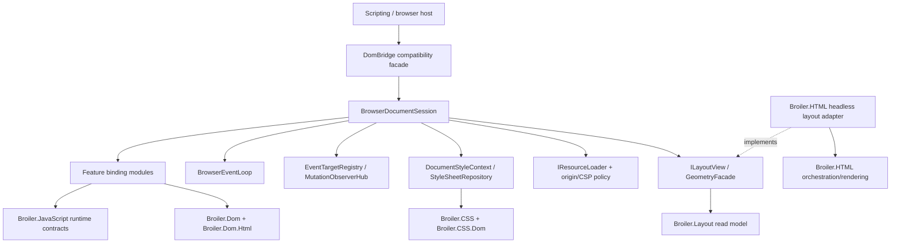

# HtmlBridge complexity-reduction roadmap

Status: **in delivery** — Phases 0–5 delivered to their in-scope terminal state (see the
[implemented delivery log](htmlbridge-complexity-reduction-implemented.md)); Phase 6's native-rendering
migration is complete and merged (submodule patches `0004`–`0007` applied upstream), with only the terminal
`Broiler.HtmlBridge.Rendering` project deletion outstanding (WPT-reftest-gated); Phase 7 items 1–5 are
done, item 6's static import/export module graph is linked and executing (P7.17) and `import.meta` is
handled at the bridge layer (P7.18), leaving item 6's engine-coupled tail (live cyclic bindings,
top-level-await-as-async, dynamic `import()`, event-loop ordering). The `Broiler.JS` seam for driving the
engine's own module machinery ships as patch `0008` (P7.19) but is blocked below it by the engine's
incomplete module execution (static-import value binding + nested-async ordering); Phase 8 remains proposed.
Per-phase detail: [remaining phases](htmlbridge-complexity-reduction-remaining.md).

Baseline date: 2026-07-13

Scope: Broiler.HtmlBridge.Core, Broiler.HtmlBridge.Dom,
Broiler.HtmlBridge.Rendering, Broiler.HtmlBridge.Scripting, and the canonical
components that should absorb engine-neutral behavior.

Companion inventory:
[HtmlBridge current component inventory](../architecture/htmlbridge-current-component-inventory.md).

## Executive decision

Do not solve the remaining complexity by moving the whole bridge into
Broiler.Dom, Broiler.CSS, or Broiler.HTML.

The previous promotion work has already established a canonical DOM and a shared
CSS engine. The next constraint is the shape of the browser adapter itself:
Broiler.HtmlBridge.Dom is a 27,436-line partial god object which combines JavaScript
binding, browser-runtime state, host resource loading, CSSOM, event-loop behavior,
layout queries, rendering workarounds, and test compatibility. Most of those
responsibilities really are bridge responsibilities, but they should not be one
class.

The recommended end state is:

1. Keep a small, source-compatible DomBridge facade.
2. Split browser behavior into document-scoped services and feature binding
   modules inside the bridge before considering more assemblies.
3. Promote only engine-neutral algorithms and data models to Broiler.Dom,
   Broiler.Dom.Html, Broiler.CSS, Broiler.CSS.Dom, Broiler.Layout, Broiler.HTML,
   Broiler.JavaScript, or Broiler.Graphics.
4. Replace the three unrelated responsibilities in
   Broiler.HtmlBridge.Rendering, then remove that project.
5. Make resource loading, time, and layout explicit injected host services.

This sequence reduces coupling without turning the canonical DOM/CSS libraries
into a browser host or creating dozens of tiny assemblies.

## Baseline and why this work is now necessary

The measurements below describe the current working tree, excluding bin and obj.
Method counts are approximate declaration counts, so they are useful for sizing
and trend checks rather than public-API accounting.

| Project | Source files | Physical lines | Non-blank lines | Approx. methods |
|---|---:|---:|---:|---:|
| Broiler.HtmlBridge.Core | 9 | 1,175 | 987 | 50 |
| Broiler.HtmlBridge.Dom | 65 | 27,436 | 23,641 | 1,104 |
| Broiler.HtmlBridge.Rendering | 3 | 1,003 | 908 | 35 |
| Broiler.HtmlBridge.Scripting | 5 | 682 | 594 | 22 |
| **Total** | **82** | **30,296** | **26,130** | **about 1,211** |

The dominant class is DomBridge:

- It is reopened by 63 partial declarations.
- Fourteen callback files contain 409 distinct numbered Js...Core callbacks.
- Forty-one of the 65 Dom source files directly know about the JavaScript
  engine; 25 know about CSS/computed style; 11 know about resources or network
  loading; 12 parse or serialize HTML; and 8 calculate layout geometry.
- InlineStyle is touched from 24 files, GetElementRuntimeState from 25,
  GetComputedProps from 16, ToJSObject from 16, and CreateBridgeElement from 13.
  These are hidden shared-state APIs, not feature-local dependencies.

Largest individual files:

| File | Lines | Main reason for size |
|---|---:|---|
| DomBridge/LayoutMetrics.cs | 2,269 | CSSOM View, layout approximation, scrolling, rectangles, zoom |
| JsFunctionCallbacks/JsObjects.cs | 1,634 | numbered callbacks for several unrelated interfaces |
| JsFunctionCallbacks/Registration.cs | 1,516 | callback plumbing and generic dispatch |
| DomBridge/SubDocuments.cs | 1,390 | frames, documents, parsing, origin, lifecycle and resource loading |
| DomBridge/Utilities.cs | 1,373 | unrelated DOM, URL, MIME, storage, form, canvas and SVG helpers |
| DomBridge/DomBridge.cs | 1,001 | construction, attach, lifecycle, timers and global orchestration |
| DomBridge.Serialization.cs | 947 | serialization plus render-oriented transforms |
| DomBridge/StyleSheets.cs | 918 | CSSOM identity, mutation, parsing and resource loading |

The current project graph also makes a low-level binding project pull the full
image rendering stack:

    Scripting -> Dom -> Rendering -> HTML.Image
                                      -> HTML.Orchestration
                                      -> HTML.Core -> Layout

Dom currently needs Rendering primarily for geometry and compatibility helpers.
That dependency direction should be replaced by a small layout/read-model
contract.

## Complexity model

The plan treats four kinds of complexity separately. Moving a file only helps
the first kind; it does not automatically help the other three.

| Kind | Current symptom | Correct response |
|---|---|---|
| Ownership | Neutral algorithms live in a browser adapter | Promote the algorithm and its neutral tests |
| Cohesion | One partial class owns unrelated browser APIs | Extract document services and feature modules |
| Dependency | Dom reaches through Rendering to HTML.Image | Invert through narrow layout and host contracts |
| State | Canonical DOM state is shadowed by bridge dictionaries | Establish one authority and one invalidation stream |

## Target architecture

Dependency rules:

- Broiler.Dom and Broiler.CSS must never reference HtmlBridge, a JavaScript
  engine, networking, or renderer policy.
- The bridge may depend on canonical DOM/CSS and public Layout contracts.
- The bridge must not depend on Broiler.HTML.Image.
- Broiler.HTML may implement a bridge-consumed layout interface, but the
  interface and DTOs must live below the HTML renderer.
- A browser host composes implementations. A feature callback must not construct
  HttpClient, parse a file path, or create a renderer directly.

## Ownership comparison and proposed destinations

### Canonical components

| Destination | Move here | Keep out |
|---|---|---|
| Broiler.Dom | Tree-neutral range operations, traversal, mutation records and option matching, node equality/normalization, neutral shadow-tree algorithms | JS wrappers, event-loop scheduling, URL/origin policy, computed style, geometry |
| Broiler.Dom.Html | HTML document/fragment parsing, deterministic serialization, canonical doctype/parser metadata, script-element discovery as metadata | Fetching scripts, CSP decisions, execution order, render compatibility rewrites |
| Broiler.CSS | CSS syntax and typed value models: anchor grammar, position-area/position-try values, keyframes/timing functions, CSS time and length expressions | Live CSSOM object identity, stylesheet fetching, DOM cascade, used layout values |
| Broiler.CSS.Dom | Selector matching, cascade, computed style, style scopes, tree-aware invalidation | JavaScript CSSOM wrappers, network loading, used geometry |
| Broiler.Layout | Anchor placement, position-try selection, sticky/fixed containing blocks, overflow/scroll geometry, zoomed used values, hit testing, animation sampling/application | JS conversion, document loading, renderer-specific compatibility transforms |
| Broiler.HTML | DOM-to-box projection and headless layout-session implementation; HTML rendering orchestration | Canonical DOM APIs, JS bindings, CSP and fetch policy |
| Broiler.JavaScript | ECMAScript WeakRef and FinalizationRegistry support and reusable engine-level primitives | Browser APIs such as Window, fetch, DOM events, queueMicrotask host integration |
| Broiler.Graphics | Immutable canvas display-list primitives only if commands are actually replayed | JS Canvas bindings and an unused mutable command recorder |

### Bridge and host components

| Destination | Move or keep here | Reason |
|---|---|---|
| HtmlBridge facade | Existing public construction/attach/flush/serialize entry points | Source compatibility and a single composition root |
| HtmlBridge feature bindings | JS registration, conversion, callback dispatch, CSSOM/DOM object identity | These translate browser IDL behavior into this JS engine |
| HtmlBridge document services | listeners, timers, observers, browsing contexts, top layer, JS identity, style session | Browser-runtime behavior is legitimate bridge ownership |
| Host/security layer | immutable CSP policy, URL/origin decisions, injected resource loader | Host policy should not contaminate DOM or CSS |
| WPT/CLI test support | check-layout assertions, Acid-specific transforms, path mapping and test-only shims | Test policy must not run on arbitrary production pages |

## Proposed bridge decomposition

Start inside Broiler.HtmlBridge.Dom. Assembly boundaries should follow stable
dependency boundaries later; they should not be used as the first refactoring
tool.

### Document-scoped services

| Service | Mission | Replaces or contains |
|---|---|---|
| BrowserDocumentSession | Own document, URL/origin, viewport, lifecycle and disposal | DomBridge's mutable document-wide fields |
| JsObjectRegistry | Preserve one JS wrapper identity per canonical node/object | scattered ToJSObject/CreateBridgeElement caches |
| DocumentBindingFactory | Build bindings and their narrow dependencies | generic callback registration in the facade |
| BrowserEventLoop | Own tasks, timers, intervals, RAF, microtask checkpoints and thread affinity | timer lists and drain loops in DomBridge/ScriptEngine |
| EventTargetRegistry | One listener store and dispatch path for node/window/generic targets | the current three listener stores |
| MutationObserverHub | Subscribe once to DomDocument.Mutated, filter records, queue delivery | manual notifications and registration-specific state |
| DocumentStyleContext | Own style scopes, engines, caches and invalidation | global computed-property and scope helpers |
| StyleSheetRepository | Own sheet text/rules/import state; use an injected loader | mixed CSSOM identity, parsing and fetch code |
| BrowsingContextManager | Own parent/child windows, frames, origins, ports and lifecycle | SubDocuments, SubDocumentObjects and Messaging overlap |
| GeometryFacade | Translate Layout read-model values to CSSOM View values | LayoutMetrics and SharedLayoutGeometry glue |
| ScrollController | Own scroll offsets and scrolling API behavior | ScrollRuntimeState plus geometry approximations |
| TopLayerManager | Own dialog/popover order and modal/top-layer state | dialog flags spread across anchor/runtime files |
| RenderDocumentProjector | Produce a non-destructive renderer input snapshot | live-DOM mutations in serialization/render preparation |

Every service is instance-scoped to BrowserDocumentSession. No runtime state may
remain in a process-global static ConditionalWeakTable.

### Feature binding modules

Registration and callbacks for one web-platform feature must be co-located:

- Window and lifecycle
- Document
- Node and attributes
- Element and geometry
- Traversal and Range
- Events and MutationObserver
- CSSOM and computed style
- SVG
- Forms and tables
- Dialog and popover
- Frames and browsing contexts
- Fetch and XMLHttpRequest
- Messaging
- Canvas

Each module exposes one Install(JsRealmContext) entry point and receives only the
services it uses. Replace numbered names such as JsElement123Core with semantic
names while moving them. A temporary compatibility registration table may map
old callback names to new handlers.

## Delivery status and document set

This roadmap has been split into focused documents. This file keeps the stable
planning content — the executive decision, target architecture, ownership tables,
priority/sequencing, validation matrix, completion criteria, risks and decisions.
The phase-by-phase delivery detail lives in the companions below.

| Document | Contents |
|---|---|
| [Phase 0–5 delivery log](htmlbridge-complexity-reduction-implemented.md) | Project-graph repair, document services, feature-module extraction, parallel-DOM-state elimination, and used-value behaviour moved into Layout, with per-slice status, branches and regression checks. The bulk of each phase has landed; several phases carry explicit deferred/blocked residue (see the status table below). |
| [Working notes](htmlbridge-complexity-reduction-notes.md) | The native dialog / backdrop feature track, its scoping analysis, and deferred/blocked findings that inform the remaining deletion work. |
| [Remaining phases](htmlbridge-complexity-reduction-remaining.md) | Phase 6 (remove `Broiler.HtmlBridge.Rendering`), Phase 7 (isolate loading/security/browsing-context policy) and Phase 8 (simplify Core and Scripting). |

Per-phase status (as of 2026-07-17). "Bulk delivered" means the planned work
items landed but one or more exit criteria remain open — the delivery log records
the specifics per slice.

| Phase | Status | Open residue |
|---|---|---|
| 0 — stabilize the boundary / baseline | Baseline established | Recorded in [Phase 0 baseline](htmlbridge-phase0-baseline.md); no explicit completion assertion. |
| 1 — repair the project graph | **Complete** | None — all five work items landed. |
| 2 — document services & single state authority | Bulk delivered | Simultaneous-session isolation is blocked below the bridge (JS engine, out of scope); de-globalizing the process-static `ElementRuntimeState`/`PositionAreaResolutions` tables is deferred (in scope). |
| 3 — feature modules | Bulk delivered | Element/geometry, Window/Document, SVG and Canvas modules still to come; the DomBridge facade line-count target (500–800 lines) is unmet and tracked as ratcheted debt. |
| 4 — eliminate parallel DOM state | Bulk delivered | Item 2's full inline-style dict elimination (~200 sites) is deferred (Phase-5-entangled); item 5 `Normalize`/`CloneDomElement` swaps are blocked by side-effect coupling. |
| 5 — used-value behaviour into Layout | Bulk delivered | Anchor-track deletion is complete through step 6, but ALWAYS-pass and not-yet-native residue remains; full completion is gated on the native dialog/backdrop track and the visual-viewport LayoutSnapshot endgame (both tracked separately). |
| 6–8 | Not started | See [remaining phases](htmlbridge-complexity-reduction-remaining.md). |

The native dialog/backdrop track and the Phase 4 item-2 deletion scoping are
captured in the working notes.

## Priority and sequencing

The critical path is:

    Phase 0 -> Phase 1 -> Phase 2 -> Phase 3 -> Phase 4 -> Phase 5 -> Phase 6
                                           \-> Phase 7 -> Phase 8

Phase 7 can start after the ResourceLoader seam in Phase 2. CSS typed-value and
Layout read-model work can run in parallel with feature-module extraction after
Phase 1. Removing Rendering waits for both geometry inversion and replacement of
its compatibility passes.

Recommended first six implementation PRs:

1. Repair the namespace/public facade and restore Broiler.slnx.
2. Add dependency guards and deduplicate project paths.
3. Introduce ILayoutView; remove the Dom-to-HTML.Image path.
4. Introduce BrowserDocumentSession plus deterministic disposal tests.
5. Extract DocumentStyleContext and JsObjectRegistry.
6. Convert Traversal/Range into the first co-located feature binding module.

These establish the pattern without beginning with the riskiest areas
(LayoutMetrics, frames, events or network).

## Validation matrix

Every phase must choose the smallest relevant rows; milestone releases run all
rows.

| Boundary | Required validation |
|---|---|
| Public surface | API snapshot, compatibility consumer, no unplanned v2 changes |
| Core/Scripting | execution, deferred/async/interactive, microtask/timer, CSP and profiling tests |
| DOM | DOM/Range/Selection/traversal/mutation/shadow/serialization tests |
| CSS | parser, selector, cascade, computed-style, CSSOM live-mutation tests |
| Layout | geometry, scroll, fixed/sticky, hit-test, anchor, animation and zoom tests |
| Renderer | Acid, pixel/reference and headless-layout parity |
| Browser behavior | WPT subsets for the touched feature, then full committed-baseline comparison |
| Performance | bridge.mutation no worse than baseline +2%; layout snapshot built at most once per document version/viewport |
| Lifetime | repeat attach/dispose and parallel-session leak/isolation tests |
| Architecture | no canonical-to-bridge references, no HTML.Image dependency, no direct callback networking, no new partial files |

## Quantitative completion criteria

The program is complete when all of the following are true:

- Broiler.HtmlBridge.Dom is below 18,000 non-generated lines as a guardrail,
  with complexity moved to correct reusable engines or deleted rather than merely
  hidden.
- The public DomBridge facade is at most 800 lines and has no feature-private
  state.
- No new DomBridge partial files exist; no feature source file exceeds 750 lines
  without a reviewed exception.
- Broiler.HtmlBridge.Rendering is deleted.
- Broiler.HtmlBridge.Dom has no reference to Broiler.HTML.Image.
- The solution builds one canonical Dom and one canonical Graphics project path.
- There is one authority each for DOM content, inline style, events, mutations,
  resources, computed-style invalidation and layout snapshots.
- Fake #document-family elements and process-global session runtime state are
  gone.
- DOM equality/normalization, CSS parsing/timing, anchor placement and geometry
  each have one implementation in their canonical owner.
- Public v2 compatibility remains intact unless a separately approved v3
  boundary explicitly changes it.

## Risks and controls

| Risk | Control |
|---|---|
| A move changes behavior while appearing mechanical | Characterization test before each extraction; one concern per PR |
| Canonical projects absorb browser-specific policy | Dependency guards plus the ownership table above |
| New services merely recreate the god object | Narrow constructor dependencies; no service locator or DomBridge back-reference |
| Layout extraction causes repeated rendering | Versioned snapshot contract and benchmark assertion |
| State split creates two authorities | State-authority checklist and temporary write-through adapter with a deletion issue |
| Public namespace churn breaks consumers | Preserve Broiler.HtmlBridge.DomBridge facade through v2 |
| WPT-only hacks leak into production | Explicit RenderPreparationPass classification and production/test pipelines |
| More projects increase build complexity | Extract classes first; create assemblies only at stable dependency seams |

## Decisions that should be made explicitly

These are architecture decisions, not blockers to starting Phases 0-2:

1. Whether the layout contract lives in Broiler.Layout or a tiny
   dependency-neutral Broiler.HTML.Headless.Abstractions assembly. Prefer
   Broiler.Layout if the DTOs contain only used-value/read-model concepts.
2. Whether host/security remains under HtmlBridge or becomes Broiler.Web.Security.
   Create a new project only if there is a second non-bridge consumer.
3. Whether Canvas is intended to render. If not, remove command recording; if
   yes, define the Graphics display-list consumer before promoting its model.
4. Whether public-surface v3 is desired. None of the internal decomposition
   requires it.

## Relationship to existing roadmaps

This roadmap follows, rather than replaces, the completed neutral DOM/CSS
promotion work:

- [Phase 0 baseline record](htmlbridge-phase0-baseline.md)
- [DOM/CSS promotion roadmap](htmlbridge-dom-css-promotion-roadmap.md)
- [Remaining work roadmap](htmlbridge-remaining-work-roadmap.md)
- [Promotion backlog](htmlbridge-promotion-backlog-roadmap.md)
- [Out-of-scope routing](htmlbridge-out-of-scope-routing-roadmap.md)
- [Engine boundary](../architecture/htmlbridge-engine-boundaries.md)

Those documents answer which standards algorithms could leave the bridge. This
document answers how to reduce the complexity of the bridge responsibilities
which correctly remain.
